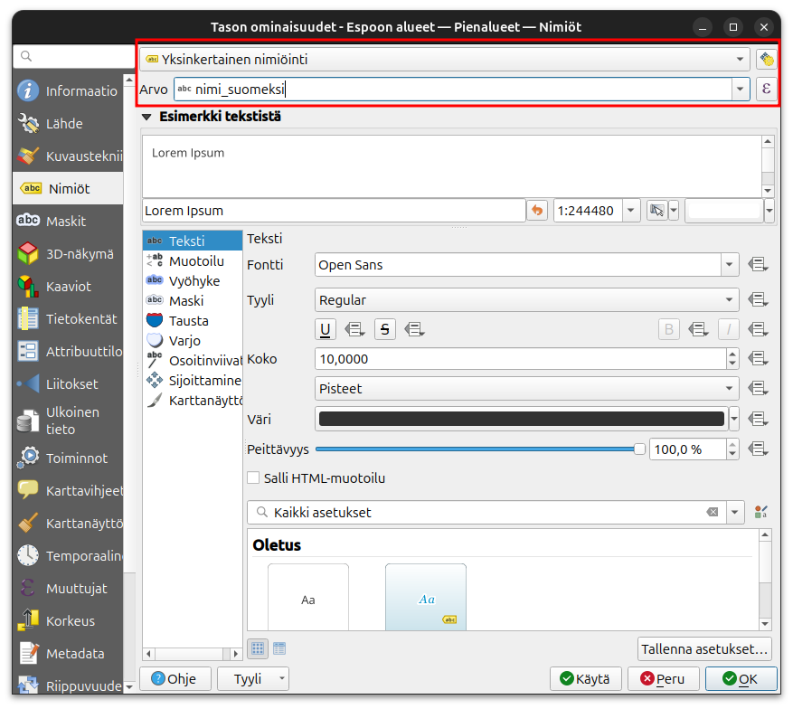
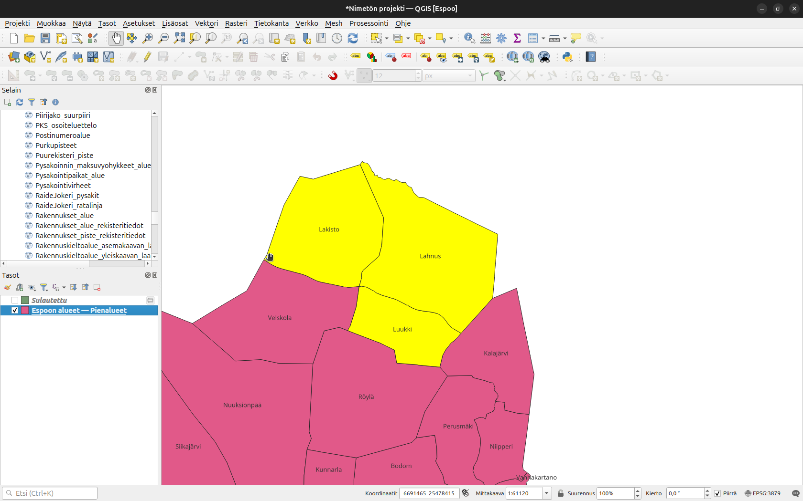
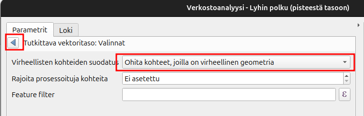
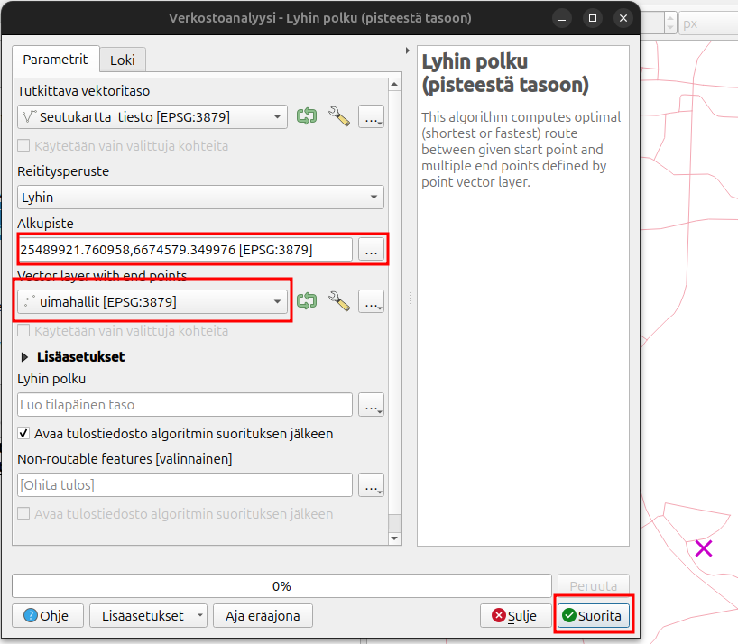
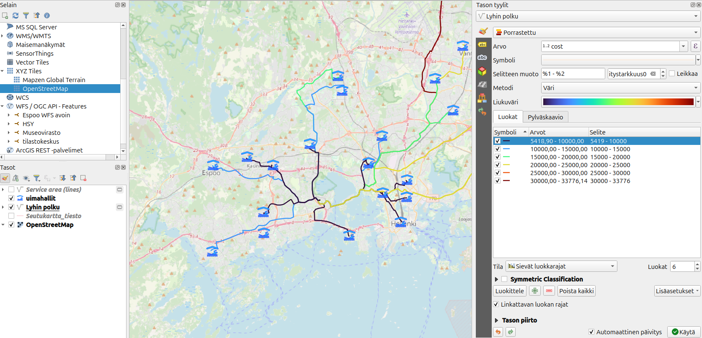

# Lisätehtävä: Paikkatietoanalyysit

## Harjoituksen sisältö

Harjoituksessa kokeillaan muutamia paikkatietoanalyyseja

## Harjoituksen tavoite

Koulutettava oppii löytämään paikkatietoanalyysityökaluja

## Valmistautuminen

Käynnistä QGIS-ohjelmisto. Tallenna QGIS-projekti nimellä (**Projekti → Tallenna nimellä…**) “**QGIS_harjoitus_lisätehtävä**”.

## Rajaa ja sulauta

Tuo kurssihakemistosta Espoon pienalueet karttatasoa QGISiin. Jotta olisi helpompi lukea karttaa niin laitetaan nimiöt päälle. Paina hiiren oikealla Pienalueet-tasoa ja valitse **Ominaisuudet**. Nimiöt-välilehdellä valitset **Yksinkertainen nimiöinti** ja Arvoksi **nimi_suomeksi**. 

Tarkoituksena on yhdistää pienalueet Lakisto, Lahnus ja Luukki yhdeksi alueeksi. Valitse kaikki kolme aluetta käyttämällä valintatyökalua

 

Valitse seuraavaksi **Vektori -> Geoprosessointi -> Sulauta (dissolve)**. Rastita **Käytetään ainoastaan valittuja kohteita**, muuten yhdistäisimme koko Espoon. Paina tämän jälkeen **Suorita**. Nyt sinulla on uusi taso missä on yhdistetty kaikki kolme aluetta!

## Saavutettavuusanalyysi
Tähän harjoitukseen pitää ensin lisätä **saavutettvauusanalyysi_aineistot.gpkg** tiedostosta kahdet tasot: **uimahallit** ja **Seutukartta_tiesto**. 

Saavutettavuusanalyyseja on monenlaisia ja muutama työkalu tähään löytyy QGISin työkalupakista. Paina ensin seuraavaa symbolia jotta saat auki Työkalut-näkymän:

Navigoi itsesi **Verkostoanalyysi** alavalikolle tai etsi suoraan työkalu nimeltään **Lyhin polku (pisteestä tasoon)**. Tutkittava vektoritaso on Seutukartta_tiesto ja siinä voi olla geometriavirheitä. Valitse viereisestä jakoavain-symbolin takaa **Ohita kohteet, joilla virheellinen geometria**. Palaa takaisin edelliseen näkymään painamalla kolmiota.

Valitse vielä alkupiste kartalta painamalla kolmea pistettä ja sen jälkeen paikkaa kartalta. Valitse päätepistetasoksi Uimahallit-tasoa. Paina tämän jälkeen **Suorita**.

:::hint-box
On mahodllista laskea reitti etäisyyden tai matka-ajan mukaan. Etäisyys mitataan tässä koordinaattijärjestelmässä metreinä.  Matka-aikaa laskieassa niin saadaan tietää matka-aikaa tunnin osina.
:::

Voit avata uuden tason ominaisuustaulukkoa ja huomaat, että kolme uutta saraketta on syntynyt. Start ja end ovat alku-ja loppupisteet ja cost taas kertoo matkaosuus metreinä. Voit visualisoida tuloksia luokittelemalla tuloksia cost-sarakkeen mukaan. Kysy apua kouluttajalta jos et muista miten se tehdään.

