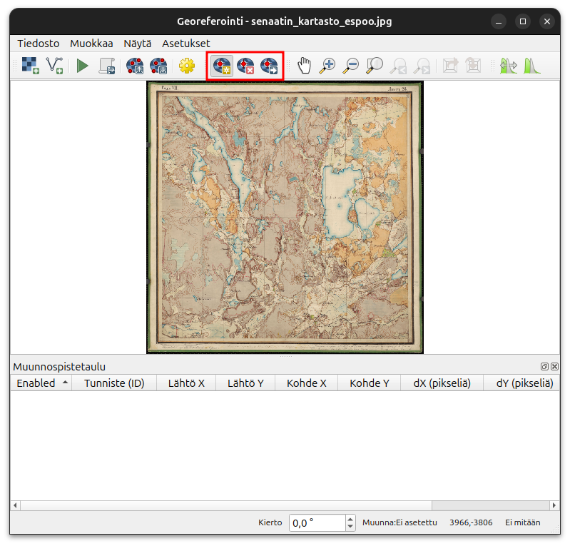
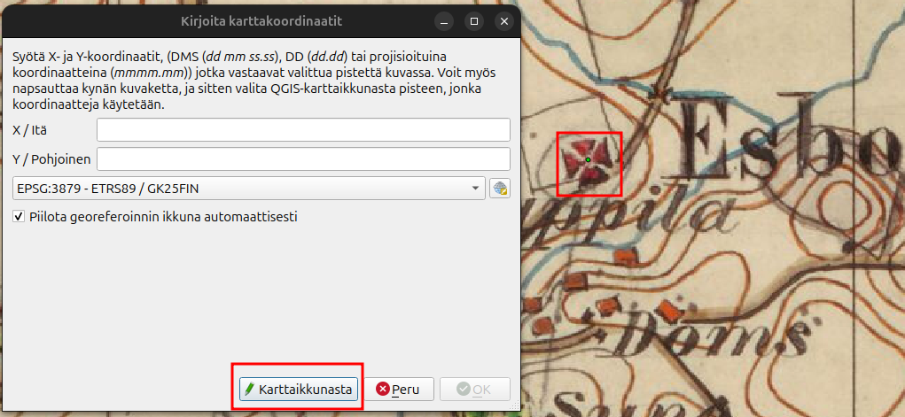
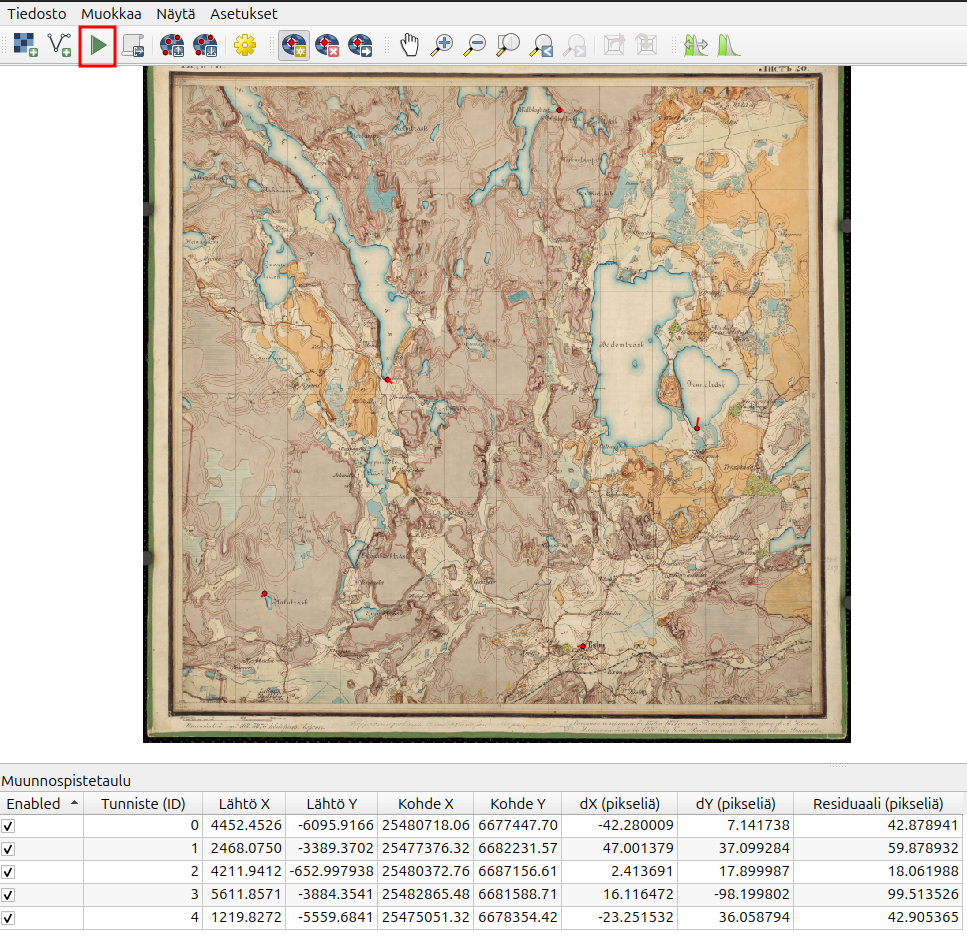
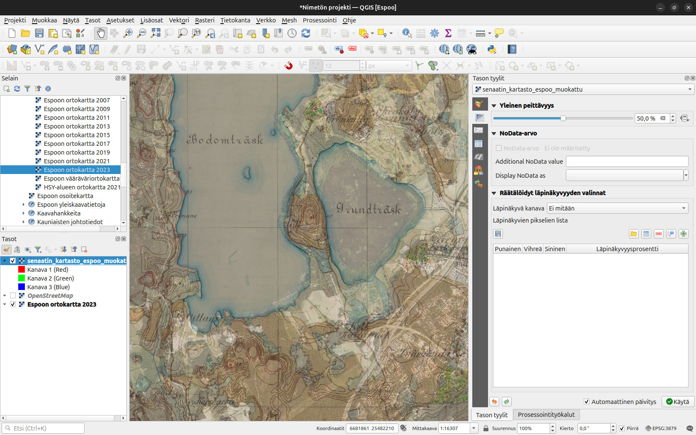

# Lisätehtävä: Georeferointi
## Harjoituksen sisältö

Harjoituksessa saadaan vanha digitalisoitu paperikartta QGISiin oikein georeferoitu

## Harjoituksen tavoite

Kouluttautuja oppii georeferoimaan aineistoja joilla ei ole koordinaattijärjestelmätietoa

## Valmistautuminen

Tallenna QGIS-projekti nimellä (**Projekti → Tallenna nimellä…**) “**QGIS_harjoitus_georeferointi**”.

## Georeferointi

Tarvitaan ensin jonkilainen taustakartta. Voit ladata esimerkiksi Espoon WMS-palvelusta **Ortokartta 2023**. Valitse tämän jälkeen **Tasot -> Georeferoija**. Uudessa ikkunnasa valitset **Avaa rasteri** ja valitse kurssihakemistosta **senaatin_kartasto_espoo.jpg**.

Nyt QGIS olettaa, että haluat lisätä muunnospisteitä, eli pisteitä joiden sijaintia määrittelet sekä vanhassa karttakuvassa ja taustalla olevalla ortokuvalla. Kuvassa on merkitty punaisella miten hallinnoit muunnospisteitä. Valitse kartalta jokin piste, se on hyvä olla piste, jonka tunnistat helposti myös ortokuvalta. Tämä voi olla esimerkiksi järvenranta tai vanha talo jota tiedät edelleen olevan samalla paikalla. Huomaa, että voit zoomata karttakuvaa. 

Kun valitset pisteen niin uusi ikkuna aukeaa. Valitse tämän jälkeen **Karttaikkunasta** ja valitse mahdollisimman sama sijainti ortokuvalla. Tämän jälkeen Georeferoijan ikkunassa koordinaattitiedot päivittyvät. Paina tämän jälkeen **OK**.

Jatka tekemällä ainakin neljä muuta pistettä samalla tavalla. On hyvä käytäntö koittaa saada eri puolilta kuvaa pisteitä, silloin lopputulos on yleensä parempi. Mitä enemmän pisteitä ja sen tarkemmat sijainnit niin sen paremmin kuva saadaan oikealle kohdalle. Kun koet olevasi valmis pisteiden kanssa voit painaa vihreätä kolmiota Georeferoija-ikkunassa.

Aseta tämän jälkeen tiedostopolku ja anna nimi tiedostolle. Muita asetuksita ei tarvitse tässä tapauksessa miettiä. Paina uudestaan vihreätä kolmiota ja odota, että georeferointi on valmis. Vertaile kuvaa ortokuvan kanssa. Jos olet tyytyväinen voit sulkea Georeferoija-ikkunan. Ei tarvitse tällä kertaa tallentaa muunnospisteitä. 

Voit säätää näkyvyyttä tasoille, jotta on helpompi vertailla lopputulosta.

Hienosti georeferoitu!
