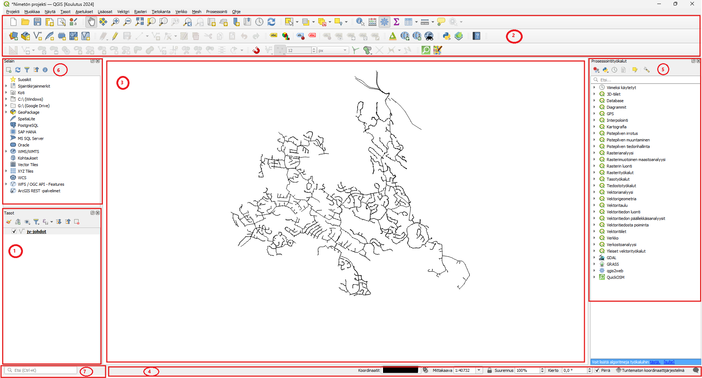
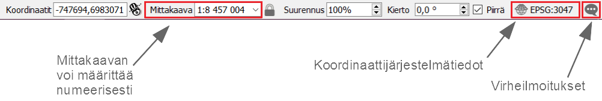

# Harjoitus 1: QGIS käyttöliittymä ja perustoiminnot ja CAD-aineistot QGISissä

**Harjoituksen sisältö**

Harjoituksessa tutustutaan QGIS--ohjelmiston käyttöliittymään ja sen
perustoimintoihin. Lisäksi Harjoituksessa tuodaan CAD-aineistoja QGIS-työtilaan.

**Harjoituksen tavoite**

Koulutettava oppii käyttämään QGISin käyttöliittymää ja Kouluttautuja oppii tuomaan sekä viemään CAD-aineistoja QGISissä.

**Valmistautuminen** Avaa web-selain ja mene QGISin web-sivuille.

::: note-box
<https://www.qgis.org/>
:::

Löydät etusivulta linkin, jonka avulla pääset lataamaan
QGIS-työpöytäohjelmiston. Lataa sivustolta **QGISin pitkäaikaisversio
(long term release)**. Pitkäaikaisversio on stabiilein QGIS-versio,
mutta siitä voi puuttua uudempien versioiden uusia ominaisuuksia. QGISin
voi asentaa Windows-, Linux- tai Mac-käyttöjärjestelmään. Eri
järjestelmien QGIS-versioiden välillä huomattavimmat erot ovat
väriskeemoissa ja tiedostopoluissa -- muuten erot ovat hyvin pieniä.

## Kurssimateriaalien lataus

Voit halutessasi ladata kurssin luentokalvot täältä:

::: note-box
[Luentomateriaali](https://drive.google.com/file/d/17Ayqz2qR6i6UFlVSBY2lA1Yuzz_0DXNV/view?usp=sharing)
:::

Kurssilla tarvittavat paikkatieto-aineistot on ladattavissa Google
Drivestä linkistä

::: note-box
[Kurssihakemisto.zip](https://drive.google.com/file/d/1yiZX1BaHJCQYDiHHNESvzJbVJI4woP_W/view?usp=drive_link)
:::

Avaa yllä oleva linkki ja klikkaa **Lataa**. Tämä lataa aineistot
kokonaisuudessaan pakattuna zip-tiedostona **Kurssihakemisto.zip**. Pura
kurssimateriaalit omalle tietokoneellesi haluamaasi kansioon niin, että
löydät ne helposti harjoituksia tehdessä. Kun kurssimateriaalissa
viitataan **../kurssihakemisto/**, tarkoitetaan itse määrittelemääsi
kurssihakemiston polkua. Kysy tarvittaessa apua kouluttajalta.

## QGISin käyttöliittymä

Käynnistä QGIS. QGISin käyttöliittymä saattaa aueta englanninkielisenä
ensimmäisellä käyttökerralla. Voit vaihtaa kielen suomeksi asetuksista
**Settings → Options → General → User Interface Translation → suomi**.
Paina lopuksi **OK**.

{width="70%"}

Huomaa, että kielen vaihtamisen aktivoimiseksi sinun tulee käynnistää
QGIS uudelleen. Lisää ensimmäinen vektorimuotoinen paikkatietoaineisto
napsauttamalla **Avaa tietolähteiden hallinta --pikakuvakenäppäintä**:
{width="3%"}

Löydät saman toiminnon myös Tasot-valikosta **Lisää taso → Lisää
vektoritaso...** (Ctrl+Shift+V). Valitse avautuvasta ikkunasta
vasemmalta puolelta **Vektori-välilehti**. Lisää aineisto kurssin
materiaaleista (**.../kurssihakemisto/Harjoitus 1/**). Valitse nyt
Maanmittauslaitoksen 1:1M-aineistosta **Tieviiva.gpkg-tiedosto**. Paina
lopuksi **Lisää** ja sulje ikkuna.

{width="70%"}

Aineiston pitäisi näkyä seuraavan sivun esimerkin mukaisesti (huom!
viivan väri saattaa olla eri).

## QGIS-käyttöliittymän osat

**1. Tasoluettelo** Tähän osioon tulevat näkyviin paikkatietoaineistot,
jotka näkyvät karttaikkunassa. Voit hallita tasojen järjestystä ja
näkyvyyttä.

**2. Työkalupalkit** Työkalupalkit sisältävät erilaisia työkaluja.
Omassa tietokoneessasi voi olla näkyvissä enemmän tai vähemmän
työkalupalkkeja. Napauttamalla hiiren oikea näppäintä työkalupalkkien
päällä, voit piilottaa tai ottaa esiin työkalupalkkeja. Voit myös
raahata työkalupalkkeja eri kohtiin.

**3. Karttaikkuna** Karttaikkunaan piirtyvät ne paikkatietoaineistot,
jotka ovat tasoluettelossa aktivoituna näkyväksi. Voit lähentää ja
loitontaa karttaa sekä vapaasti siirtää näkymää hiiren avulla (koita
myös hiiren scrollia).

**4. Tilapalkki** Tilapalkista näet hiiren kursorin koordinaatit, minkä
lisäksi voit muuttaa mittakaavaa ja koordinaattijärjestelmää.

**5. Prosessointi- ja selain-paneeli** Aikaisemmassa harjoituksessa
tutustuttiinkin jo hieman QGISin uuteen Selain-paneeliin, joka
aikaisemmissa versioissa on ollut erillisenä ohjelmana. Myös
Prosessointityökalut saa kätevästi esille paneeliksi, jolloin ne ovat
aina helposti löydettävissä. Prosessointyökaluista löydät esim. vektori-
ja rasterianalyysityökalut.

**6. Hakutoiminto** Joskus on vaikea muistaa, mistä mikäkin työkalu ja
toiminto valikosta löytyy. Hakutoiminnolla voit helposti etsiä näitä
näppäilemällä CTRL+K ja kirjoittamalla etsimäsi toiminnon hakukenttään.

## Kokeile itse

Kokeile erilaisia työkaluja ja tarkastele ainakin seuraavien työkalujen
toimintaa. Työkalupalkin toiminnot (käyttöliittymän yläosassa):

Paikanna edellä näkyneestä työkalurivistä seuraavat työkalut ja tunnista
niiden tarkoitukset:

<!--Format tables -->

<!--| Zoomaa täydeksi       |  |-->

|                       |                                  |
|:---------------------:|:--------------------------------:|
|    Zoomaa täydeksi    |   |
|     Zoomaa tasoon     |   |
| Näytä kohteen tiedot  |   |
| Avaa attribuuttitaulu |  |
| Mittaa viivan pituus  |  |

Kokeile myös seuraavia tilapalkin toimintoja ja pohdi niiden
tarkoituksia työkaluina:

Tasoluettelon toiminnot (käyttöliittymässä vasemmalla puolella):

### Attribuuttitaulu

Valitse jv-johdot-karttataso ja avaa ominaisuustietotaulukko, joko
painamalla pikakuvaketta  tai painamalla
hiiren oikealla näppäimellä karttatason kohdalla sekä valitsemalla
**Avaa attribuuttitaulu**. Voit järjestää ominaisuustietotaulun minkä
tahansa kentän mukaan laskevaan tai nousevaan järjestykseen klikkaamalla
otsikkoa.

Kun olet tutkinut ominaisuustietotaulukkoa riittävästi, sulje taulukko.

# CAD-aineistot QGISissä

## CAD-aineiston tuonti

Tässä harjoituksessa ohjeistetaan kuinka käytetään QGISin "Tuo DWG/DXF”-työkalua, joka aineiston avaamisen lisäksi luo GeoPackage-tiedoston sen sisällöstä. 

Toinen vaihtoehto olisi tuoda aineisto projektiin uutena vektoritasona (Tasot -> Lisää taso -> Lisää vektoritaso). Näistä ensin mainittu työkalu antaa paremman näkymän aineistoon, sillä se jakaa aineiston CAD-ohjelmistossa nimettyihin tasoryhmiin. Sen sijaan aineiston tuonti vektoritasona tuo kaikki polygoni-, viiva- ja pisteaineistot projektiin geometrian mukaan jaettuina tasoina, minkä seurauksena haluamiaan tietoja joutuu kaivelemaan aineiston attribuuttitaulukoista. Joidenkin aineistojen tapauksessa myös Tuo DWG/DXF-työkalu on ainoa tapa saada aineisto auki QGISissä, jos jostain syystä vektoritasona tuominen ei toimi.

:::hint-box
Psst! Lue meidän [blogia](https://www.gispo.fi/blogi/cad-aineistot-ja-qgis/), missä käydään läpi CAD-aineistojen yhteensopivuus QGISin kanssa.
:::

## Erilaiset CAD-aineistot

|Formaatti|Selite|Toimii QGISissä| 
|:-------:|:---------------:|:----------:| 
| .dwg | AutoCADin oletusformaatti |Versio 2018 ja uudemmat eivät toimi. Vanhemmat versiot toimivat.| 
| .dgn | Microstationin oletusformaatti | Ei, paitsi jos käyttää vanhaa (v7) dgn-tiedostoa.| 
| .dxf | AutoCadin formaatti kun halutaan siirtyä toiseen ohjelmistoon  |Kyllä| 

Mene QGISin asetusvalikossa Projekti -> Tuo/vie -> Tuo tasoja DWG/DXF-tiedostoista. 
Uudessa ikkunassa pitää luoda uusi Geopackage-tiedosto, johon valittu DWG-tiedosto viedään. Valitse Lähdepiirrokseksi eli tuotavaksi DWG-sisällöksi kurssihakemistosta **210808b_2013v.dwg**. Tämä tiedosto on vanhempi versio .dwg-muodosta. 

::: hint-box
Jos kokeilet tuoda uusimman version .dwg tiedosto (210808b.dwg), niin huomaat, että QGIS ilmoittaa että tiedostomuotoa ei tueta.
:::

Valitse tämän jälkeen kolmen pisteen takaa Kohdepaketti-kohdasta hyvä sijainti ja nimi uudelle GeoPackage-tiedostolle. Valitse myös oikea koordinaattijärjestelmä. Kurssihakemiston tiedostoilla koordinaattijärjestelmä on **ETRS89 / GK25FIN (EPSG:3879)**. Älä huolestu pienestä kolmiosta. Pitämällä hiirtä komlmion päällä, niin selviää, että tällä koordinaattijärjestelmällä tarkkuus rajoittuu 0,1 metriin. 

Paina seuraavaksi **Tuo** nappia. Riippuen piirrustuksen laajudesta niin voi kestää pieni hetki, että tasot latautuvat. Voit tämän jälkeen painaa **OK**-nappia. Nytkin voi kestää hetken, että QGIS saa auki kaikki tasot. 

Tämän jälkeen niin Tasot-paneeliin ilmestyy uusi tasoryhmä. Tämän tasoryhmän alla on monta alatasoryhmää. Näiden sisällä on sitten tasot. On hyvin mahdollista, että karttanäkymäsi on edelleen tyhjä. Kokeile painaa jotain tasoa tai ryhmää oikealla hiirennäppäimellä ja valitse **Zoomaa ryhmään/Zoomaa tasoihin**. 

Jos olet epävarma missä kohde sijaitsee voi lisätä haluamasi taustakartan esim. Espoon WMS-rajapinnan kautta. Voit myös mennä Selain-paneelissa XYZ-tiles-kohtaan ja tuplaklikkata OpenStreetMap-yhteyttä. Muista siirtää taustakarttaa alimmaksi tasoksi tasoluettelossa. Jos taustakarttasi paistaa liian paljon läpi, voit säätää sen läpinäkyvyyttä avaamalla tason tyylit ja menemällä **Läpinäkyvyys**-välilehdelle. Tästä voit säätää miten läpinäkyvä taustakarttasi on.

::: hint-box
Jos haluat saada auki piirrustuksesi QGISissä niin suosittelemme, että **käytät ensisijaisesti .dxf-muotoa** (ellei ohjelmistosi tue suoriltaan jotain paikkatietoformaattia, kuten GeoPackage). Eli vie ulos käyttämästäsi CAD-ohjelmistosta mieluiten .dxf tiedostoa. Jos tämä ei ole mahdollista niin tallenna vanhempaan (esim. versio 2013) .dwg-muotoon, tai vanhempaan (v7) .dgn-muotoon. Kokeile sitten tuoda nämä QGISiin. Jos ei kuitenkaan tunnu toimivan, niin voit kokeilla muuntaa dwg/dgn tiedoston .dxf-muotoon, muunnosohjelman kautta, joka toimii netissä. Hakukoneen kautta löytää monta vaihtoehtoa, esimerkiksi [tämä](https://cloudconvert.com/dwg-to-dxf). 
:::

## Paikkatietoaineiston vienti CAD-muotoon

QGIS osaa myös viedä paikkatietoaineiston CAD-muotoon. Suosittelemme ensisijaisesti viemään tiedostoa dxf-muodossa. Voit myös kokeilla viedä aineistot .dgn-muodossa, mutta siihen saattaa liittyä enemmän rajoituksia. Voit tallentaa yksittäisen tason dxf tai dgn-muodossa samalla tavalla kuin olisit tallentamassa tason paikkatietomuotoon. Eli klikkaa tasoa hiiren oikealla ja valite **Vie -> Tallenna kohteet nimellä**. Tällä tavalla saat yksittäisen tason .dxf tai .dgn-muotoon. Jos haluat viedä kokonaista projektia .dxf-muotoon niin sekin onnistuu QGISillä. Valitse **Projekti -> Tuo/Vie -> Vie projekti DXF:n...**. Voit kokeilla molempia tapoja.

::: hint-box
Miksi on niin vaikeata saada auki nämä tiedostot QGISissä? Yksi syy on ainakin se, että CAD-aineistot ovat usein suljettuja formaatteja ja ne eivät seuraa avoimina standardeja (kuten esimerkiksi GeoPackage).
:::

Tallenna lopuksi aloittamasi QGIS-projekti omaksi projektitiedostokseen
kurssihakemistoon, esimerkiksi nimellä
**../kurssihakemisto/QGIS_harjoitus_1.qgz**.

::: hint-box
**Psst! Muista tallentaa QGIS-projekti aina harjoituksen lopuksi.**
:::
