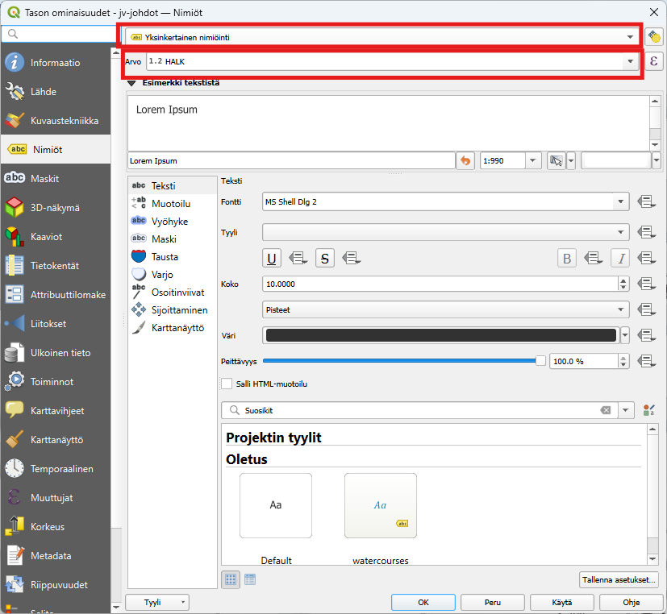
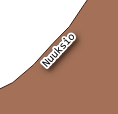

# Harjoitus 4: Paikkatietoaineiston nimiöinti ja luokittelu

## Harjoituksen sisältö

Harjoituksessa tutustutaan aineistojen nimiöinti- ja luokittelutoimintoihin.

## Harjoituksen tavoite

Koulutettava oppii muodostamaan eri tyyppisille paikkatietokohteille tekstitykset ja oppii luokittelemaan paikkatietoaineistoja QGISin työkaluilla.

## Valmistautuminen

Käynnistä QGIS-ohjelmisto. Avaa edellisen harjoituksen QGIS-projekti ja tallenna se nimellä (**Projekti → Tallenna nimellä...**) "**QGIS_harjoitus_4**". Mikäli et tallentanut harjoitusta 3,

-   Lisää projektiin seuraavat aineistot:
    -   **.../Harjoitus 3/jv-johdot.TAB**

    -   **.../Harjoitus 3/jv-varusteet.TAB**

    -   **.../Harjoitus 3/viemäripiirit.TAB**

Aseta aluksi **jv-johdot.TAB**-taso näkyviin ja muut näkymättömäksi

## Nimiöt

QGIS käyttöliittymässä paikkatietokohteiden tekstitykseen viitataan termillä **Nimiöt** (englanninkielinen termi on "**Labeling**"). Avaa **jv-johdot.TAB-tason Ominaisuudet-ikkuna** ja valitse **Nimiöt-välilehti**. Valitse **Yksinkertainen nimiöinti** ja **Nimiöiden perustana -alasvetovalikosta** nimiöinnissä käytettävän sarakkeen nimi, esim. "HALK". Paina **Käytä**, niin kohteille syntyy nimiöt. Tämä nähdään nyt karttaikkunasta, johon nimiöt ovat jo päivittyneet:

## Nimiöiden tyyli- ja yleisasetukset

Nimiöiden tekstien näkymistä kartalla voi määrittää monella eri tavalla. Alla kuvaukset QGISin nimiöiden muokkaamisen alateemoista:

|               |                                                                                                                                                      |
|:-----------:|:----------------------------------------------------------|
|    Teksti     | Määritellään tekstin tyyli, väri ja muita yleisiä ominaisuuksia                                                                                      |
|   Muotoilu    | Voit muodostaa useampirivisiä tekstejä, keskittää tekstiä ja määritellä lukujen muotoa                                                               |
|    Vyöhyke    | Luodaan tekstiä korostavat puskurit (tekstin reunukset)                                                                                              |
|     Maski     | Tekstiä korostavat puskurit, joiden vaikutusta alla oleviin tasoihin voi säädellä Tason ominaisuuksien **Masks** -välilehdellä                       |
|    Tausta     | Tekstin taustalle voi piirtää suorakulmion tai muun muodon                                                                                           |
|     Varjo     | Teksteille voidaan muodostaa varjo                                                                                                                   |
|   Callouts    | Voit siirtää nimiöitä karttanäkymässä vapaasti (Nimiöiden asetukset -työkalupalkin avulla) ja yhdistää tekstit niihin liittyviin kohteisiin viivalla |
| Sijoittaminen | Määrittelee tekstien sijoittumista kohteiden suhteen                                                                                                 |
| Karttanäyttö  | Määrittelee tekstien mittakaavarajoja ja muita tekstien näkyvyyteen liittyviä asioita                                                                |

## Nimiön tekstityyli

Nimiöiden tekstien tyyleille voit asettaa esimerkiksi haluamasi fontin, tyylin ja koon.

Kokeile erilaisia tekstityylejä. Kokeile nimiöiden varjostamista, minkä avulla voimme korostaa nimiöitä taustalla olevista muista karttaelementeistä. Valitse **Varjo-alateema** ja rastita sitten **Piirrä heittovarjo**. Paina **Käytä**, jotta näkisit tulokset kartalla. Kokeile vaihtaa asetuksia kuten siirtymä, sumennussäde, peittävyys sekä väri, ja katso miten ne vaikuttavat nimiöinnin varjoon. Huomaat muutokset kartalta tai **Esimerkki tekstistä -kentästä**.

Toinen työkalu tekstin korostamiseen on tekstipuskuri. Valitse **Vyöhyke-alateema** ja lisää tekstille haluamasi puskuri rastimalla **Piirrä tekstivyöhyke**. Näin saat nimiöt erottumaan kartasta vielä paremmin. Kokeile erilaisia puskurin kokoja, värejä ja läpinäkyvyyttä.

Avaa vielä **Sijoittaminen-alateema** ja valitse ***Ympärille (kaareva)***. Valitse **Sallitut asemoinnit -kohdassa Viivan alla**. Huomaa, että sallitut asemoinnit-kohdassa tulee aina olla vähintään yksi kohta valittuna. Jos useampi kohta on valittu, QGIS valitsee automaattisesti parhaan vaihtoehdon jokaiselle kohteelle. Paina OK, ja huomaa, että nyt nimiöt seuraavat monikulmioiden rajoja.

Tulos voi näyttää oudolta, etenkin jos karttaikkunan mittakaavaa on asetettu ison alueen kattavaksi. Lähennä karttaa, jotta nimiöt näkyisivät johdonmukaisemmin ja pohdi, missä tapauksessa tämänkaltainen nimiöinti olisi sopivinta.

Etsi vielä **Sijoittaminen → Prioriteetti** ja määritä se **Korkeaksi**.

Tällä tavalla annat preferenssin muokkaamasi tason nimiöille suhteessa muiden tasojen nimiöihin ja voit näin järjestää tärkeimpien ja ei niin tärkeiden tasojen nimiöintiä. Paina vielä **OK**.

## Nimiöinnit viivatasoilla

Samalla tavalla kuin juuri määritimme nimiöinnin monikulmiotasolle, voidaan niitä määrittää muillekin vektoriaineistoille. Avaa TieViiva-tason **Ominaisuudet-ikkuna** ja aktivoi nimiöiden käyttö päälle edellisessä harjoituksessa oppimallasi tavalla. Valitse **Nimiöiden perustana -kohdan** alavalikosta käytettäväksi nimiöintisarakkeeksi Tienumero. Paina **Käytä**, ja katso muutokset. Avaa vielä nimiöiden **Sijoittaminen-alateema**, ja rastita **Seuraa viivaa** ja **Viivan päällä -toiminnot** päälle. Paina **Käytä**, ja tarkista, että nimiöinti toimii odotetulla tavalla. Katso esimerkkiasetukset kuvasta:

Nyt nimiöt seuraavat viivoja paremmin. Huomaa myös, että kaikki nimiöt eivät nyt tule piirretyksi. Vaihda **Maksimikulma kaarevien merkkien välillä -kohdan** arvoja, niin pystyt muokkaamaan tekstin kaarevuuden reunaehtoja. Voit sulkea **Ominaisuudet-ikkunan** totuttuun tapaan painamalla **OK**. Rastita vielä päälle **Yhdistä kytketyt viivat** välttääksesi kopioidut nimiöt (tämä löytyy Karttanäyttö-alateeman Kohteen valinnat -kohdan alta).

## Vektoriaineiston luokittelut

**jv-johdot.TAB** on vektoriaineisto. Tutustu ensin aineistoon. Avaa **Attribuuttitaulu** painamalla aineistotason nimen päällä hiiren oikealla näppäimellä.

{width="96%"}

Ominaisuustietotauluissa sarakkeiden nimet ovat usein lyhennetyssä muodossa.

Suodatetaan aineistosta pois esimerkiksi kohteet joiden rakennus vuodeksi on merkitty "0": klikkaa tason nimeä hiiren oikealla ja valitse **Suodata...** Kirjoita (tai valitse tietokentistä ja operaattoreista klikkaamalla) suodatuslausekkeeksi "RAK_VUOSI" != 0. Voit testata suodatuksen toimivuutta klikkaamalla **Testaa**.

{width="70%"}

Nyt QGIS näyttää aineistostasi vain ne ruudut, jotka täyttävät annetun ehdon. Voit poistaa suodatuksen klikkaamalla tason vieressä olevaa "suppiloa" 

ja poistamalla suodatuslauseen ja klikkaamalla lopuksi OK.

Paikkatietoineiston ymmärtäminen ennen sen käsittelyä on välttämätöntä. Voimme nyt esimerkiksi päättää, että haluamme tuottaa teemakartan RAK_VUOSI-sarakkeen tietojen pohjalta. Näin pystymme myös paremmin tulkitsemaan karttaa ja valitsemaan visualisointia varten sopivat asetukset. Avaa tason ominaisuudet ja valitse tason kuvaustekniikaksi **Porrastettu**. Aseta vielä oheisen kuvan mukaiset **Sarake-, Liukuväri-, Tila- ja Luokat-määrittelyt**.

{width="60%"}

Kun olet saanut ne asetettua, paina **Luokittele**, niin luokitus tulee näkyviin. Voit myös muokata manuaalisesti arvovälejä kaksoisklikkaamalla **Arvot-saraketta** tai luokkien nimiä kaksoisklikkaamalla **Selite-saraketta**. Luokkien nimet näkyvät **Tasot-paneelissa** ja myös karttatulosteen selitteessä. Paina **Käytä**, niin näet muutokset kartalla. Karttanäytölle pitäisi muodostua jokseenkin tämän näköinen tilastoteemakartta.

Jos **Tasot-paneelissasi** ei näy selitettä, paina tason nimen vasemmalla olevaa pientä nuolta ja selitteet avautuvat tason alle kuvan mukaisesti. Palaa vielä **Kuvaustekniikka-asetuksiin** ja kokeile **Tila → Tasaväli** ja vaihda **Luokat**. Voit hävittää olemassa olevat luokat painamalla **Poista kaikki** (Delete All) ja sitten uudelleen luokitella painamalla **Luokittele**. Kokeile myös vaihtaa luokkien lukumäärää, luokitustapoja ja värityksiä, kunnes löydät mielestäsi sopivan tuloksen.

Voit vertailla eri luokittelumenetelmiä ja tutkia aineiston jakaumaa histogrammin avulla. Histogrammi löytyy omalta välilehdeltään. Paina **Lataa arvot** saadaksesi histogrammin ja luokkien rajat näkyviin.

{width="60%"}

## Lisätehtävä: nimiöiden piirtäminen

Loitonna karttanäkymää siten, että kaikki tasojesi kohteet tulevat näkyville. Voit tehdä tämän seuraavan työkalun avulla:

Joissakin tapauksissa olisi hyödyllistä määrittää nimiöt eri mittakaavoille erikseen. Avaa **jv-varusteet tason ominaisuudet** ja valitse **Nimiöt-sivupalkista** ja Valitse alasvetovalikosta "Yksinkertainen nimiöinti" ja arvoksi "VARUSTE".

Mene sen jälkeen **Karttanäyttö-alateemaan**. Rastita päälle **Mittakaavaperusteinen näkyvyys** ja laita **Minimi-kentän arvoksi** 5000:

Paina **OK**. jv-varusteet-kohteiden nimiöt eivät enää näy 1:5000 mittakaavan ulkopuolella. Lähennä karttaan, kunnes nimiöt näkyvät uudelleen. Voit myös testata muita tekstittämiseen liittyviä edistyneempiä toimia. Voit muun muassa ohjata nimiöiden tekstejä lausekepohjaisesti käyttämällä merkkijonoja QGISin lauseke-työkalulla:

Kokeile yhdistää kaksi saraketta samaan nimiöön **\|\| -merkin** avulla esimerkiksi seuraavalla tavalla: "**sarake1 \|\| sarake2**". Uuden rivin saat komennolla **`'\n'`** . Huomaa, miten **Tuloksen esikatselu -kohtaan** tulee esille nimiöinnin oletettu tulos (aineistosta otetuilla esimerkkiarvoilla).

::: hint-box
**Psst!** Muista tallentaa QGIS-projekti harjoituksen lopuksi.
:::
