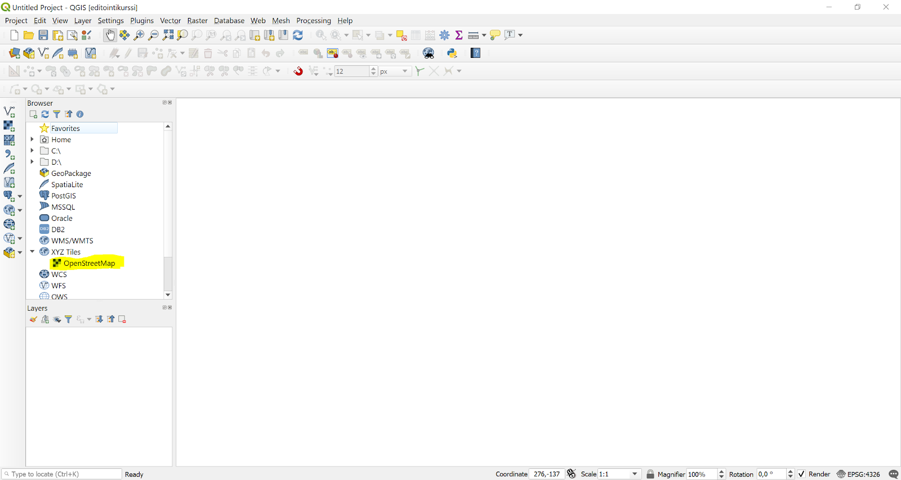
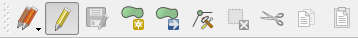
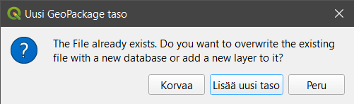
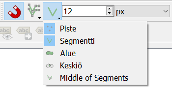
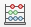
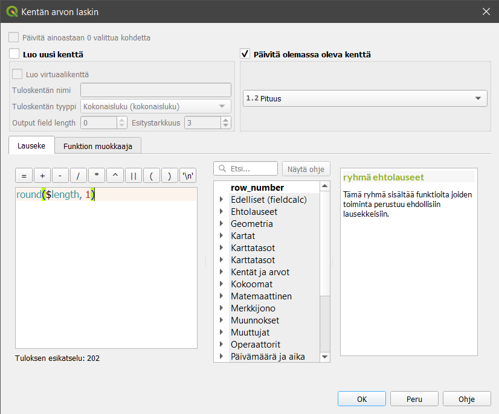

# Harjoitus 5: Digitointi

**Harjoituksen sisältö**

Harjoituksessa luodaan vektoriaineisto hyödyntäen digitoinnin perustyökaluja.

**Harjoituksen tavoite**

Harjoituksen jälkeen osallistuja osaa lisätä ja luoda tasoja QGISiin.

**Arvioitu kesto**

30 minuuttia.

## Valmistautuminen

Avaa uusi QGIS-projekti (**Projekti \> Uusi**) ja tallenna se nimellä "**QGIS-harjoitus 6**".

## Muokkauksen yleisasetukset

Muokkauksen toimintoa ja muita yleisiä muokkaustyöasetuksia voit muuttaa päävalikon ikkunassa **Asetukset \> Valinnat \> Digitointi**. Jos et esimerkiksi halua, että ominaisuustietojen muokkausikkuna tulee esiin jokaisen polygonin piirtämisen jälkeen, rastita **Älä näytä ominaisuustietojen pop-up lomaketta kohteen luonnin jälkeen**. Jätä se kuitenkin päälle tällä kertaa. Kokeile myös vaihtaa kohteiden muokkausväri keltaiseksi (**Kuminauha**) ja **Taitepisteen** symbolin tyyli ja koko. Paina **OK**, jolloin asetukset tulevat voimaan.

## Editoinnin valmistelu

Aloitetaan tekemällä editointia helpottavia valmisteluja. Ensimmäisenä aktivoi omaan projektiisi **Työkalut-valikosta** seuraavat työkalut:

-   Digitoinnin työkalupalkki

-   Digitoinnin lisätyökalujen palkki

-   Tarttumisen työkalut\

Usein ensimmäinen tehtävä aineistojen luomisessa on taustakartan lisääminen. Taustakartta helpottaa liikkumista ja aineistojen tarkistusta. Uudemmissa QGISin versioissa on OpenStreetMapin taustakarttatasot valmiiksi saatavilla. Lisää taustakartta projektiin tuplaklikkaamalla vasemmalta **Selain-paneelista XYZ Tiles \> OpenStreetMap**.

Zoomaa kartta Suomen kohdalle, ja koska haluamme tehdä tarkkaa editointia oikeassa koordinaattijärjestelmässä, muutetaan projektin koordinaattijärjestelmä Kuopin käyttämään **EPSG**:**3881 - ETRS89/GK27FIN**-järjestelmään. Klikkaa projektin oikeasta alakulmasta, jossa lukee tällä hetkellä EPSG:3857. Tämä on QGISin taustakartan perusteella asettama koordinaattijärjestelmä, jota emme nyt siis halua käyttää.

Paina tämän jälkeen **OK,** minkä jälkeen avautuva ikkuna kysyy sinulta koordinaattimuunnoksesta. Valitse uudestaan **OK**. Nyt projektisi on oikeassa koordinaattijärjestelmässä.

## GeoPackagen luonti

Luo uusi GeoPackage-taso valitsemalla päävalikosta **Tasot \> Luo taso \> Uusi Geopackage-taso**.

GeoPackage on tietokanta, jossa tieto on tallennettu tauluihin. Anna tietokannan nimeksi **"Jätevesi"** ja luotavan tason nimeksi **"Viemäripiirit"**. Valitse taulun geometriaksi polygoni ja koordinaattijärjestelmäksi **EPSG**:**3881 - ETRS89/GK27FIN**. Lisää GeoPackageen nyt muutama muu uusi sarake seuraavasti:

-   Nimi: Nimi / Tyyppi: teksti

-   Nimi: Pinta-ala / Tyyppi: desimaalinumero

Muista aina klikata **Lisää kenttälistaan -painiketta**, jotta jokainen kenttä ilmestyy listaukseen.

::: hint-box
Integer, 32bit integer vai Integer 64 bit? Tässä tapauksessa valitsemme kentän tyypiksi Integerin, mutta mistä tietää jatkossa, kumman valitsee?\
\
Ensin käyttötarkoitus: mitä lukuja kenttään tallennetaan?\
\
16-bit unsigned integer voi sisältää luvun väliltä -32 768 - 32 767\
Signed: 0 - 65 535.\
32-bit unsigned integer voi sisältää luvun välillä −2 147 483 648 - 2 147 483 647\
Signed: 0 - 4 294 967 295.\
64-bit unsigned integer voi sisältää luvunvälillä −9 223 372 036 854 775 808 - 9 223 372 036 854 775 807\
Signed: 0 - 18 446 744 073 709,55.\
\
QGIS:issä (versioissa 3.10+) integerit ovat oletuksena signed-tyyppisiä, ellei toisin mainita.\
Toisakseen tulee harkittavaksi, mihin tuota tietoa tallennetaan: Geopackage, PostgreSQL vai joku muu? Mitä enemmän käytetään bittejä, sitä suuremmaksi kasvaa tiedostojen koot (myös PostgreSQL:ssä on tiedostoja tietokannan takana). Mitä suuremmat tiedostot, sitä hitaammin asiat sujuvat.\
\
Kolmanneksi pitäisi ottaa huomioon, että siirretäänkö kyseistä aineistoa johonkin toiseen järjestelmään / tiedostoformaattiin. Tuleeko tilanteita, joissa 64bit tallennettu tieto pitääkin viedä tiedostoon, joka ei salli noin suuria numeroita (kuten Shapefile).\
:::

## Aloita geometrioiden editointi

Etsitään editoitava alue kartalla hyödyntäen QGISin hakutoimintoa OSM-kartan kanssa. QGISin alapalkissa vasemmalla on upotettu Etsi-toiminto, johon on sisäänrakennettu esimerkiksi OpenStreetMapin aineistoon perustuva Nominatim Geocoder, jonka avulla voimme etsiä osoitteita.

Etsiminen tapahtuu kirjoittamalla `>` ja sen perään osoite. Tässä harjoituksessa editoimme Kuopion aluetta, joten kirjoitamme hakukenttään `> kuopio` .

::: hint-box
Jos QGIS-versiosi on vanhempi, voi olla, että tarvitset Nominatim Locator Filter -lisäosan. Asenna se Lisäosat-välilehden kautta. Kun olet asentanut lisäosan, hae kohdetta muutoin samaan tapaan, mutta aloita haettava osoite `osm`-sanalla eli kirjoita Etsi-laatikkoon `osm Kuopio`

Huomaa, että Kuopio-sanan jälkeen on lisättävä vielä välilyönti, jotta haku tapahtuu.
:::

Seuraavaksi aloitamme aineiston muokkaamisen klikkaamalla **Tason muokkaus päälle/pois -painiketta** . Huomaa, että **Digitoinnin työkalupalkin** työkalut aktivoituvat. 

Valitse työkaluksi **Lisää polygonikohde** ja aloita alueiden digitointi. Hiiren vasemmalla näppäimellä voit klikata kartalla kohteen kulmapisteet. Kun monikulmio on valmis, napauta hiiren oikeaa näppäintä ja uusi monikulmio on luotu. Digitoi oikea tai kuvitteellinen viemäripiiri.

Kun editointi on valmis, QGISiin avautuu **viemäripiirit - kohteen attribuutit -ikkuna**. Laita **Nimi-kohtaan "Alueen nimi"**. Muihin kenttiin ei vielä tarvitse täyttää mitään. Paina **OK**.

Luodaan seuraavaksi uusi GeoPackage-taso, mutta kokonaan uuden tietokannan luomisen sijaan teemme aikaisemmin luotuun **Jätevesi-GeoPackageen** vain uuden tason. Anna taulun nimeksi **"jv_johdot"** ja lisää siihen seuraavat kentät:

-   Nimi: verkko / Tyyppi: teksti

-   Nimi: materiaali / Tyyppi: teksti

-   Nimi: Pituus / Tyyppi: desimaalinumero

Kun klikkaat **OK**, QGIS kysyy, haluatko korvata olemassa olevan GeoPackage-tiedoston (ja sen taulut) tällä tiedostolla vai lisätä tiedostoon/tietokantaan uuden tason. Valitse **Lisää uusi taso**, jolloin projektiin lisätään jälleen uusi taso.

Laita nyt vuorostaan tämän juuri luodun tason editointi päälle klikkaamalla **Tason muokkaus päälle/pois -kuvaketta** (kynäikoni). Koska haluamme, että johtoverkosto kytekytyy toisiinsa ilman välejä, on kytkettävä **Tarttuminen (snapping)** päälle. Voit tehdä tämän klikkaamalla **Ota tarttuminen käyttöön -painiketta** . Valitse ensimmäisestä alasvetovalikosta **Kaikki tasot** ja toisesta valikosta kuvan mukaisesti **Piste** ja **segmentti**. Aseta **tarttumisherkkyydeksi** 12 pikseliä (oletusherkkyys).

Luodaan seuraavaksi jätevesijohtoverkostoa. Piirrä useampia viivoja, jotka tarttuvat toisiinsa. Anna tälle viivoille verkko kohtaan nimi jätevesi ja materiaaliksi esim. pvc. Jätä pituus-kenttä vielä tyhjäksi.

Päivitetään attribuuttitaulun kenttiin puuttuvat tiedot **Kentän arvojen laskin -työkalun** avulla. Avaa laskin klikkaamalla **Ominaisuustietojen työkalupalkista** **Avaa kentän arvojen laskin -painiketta**  

Klikkaa avautuvasta ikkunasta **Päivitä olemassa oleva kenttä** ja valitse alasvetovalikosta **Pituus-kenttä**. Kirjoita **Lauseke-kenttään** lauseke, joka laskee viivamaisen kohteen pituuden sekä pyöristää sen yhden desimaalin tarkkuudelle:

::: code-box
round(\$length, 1)
:::

Päivitä aluemaiselle tasolle samalla tavalla pinta-alatiedot kuin äsken päivitit viivatasolle viivojen pituudet. Pinta-alan saa laskettua käyttäen automaattista pinta-alafunktiota **\$area**, joka palauttaa alueen pinta-alan neliökilometreinä. Jos digitoimasi alueet ovat isoja, voit jakaa tuloksen miljoonalla, jolloin saadaan pinta-ala neliökilometreinä.

Laita lopuksi molempien tasojen tason muokkaus pois päältä klikkaamalla kynäkuvaketta. Tallenna kaikki muutokset tasoihin. Kun olet valmis, tallenna projektitiedosto kurssihakemistoon pikanäppäimellä **CTRL + T** (englanninkielisessä QGISissä **CTRL + S**) tai päävalikosta **Projekti \> Tallenna**.

::: hint-box
**Psst!** Muista tukipalvelu! Koulutuksen jälkeen saat henkilökohtaista tukea Gispon tukipalvelun kautta lähettämällä yksinkertaisesti koulutustuki\@gispo.fi-sähköpostiosoitteeseen kysymyksen tai kommentin jostakin sinua mietityttävästä asiasta. Gispon tiimi auttaa sinua toimiesi äärellä. Kysymykset käsitellään henkilökohtaisesti.
:::

## Lisätehtävä

Lisää GeoPackageen pistemäinen taso ja digitoi pistekohteita kartalle. Kun olet valmis, tallenna muutokset tasolle ja projektitiedostoon, kuten tehtiin edellisen digitointiharjoituksen päätteeksi.
