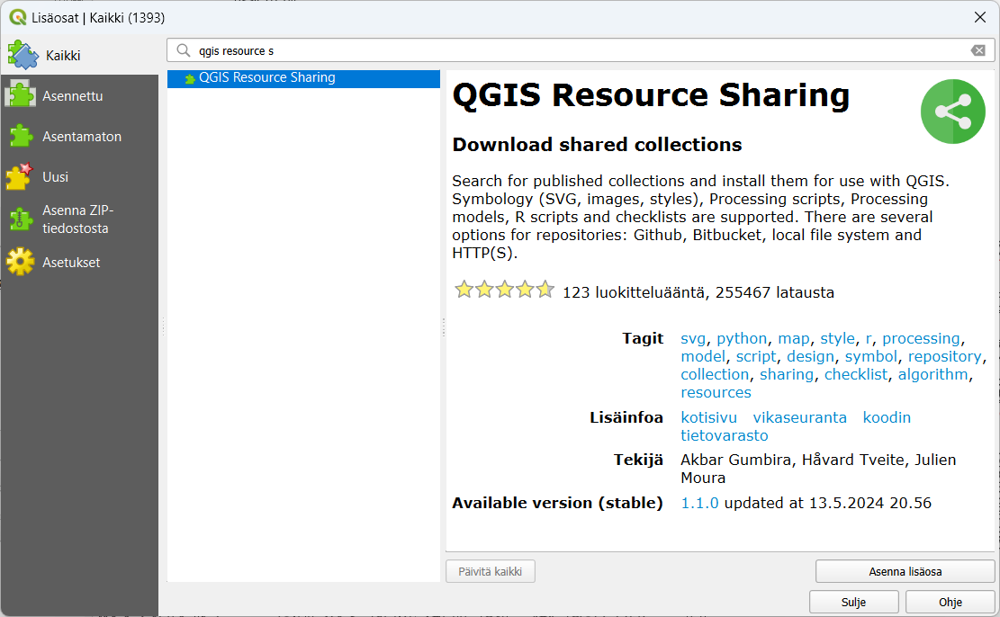
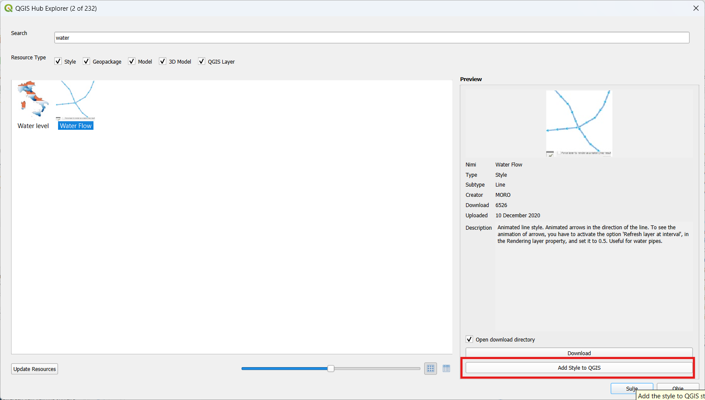
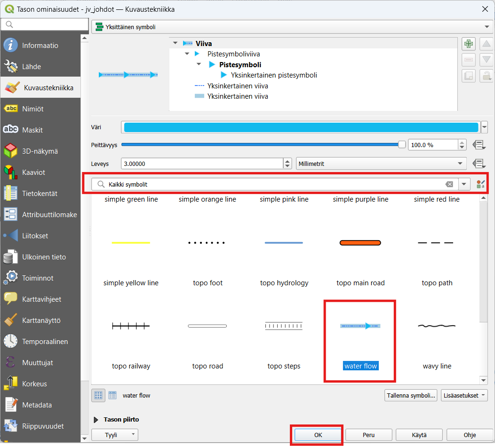
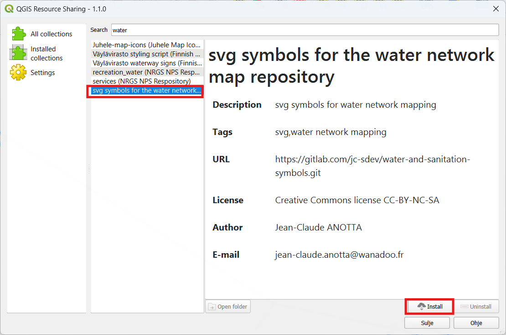
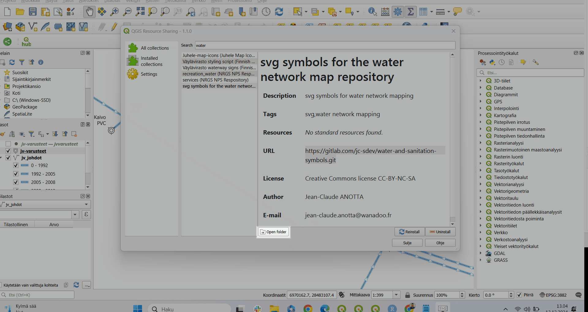
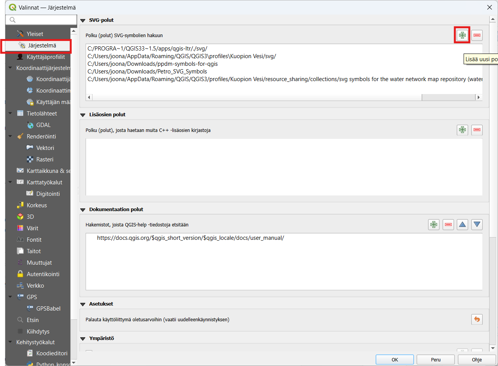
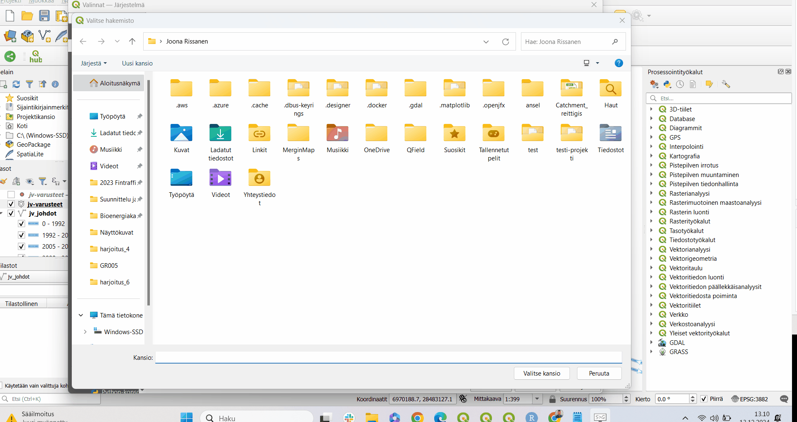
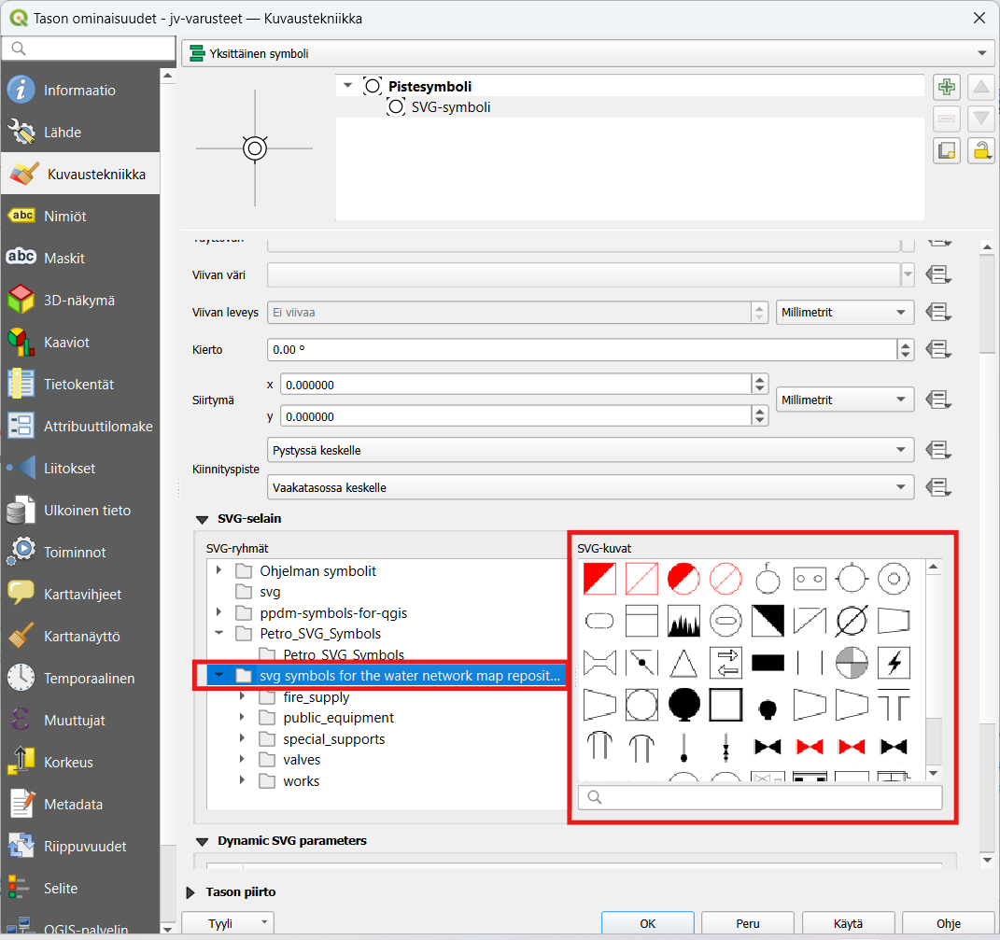

# Harjoitus 6: Lisäosien asentaminen, uusien visualisointien hakeminen symbolikirjastoista ja omien symbolien tekeminen

## Harjoituksen sisältö

Harjoituksessa tutustutaan lisäosien asentamiseen, uusien visualisointien hakmiseen valmiista symbolikirjastoista ja omien symbolien tekemiseen

## Harjoituksen tavoite

Koulutettava oppii asentamaan QGIS-lisäsoa ja lataamaan valmiita visualisointikirjastoja QGISiin ja asettamaan QGISiin oletuspolku SVG-kuvakkeille.

## Valmistautuminen

Käynnistä QGIS-ohjelmisto. Avaa harjoituksen 4 QGIS-projektisi ja tallenna se nimellä (**Projekti → Tallenna nimellä...**) "**QGIS_harjoitus_6**". Avaa projektiin seuraavat aineistot:

-   Lisää projektiin seuraavat aineistot:
    -   **.../jv-johdot.TAB**

    -   **.../jv-varusteet.TAB**

    -   **.../viemäripiirit.TAB**

SVG-symbolit ovat erittäin hyödyllisiä QGIS:ssä, sillä ne mahdollistavat mukautettujen karttasymbolien käytön.

Tässä harjoituksessa harjoittelemme sekä valmiiden symbolikirjastojen asentamista että omien symbolien tekemistä.

## Lisäosien asentaminen

Lisäosia lisätään käyttöön päävalikosta **Lisäosat → Hallitse ja asenna lisäosia...** -valikon kautta. Valitse **Kaikki**-välilehti. Asennetaan kaksi hyödyllistä lisäosaa joilla saa käyttään uusia symboleita. Etsi ensin **QGIS Hub Plugin** ja asenna se painamalla **Asenna lisäosa.** Etsi tämän jälkeen vielä **QGIS Resource sharing** -lisäosa ja asenna sekin samalla tavalla.



## QGIS Hub plugin

Tämä QGIS lisäosa hakee visualisointeja [QGIS Hub](https://plugins.qgis.org/styles/?order_by=-upload_date&&is_gallery=true)- palvelusta. Tarjoaa kokoelman hyödyllisiä QGIS-resursseja QGIS-tyylistä, tasosta ja käsittelymallista. Tämä QGIS Hub -laajennus auttaa sinua selaamaan käytettävissä olevia visualisointeja ja lisäämään ne suoraan QGIS-järjestelmääsi.

Kokeile esimerkiski Water Flow- tyyliä. Etsi se haku palkin kautta ja lisää lopuksi QGISiin klikkaamalla **Add style to QGIS.**



Tämän jälkeen voit kokeilla visualisoida jv-johdot aineistoa tällä visualisoinnilla. Tällöin aineistossa pitäisi näkyä virtausnuolet valmiina.



## QGIS Resource Sharing

Tällä lisäosalla saat käyttöön jaettuja kokoelmia esimerkiksi SVG-ikoneita ja tyylitiedostoj. Väylävirasto on esimerkiksi jakanut tämän lisäosan kautta kaikki [Suomen liikennemerkit QGIS-kuvakirjastona](https://github.com/finnishtransportagency/liikennemerkit). (Löytyy lisäosasta hakukenttään syöttämällä "Väylävirasto". Lisäosasta löytyy myös kaikenlaisia muita symbolikirjastoja. Yksi hyödyllinen SVG-symbolikirjasto löytyy nimellä "svg symbols for the water network map repository" (suom. svg-symbolit vesiverkostolle". Kokeillaan seuraavaksi ladata tämä ja ottaa se käyttöön. Etsi symbolikirjasto syöttämällä hakukenttään esimerkiksi "water". Kun olet löytänyt oikean niin asenna se klikkaamalla **Install.** Tämä symbolikirjasto on lisensoitu CC-BY-NC-SA, joka tarkoittaa *Tekijä tai oikeudenomistaja mainittava asianmukaisesti, teoksen käyttö kaupallisiin tarkoituksiin on kielletty ja johdannaisteoksia saa levittää vain samalla lisenssillä kuin alkuperäistä teosta.*



Kun asennus on suoritettu onnistuneesti klikkaa **Open folder** kopioi tämän kansion tiedostosijanti:



Kopioi tämän sijainti leikepöydälle. Seuraavaksi kopioidaan tämä osoite QGISin symbolikirjaston oletus osoitteeksi, jotta kirjaston saa käyttöön.

Mene QGISissa ylävalikosta *Asetukset --\> Valinnat --\> Järjestelmä* kohtaan. Lisää uusi polku kohtaan *Polku (polut) SVG-symbolien hakuun* plus-merkistä.



Lisää tähän sijaintiin juuri kopioimasi sijainti ja valitse lopuksi **Valitse kansio.**



Tämän jälkeen symbolit ovat käytettävissä suoraan pistemuotoisten tasojen SVG-visualisoinnissa:



## Omien symbolien tekeminen

Voit käyttää mitä tahansa vektorigrafiikkaohjelmaa, kuten:

-   **Inkscape** (ilmainen ja avoimen lähdekoodin ohjelma)

-   **GIMP**

Toimi näin:

1.  **Avaa ohjelma ja luo uusi tiedosto.**

    -   Aseta kankaan koko esimerkiksi 100x100 pikseliä.

2.  **Piirrä symboli.**

    -   Käytä yksinkertaisia muotoja ja värejä.

    -   Vältä liian monimutkaisia elementtejä, jotka saattavat hidastaa QGIS:n toimintaa.

3.  **Vie tiedosto SVG-muodossa.**

    -   Inkscapessa valitse **Tiedosto -\> Vie tallennettuna** ja valitse SVG.

4.  **Sijoita SVG-symboli oikeaan kansioon**

Jotta QGIS löytää symbolisi:

5.  Tallenna tiedosto paikkaan, jossa se on helposti saatavilla. Esimerkiksi:\
    `C:/Users/[käyttäjänimi]/Documents/QGIS/SVG`

6.  Vaihtoehtoisesti voit sijoittaa sen QGIS:n oletussymbolikansioon:

    -   Windows: `C:/Program Files/QGIS 3.xx/apps/qgis/svg`

    -   MacOS/Linux: `/usr/share/qgis/svg`

**Lisää SVG-symboli QGIS:ssä**

7.  Avaa **QGIS** ja avaa **Tyylieditori**:

    -   Klikkaa kerrosta, jonka tyyliä haluat muokata.

    -   Valitse **Ominaisuudet -\> Tyyli**.

8.  Valitse **Symbolin tyyppi**:

    -   Valitse **Markeri -\> SVG-marker**.

9.  Klikkaa **Tiedosto-painiketta** ja etsi luomasi SVG-symboli.

10. Säädä tarvittaessa kokoa, värejä ja kiertoa.

**Tee symbolista uudelleenkäytettävä**

Jos haluat käyttää symbolia muissa projekteissa:

11. Tallenna tyyli tiedostoksi:

```         
-   **Tiedosto -\> Vie tyyli -\> .qml** (QGIS-tyylitiedosto).
```

12. Voit myös käyttää **Tyylikirjastoa**:

```         
-   QGIS:n päävalikosta: **Projektit -\> Tyylikirjasto**.
```

### Vinkkejä onnistuneeseen SVG-symbolien luontiin

-   **Yksinkertaisuus:** Vältä liian monimutkaisia symboleita.

-   **Mittakaava:** Testaa symbolin näkyvyys eri mittakaavoissa.

-   **Käytä kerroksia:** Kerrokset helpottavat symbolin muokkaamista myöhemmin.

-   **Testaa symboli:** Lataa symboli QGIS:ään ja varmista, että se näyttää hyvältä ja toimii odotetusti.

Onko sinulla tietty symboli, jonka haluat tehdä? Voin auttaa ideoinnissa!
