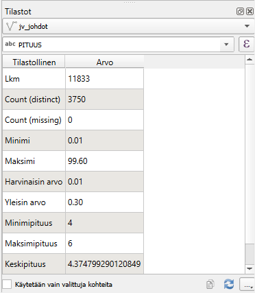
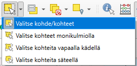
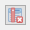
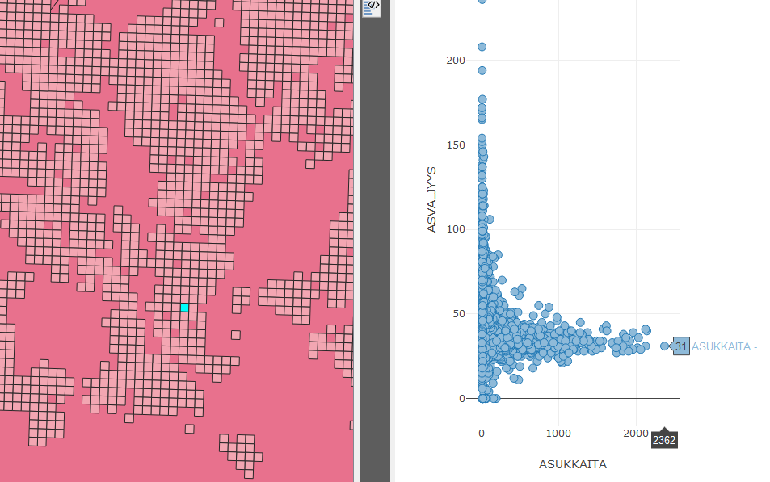
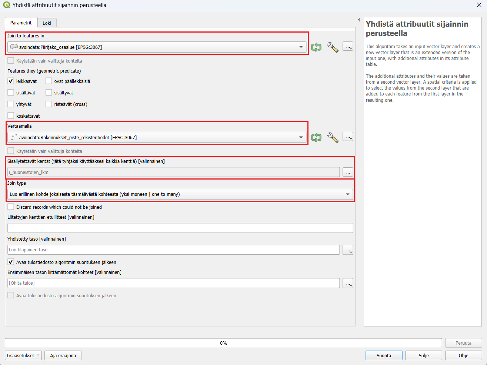
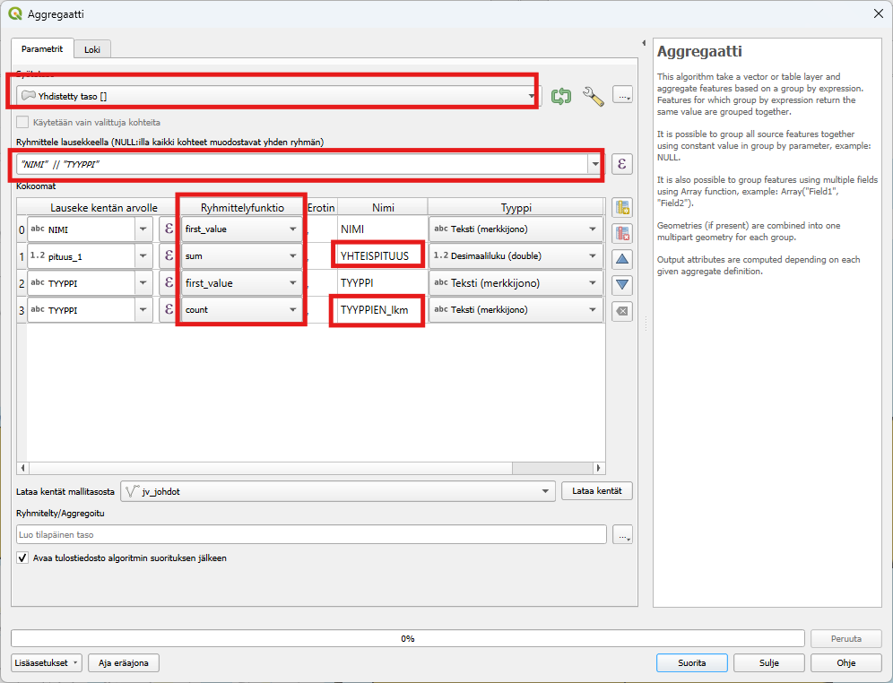
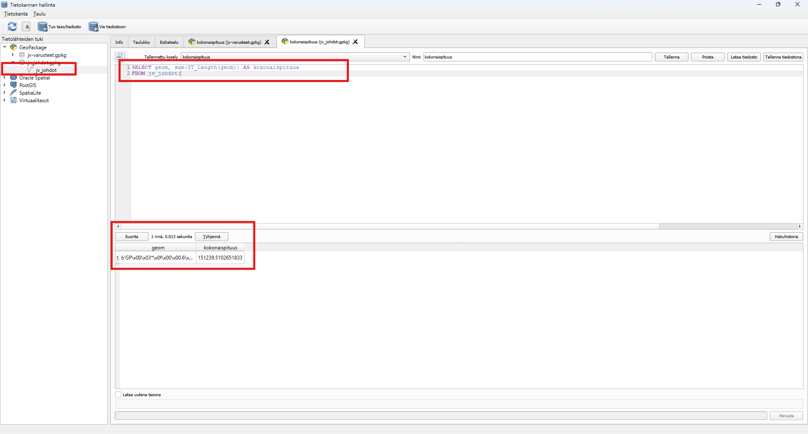

# Harjoitus 8: SQL-kyselyt

## Harjoituksen sisältö

Harjoituksessa harjoitellaan SQL-kyselyiden tekemistä aineistoilla

## Harjoituksen tavoite

Koulutettava oppii SQL-kyselyiden luonnin

## Valmistautuminen

Käynnistä QGIS-ohjelmisto. Avaa uusi QGIS-projekti ja tallenna se nimellä (**Projekti → Tallenna nimellä...**) "**QGIS_harjoitus_8**".

Lisää projektiin seuraavat aineistot:

-   **.../jv-johdot.TAB**
-   **.../kaupunginosat.TAB**
-   **.../viemäripiirit.TAB (jos haluat käyttää tätä lakusissa kaupnginosien sijaan)**

## Tilastot

Avaa projektiisi **jv-johdot.TAB** ja muunnetaan se harjoituksen aluksi GeoPackageksi. Tämä varmistaa sen, että saamme laskettua alueellisia summia ja tehtyä SQL-kyselyitä. Klikkaa Tasot-luettelossa jv-johdot tasoa hiiren oikealla ja valitse **Vie** \> **Tallenna kohteet nimellä.** Anna Tiedostomuodon olla GeoPackage. Valitse **Tiedostonimeksi** jvjohdot ja **Tason nimeksi** jvjohdot. Vaihda **koordinaattijärjestelmäksi** Ennalta määritelty koordinaattijärjestelmä ja valitse **ETR89/GK27FIN** (EPSG:3881). Tallenuksen jälkeen taso ilmestyy Tasot-paneeliin. Poista alkuperäinen jv-johdot.TAB painamalla tasoa hiiren oikealla ja valitsemalla **Poista taso**. Varmista vielä, että projektille on määritetty koordinaatistoksi **ETR89/GK27FIN** (EPSG:3881). Voit tehdä sen esim. **Projekti** \> **Ominaisuudet** \> **Koordinaatijärjestelmä** tai QGISin oikean alalaidan kuvakkeen kautta.

Tehdään vielä alkuvalmisteluina muutos ominaisuustietotauluun. Alkuperäisessä aineistossa pituustieto oli tekstimuodossa, joka estää laskuoperaatioiden tekemisen. Mene **Tason ominaisuudet** \> **Tietokentät** ja poista sarake **Pituus** aktivoimalla muokkaus kynäkuvakkeesta ja valitsemalla **Poista kenttä.** Paina **Uusi kenttä** ja anna Nimeksi Pituus ja Tyypiksi Desimaalinumero. Laske tämän jälkeen pituudet **Kentän arvojen laskin -työkalulla** kuten tehtiin Digitointiharjoituksessa.

Tutkitaan seuraavaksi tasoa QGISin tilastot-paneelissa, jossa voit tarkastella aineistosi arvojen tilastollista jakaumaa. Saat **Tilastot-paneelin** näkyviin QGISin käyttöliittymään klikkaamalla Näytä tilastollinen yhteenveto -painiketta  tai valitsemalla päävalikosta **Näytä \> Paneelit \> Tilastot**. Avautuvassa ikkunassa valitse pudotusvalikosta **jvjohdot-taso** ja sen jälkeen yksi tason attribuuttikenttä. Tarkastele esitettäviä tilastollisia tunnuslukuja. Voit myös valita aineistosta vain osan, jonka tilastoja haluat tarkastella. Valitse osa aineiston ruuduista joko kartalta tai attribuuttitaulusta, ja klikkaa **Tilastot-paneelin** ruutu **Käytetään vain valittuja kohteita** aktiiviseksi.

## Alueellisten summien laskeminen ja aggregointi

Erilaisia paikkatietoaineistoja pitää välillä yhdistää ominaisuuksiensa tai sijainnin perusteella. Tässä harjoituksessa tutustuaan, miten ominaisuustietoja voidaan yhdistää eri tavoin.

### Aggregointi

Valitse sopiva valintatyökalun asetus:

ja tee valintatyökaluilla valinta halutulta alueelta.

Aggregoimalla voidaan yhdistää sarakkeita jonkin ominaisuustiedon perusteella ja päättää, miten muut sarakkeet yhdistyvät toisiinsa. Etsi Prosessointityökaluista **Aggregaatti**. Valitse syötetasoksi jvjohdot, laita valintapäälle "Käytetään vain valittuja kohteita" ja ryhmittelylauseeksi `"TYYPPI"`. Kokoomat-lehdellä on kaikki aineiston sarakkeet ja voit valita miten sarakkeet yhdistyvät toisiinsa. Poista kaikki ylimääräiset sarakkeet valitsemalla esimerkiksi CTRL-pohjassa sarakkeet ja painamalla  nappia. Jätä näkyviin vain TYYPPI ja pituus. Lisää tämän jälkeen vielä toinen TYYPPI sarake. Määrittele seuraavat ryhmittelyfunktiot:

-   TYYPPI --\> first_value

-   pituus --\> sum

-   TYYPPI --\> count

    Vaihda tämän jälkeen vielä pituus sarakkeen nimeksi "YHTEISPITUUS" ja TYYPPI - count sarakkeen nimeksi "TYYPPIEN_lkm"

    

Paina vielä **Suorita**. Ajossa kestää hetki ja uusi Aggregated-taso ilmestyy projektiisi. Avaa tason attribuuttitaulukko. Jokaisella osa-alueella on summattuna alueella olevien jvjohtojen lukumäärä tyypeittäin. Voit visualisoida aineiston esimerkiksi valitsemalla kuvaustekniikaksi porrastettu ja etsimällä aineistoon sopivat luokkavälit.

### Alueellisten summien laskeminen

Harjoituksessa käytetään Kuopion kaupungin **kaupunginosat**- tasoa (**kaupunginosat.TAB**) ja lasketaan, kuinka paljon jvjohtoja on eri Kuopion osa-alueilla.

::: hint-box
Voit myös tehdä harjoituksen myös muulla aluejaolla esimerkiksi viemäripiirit tasolla.
:::

Liitetään tieto jv-johdoista Kuopion kaupunginosa jakoon sijainnin perusteella. Avaa **Vektori -\> Tiedonhallinta -\> Yhdistä attribuutit sijainnin perusteella**. Valitse yhdistettäväksi tasoksi kaupungingosat ja vertailukohteeksi jvjohdot. Jätä Säilytettävät kentät tyhjäksi niin kaikki jv-johdot-tason sarakkeet lisätään. Tarkista vielä, että Join type on **Luo erillinen kohde jokaisesta täsmäävästä kohteesta (yksi-moneen)** , jotta jokainen piste huomiodaan uudessa tasossa.

Paina **Suorita**. Tasoluetteloon pitäisi tulla uusi taso nimeltään "Yhdistetty taso". Voit tarkistaa onko yhdistys tehty oikein tarkistamalla kohteiden lukumäärän. Klikkaa tasoa hiiren oikealla ja valitse "Näytä kohteiden lukumäärä" -täppä aktiiviseksi. Tee sama jvjohdot -tasolle. Jos lukumäärä on lähes sama, yhdistys on onnistunut! (muutama kohde on kaupungosa-alueiden ulkopuolella). Attribuuttitaulukossa on sarake kaikista kaupunginosista muiden attribuuttien lisäksi.

Seuraavaksi tasot yhdistetään osa-alueittain aggregoimalla taso kaupunginosajaon ja johdon tyypin mukaisesti. Aggregoimalla voidaan yhdistää sarakkeita jonkin ominaisuustiedon perusteella ja päättää, miten muut sarakkeet yhdistyvät toisiinsa. Etsi Prosessointityökaluista **Aggregaatti**. Valitse syötetasoksi aiemmin tehty Yhdistetty taso, ryhmittelylauseeksi `"NIMI"  || "TYYPPI"` (eli siis kokoamme yhteen sekä kaupunginosa nimen perusteella että johdon tyypin). Kokoomat-lehdellä on kaikki aineiston sarakkeet ja voit valita miten sarakkeet yhdistyvät toisiinsa. Poista kaikki ylimääräiset sarakkeet ja jätä näkyviin vain NIMI, pituus, TYYPPI. Lisää tämän jälkeen vielä toinen TYYPPI sarake. Määrittele seuraavat ryhmittelyfunktiot:

-   NIMI --\> first_value

-   pituus --\> sum

-   TYYPPI --\> first_value

-   TYYPPI --\> count

    Vaihda tämän jälkeen vielä pituus sarakkeen nimeksi "YHTEISPITUUS" ja TYYPPI - count sarakkeen nimeksi "TYYPPIEN_lkm"

    

    

    

Paina vielä **Suorita**. Ajossa kestää hetki ja uusi Aggregated-taso ilmestyy projektiisi. Avaa tason attribuuttitaulukko. Jokaisella osa-alueella on summattuna alueella olevien jv-johtojen lukumäärä tyypeittäin. Voit visualisoida aineiston esimerkiksi valitsemalla kuvaustekniikaksi porrastettu ja etsimällä aineistoon sopivat luokkavälit.

## Lisätehtävä: Summien laskeminen SQL-lausekkeilla

QGIS mahdollistaa SQL-kyselyiden tekemisen suoraan aineistoihin, kuten PostGIS-tietokantoihin tai paikallisiin tiedostoihin (esim. GeoPackage). Tässä ohjeet, miten voit tehdä SQL-kyselyitä QGIS:llä:

1\. **Valmistaudu SQL-kyselyihin**

Tarkista, että aineisto tukee SQL-kyselyitä

-   **PostGIS-tietokanta:** Voit käyttää SQL:ää suoraan, kun olet yhdistänyt QGIS:n PostGIS-tietokantaan.

-   **GeoPackage-tiedosto:** GeoPackage-tiedostot tukevat SQL:ää.

-   **Shapefile:** Shapefile ei tue suoria SQL-kyselyitä; muunna se ensin sopivampaan muotoon, kuten GeoPackage.

-   **MapInfo-tiedostot kuten TAB:** eivät tue suoria SQL-kyselyitä; muunna se ensin sopivampaan muotoon, kuten GeoPackage.

2\. **Avaa "DB Manager"**

DB Manager on QGIS:n työkalu, jonka avulla voit tehdä SQL-kyselyitä:

1.  Avaa **DB Manager**:

    -   **Valikko:** *Tietokanta -\> DB Manager -\> DB Manager*.

2.  Valitse tietolähde:

    -   Jos käytät GeoPackage-tiedostoa, valitse tiedosto paikallisista tietolähteistä.

3\. **Kirjoita SQL-kysely**

-   Klikkaa tietokannan nimeä ja valitse **SQL-kysely** (Query).

-   Kirjoita SQL-koodi editoriin:

    ::: code-box
    SELECT geom, sum(ST_Length(geom)) AS kokonaispituus

    FROM jvjohdot;
    :::

    

<!-- -->

-   Suorita kysely:

    -   Klikkaa **Suorita kysely (Execute)**.

-   Tässä myös muita SQL-lauseita:

Lukumäärien laskenta:

::: code-box
SELECT TYYPPI, COUNT(\*) AS lukumäärä

FROM jvjohdot

GROUP BY TYYPPI;
:::

Lukumäärät, josta betoni materiaali ja omistaja Kuopion Vesi:

::: code-box
SELECT TYYPPI, COUNT(\*) AS lukumäärä

FROM jvjohdot

where OMISTAJA IS "Kuopion Vesi" AND MATERIAALI IS "BET"

GROUP BY TYYPPI;
:::

**SQL-kyselyt suoraan QGIS:n tasoille**

Jos haluat tehdä SQL-kyselyitä ilman DB Manageria, voit käyttää **suodattimia**

**a) Käytä Suodatinta (Filter):**

1.  Valitse kerros ja klikkaa sitä hiiren oikealla → **Suodatin**.

2.  Kirjoita yksinkertainen kysely, esimerkiksi:

    ::: code-box
    "TYYPPI" = 'Keräilyviemäri, digit. - Jäte'
    :::

    TAI:

    ::: code-box
    "TYYPPI" = 'Keräilyviemäri, digit. - Jäte' AND "OMISTAJA" = 'Kuopion Vesi'
    :::

3.  Klikkaa **OK**.

**Hyviä käytäntöjä SQL-kyselyissä**

-   **Projektio:** Varmista, että käytät oikeita koordinaattijärjestelmiä erityisesti geometriakyselyissä.

-   **Optimoitu kysely:** Suuren tietoaineiston käsittely voi olla hidasta, joten käytä suodattimia (esim. `WHERE`) tarpeettomien rivien rajaamiseksi.

-   **Testaa kyselyt pienemmässä mittakaavassa:** Varmista, että kysely toimii ennen kuin suoritat sen koko tietoaineistolle.
