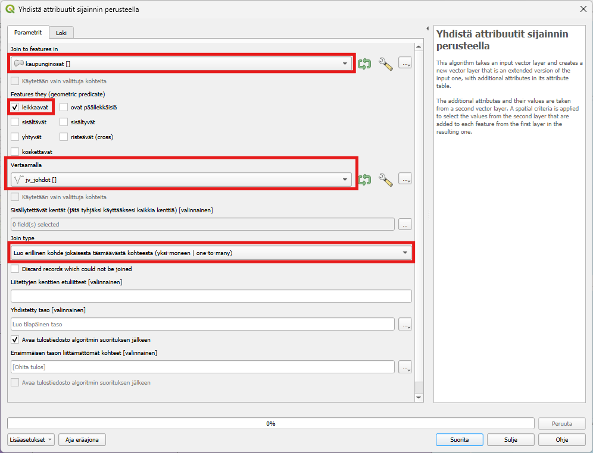

# Harjoitus 8: SQL-kyselyt

## Harjoituksen sisältö

Harjoituksessa harjoitellaan SQL-kyselyiden tekemistä aineistoilla

## Harjoituksen tavoite

Koulutettava oppii SQL-kyselyiden luonnin

## Valmistautuminen

Käynnistä QGIS-ohjelmisto. Avaa uusi QGIS-projekti ja tallenna se nimellä (**Projekti → Tallenna nimellä...**) "**QGIS_harjoitus_8**".

Lisää projektiin seuraavat aineistot:

-   **.../Harjoitus 8/jv-johdot.TAB**

## Tilastot

Tuo projektiisi kurssihakemiston **Harjoitus 3** -kansiosta vektorimuotoinen taso **Vaestotietoruudukko_2022.gpkg**. Tutkitaan seuraavaksi tasoa QGISin tilastot-paneelissa, jossa voit tarkastella aineistosi arvojen tilastollista jakaumaa.

Saat **Tilastot-paneelin** näkyviin QGISin käyttöliittymään klikkaamalla Näytä tilastollinen yhteenveto -painiketta  tai valitsemalla päävalikosta **Näytä \> Paneelit \> Tilastot**. Avautuvassa ikkunassa valitse pudotusvalikosta **vaestotietoruudukko_2022-taso** ja sen jälkeen yksi tason attribuuttikenttä. Tarkastele esitettäviä tilastollisia tunnuslukuja. Voit myös valita aineistosta vain osan, jonka tilastoja haluat tarkastella. Valitse osa aineiston ruuduista joko kartalta tai attribuuttitaulusta, ja klikkaa **Tilastot-paneelin** ruutu **Käytetään vain valittuja kohteita** aktiiviseksi.


## Alueellisten summien laskeminen ja aggregointi

Erilaisia paikkatietoaineistoja pitää välillä yhdistää ominaisuuksiensa tai sijainnin perusteella. Tässä harjoituksessa tutustuaan, miten ominaisuustietoja voidaan yhdistää eri tavoin. Harjoituksessa käytetään Helsingin kaupungin avointa aineistoa rajapinnalta ja lasketaan, kuinka paljon huoneistoja on eri Helsingin osa-alueilla.

Tee yhteys Helsingin kaupungin WFS-osoitteeseen:

<https://kartta.hel.fi/ws/geoserver/avoindata/wfs?request=getCapabilities>

Lisää projektiisi rajapinnalta:

-   **Piirijako_osaalue**
-   **Rakennukset_piste_rekisteritiedot**

Pisteaineisto on melko iso, joten sen lataamisessa voi kestää hetki. Aineistossa on jokainen rakennus pisteenä ja ominaisuustiedoissa huoneistojen lukumäärä kussakin rakennuksessa sarakkeessa **i_huoneistojen_lkm**. Liitetään tieto huoneistojen lukumäärästä Helsingin piirijakoon sijainnin perusteella. Avaa **Vektori -\> Tiedonhallinta -\> Yhdistä attribuutit sijainnin perusteella**. Valitse yhdistettäväksi tasoksi Piirijako_osaalue ja vertailukohteeksi Rakennukset_piste_rekisteritiedot. **Sisällytettävät kentät** kohdassa valitse listasta **i_huoneistojen_lkm**. Jos kenttä jää tyhjäksi niin kaikki Rakennus-tason sarakkeet lisätään. Tarkista vielä, että Join type on **Luo erillinen kohde jokaisesta täsmäävästä kohteesta (yksi-moneen)** , jotta jokainen piste huomiodaan uudessa tasossa.



Paina **Suorita**. Tasoluetteloon pitäisi tulla uusi taso nimeltään "Yhdistetty taso". Voit tarkistaa onko yhdistys tehty oikein tarkistamalla kohteiden lukumäärän. Klikkaa tasoa hiiren oikealla ja valitse "Näytä kohteiden lukumäärä" -täppä aktiiviseksi. Tee sama Rakennukset_piste -tasolle. Jos lukumäärä on sama, yhdistys on onnistunut! Attribuuttitaulukossa on sarake kaikista huoneistojen lukumääristä piirijaon attribuuttien lisäksi.

Seuraavaksi tasot yhdistetään osa-alueittain aggregoimalla taso piirijaon mukaisesti. Aggregoimalla voidaan yhdistää sarakkeita jonkin ominaisuustiedon perusteella ja päättää, miten muut sarakkeet yhdistyvät toisiinsa. Etsi Prosessointityökaluista **Aggregaatti**. Valitse syötetasoksi aiemmin tehty Yhdistetty taso, ryhmittelylauseeksi tunnus. Kokoomat-lehdellä on kaikki aineiston sarakkeet ja voit valita miten sarakkeet yhdistyvät toisiinsa. Valitse teksti-sarakkeisiin esimerkiksi first_value, jolloin vain ensimmäinen alueen arvo tulee sarakkeeseen. Voit myös poistaa ylimääräisiä sarakkeita vasemmalta puolelta  -napista. Tarkista, että i_huoneistojen_lkm sarakkeessa aggregaattifunktio on **sum**, jotta saamme huoneistojen yhteismäärän alueittain.


Paina vielä **Suorita**. Ajossa kestää hetki ja uusi Aggregated-taso ilmestyy projektiisi. Avaa tason attribuuttitaulukko. Jokaisella osa-alueella on summattuna alueella olevien huoneistojen määrä. Voit visualisoida aineiston esimerkiksi valitsemalla kuvaustekniikaksi porrastettu ja etsimällä aineistoon sopivat luokkavälit.

## 

QGIS mahdollistaa SQL-kyselyiden tekemisen suoraan aineistoihin, kuten PostGIS-tietokantoihin tai paikallisiin tiedostoihin (esim. GeoPackage). Tässä ohjeet, miten voit tehdä SQL-kyselyitä QGIS:llä:

### 1. **Valmistaudu SQL-kyselyihin**

#### Tarkista, että aineisto tukee SQL-kyselyitä:

-   **PostGIS-tietokanta:** Voit käyttää SQL:ää suoraan, kun olet yhdistänyt QGIS:n PostGIS-tietokantaan.

-   **GeoPackage-tiedosto:** GeoPackage-tiedostot tukevat SQL:ää.

-   **Shapefile:** Shapefile ei tue suoria SQL-kyselyitä; muunna se ensin sopivampaan muotoon, kuten GeoPackage.

### 2. **Avaa "DB Manager"**

DB Manager on QGIS:n työkalu, jonka avulla voit tehdä SQL-kyselyitä:

1.  Avaa **DB Manager**:

    -   **Valikko:** *Tietokanta -\> DB Manager -\> DB Manager*.

2.  Valitse tietolähde:

    -   Jos käytät PostGIS:iä, yhdistä tietokantaan (jos et ole tehnyt sitä aiemmin, valitse *PostGIS -\> Yhdistä* ja anna tietokantatiedot).

    -   Jos käytät GeoPackage-tiedostoa, valitse tiedosto paikallisista tietolähteistä.

### 3. **Kirjoita SQL-kysely**

1.  Klikkaa tietokannan nimeä ja valitse **SQL-kysely** (Query).

2.  Kirjoita SQL-koodi editoriin:

    -   Esimerkki: Valitse kaikki rivit tietyltä alueelta:

        ```         
        sql
        ```

        Kopioi koodi

        `SELECT *  FROM taulun_nimi WHERE ST_Intersects(geometry, ST_Buffer(ST_MakePoint(25.5, 60.2)::geometry, 1000));`

    -   Esimerkki: Laskenta:

        ```         
        sql
        ```

        Kopioi koodi

        `SELECT luokka, COUNT(*) FROM taulun_nimi GROUP BY luokka;`

3.  Suorita kysely:

    -   Klikkaa **Suorita kysely (Execute)**.

### 4. **Tallenna tulos kartalle**

1.  Jos kysely tuottaa geometrioita:

    -   Tulos näkyy DB Managerin alareunassa. Klikkaa **Tuo QGIS:iin (Load as layer)**.

    -   Anna kerrokselle nimi ja määritä projektio.

2.  Jos kysely ei tuota geometrioita:

    -   Voit viedä tuloksen CSV-tiedostoksi ja lisätä sen myöhemmin taulukoksi.

### 5. **SQL-kyselyt suoraan QGIS:n kerroksille**

Jos haluat tehdä SQL-kyselyitä ilman DB Manageria, voit käyttää **suodattimia** tai **Virtual Layer -ominaisuutta**.

#### **a) Käytä Suodatinta (Filter):**

1.  Valitse kerros ja klikkaa sitä hiiren oikealla → **Suodatin**.

2.  Kirjoita yksinkertainen kysely, esimerkiksi:

    ```         
    sql
    ```

    Kopioi koodi

    `luokka = 'metsä' AND pinta_ala > 1000`

3.  Klikkaa **OK**.

#### **b) Käytä Virtual Layer -kerrosta:**

1.  Lisää uusi virtuaalinen kerros:

    -   **Valikko:** *Kerros -\> Luo kerros -\> Lisää virtuaalinen kerros*.

2.  Kirjoita SQL-kysely, esimerkiksi:

    ```         
    sql
    ```

    Kopioi koodi

    `SELECT * FROM "kerroksen_nimi" WHERE luokka = 'kaupunkialue';`

3.  Klikkaa **OK**.

### 6. **Hyviä käytäntöjä SQL-kyselyissä**

-   **Projektio:** Varmista, että käytät oikeita koordinaattijärjestelmiä erityisesti geometriakyselyissä.

-   **Optimoitu kysely:** Suuren tietoaineiston käsittely voi olla hidasta, joten käytä suodattimia (esim. `WHERE`) tarpeettomien rivien rajaamiseksi.

-   **Testaa kyselyt pienemmässä mittakaavassa:** Varmista, että kysely toimii ennen kuin suoritat sen koko tietoaineistolle.

Jos sinulla on tietty kysely mielessä, voin auttaa sen kirjoittamisessa!
