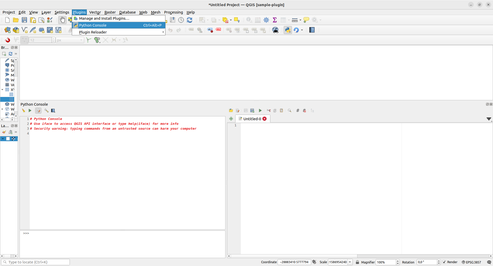

# 3. Pythonin perusteet

**Harjoituksen sisältö:** Python-ohjelmointikielen perusteiden läpikäynti.

**Harjoituksen tavoite:** Harjoituksen jälkeen opiskelija tuntee Pythonin perusteet.

Tämä harjoitus keskittyy PyQGIS-ohjelmoinnin sijasta Python-kielen perusteisiin.
Kurssin osallistujilta ei vaadita täydellistä ohjelmointitaitoa,
mutta jos ohjelmoinnin perusteet ovat hallussa, niin se auttaa jatkotehtävissä.

## Esivalmistelut

Yksinkertaisin tapa käyttää Python-rajapintaa QGISissä on Python-konsolin kautta.
Konsolin avulla voidaan syöttää ja ajaa yksittäisiä komentoja tai pidempiä skriptejä.
Windowsilla QGIS-asennukseen sisältyy erillinen Python-tulkki, jonka version voit tarkistaa valikosta **Ohje** -> **Tietoja QGISista**. Tämä on hyödyllinen tieto, kun haluat selvittää ongelmia koodissa.

QGISin asennukseen sisältyy joitain muita Python-paketteja standardikirjaston lisäksi. QGIS-kirjasto mahdollistaa esim. yhteydenoton QGIS-ohjelmistoon. Asennukseen kuuluu myös esim. gdal/ogr-kirjasto, joka mahdollistaa paikkatietojen manipulointia. Näiden lisäksi asennukseen kuuluu myös PyQt-kirjasto (eli Qt-käyttöliittymäkirjaston Python-sidonta (binding)),
joka mahdollistaa graafisen käyttöliittymän luomisen lisäosille.

::: hint-box
Python toimii käyttöjärjestelmien välillä hieman eri tavalla. Windows- ja
MacOS-käyttöjärjestelmissä QGIS-asennukseen kuuluu oma Python-tulkki, kun
taas Linux-pohjaisilla käyttöjärjestelmillä QGIS käyttää järjestelmän Python-tulkkia.
:::

Python-konsoliin pääsee usealla tavalla (kts. alla oleva kuva): 

- Sen voi avata QGISin ylävalikosta Lisäosat > Python-konsoli (Plugins > Python Console),
- Pikanäppäinyhdistelmällä **Ctrl** + **Alt** + **P**,
- Klikkaamalla työkalupalkista Python-logon kohdalta


Tarkastellaan konsoli-ikkunan eri osia: vihreästä kolmiosta klikkaamalla komennot
suoritetaan (enter-näppäin ajaa saman asian). Muista ikoneista:

- 
Avaa koodieditorin. Editori helpottaa pidempien skriptien tekoa ja ajamista

- 
Tyhjentää konsoli-ikkunan edellisistä komennoista

- 
Täältä löydät kätevästi linkit PyQGIs API -dokumentaatioon, PyQGIS Cookbookiin
sekä konsolin ohjeisiin.

Avaa konsolista koodieditori ja tutki samoin sen ominaisuuksia.


## Python-perusteita

Eri harjoitusosioissa on annettu esimerkkejä Python-koodista. Suosittelemme,
että esimerkkejä läpikäydessä kopioit esimerkin QGIS-konsolin koodieditorin
puolelle ja ajat koodin. Esimerkkien yhteydessä voi myös muokata koodia
kokeillakseen eri toimintoja ja lopputuloksia. Esimerkit on annettu
koodilaatikossa, josta sen sisällön voi kopioida viemällä hiiren osoittimen
laatikon päälle ja klikkaamalla laatikon oikeaan yläreunaan ilmestyvää
painiketta.


### Komennot

Kuten kaikki tietokoneohjelmat,
myös Python-ohjelmat koostuvat komennoista (command).
Alla esimerkkiohjelma, jossa `print`-komennolla tulostetaan konsoliin ensin `Hello`
ja sitten `QGIS!`. Kokeile syöttää ensimmäisen rivin Python-konsoliin (sieltä mistä löydät **>>>**) ja paina enteriä. Jos yrität syöttää molemmat rivit samaan aikaan niin konsoli antaa sinulle errorin. Kun haluat ajaa usemman rivin koodia niin käytä oikealla olevaa koodieditoria.

::: code-box
```python
print("Hello")
print("QGIS!")
```
:::

Ohjelma tulostaa:
```
Hello
QGIS!
```

### Kommentit

Python-kielessä rivit, joiden alussa on `#`-merkki,
eivät vaikuta ohjelman toimintaan.
Näitä kutsutaan kommenteiksi (comment),
ja niillä voi selittää ohjelman toimintaa itselleen tai muille.
Kommentti voi olla myös rivin lopussa.

Kommentoitu esimerkkiohjelma, jonka tuloste on sama kuin yllä:

::: code-box
```python
print("Hello")
# Tämä rivi ei tee mitään
print("QGIS!")  # Tulosta QGIS!
```
:::

### Luvuilla laskeminen

`print`-komennon sisälle voi laittaa myös laskutoimituksen,
jolloin tulostuu sen tulos.

::: code-box
```python
print(1 + 1)
print(5 / 2.5)
print(10 - 4 * 2)
```
:::

Tulostaa:
```
2
2.0
2
```

### Muuttujat

Ohjelman tarvitsemaa tietoa,
esimerkiksi lukuarvon,
voi tallentaa muuttujaan (variable).

Muuttujan luonti:

::: code-box
```python
muuttuja = <arvo>
```
:::

jossa `<arvo>` voi olla mitä vaan tietoa, joka tallentuu muuttujaan.

Alla esimerkki muuttujien käytöstä:

::: code-box
```python
number1 = 10
number2 = 5

summed = number1 + number2
multiplied = number1 * number2

print(summed)
print(multiplied)
```
:::

Tulostaa:
```
15
50
```

Muuttujan arvo voi muuttua:

::: code-box
```python
variable = 10
variable = "kymmenen"

print(variable)
```
:::

Tulostaa:
```
kymmenen
```

### Tyypit

Olemme käsitelleet jo kolmen eri tyypin (type) tietoa:
Lainausmerkeillä `""` merkittyjä merkkijonoja sekä kokonais- ja desimaalilukuja.

`type`-komennolla voi selvittää tyyppejä:

::: code-box
```python
print(type("merkkijono"))
print(type(1))
print(type(0.5))
```
:::

Tulostaa:
```
<class 'str'>
<class 'int'>
<class 'float'>
```

Tulosteesta selviää,
että Pythonissa `str` (string) tarkoittaa merkkijonoa,
`int` (integer) kokonaislukua
ja `float` (floating-point number) desimaalilukua.

Tyyppejä on monia, ja niitä voi myös luoda itse.
Tässä esimerkkinä vielä
totuusarvot `True` ja `False` (`bool`).

::: code-box
```python
print(type(True))
print(type(False))
```
:::

Tulostaa:
```
<class 'bool'>
<class 'bool'>
```

Eri tyypit omaavat erilaisia ominaisuuksia.
Esimerkiksi kokonais- ja desimaalilukuja voi käyttää
matemaattisten operaattoreiden kanssa laskemiseen,
kun taas muilla tyypeillä tämä ei välttämättä aina toimi.

Nämä lausekkeet esimerkiksi toimivat:

::: code-box
```python
print(1 + 1)
print("merkki" + "jono")
print(2 * "GIS")
```
:::

Tulostaa:
```
2
merkkijono
GISGIS
```

Seuraavista lausekkeista tulostuu virheviesti,
virheen syynä `TypeError`:

::: code-box
```python
print(1 + "1")
print("merkki" - "jono")
print("GIS" / 2)
```
:::

### Ehtolauseet ja vertailu

On tyypillistä,
että ohjelman suorituksen täytyy muuttua tiettyjen ehtojen mukaan.
Usein ehdot perustuvat arvojen vertailuun.
Alla Pythonin vertailuoperaattoorit:

| Operaattori | Selite |
|-|-|
| == | Yhtä suuri |
| != | Erisuuri |
| > | Suurempi |
| < | Pienempi |
| >= | Suurempi tai yhtä suuri |
| <= | Pienempi tai yhtä suuri |
<br>
Esimerkkinä ohjelma, joka vertaa muuttujan `a` arvoa erilaisiin merkkijonoihin.
Jos merkkijonot yhtenevät,
kyseisen ehdon sisennetty koodilohko suoritetaan.
Huomaa, että `elif`-avainsanan ehto tarkastetaan vain jos
edeltävän `if`-avainsanan ehto ei täyty.
Jos `if` tai `elif` ehdot eivät kumpikaan täyty,
suoritetaan `else`-avainsanan lohko.
Kaikissa tapauksissa suoritetaan viimeinen tulostuskomento.

::: code-box
```python
a = "GIS"

if a == "GIS":
    string_to_print = "Q" + a
elif a == "jono":
    string_to_print = "merkki" + a
else:
    string_to_print = a

print(string_to_print)
```
:::

Tulostaa:
```
QGIS
```

Ehtoja voi myös yhdistää loogisilla operaattoreilla `and` ja `or`:

::: code-box
```python
temperature = 15

if temperature < 25 and temperature > 10:
    print("sopiva")
elif temperature >= 25 or temperature <= 10:
    print("liian kylmä tai kuuma")
```
:::

### Funktiot

Funktio (function) on koodia, joka kutsuttaessa suorittaa jonkin toiminnon.
Funktio voi ottaa vastaan parametreja,
jotka vaikuttavat sen suoritukseen,
ja se voi myös palauttaa tietoa.

Esimerkiksi `print` on pythonin sisäänrakennettu funktio,
joka ottaa parametreinä tulostettavia arvoja,
tulostaa ne, mutta ei palauta mitään.
`type`-funktio sensijaan palauttaa parametrin tyypin.

Funktiokutsu on siis muotoa:

::: code-box
```python
funktio(parametri_1, parametri_2, ... parametri_n)
```
:::

Uusi funktio määritellään `def`-avainsanalla:

::: code-box
```python
# parametriton funktio, joka ei palauta mitään
def greet():
    print("Hello!")

greet()
```
:::

Tulostaa:
```
Hello!
```

Funktion parametrit määritellään suluissa `()`
ja palautusarvo `return`-avainsanalla.

Funktiota kutsuttaessa parametrit voi antaa joko
lyhyesti, eli kirjoittamatta erikseen parametrien nimiä,
tai kirjoittamalla sekä parametrin, että sille annettavan arvon:

::: code-box
```python
def multiply(a, b):
    return a * b

multiply(2, 3)
multiply(a=2, b=3)
```
:::

Alla vielä kommentoitu esimerkki funktion käytöstä:

::: code-box
```python
def make_greeting(name):  # yksi parametri: name
    greeting = f"Hello {name}!"
    return greeting  # palautetaan tervehdys

greeting = make_greeting("QGIS")  # palautusarvo muuttujaan greeting
print(greeting)
print(make_greeting(name="Me"))  # palautusarvon tulostus suoraan
```
:::

Tulostaa:
```
Hello QGIS!
Hello Me!
```

Huomaa ylläolevassa esimerkissä myös
pelkkien lainausmerkkien `""` sijaan `f""`-muotoa olevan merkkijono.
f-syntaksi mahdollistaa
merkkijonon täydentämisen aaltosulkuihin `{}` merkityllä sisällöllä.

Funktion sisällä voi olla mitä vaan koodia ja muita funktioita:

::: code-box
```python
def sum_two_positive_integers(a, b):
    if type(a) != int or type(b) != int:
        print("use integers only")
        # tyhjä return lopettaa funktion suorituksen palauttamatta mitään
        return
    if a < 0 or b < 0:
        print("integers must be positive")
        return
    return a + b  # palautetaan summa
```
:::

### Tietorakenteita

Yksittäisten arvojen lisäksi Pythonissa on myös tietorakenteita,
joihin voi tallettaa useita arvoja ja joista voi hakea tietoa eri tavoin.

#### Lista

Lista (list) on kokoelma tietoa. Se luodaan hakasulkeilla `[]`,
ja sen alkiot (item) erotetaan pilkulla `,`.

Alla lista, jossa alkioina luvut 1, 2 ja 3.

::: code-box
```python
my_list = [1, 2, 3]
```
:::

Listan alkioihin pääsee käsiksi niiden indeksillä.
Ensimmäisen alkion indeksi on 0, toisen 1, kolmannen 2 jne.
Miinusmerkkiset indeksit viittaavat listan loppupäähän,
eli listan viimeisen alkion indeksi on -1, toiseksi viimeinen -2 jne.

::: code-box
```python
items = ["first_item", "second_item", "third_item"]

print(items[0])
print(items[1])
print(items[2])

print(items[-1])
print(items[-2])
print(items[-3])
```
:::

Tulostaa:

```
first_item
second_item
third_item
third_item
second_item
first_item
```

Listassa voi olla mitä vain tietoa, esim:

::: code-box
```python
everything = [True, 3.14, "yes", [1, 2, 3]]
```
:::

Listan alkioita voi muuttaa ja poistaa, ja siihen voi lisätä alkioita.

::: code-box
```python
my_list = [1, 2, "some_item", "last_item"]

my_list[0] = "new_value"  # muuta arvo alkiolle 0 indeksissä
print(my_list)

my_list.pop(2)  # list.pop poistaa indeksin mukaan
print(my_list)

my_list.remove("last_item")  # list.remove poistaa alkion arvon mukaan
print(my_list)

my_list.append("my_new_last_item")  # list.append lisää listan loppuun
print(my_list)
```
:::

Tulostaa:
```
['new_value', 2, 'some_item', 'last_item']
['new_value', 2, 'last_item']
['new_value', 2]
['new_value', 2, 'my_new_last_item']
```

#### Sanakirja

Sanakirjassa (dictionary) alkiot ovat yksittäisten arvojen sijaan
avaimen (key) ja arvon (value) muodostamia pareja.
Tietoon pääsee käsiksi avaimen perusteella.

Sanakirja luodaa aaltosuluilla `{}`, avain ja arvo erotellaan kaksoispisteellä `:`
ja avain-arvo-parit erotellaan pilkulla `,`:

::: code-box
```python
my_dictionary = {"greeting": "Hello!", 10: 1000, "list": [1, 0]}

print(my_dictionary["greeting"])
print(my_dictionary[10])  # Huom! 10 on avain, vaikka onkin numero
print(my_dictionary["list"])
```
:::

Tulostaa:
```
Hello!
1000
[1, 0]
```

Sanakirjoja voi muokata lisäämällä uusia avain-arvo pareja.
Avaimet ovat uniikkeja, eli saman avaimen käyttö korvaa arvon.
Myös poistaminen onnistuu.

::: code-box
```python
my_dictionary = {"fruit": "apple"}

my_dictionary["fruit"] = "pear"
my_dictionary["number"] = 42
print(my_dictionary)

# poistot avaimen mukaan
my_dictionary.pop("fruit")
del my_dictionary["number"]
print(my_dictionary)
```
:::

Tulostaa:
```
{'fruit': 'pear', 'number': 42}
{}
```


#### Tuple

Tuple on käytännössä muuten samanlainen kuin lista,
mutta se luodaan kaarisuluilla `()` ja se on muuttumaton:
sen alkioita ei voi muuttaa eikä siihen voi lisätä tai poistaa alkioita.

::: code-box
```python
xyz = (3, 2, 1)
xyz[0] = 0  # ei mahdollista, TypeError
```
:::

#### Joukko

Joukko (set) on myös samantyylinen kuin lista,
mutta se luodaan aaltosuluilla `{}` ja jokainen sen alkio on uniikki.

::: code-box
```python
my_set = {1, 1, 2, 2, 3, 3}
print(my_set)
```
:::

Tulostaa:
```
{1, 2, 3}
```

Pythonin sisäänrakennetuilla `set`- ja `list`-funktiolla voi karsia esim. listan
vain sen uniikkeihin elementteihin.

::: code-box
```python
list_with_duplicates = [1, 1, 1, 0]
print(set(list_with_duplicates))
print(list(set(list_with_duplicates)))
```
:::

Tulostaa:
```
{0, 1}
[0, 1]
```

