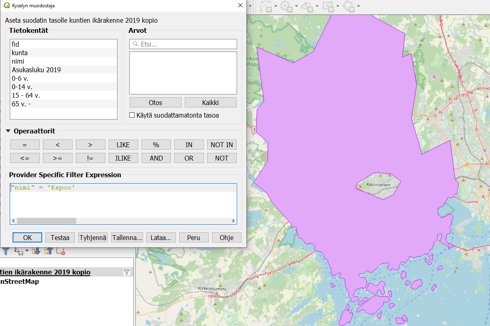
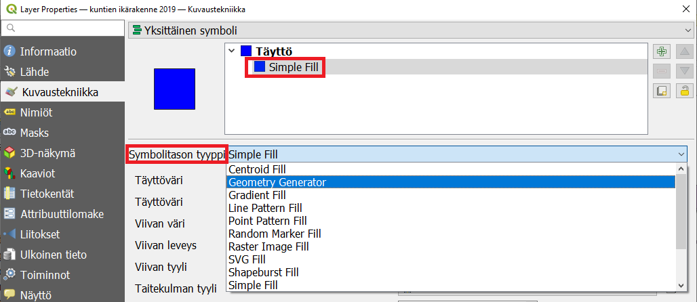

---
output:
  pdf_document: default
  html_document: default
---
# Harjoitus 1: Geometry generator, tyylitiedostot ja sääntöpohjainen visualisointi

**Harjoituksen sisältö**

Harjoituksessa tutustutaan Geometry generator -työkaluun, laaditaan vertaileva teemakartta sekä tallennetaan ja otetaan käyttöön tyylitiedosto.

**Harjoituksen tavoite**

Koulutettava oppii laatimaan teemakarttoja attribuuttitietoihin perustuen sekä ymmärretään tehtyjen visualisointivalintojen merkityksen valmiissa kartassa. Lisäksi koulutettava oppii hyödyntämään tyylitiedostoja ja johtamaan aineiston geometrioista uusia geometrioita.  

**Arvioitu kesto**

45 minuuttia.

## **Valmistautuminen**

Avaa uusi QGIS-projekti (**Projekti \> Uusi**) ja tallenna se nimellä "**QGIS-harjoitus 1**". Lisää projektiin seuraavat aineistot:

-   **..kurssihakemisto/kuntien ikärakenne 2019.gpkg (taso: "kuntien ikärakenne 2019")**

-   **OpenStreetMap (XYZ Tiles -valikosta) taustakartaksi**

## **Polygonin käyttö maskina**

Polygoneja voidaan käyttää tietyn alueen rajaavan maskin luomiseen. Suodata **kuntien ikärakenne 2019 -tasoa** siten että näkyviin jää vain kotikuntasi:

Muuta nyt polygonitason kuvaustekniikka **Inverted polygons -tyyliseksi** ja vaihda sen väri mustaksi ja peittävyys 50%:iin. Maskina toimiva taso häivyttää kaiken sen alle jäävän ja korostaa kotikuntaasi kirkkaampana. Huomaa, että jos alla olevissa tasoissa on käytössä nimiöitä, ne eivät jää maskitason alle vaan pomppaavat aina ylimmäiseksi! Maskitaso toimiikin parhaiten, kun sen avulla halutaan korostaa jotain rasteritason aluetta, kuten kaavan aluetta tai vaikkapa suojelualuetta.

Poista lopuksi tason suodatus ja vaihda kuvaustekniikka takaisin normaaliksi. Tai **monista kuntien ikärakenne 2019 -taso** ja työskentele jatkossa uudella kopiolla.

### **Geometry generator**

Tällä työkalulla voidaan muuntaa vektorimuotoisia aineistoja geometriatyypistä toiseen visualisointitarkoituksessa. Aineiston todellinen geometria ei siis muutu. Avaa **kuntien ikärakenne 2019 -tason** **Kuvaustekniikka** ja valitse **Symbolitason tyyppi** -pudotusvalikosta **Geometry Generator**.

Vaihda geometriatyypiksi **point/multipoint** ja anna lauseke, jonka perusteella pisteiden sijainnit muodostetaan. Yksinkertaisin lauseke etsii **kunta-polygonien** painopisteen:

::: code-box
centroid(\$geometry)
:::

Paina **Käytä**. Huomaa, että voit monistaa **Simple fill -tason** **-painikkeella** ja luoda keskipisteiden alle toisen tason, jossa näkyvät alkuperäiset polygonit.

Kuvassa näkyvän Hämeenlinnan painopiste on melkein sen ulkopuolella. Joskus onkin parempi käyttää esimerkiksi komentoa **pole of inaccessibility**, joka etsii reunaviivoista mahdollisimman kaukana olevan pisteen. Se tarvitsee lisäksi parametriksi toleranssin eli tarkkuuden jolla pisteen sijainti lasketaan:

::: code-box
pole_of_inaccessibility(\$geometry,100)
:::

Lisää hyödyllisiä geometrianmuodostuslausekkeita voit etsiä tuttuun tapaan **Lausekkeen muokkaus -ikkunassa** joka löytyy -painikkeen takaa:

## **Tyylin tallentaminen tiedostoon**

Alueiden keskipiste-visualisointia (pole of inaccessibility) voidaan hyödyntää muillekin aineistoille. Tallennetaan siis tämä geometry generatorilla luotu tyyli. Klikkaa kuvaustekniikka-ikkunan alalaidasta **Tyyli**-painiketta ja valitse **Tallenna tyyli\...**. Tallenna tyyli QML-muodossa, anna sille kuvaava nimi (vaikkapa "keskipisteet" ja valitse tiedostolle sijainti.

Tätä qml-tiedostoa voi nyt käyttää mille tahansa polygonimaiselle vektoriaineistolle, kun haluat esittää niiden keskipisteet sekä alkuperäiset alueet yhdessä. Huomaa, että qml-tiedosto toimii vain QGISissä.

Avaa jokin toinen polygoniaineisto ja käytä sille tallentamaasi tyyliä. Voit ottaa tyylin käyttöön samasta **Tyyli-painikkeesta** valitsemalla **Lataa tyyli**.

## **Sääntöpohjainen visualisointi**

Sääntöpohjaisella visualisoinnilla voidaan luoda useampaan attribuuttitietoon perustuvia, monimutkaisempia tyylejä. Tehdään sen avulla teemakartta, joka esittää kuntien huoltosuhteen eli työikäisen väestön suhteen lapsiin ja vanhuksiin.

Valitse kuntien ikärakenne 2019-tason kuvaustekniikaksi **Sääntöpohjainen** ja muodosta ensimmäisen säännön lauseke tulpaklikkaamalla säännön riviä. Anna säännölle nimi ja syötä lauseke -painikkeesta. Valitse sitten tyyli ja väri, jolla haluat nämä kunnat visualisoida.

Luo myös toinen sääntö -painikkeella ja anna sille suodatinlauseke, jossa työikäisiä on vähemmän kuin muita ikäryhmiä. Valitse sillekin kuvaava väri.

Entä jos jossain kunnassa huoltosuhde on täsmälleen 1:1? Silloin tuo kunta jää näillä sääntöasetuksilla näkymättömäksi. Sisällytä se siis jompaankumpaan sääntöön käyttämällä "pienempi tai yhtäsuuri kuin" -ehtoa.

Kun olet valmis, tallenna projektitiedosto kurssihakemistoon pikanäppäimellä **CTRL + T** tai päävalikosta **Projekti \> Tallenna**.

::: hint-box
**Psst! Koulutuksen jälkeen saat henkilökohtaista tukea Gispon tukipalvelusta. Lähetä kysymyksesi tai kommenttisi osoitteeseen [koulutustuki\@gispo.fi](mailto:koulutustuki@gispo.fi){.email}!**
:::
