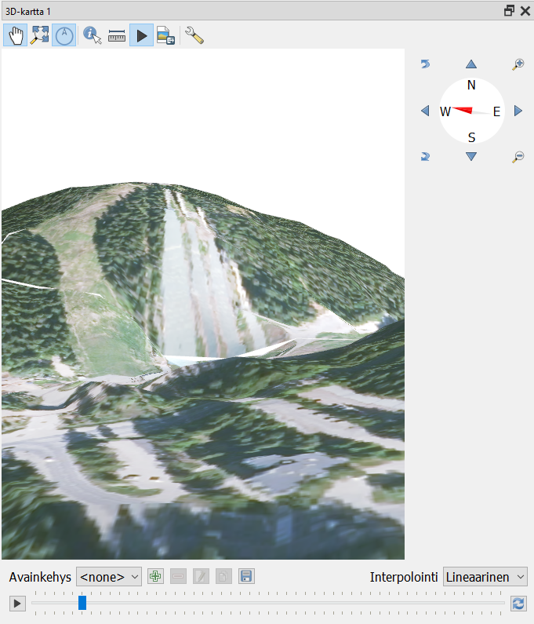
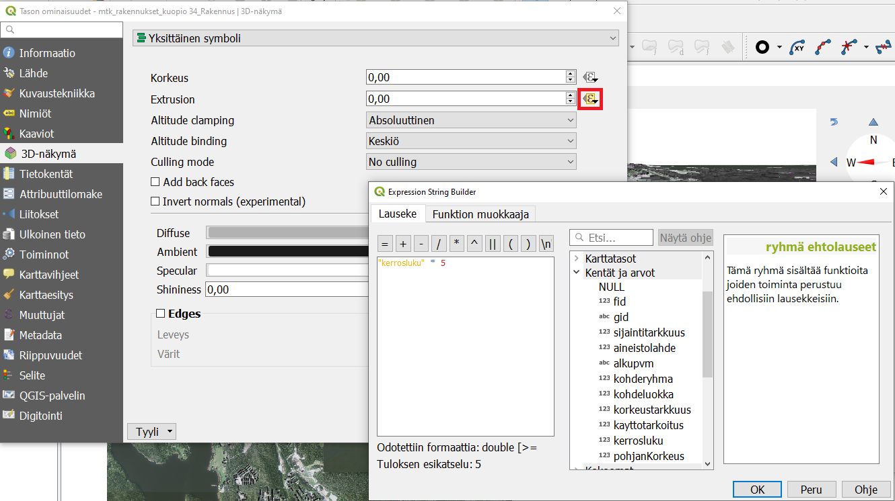

# Harjoitus 3: 3D-visualisointi

**Harjoituksen sisältö**

Harjoituksessa tutustutaan QGISin mahdollisuuksiin 3D-aineiston visualisoinnissa.

**Harjoituksen tavoite**

Koulutettava osaa hyödyntää kolmiulotteista aineistoa visualisoinnissa.

**Arvioitu kesto**

60 minuuttia.

## **Valmistautuminen**

Avaa uusi QGIS-projekti (**Projekti \> Uusi**) ja tallenna se nimellä **"QGIS-harjoitus 3"**. Lisää projektiin kurssihakemistostaseuraavat aineistot:

-   **..kurssihakemisto/HSY_vaestoruudukko_2019.gpkg**

-   **..kurssihakemisto/P5114D_kuopio_dem.tif**

-   **..kurssihakemisto/P5114D_kuopio.jp2**

-   **..kurssihakemisto/mtk_rakennukset_kuopio.gpkg (taso "34_Rakennus")**

-   **OpenStreetMap (XYZ Tiles -valikosta) taustakartaksi**

## **3D-pylväsdiagrammi tilastoaineistosta**

Aseta näkyväksi ainoastaan **HSY_vaestoruudukko_2019.gpkg**. Luokittele se **ASUKKAITA-kentän** perusteella haluamallasi tavalla.

Asenna lisäosa nimeltä **Qgis2threejs**. Avaa lisäosa yläpalkin **Verkko-valikosta**. Valitse vasemman reunan listasta DEM (flat plane) ja polygoniksi **vaestoruudukko_2019**. Tuplaklikkaa polygoniaineiston riviä, jotta pääset antamaan korkeusasetukset. Ota mallia kuvan asetuksista:

Näillä asetuksilla väestöruudut saavat saman värin kuin perinteisessä QGIS-näkymässäsi ja niiden korkeus määräytyy asukasmäärän mukaan. Voit pyöritellä ja zoomata pk-seudun väestömallia esikatselussa. **Scene-valikon** asetuksista voit tarvittaessa esim. lisätä korkeusarvoille jonkin kertoimen tai vaihtaa taustan väriä. **File-valikosta** voit tallentaa esikatsellun näkymäsi kuvana tai viedä sen html-sivuksi jossa mallin pyörittämisen ja zoomaamisen interaktio toimii. Muista rastittaa valinta **Enable the Viewer to Run Locally**,jotta voit katsella luomaasi html-sivua selaimessa.

## **Maastomalli korkeusaineistosta**

TIF-muotoinen aineisto sisältää Maanmittauslaitoksen **"Korkeusmalli 2 m"-aineistosta** korkeusmallin yhden karttalehden osalta (haettu 2020-02, lisenssi: CC BY 4.0. Koko aineisto on haettavissa ja tilattavissa osoitteesta: <https://tiedostopalvelu.maanmittauslaitos.fi/tp/kartta>). Kolmiulotteisen kartan luomiseen käytetään korkeusmalli-aineistoa (DEM = digital elevation model) sekä ilmakuva-aineistoa. QGIS tukee 3D-aineistojen tuontia suoraan 3.0-versiosta lähtien, aiemmin tähän on käytetty lisäosia, kuten Qgis2threejs-lisäosaa, jonka avulla tuloksia on voinut tarkastella web-selaimella.

JP2-muotoinen aineisto sisältää ortoilmakuvan, joka tarjoaa tekstuurin kolmiulotteiselle pinnalle. Tämän tason visualisointia ei tarvitse erikseen miettiä, sillä se toimii ainoastaan kolmiulotteisen visualisoinnin pohjana.

## **3D-karttanäkymä**

Kolmiulotteinen kartta saadaan luotua valitsemalla ylävalikosta kohdasta **Näytä \> Uusi 3D-karttanäkymä.** Aukeaa uusi ikkuna/paneeli, jossa on sama näkymä kuin karttaikkunassa, eli myös esimerkiksi kaikki samat tasot. Muokkaa ikkunan koko sopivaksi. Voit myös liikuttaa karttaa sopivaksi joko raahaamalla tai ikkunan reunassa olevalla **kompassi-työkalulla** (**Toggle On-Screen Navigation** -nappi pitää olla ikkunan yläreunasta aktivoituna). Kartan zoomaus onnistuu hiiren rullalla. Myös kartan orientaatiota ja katselukulmaa pystyy muuttamaan joko edellä mainitulla **kompassi-työkalulla** tai pitämällä Shift-näppäintä pohjassa ja hiiren avulla raahaamalla.

Karttanäkymän katselukulmaa muuttamalla huomataan, että näkymä on vielä normaali kaksiulotteinen kartta. Onkin vielä määritettävä miten ja minkä tason perusteella kolmiulotteinen näkymä muodostetaan. Tämä käy avaamalla **konfiguroi-painikkeesta**  3D-näkymän asetukset.

**Tyyppi**-alasvetovalikosta on kolme vaihtoehtoa korkeusmallille: DEM (Raster layer), Flat terrain (kaksiulotteinen näkymä) ja Online (korkeustiedot haetaan internetistä). Valitse siis tyypiksi DEM (Raster layer), jolloin seuraavalle riville ilmestyy Korkeus-alasvetovalikko, josta valitaan se rasteritaso, joka toimii korkeusmallina. Eli tässä tapauksessa valitaan **P5114D_kuopio_dem.tif**. Paina tämän jälkeen **OK** ja tarkastele 3D-näkymää eri suunnista ja korkeuksilta. Näkymässä liikutaan hiiren avulla:

-   Hiiren rulla zoomaa näkymää lähemmäs ja kauemmas

-   Liikuttamalla hiirtä Shift-näppäin pohjassa voit pyörittää mallia

-   Liikuttamalla hiirtä Ctrl-näppäin pohjassa voit siirtää mallia ("pan")

Myös muut olennaisimmat 3D-näkymän asetuksista löytyvät sen **Maasto-osiosta**. Avaa siis konfigurointiasetukset uudelleen. Maastonmuotojen ollessa loivia voi olla hyödyllistä hieman liioitella korkeuseroja pystymittakaavaa muuttamalla. Kokeile tätä eri asetuksilla, ja valitse sopiva (käyttötarkoituksesta riippuen n. 2,00 voi olla tässä hyvä). Tiilien resoluutiota **(Tile resolution**) voi myös tarvittaessa lisätä oletusarvosta (16 px).

**Skirt height** -asetus vaikuttaa karttatiilien paksuuteen, kuten voit huomata zoomaamalla ulos siten, että näet koko karttanäkymän ja katsomalla kartan reunaa (tarkastele karttaa melko sivusta ja läheltä). Tätä asetusta tarvitaan, sillä toisinaan 3D-näkymässä piirtyvien tiilien väliin jää valkoisia kaistaleita. Ilmiön saa tässä näkymään asettamalla Skirt height -arvon nollaksi sekä pienentämällä tiilien resoluutiota (esimerkiksi 8 px tai 4 px). Myös pystymittakaavaa liioittelemalla valkoiset kaistaleet tiilien saumakohdissa tulevat erityisen näkyviksi. Kokeile tätä.

Voit myös lisätä erilaisia efektejä elävöittämään 3D-näkymää. Klikkaamalla Terrain shading -asetukset päälle voit määrittää näkymän valaistuksen: yleisvalaistuksen väri (Ambient), heijastuneen valon värin (Specular), sekä "kiillon" (Shininess). Tätä seuraavasta Lights-osiosta voit lisäksi tarkastella maaston varjostumia ja mallintaa esimerkiksi tietystä suunnasta paistavaa aurinkoa. Valonlähteitä voi lisätä (vihreä plus-nappi) ja poistaa (pun. miinus): määritä valonlähteeen paikka (X, Y, Z), valon väri,  intensiteetti (Intensity) sekä intensiteetin vaimeneminen etäisyyden funktiona Attenuation-parametrien ( A0 , A1, A2) avulla. Kokeile näiden asetusten vaikutusta ja luo esimerkiksi näkymä auringon laskiessa.

## **Lisätehtävä**

Kokeile 3D-näkymän animaatio-toimintoa (ns. kamera-ajo). Aktivoi **Animations-nappi**  3D-ikkunan ylälaidassa. Tällöin näkymän alapuolelle aukeaa kamera-ajon asetukset sekä aikajana. Aseta haluamasi aloitusnäkymä ja valitse **Avainkehys "0 s"**. Tämän jälkeen kierrä ja zoomaa karttanäkymä minne haluat animaation siirtyvän seuraavaksi ja paina vihreää plus-nappia uuden avainkehyksen luomiseksi. Määritä tämän uuden kehyksen ajanhetki, jolloin uusi näkymä tallentuu tähän. Jatka samaan tapaan. Kehyksiä voi myös poistaa punaisesta miinus-nappulasta. Tämän jälkeen voit suorittaa animaation play-näppäimestä. Kamera-ajo interpoloi asetettujen ajanhetkien ja kehysten välillä. Tätäkin asetusta pystyy muuttamaan alasvetovalikosta oikealta. Lopuksi animaation voi tallentaa kuvasarjaksi **levyke-napista** (**Export Animation Frames**).

Joissakin tapauksissa 3D-ikkunan renderointi saattaa toimia väärin, ikkunaan piirtyy ylimääräistä ja animaatiossa voi esiintyä välkkymistä. Tämä ei kuitenkaan tallennu esimerkiksi tallennettuihin karttanäkymiin ja taittoihin, vaan näiden pitäisi piirtyä oikein.

::: hint-box
Huom! QGIS-projektin koordinaattijärjestelmän yksikön pitää olla metreinä tai jalkoina, jotta 3D-näkymä toimii.
:::

## **Rakennusten ja muiden objektien 3D-visualisointi**

Luodun kolmiulotteisen näkymän päälle voidaan tuoda ja luoda uusia tasoja, jotka asettuvat maaston mukaisesti 3D-pinnalle. Seuraavaksi luodaan  3D-visualisointi tasosta  **mtk_rakennukset_kuopio.gpkg**, joka sisältää maastotietokannasta haetut rakennukset Kuopion alueelta.

Nyt **Rakennukset-taso** sisältää polygonikohteita. Näistä voidaan luoda kolmiulotteisia seuraavasti: avaa tason ominaisuudet. Valitse 3D-näkymä aukeavasta ikkunasta ja sieltä **Yksittäinen symboli -asetukset**. Kohteiden korkeus määrittyy **Extrusion-asetuksen** perusteella. Asettamalla tähän arvolaatikkoon esimerkiksi 5,00 (metriä), jokainen rakennus saa tämän saman korkeuden. Jos taso sisältää tiedon korkeudesta, voidaan se määrittää klikkaamalla kuvaketta arvolaatikon oikealla puolella (Asetusten kumoaminen / Data defined override) ja lisäämällä lausekkeeseen (**Expression String Builder**, joka aukeaa kohdasta **Muokkaa...**) ja valitsemalla korkeustiedon kenttä. Tähän voidaan siis myös lisätä mikä tahansa lauseke, jonka perusteella kohteiden korkeus visualisoidaan.

Rakennukset-tasosta korkeustietoa ei saada suoraan, mutta sitä voidaan arvioida attribuuttikentän "kerrosluku" perusteella. Lausekkeeksi voidaan kirjoittaa esimerkiksi **"kerrosluku \* 5"**, jolloin jokaisen kerroksen korkeudeksi tulee 5 metriä. Valitaan nyt visualisoinnin kannalta **Altitude clamping \> Absoluuttinen** sekä **Altitude binding \> Keskiö**.

::: hint-box
Huom! Tämä menetelmä luo vain rakennuksen pohjan muotoisia, tasakorkuisia laatikoita. 3D-kaupunkimalleja ja rakennuksia voitaisiin käsitellä myös sille erityisesti luodussa CityGML-formaatissa. Näitä aineistoja on olemassa eri tarkkuustasoisina (LOD-tasot, LOD = level of detail). Suurempi tarkkuustaso sisältää esim. kattojen profiilit, parvekkeet ja muut ulokkeet.
:::

Valmis rakennusten 3D-malli. Huomaa, että ne rakennukset, joille ei ole tallennettu kerroslukutietoa, eivät saa mitään korkeutta. Ne näkyvät silti maanpinnan tasossa geopackage-tiedostoon tallennetun tyylin mukaisina.

## **Karttatuloste**

Tehdään nyt karttatuloste, joka sisältää sekä 2D-näkymän että 3D-näkymän. Tehdään siitä seuraavanlainen: tulosteen 2D-osa sisältää taustakartan ja 3D-osa 3D-maiseman vastaavasta alueesta. Edellä käytetyn **mtk_rakennukset_kuopio.gpkg-tason** voi siis nyt ruksata pois näkyvistä.

Tuloste tehdään periaatteessa samoin kuten normaalikin karttatuloste, eli luodaan uusi taitto (**Projekti \> Uusi taitto\...**), annetaan sille nimi **"kuopio_3d"**. 2D-kartta lisätään kuten aiemminkin vasemman reunan paneelista kohdasta Lisää uusi Kartta taittoon, ja määrittämällä sille sopiva laatikko sivulle valkoiselle pohjalle, jolloin karttaikkunan näkymä piirtyy laatikkoon. Määritä laatikon leveys vajaan puolen sivun levyiseksi, jotta saat lisättyä kolmiulotteisen karttanäkymän sen viereen. Lisää tarvittavat selitteet (kartan otsikko, mittakaava, pohjoisnuoli\...)

Tämä 3D-karttanäkymä saadaan lisättyä vastaavalla tavalla äskeisen napin alapuolelta, kohdasta Lisää uusi 3D kartta taittoon, ja määrittelemällä tälle oma laatikko edellisen laatikon viereen. Nyt 3D-näkymä ei piirry automaattisesti, vaan laatikossa lukee "Scene not set". Näkymä on konfiguroitava oikeanpuoleisesta paneelista (Elementit / Elementin ominaisuudet). Valitaan 3D-kartan ominaisuudet (3D-kartta 1) ja asetetaan ne suoraan kohdasta **Scene Settings** painamalla **Copy Settings from a 3D View...** ja valitaan **3D-kartta 1**. Nyt taittoon latautuu myös 3D-näkymä. Näkymän katselukulmaa, -etäisyyttä jne. pystyy tämän jälkeen muuttamaan Camera Pose -asetuksista (ja alla olevasta **Set from a 3D View... -painikkeesta** palauttamaan alkuarvot).

Alla olevan kaltainen karttatuloste saadaan seuraavalla tavalla:  lisää QGISin pääikkunassa päällimmäiseksi uusi taso joka sisältää taustakartan, vaikkapa Selain-paneelista löytyvän XYZ Tiles-valikon Open Street Map. Kun painat karttatulosteikkunassa päivityspainiketta **Update Map preview** , tulosteen 2D-osaan tulee näkyviin Open Street Map -taustakartta 3D-osan pysyessä ennallaan.

Kun olet valmis, tallenna projektitiedosto kurssihakemistoon pikanäppäimellä **CTRL + T** tai päävalikosta **Projekti \> Tallenna**.

::: hint-box
**Psst! Koulutuksen jälkeen saat henkilökohtaista tukea Gispon tukipalvelusta. Lähetä kysymyksesi tai kommenttisi osoitteeseen [koulutustuki\@gispo.fi](mailto:koulutustuki@gispo.fi){.email}!**
:::
