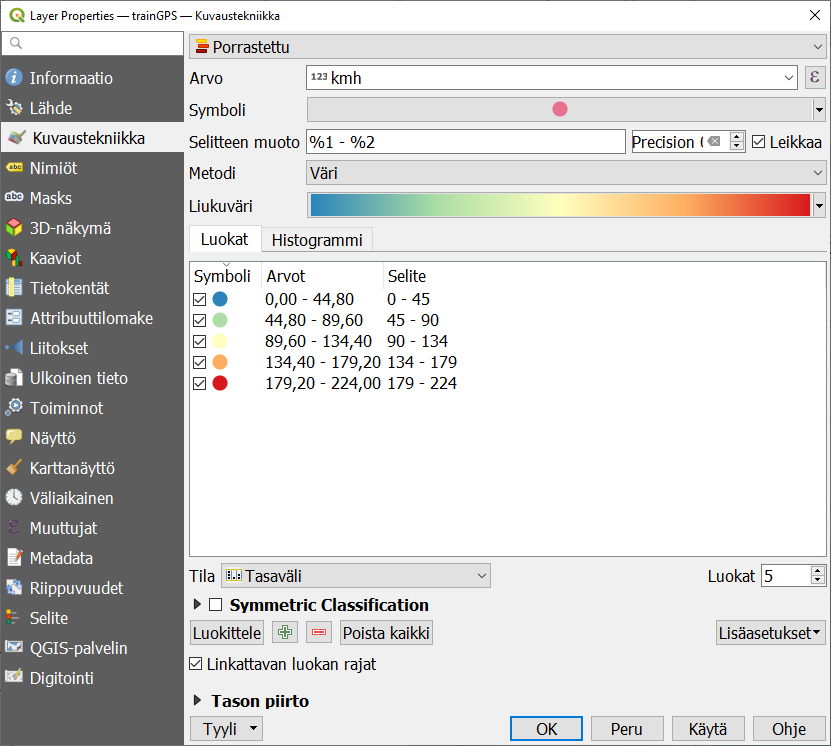

# Harjoitus 4: Animaatiot

**Harjoituksen sisältö**

Harjoituksessa tutustutaan QGISin Temporal controller -työkaluun ja temporaaliseen dataan.

**Harjoituksen tavoite**

Koulutettava ymmärtää, millaisesta datasta voi laatia animaatioita, ja hallitsee Temporal controllerin perustoiminnallisuudet.

**Arvioitu kesto**

60 minuuttia.

## **Valmistautuminen**

Avaa uusi QGIS-projekti (**Projekti → Uusi**) ja tallenna se nimellä **\"QGIS-harjoitus 4\"**. Avaa tausta-aineistoksi jokin taustakartta Suomesta tai lisää esimerkiksi seuraavat tasot QGIS-projektiin:

-   **..kurssihakemisto/kunta1000k_2017.gpkg**

-   **..kurssihakemisto/MML_YK1M/RautatieViiva.shp**

## **Temporal controller**

**Temporal controller -työkalulla** voidaan luoda animaatioita mistä tahansa datasta, jossa on aikaleima. Liikkuvat kohteet tallennetaan useimmiten sijaintina tiettynä ajanhetkenä, ja Temporal controller sopiikin parhaiten datalle joka on spatiaalisesti pistemäistä ja temporaalisesti hetkellistä, eli sillä ei ole kestoa.

Aikaleimakentän on oltava tallennettu sellaisessa muodossa, että QGIS osaa lukea sitä. Hyväksytyt aikaleiman muodot ovat:

::: file-content-box
YYYY-MM-DD HH:MM:SS.ssssss\
YYYY-MM-DD HH:MM:SS\
YYYY-MM-DD HH:MM\
YYYY-MM-DD\
YYYY/MM/DD HH:MM:SS.ssssss\
YYYY/MM/DD HH:MM:SS\
YYYY/MM/DD HH:MM\
YYYY/MM/DD\
DD.MM.YYYY HH:MM:SS.ssssss\
DD.MM.YYYY HH:MM:SS\
DD.MM.YYYY HH:MM\
DD.MM.YYYY\
DD-MM-YYYY HH:MM:SS.ssssss\
DD-MM-YYYY HH:MM:SS\
DD-MM-YYYY HH:MM\
DD-MM-YYYY\
DD/MM/YYYY HH:MM:SS.ssssss\
DD/MM/YYYY HH:MM:SS\
DD/MM/YYYY HH:MM\
DD/MM/YYYY\
:::

Mikäli aineistosi aikaleima ei ole missään näistä muodoista, voit muokata sitä esim. Excelillä tai muulla taulukko-ohjelmalla. Huomaa, että koko aikaleiman on oltava samassa kentässä! Jos siis aineistosi sisältää sekä päivämäärän että kellonajan, ne täytyy ilmoittaa yhdessä ja samassa kentässä.

## **Datan esikäsittely**

Animaation lähtötiedoksi sopii mikä tahansa vektoriaineisto, jolla on aikaleima. Tässä harjoituksessa käytetään csv-muotoista datasettiä junien liikkeistä Suomessa muutaman tunnin ajanjaksolla. Attribuuttitietona on junan numero sekä sen nopeus kullakin ajanhetkellä. Tuo aineisto (**trainGPS.csv**) QGISiin käyttäen **Merkein eroteltu tekstitiedosto -työkalua**. Valitse **räätälöidyksi erotinmerkiksi** pilkku, anna X- ja Y-koordinaattikentät sekä oikea koordinaattijärjestelmä. Varmista alareunan esikatselusta että data jakaantuu oikein sarakkeisiin.

Aineisto on varsin suuri, yli 119.000 riviä. Pienennä aineistoa valitsemalla attribuuttien perusteella mukaan vain ne junat, joiden numero (**trainNo**) on **pienempi kuin 100**.

Vie valittu aineisto uudeksi tiedostoksi GeoPackage-formaatissa. Näin animaatio pyörii sujuvammin kuin suoraan csv.stä käsin. Samalla voit muuntaa aineiston koordinaattijärjestelmän Suomen metriseen tasokoordinaattijärjestelmään ETRS89/TM35FIN (EPSG-koodi: 3067).

Aseta aineiston kuvaustekniikka mieleiseksesi. Kokeile vaikka aineiston luokittelua eri väreihin junan nopeuden mukaan. Halutessasi voit askarrella myös junien numerot näkyviin **Nimiöt-välilehdeltä**.

Siirry sitten saman **Layer Properties -ikkunan Temporaalinen -välilehdelle**. Aktivoi toiminto ruksista ja valitse pudotusvalikosta **Single field with Date/Time**. Valitse  aikaleiman sisältävä kenttä. Aineistossa on aikaleimoja sekunnin tarkkuudella, mutta aseta nyt **Event Duration** yhteen **minuuttiin**. Näin kaikki minuutin sisällä tapahtuneet \"havainnot\" esitetään kartalla samanaikaisesti. Koska haluamme että junat näyttävät liikkuvan kartalla eikä jokainen havaintopiste jää näkyviin, älä ruksi **Accumulate features over time -vaihtoehtoa**. Paina lopuksi **OK**.  

Avaa näkyviin **Temporaalinen säädin -paneeli** joko klikkaamalla ylävalikosta **Näytä \> Paneelit** tai klikkaamalla työkalupaneelien päällä hiiren oikealla napilla. Tämä työkalu toimii samalla animaation etenemistä näyttävänä legendana.

Aktivoi animaatio-ominaisuus klikkaamalla . Päivitä animaation aikarajat klikkaamalla  ja aseta **Askel** samaan yhteen minuuttiin kuin aineiston **event duration** on. Oikeaan yläkulmaan piilotetulla pienellä  **-asetuspainikkeella** voi säätää, kuinka pitkään yksi **frame** eli näkymä on näkyvissä. Tämä vaikuttaa siis animaation nopeuteen ja kokonaiskestoon. Aseta se aluksi  yhteen sekuntiin.

Nyt voit klikata **Play-nappia** ja katsella liikkuvaa animaatiota kartalla. Huomaa, että yhdenkin minuutin event duration aiheuttaa symboleille pientä venymistä: jos junalle on tallennettu useita sijainteja minuutin aikana, ne kaikki ovat näkyvissä yhtä aikaa ja liikkuvan junan perään jää \"häntä\". **Event durationia** lyhentämällä ilmiön saa poistettua, mutta animaatio saattaa käydä liian raskaaksi tietokoneen prosessorille.

Valmiin animaation voit tallentaa **Export animation -painikkeesta**  sarjaksi kuvatiedostoja, joista voit muodostaa vaikka GIF-animaation. Linux- ja Mac-käyttöjärjestelmissä GIFin luominen on mahdollista suoraan QGISissä.

Kun olet valmis, tallenna projektitiedosto kurssihakemistoon pikanäppäimellä **CTRL + T** tai päävalikosta **Projekti \> Tallenna**.

::: hint-box
Psst! Koulutuksen jälkeen saat henkilökohtaista tukea Gispon tukipalvelusta. Lähetä kysymyksesi tai kommenttisi osoitteeseen tuki\@gispo.fi!
:::
