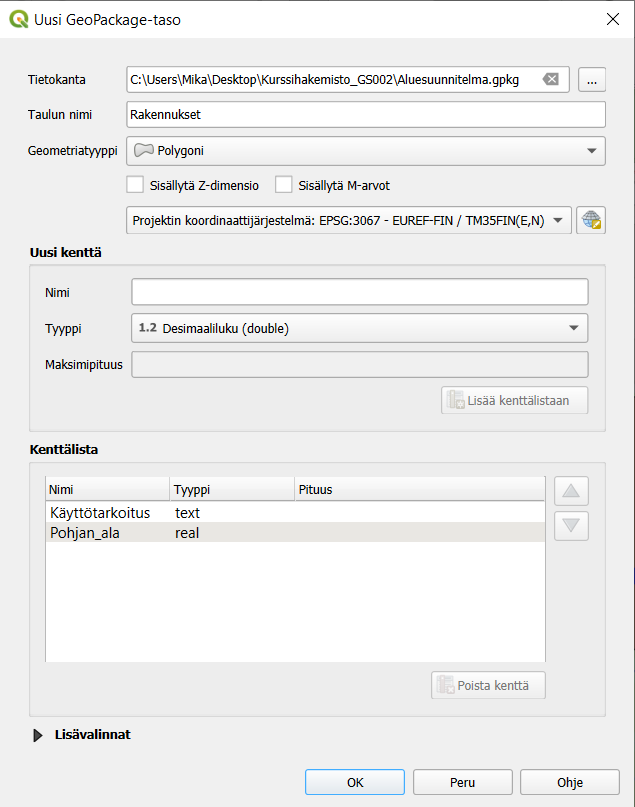
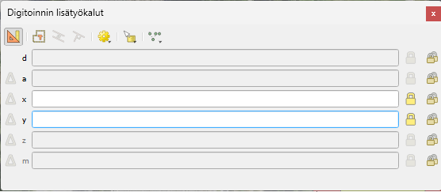
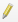
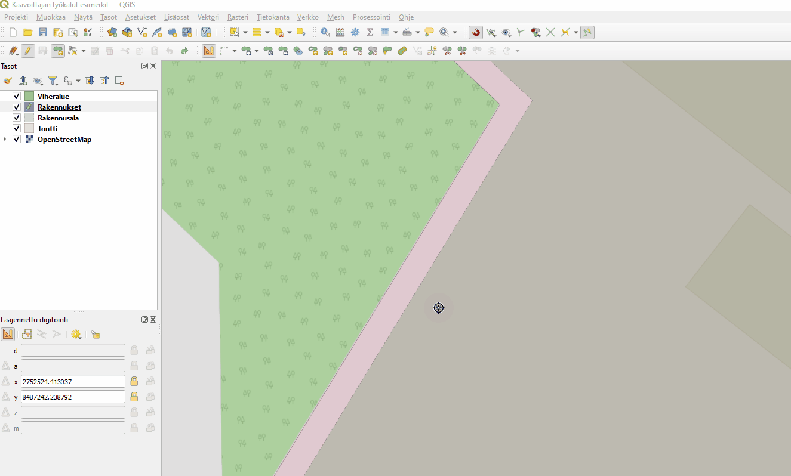
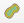
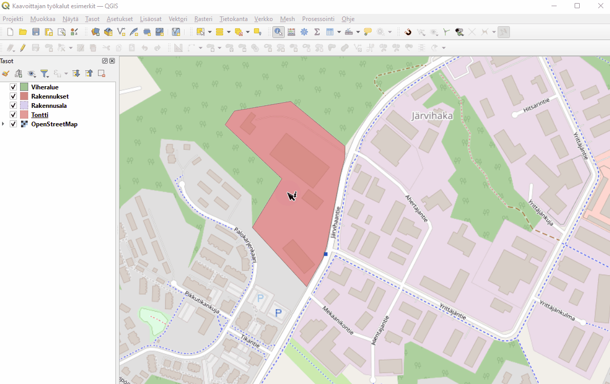
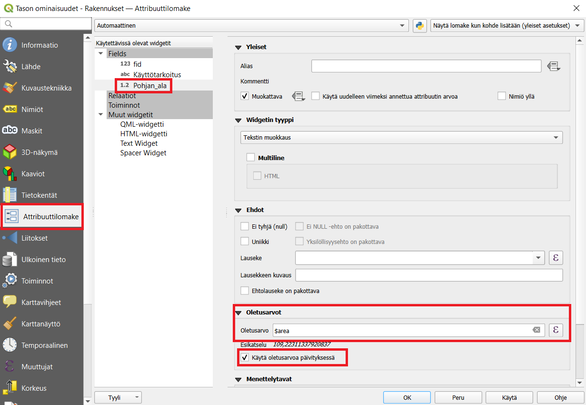
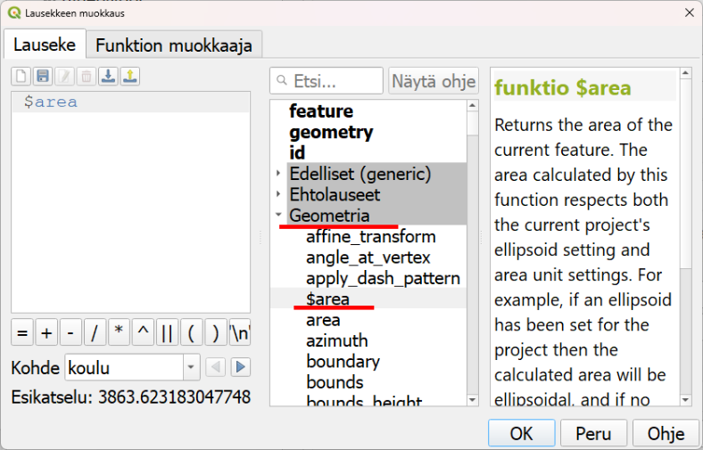

# Harjoitus 2: Edistyneet digitointiominaisuudet

**Harjoituksen sisältö**

Harjoituksessa tehdään edistyneitä digitoinnin operaatioita QGISillä.

**Harjoituksen tavoite**

Harjoituksen jälkeen opiskelija osaa hyödyntää monipuolisemmin editoinnin ominaisuuksia.

**Arvioitu kesto**

45 minuuttia.

## Valmistautuminen

Avaa uusi QGIS-projekti (**Projekti \> Uusi**) ja tallenna se nimellä "**QGIS-harjoitus 2**". Lisää projektiin seuraavat aineistot:

-   **Aluesuunnitelma.gpkg (Alueet- ja Kulkureitit-tasot)**

-   **OpenStreetMap**

## Kohteisiin tarttuminen (snapping) ja rakennustila (construction mode)

Tässä harjoitukksessa teemme rakennuksia rakennuspaikoille. Luo **Aluesuunnitelma-GeoPackageen** uusi taso rakennuksia varten seuraavasti:

Aloita valitsemalla työkalupalkista jälleen **Uusi GeoPackage-taso**. Tällä kertaa kuitenkin valitsemme **Tietokanta**-kenttään kohteeksi aiemmin luodun Aluesuunnitelma-Geopackagen, jolloin uusi taso tuleelisätyiksi siihen. Kun olet valinnut Aluesuunnitelma.gpkg:n tietokannaksi, anna tason nimeksi "Rakennukset" ja täytä tason tiedot kuten alla olevassa kuvassa:

Tallennettaessa QGIS kysyy, korvataanko aiemmin luotu GeoPackage vai lisätäänkö uusi taso siihen. Valitse Lisää uusi taso.

Seuraavaksi laita **Tarttuminen** , **Seuraaminen**  **ja Self-snapping **päälle **Tarttumisen työkalut -paneelista**. Aseta muut tarttumisasetukset seuraavan kuvan mukaisiksi:

Valinnat järjestyksessä vasemmalta oikealle:

-   Tarttuminen

-   Kaikki tasot (klikkaa kuvaketta ja voit valita asetuksen pudotusvalikosta)

-   Taitepiste (klikkaa kuvaketta ja voit valita asetuksen pudotusvalikosta)

-   10

-   px (pikseliä)

-   Ei käytössä

-   Ei käytössä

-   Ei käytössä

-   Ota seuraaminen käyttöön

-   Self snapping (tarttuminen työn alla olevaan digitoitavaan kohteeseen)

## Rakentamistila

Jos piirtämisen apuna tarvitaan etäisyyttä tietystä pisteestä tai tiettyä kulmaa johonkin olemassa olevaan linjaan, rakentamistilan avulla saa näkyville apuviivoja piirtämisen tueksi. Rakentamistilan ollessa aktiivisena ei voi piirtää, mutta sen avulla voidaan hakea näkyviin tarvittavia apuviivoja esim. etäisyyden tai kulman suhteen. Rakentamistilaa voi käyttää ennen tai kesken piirtämisen.

Rakentamistila aktivoidaan laajennetun digitoinnin paneelista löytyvästä -nappulasta. Sen saa päälle/pois päältä myös pikakomennolla **C**.

Huom! Rakentamistilassa ollessa ei piirretä mitään. Kun olet saanut rakentamistilassa toivotut apuviivat näkyville ja haluat aloittaa varsinaisen piirtämisen, rakentamistila tulee sulkea joko painamalla hiirellä  tai **C**-näppäimellä. Apuviivat jäävät näkyviin ja voit piirtää niiden avulla pisteen haluamaasi paikkaan.

## Rakennuksen piirto apuviivojen avulla

Lisätyökalujen avulla voi saada näkyville apuviivat ja tarttumisasetukset tiettyihin kulmiin, esimerkiksi 45 tai 90 asteen välein. Toiminnon saa päälle laajennetun digitoinnin paneelista (ikkunan vasemmassa laidassa) -nappulasta. Oletuksena nollakulma on vaakatasossa piirtoalueen suhteen, mutta piirtämisen alettua kulma lasketaan viimeisen piirretyn viivan mukaan ja näkyviin tulee tukiviivoja haluttujen kulmien kohdalle.

### Sitten vain harjoittelemaan....

Aseta **Rakennukset-tason** editointi päälle kynäkuvakkeesta. Kun valitset **Lisää polygonikohde -työkalun**, **Laajennettu digitointi -kuvake** aktivoituu . Klikkaa kuvaketta niin saat **Laajennettu digitointi -hallintapaneeliin** QGISiin.

Laita vielä **Snap to common angles/tartu yleismpiin kulmiin --\> 90.0, 180.0, 270.0, 360.0** päälle

Aloita nyt **Rakennukset-tason** editointi.

1.  Harjoittele ensin rakennuksien piirtämistä apuviivojen avulla alla olevan kuvan mukaisesti

    

2.  Seuraavaksi harjoitellaan alueen reunaviivan suuntaisesti rakennuksen piirtämistä. Toimi seuraavasti:

-   Varmista, että laajennettu digitointi {width="26" height="25"} on päällä.

-   Piirrä piste kartalle haluamaasi kohtaan. Laajennetun digitoinnin valikossa aktivoituvat kohtisuoruustyökalu  ja rinnakkainentyökalu .

-   Valitse haluamasi työkalu (kohtisuoruus tai rinnakkainen):

    -   

        a)  painamalla sen nappia hiirellä, tai

    -   

        b)  paina **P** yhdestä kolmeen kertaa aktivoidaksesi työkaluja järjestyksessä: kohtisuoruus -\> yhdensuuntaisuus -\> vapaapiirto.

-   Kun jompi kumpi työkalu on valittuna, klikkaa viivaa, jonka suhteen haluat yhdensuuntaisuutta tai kohtisuoruutta. Huom! tämä klikkaus ei piirrä pistettä, vaan valitsee työkalulle peilauskohteen. Näkyviin tulee valitusta työkalusta riippuen joko yhdensuuntainen tai kohtisuora apuviiva.

-   Klikkaa toinen piste kartalle apuviivan avulla haluamaasi kohtaan. Jos haluat, voit määrittää etäisyyden painamalla **D** (fokus etäisyyden syöttökenttään), syöttämällä etäisyyden metreinä ja painamalla **enter**.

-   Jatka piirtämistä haluamallasi tavalla. Kohtisuoruutta ja yhdensuuntaisuutta voi käyttää piirtämisen aikana toistamalla askelia

## Suorakulmaisen polygonin piirtäminen

1.  Laita tarttumisen työkalu (työtilan yläosassa) päälle **self-snapping** .

2.  Laita asteen mukaiset tukiviivat ja tarttuminen päälle laajennetun digitoinnin paneelista . Riittävä tarkkuus on tässä *"90, 180, 270, 360 astetta"*.

3.  Aloita piirtäminen piirtämällä ensimmäiset kaksi pistettä haluttuihin kohtiin.

4.  Kolmannen pisteen piirtämistä helpottamaan näkyville tulee apuviiva kohtisuoraan jo piirrettyyn viivaan. Piirrä tämän avulla kolmas piste haluttuun kohtaan.

5.  Hae seuraava kohtisuora apuviiva näkyviin liikuttamalla hiirtä kohti neljättä pistettä, mutta ÄLÄ paina hiiren nappulaa. Kun apuviiva on näkyvissä ja laajennetun digitoinnin paneelissa näkyy kulman arvona 90 astetta paina **CTRL+ A** lukitaksesi kulman arvo. ÄLÄ klikkaa neljättä pistettä kartalle.

6.  Vie hiiri suorakulmion aloituspisteeseen ja kun osoitin tarttuu pisteeseen, **klikkaa sitä hiirellä**. 

7.  Saadaksesi piirtämisen päätökseen, **klikkaa vielä hiiren oikealla** **näppäimellä.** Suorakulmio on valmis.

## Tehtävä: "Rakennus 35×40 m tontin rajan suuntaisesti, etäisyys rajaan 15 m"

Piirretään uusi kohde tietylle etäisyydelle ja tietyssä kulmassa halutusta pisteestä tai linjasta. Esimerkiksi jos halutaan piirtää 15 metrin etäisyydelle tontin reunasta suorakulmainen rakennus, jonka kukin sivu on 30 metriä, sen voi tehdä laajennetun digitoinnin työkaluja hyödyntäen mm. seuraavasti:

1.  Lisää kurssihakemistostasi kiinteistörajat sisältävä vektoritaso **MML_kiinteistorekisterikartta_05-2023.gpkg**

2.  Valitse **Rakennukset** taso aktiiviseksi.

3.  Laita **editointi** päälle {width="26" height="24"} **Rakennukset**- tasolle,  **monikulmiokohteen piirtäminen päälle**  sekä l**aajennetun digitoinnin työkalut** aktiivisiksi {width="26" height="24"}.

4.  **Laita laajennetun digitoinnin** paneelista (vasen reuna) **rakentamistila** päälle  (tai painamalla **C**).

5.  Aseta halutun kiinteistönraja nollakulmaksi valitsemalla rajalta kaksi pistettä.

6.  Valitse haluttu tukikulma 90 astetta painamalla **A** (kerran tai kahdesti, niin että fokus siirtyy laajennetun digitointipaneelin kohtaan a(ngle)) ja syötetään luku 90. Painetaan **enter**. Käyttöön tulee apuviiva kohtisuorasti kiinteistönrajaan. Huom! Jos kulma-asteiden apuviivat ovat käytössä (-valikosta), saat automaattisesti apuviivoja piirtämisen avuksi eikä kulman arvoa tarvitse syöttää erikseen.

7.  Valitse haluttu etäisyys 15 metriä painamalla **D** (fokus siirtyy kohtaan d(istance)). Syötetään **luku 15**. Painetaan **enter**. Käyttöön tulee säde 15 m etäisyydelle kiinteistönrajaan piirretyn jälkimmäisen apupisteen mukaan. HUOM! Mitään ei ole vielä piirretty.

8.  Aloita piirtäminen poistamalla **rakentamistila** käytöstä  (tai painamalla **C**).

9.  **Piirrä** ensimmäinen piste kohtisuoraa apuviivaa ja -sädettä hyödyntäen.

10. Suora kulma pysyy valittuna, mutta etäisyys halutaan muuttaa 35 metriin (rakennuksen 1. seinän mitta). Paina **D**, syötä arvoksi 35 ja paina **enter**. Apusäde muuttuu 35 metriin. Piirrä rakennuksen seuraava nurkka.

11. Vaihda etäisyydeksi 45 painamalla jälleen, syöttämällä arvo ja painamalla **enter**. Ympyrä kasvaa ja piirtäminen voidaan tehdä sen ja kohtisuoran apuviivan avulla. Etäisyys ja kulma pysyvät samana: piirrä kolmas nurkkapiste.

12. Toista kohta 9.

13. Paina lopuksi hiiren oikeaa näppäintä, jolloin alue sulkeutuu. Näin rakennus on valmis.

Tämän jälkeen digitoi aineistoon rakennuksia vähintään kolme kappaletta hyödyntäen laajennetun digitoinnin ominaisuuksia. Koita myös kääntää rakennuksia 45 astetta hyödyntäen **Kierrä kohteita -työkalua** . **CTRL+hiiren klikkaus** asettaa käännökselle kulmapisteen, jonka mukaan kääntö suoritetaan.

Ota lopuksi tason editointi pois päältä ja tallenna tasoon tehdyt muutokset.

## Case rakennusala tontille: polygonin kopiointi toiseksi itseään pienemmäksi

1.  Lisää **MML_kiinteistorekisterikartta_05-2023.gpkg** taso (jatkossa "lähtötaso").

2.  Valitse polygoni/palsta, jonka haluat kopioida **valintatyökalulla** .

3.  Kopioi polygoni leikepöydälle näppäinkomennolla **CTRL+C** tai (tai painamalla hiirellä valikosta **Kopioi kohteet** ).

4.  Jos haluat luoda kopion eri tasolle kuin millä alkuperäinen polygoni on, valitse kohdetaso tasopaneelista ja laita se **editointitilaan** .

5.  Liitä kopio tasolle painamalla **CTRL+V** tai valikosta **Liitä kohteet** .

6.  Huomaa, että jos kohdetaso sijaitsee lähdetason alapuolella, liitetty polygoni jää alkuperäisen polygonin alle. Saat sen näkyviin joko vaihtamalla tasojen järjestystä (raahaamalla niitä tasot-paneelissa hiiren avulla) tai ottamalla päällä olevan tason pois näkyvistä tasopaneelissa.

7.  Jos uutta polygonia tarvitsee muokata (esim. pienentää), palaa kohdetasolle ja valitse polygoni.

8.  Valitse Advanced Digitizing -valikosta **"Tee yhdensuuntaissiirtymä"** -työkalu (Offset curve) .

9.  Klikkaa kerran johonkin polygonin pisteeseen. Ruudun oikeaan yläkulmaan ilmestyy **Siirtymä**-asetusvalikko (Offset), johon voi syöttää halutun etäisyyden alkuperäisen polygonin viivasta (esim. -5 tekee tuo polygonin reunoja 5 metriä sisäänpäin aluperäisestä). Valikossa voi valita myös kulmien muodot -nappia painamalla.

Ja sitten ei kun harjoittelemaan käyttöä! Esitellyt työkalut voivat tuntua hankalilta ensialkuun, mutta jo pienelläkin harjoituksella ja toistoilla käytännöt tulevat tutuksi ja työskentely jouhevoituu.

Olemme julkaisseet blogin myös liittyen [CAD-aineistojen käsittelyyn QGISissä](https://gispo.fi/blogi/cad-aineistot-ja-qgis/).

## Lisätehtävä: Lisää Rakennukset tasolle funktio, jolla pinta-ala tieto päivittyy automaattisesti

1.  Avaa Rakennukset-tason ominaisuudet. Mene kohtaan Attribuuttilomake

2.  Valitse kentistä Pinta-ala ja selaa kohtaan Oletusarvot.

3.  Avaa oikean reunan funktio-painikkeesta auki lausekkeen muokkaus -ikkuna.

4.  Valitse Geometrian alta `$area`. Funktion voi myös itse kirjoittaa suoraan oletusarvot -kenttään.

5.  Jos haluat vielä pyöristää arvoa niin, ettei kaikki desimaalit näy niin käytä round-funktiota. Jos esimerkiksi haluat pyöristää pinta-alan kahden desimaalin tarkkuudella lauseke on `round($area,2)`

6.  **Lopuksi muista laittaa täppä tuohon "Käytä oletusarvoa päivityksessä" kohtaan**, niin QGIS laskee uudelle polygonille automaattisesti pinta-alan! 🎉

    {width="519"}

## Lopuksi

Avaa **Kuvaustekniikka-paneeli** tai mene tason ominaisuuksien kautta **Kuvaustekniikka-välilehdelle** ja muokkaa editoitujen kohteiden värit vastaamaan taustakartan värejä **Värin valitsin -työkalua** hyödyntäen.

Voit vielä hyödyntää alueen reunaa käyttäen **Seuraaminen-ominaisuutta**:

 <https://docs.qgis.org/3.22/en/docs/user_manual/working_with_vector/editing_geometry_attributes.html#automatic-tracing>

Kun olet valmis, tallenna projektitiedosto kurssihakemistoon pikanäppäimellä **CTRL + T** (englanninkielisessä QGISissä **CTRL + S**) tai päävalikosta **Projekti \> Tallenna**.

::: hint-box
Psst! Muista tukipalvelu! Koulutuksen jälkeen saat henkilökohtaista tukea Gispon tukipalvelun kautta lähettämällä yksinkertaisesti tuki\@gispo.fi -sähköpostiosoitteeseen kysymyksen tai kommentin jostakin sinua mietityttävästä asiasta. Gispon tiimi auttaa sinua toimiesi äärellä. Kysymykset käsitellään henkilökohtaisesti.
:::
