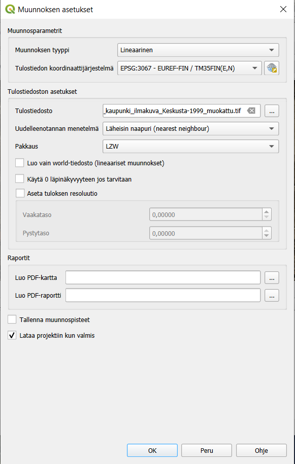

# Harjoitus 3: Georeferointi

**Harjoituksen sisältö**

Harjoituksessa aktivoidaan Georefereroija-lisäosa ja harjoitellaan georeferointia vastinpisteiden avulla.

**Harjoituksen tavoite**

Koulutettava oppii tuomaan kuvatiedoston QGIS-ohjelmaan ja georeferoimaan sen koordinaatistoon

**Arvioitu kesto**

45 minuuttia.

## Valmistautuminen

Avaa uusi QGIS-projekti (**Projekti \> Uusi**) ja tallenna se nimellä "**QGIS-harjoitus 3**".

QGISin lisäosat tarjoavat käyttöösi suuren valikoiman erilaisia taustakarttoja. Eri rajapinnoista saatavat taustakartat toimivat samaan tapaan kuin projektiin avatut rasteritasot: niiden läpinäkyvyyttä voi säätää, mutta ne eivät sisällä ominaisuustietoja.

Helpoin tapa lisätä OpenStreetMap-kartta on etsiä se Selain-paneelista **XYZ Tiles** -rivin alta ja tuplaklikata sitä:

Lisää taustakarttoja saat lataamalla Python-skriptin osoitteesta: <https://raw.githubusercontent.com/klakar/QGIS_resources/master/collections/Geosupportsystem/python/qgis_basemaps.py>

Toimi siis seuraavasti:

1\. Kopioi ylläolevan osoitteen koko sisältö

2.  Avaa QGISin Python-konsoli (Lisäosat → Python-konsoli)

3\. Liitä kopiomasi sisältö avautuneeseen Python-konsoliin \>\>\>-merkkien jälkeiseen laatikkoon

4\. Paina Enter tai klikkaa \"Suorita komento\" -nappulaa {width="35" height="31"}

Nyt käytössäsi pitäisi olla lisää taustakarttoja selainikkunan XYZ Tiles -kohdassa.

### 
Lisää taustakarttoja - QuickMapServices -lisäosa

Laajemman valikoiman erilaisia taustakarttoja saat käyttöösi lisäosalla nimeltä **QuickMapServices**. Asenna se yläpalkin Lisäosat-valikosta ja avaa sen jälkeen Verkko-valikosta **Search QMS**. Avautuvasta paneelista voit etsiä erilaisia taustakarttoja ja satelliittikuvia, suodattaa niitä sijaintisi perusteella, ja saada tarvittaessa lisätietoja (esim. käyttöoikeuksista) kartasta. Vihreä pallo kertoo, että kartta on saatavilla. Etsi vaikkapa Stamen-nimellä eri tarkoituksiin sopivia taustakarttoja.

Voit valita taustakartaksi jonkun selkeän kartan, josta saat helposti näkyville tien, rakennukset ja ympäröivän alueen, kuten satelliittikuvan tai OpenStreetMapin. Georeferoitava kohde on Tampereen keskustassa. Voit joko etsiä kohteen kartalta tai hyödyntää QGISin hakutoimintoa OSM-kartan kanssa. QGISin alapalkissa vasemmalla on upotettu Etsi-toiminto, johon on sisäänrakennettu esimerkiksi OpenStreetMapin aineistoon perustuva Nominatim Geocoder, jonka avulla voimme etsiä osoitteita.

Lisää kenttään ensin merkki **\>** ja kirjoita tämän jälkeen osoite **Ratinansilta** ja tuplaklikkaa esiintulevasta listasta osoitetta. Kartan pitäisi zoomata suoraan valittuun tiekohteeseen.

## Aineistojen valmistelu **-** Georeferoija lisäosan aktivointi

Georefereroija-lisäosa voi vaatia aktivoinnin. Uusimmissa versioissa (alkaen versiosta 3.28.) lisäosa pitäisi olla aktivoituna valmiiksi, mutta jos käytät vanhempaa QGIS-versiota (3.22), niin QGIS vaatii sisäänrakennetun Georeferencer-lisäosan aktivoinnin georeferointia varten. Lisäosa aktivoidaan Lisäosat-valikon takaa löytyvän **Hallitse ja asenna lisäosia/Manage and Install Plugins** -toiminnon avulla. Tässä ohjeistuksessa oletetaan, että lisäosa on aktivoitu onnistuneesti.

## Georeferoija-lisäosan toiminta

Huomaa, että jos sinulla on PDF-tiedosto, jonka haluat georeferoida, se tulee muuttaa ensin kuvaformaattiin (esim. .JPEG tai .PNG). Tämä onnistuu useimmilla PDF-lukuohjelmilla tai netissä saatavilla olevilla muuntimilla (Googleen PDF to PNG converter).

Kun avaat Georeferencer-lisäosan, se avaa erillisen ikkunan, jossa georeferointi toteutetaan. Georeferencer-ikkunaan voidaan avata georeferoitava rasterikuva **Avaa rasteri**... -painikkeesta (kuva 3). Painikkeesta avautuu ikkuna, jonka avulla georeferoitavan kuvan voi valita koneen tiedostojärjestelmästä. Tuettuina on useita kymmeniä eri rasteriformaatteja aina perinteisistä JPEG- ja PNG-formaateista tehokkaisiin JPEG2000- ja ECW-formaatteihin.

Valitse rasteriksi kurssihakemistosta löytyvä **Tampereen_kaupunki_ilmakuva_Keskusta-1999.png**.Kun haluttu kuva on valittu tiedostojärjestelmästä ja valinta vahvistettu Open-painikkeesta, avautuu käyttäjälle valittu rasteri näkyviin pienen latauksen jälkeen.

Vanhemmissa versioissa tässä kohtaa avautuu käyttäjälle Coordinate Reference System Selector -ikkuna. Tähän ikkunaan syötetään tieto siitä koordinaattijärjestelmästä, johon georeferoitava rasterikuva halutaan saattaa. Tässä esimerkissä käytettäväksi koordinaattijärjestelmäksi valitaan **ETRS89-TM35FIN (EPSG:3067)**, mutta yhtä hyvin koordinaattijärjestelmäksi voidaan valita mikä tahansa QGIS:n tukema koordinaattijärjestelmä.

Tämän vaiheen jälkeen määritellään georeferoinnissa käytettävät asetukset. Tämä tapahtuu avaamalla **Asetukset**-valikosta **Muunnoksen asetukset** -ikkuna (kuva 4). Saman ikkunan saa avattua myös työkaluriviltä keltaisesta ratassymbolista.

**Muunnoksen asetukset** -ikkunassa määritellään muunnoksessa käytettävät asetukset (kuva 5). Toteutettavan muunnoksen osalta Muunnos parametrit -kohta) valittavissa on muunnoksen tyyppi, interpoloinnissa käytettävä menetelmä ja koordinaattijärjestelmä. Muunnoksessa syntyvän tiedoston osalta ikkunassa voidaan määritellä syntyvän tiedoston nimi, tallennussijainti sekä pakkausmenetelmä.

Tarkista, että muunnoksen tyyppi on **Lineaarinen**, menetelmä **Nearest Neighbour** ja aseta koordinaattijärjestelmäksi **EPSG:3067**.

Ikkunassa on täpättävät kohdat (Output Settings -kohta) myös vastinpisteiden (GCP-pisteet) tallentamiseksi, ns. ESRI World -tiedoston luomiseksi varsinaisen georeferoinnin toteuttamisen sijaan ja nolla-arvojen määrittämiseksi läpinäkyviksi. Lisäksi valittavissa on kohta oman vapaavalintaisen spatiaalisen resoluution asettamiseksi muunnoksen yhteydessä luotavalle kuvalle.

Muunnoksesta on mahdollista saada ulos myös kartta ja raportti (Reports-kohta); näiden tallennuspaikat määritellään tarvittaessa. Varmista myös, että ikkunan alareunasta löytyvä \"Avaa tulosrasteri QGISissä kun valmis\" täppä on aktiivisena. Näin saat suoraan valmiin georeferoidun rasterin auki QGISin karttaikkunaan georeferoinnin jälkeen.

## Panosta vastinpisteisiin

Kun muunnoksen asetukset on onnistuneesti määritelty, paina asetusikkunasta \"OK\". Nyt voidaan siirtyä määrittelemään vastinpisteitä. Homma lähtee liikkeelle valitsemalla työkaluriviltä löytyvä Add Point -työkalu (kuva 6). Ko. painikkeen vierestä oikealta löytyvät tarvittaessa painikkeet jo määriteltyjen vastinpisteiden poistamiseen ja muokkaamiseen. Lisää piste -painikkeen painaminen aktivoi työkalun, jolla osoitetaan georeferoitavalta kuvalta piste.

Kun Lisää piste -työkalulla on osoitettu piste georeferoitavalta kuvalta, avautuu Kirjoita karttakoordinaatit (Enter Map Coordinates) -ikkuna (kuva 7). Ikkunaan voi halutessaan syöttää koordinaattitiedot käsin, mutta huomattavasti kätevämpi tapa on poimia ne QGIS-paikkatietosovelluksen pääikkunasta painamalla \"Karttaikkunasta\"-painiketta.

Usean näyttöruudun käsittävä setup helpottaa merkittävästi vastinpisteiden napsuttelua. Mikäli tällaista järjestelyä ei ole käytettävissä (esim. operoitaessa pienellä kannettavan ruudulla), voidaan elämää helpottaa täppäämällä \"Piilota goereferoinnin ikkuna automaattisesti\" -kohta. Tällöin Georeferencer sukeltaa automaattisesti piiloon Karttaikkunasta -painiketta painettaessa.

Kun pisteelle on koordinaatit (joko QGIS-pääikkunasta osoittaen tai käsin syöttämällä), nähdään kentissä X / Itä ja Y / Pohjoinen numeroarvoja (kuva 8). Tässä esimerkissä käytetään ETRS89-TM35FIN-koordinaattijärjestelmää (EPSG:3067), jonka koordinaatit ovat kuvassa. Vaihtoehtoisesti voit valita alasvetovalikosta toisen käytettävän koordinaattijärjestelmän (valittava siis samaksi kuin pääkanvaasi näkymässä)

Onnistunut ja laadukas georeferointi vaatii useiden vastinpisteiden määrittelyn. Kuten aiemmin todettiin, vastinpisteiksi kannattaa valita esimerkiksi rakennusten kulmia, kiinteistörajoja ja muita helposti ja yksiselitteisesti tukiaineistosta tulkittavia kohteita. Vastinpisteet kannattaa lisäksi pyrkiä osoittamaan huolellisesti ja tarkasti sekä eri puolille georeferoitavaa kuvaa.

Tarkkuus korostuu etenkin silloin, kun vastinpisteitä osoitetaan ainoastaan muutamia. Mitä enemmän vastinpisteitä voidaan osoittaa, sen pienempi on yksittäisestä pisteestä aiheutuva vaikutus muunnokseen.

Kun vastinpisteen tiedot ovat Kirjoita karttakoordinaatit -ikkunassa ja oikea koordinaattijärjestelmä valittu, voidaan vastinpiste tallentaa painamalla OK-painiketta. Tällöin vastinpiste tallentuu ns. vastinpistetauluun (GCP-taulu) ja ikkuna sulkeutuu. Uuden pisteet saa lisättyä Lisää piste -painikkeesta.

## Vastinpisteiden tarkastelu ja varsinainen georeferointi

Kun tarvittava määrä vastinpisteitä on syötetty, voidaan niitä tarkastella vastinpistetaulun (GCP-taulu) avulla. Mikäli vastinpistetaulu ei näy automaattisesti Georeferencer-ikkunassa ns. paneelina, voidaan se avata Näytä-valikosta löytyvän Paneelit-valikon alta (kuva 11).

Vastinpistetaulussa on nähtävillä kaikki osoitetut vastinpisteet (kuva 10). Tässä esimerkissä on määritelty kymmenen vastinpistettä. Jokaisella vastinpisteelle esitetään taulussa sijainti georeferoitavalla kuvalla (Lähtö X ja Lähtö Y) ja sijainti tukiaineistossa (Kohde. X ja Kohde. Y).

Näiden tietojen lisäksi jokaiselle pisteelle lasketaan virhe X- ja Y-suunnassa. X- ja Y-suuntaisten virhelukujen lisäksi jokaiselle pisteelle on laskettu residuaali, joka kuvaa ko. pisteen kokonaisvirhettä. Ideaalitilanteessa residuaaliarvo olisi mahdollisimman lähellä nollaa.

Huomaa, että virhearvot esitetään pikseleinä. Mikäli jokin vastinpiste eroaa virhearvojen (Residuals/Residuaalit) osalta muista, kannattaa se poistaa ja määritellä uudelleen. Tässä esimerkissä olevat pisteet näyttäisivät olevan hyvin linjassa toistensa kanssa eikä selkeitä poikkeamia esiinny. Voidaan siis edetä hyvillä mielin viimeiseen vaiheeseen, jossa itse georeferointi toteutetaan.

Kun tarvittava määrä vastinpisteitä on määritelty ja ne on todettu hyviksi vastinpistetaulua tarkastelemalla, voidaan käynnistää varsinainen georeferointi. Tämä tapahtuu Georeferencer-ikkunan **Start Georeferencing** -painikkeesta (kuva 13).

Mikäli Muunnoksen asetukset (Transformation Settings) -ikkunassa on laitettu täppä kohtaan \"Load in QGIS when done\", avautuu georeferoitu kuva automaattisesti QGISiin georeferoinnin jälkeen. Mikäli täppää ei ole laitettu, voi kuvan lisätä myös manuaalisesti Open Data Source Manager -toiminnon kautta.

Kun olet valmis, tallenna projektitiedosto kurssihakemistoon pikanäppäimellä **CTRL + T** (englanninkielisessä QGISissä **CTRL + S**) tai päävalikosta **Projekti \> Tallenna**.

::: hint-box
Psst! Muista tukipalvelu! Koulutuksen jälkeen saat henkilökohtaista tukea Gispon tukipalvelun kautta lähettämällä yksinkertaisesti tuki\@gispo.fi-sähköpostiosoitteeseen kysymyksen tai kommentin jostakin sinua mietityttävästä asiasta. Gispon tiimi auttaa sinua toimiesi äärellä. Kysymykset käsitellään henkilökohtaisesti.
:::
