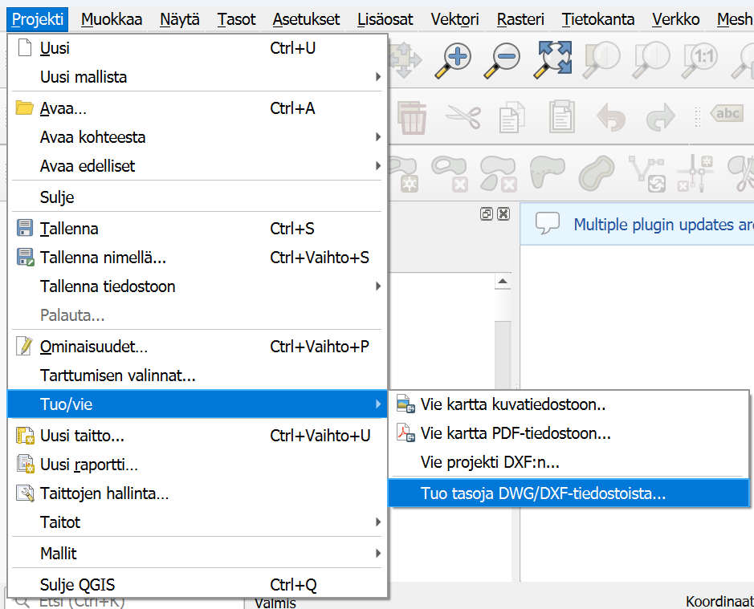
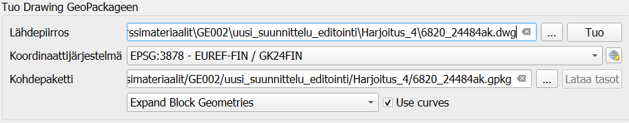
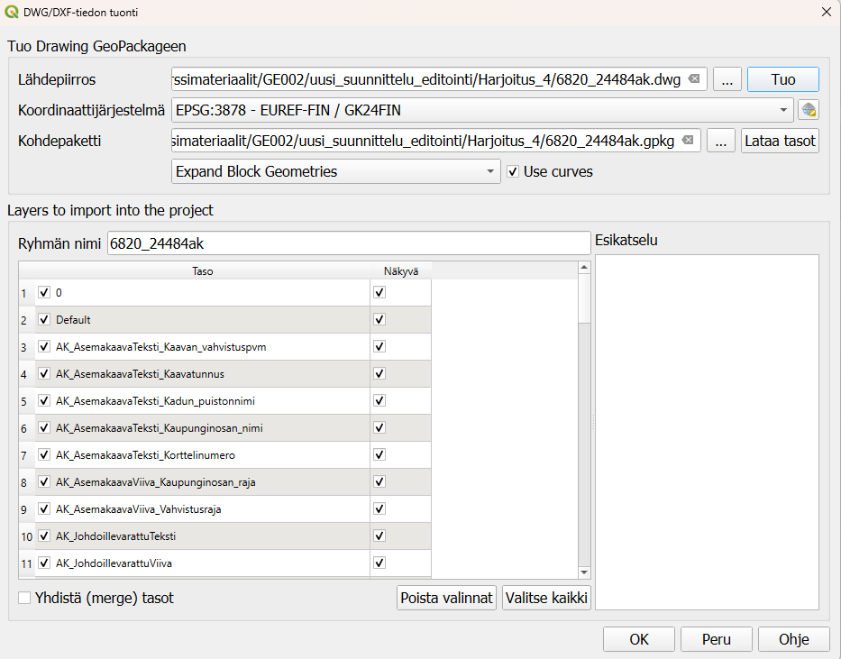
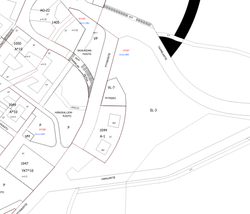

# Harjoitus 4: DWG/DXF-tiedoston tuonti

**Harjoituksen sisältö**

Tuodaan QGISiin DWG-tiedosto.

**Harjoituksen tavoite**

Kurssilainen ymmärtää, miten CAD-aineistoa tuodaan QGISiin sekä minkälaisessa muodossa se tuodaan sekä miten sitä voi käsitellä.

**Arvioitu kesto**

20 minuuttia.

## Valmistautuminen

Avaa aiemmin tehty projekti Tampereen Pyynikin alueelta. Voit pitää taustalla avaamiasi karttoja ja ensimmäisessä harjoituksessa georeferoidut vanhat kartat. Ne voi laittaa helposti pois näkyvistä painamalla tason nimen vierestä täpän pois päätlä.

## DXF-tason tuonti

QGISiin voi tuoda suoraan DXF- sekä DWG-tiedostoja. QGIS lukee usein DXF-tiedostoja hieman paremmin kuin DWG-tiedostoja, joten jos tuot aineistoa suoraan jostain CAD-ohjelmistosta, kannattaa aineisto ottaa sieltä ulos suoraan oikeassa muodossa.

::: hint-box
QGIS lukee DWG- sekä DXF-aineistoja ja niitä saa suoraan tuotua QGISiin. Aineistosta tulee tietää käytetty koordinaattijärjestelmä, jotta muunnos tapahtuu oikein. Aineiston voi myös muuntaa toisella ohjelmalla suoraan GeoPackageksi tai Shapefileksi, jolloin ne toimivat QGISin kanssa huomattavasti sujuvammin.
QGIS tukee natiivisti vain vanhempaa MicroStation DGN v7 formaattia eikä uudempia pysty avata QGISissa. Nämä aineistot pitää joko tallentaa eri formaattiin tai muuntaa jälkikäteen vanhemmaksi versioksi, jotta ne saa avattua QGISissa.

:::

Aineistotuonnille on oma työkalunsa, avaa **Projekti -> Tuo/Vie -> Tuo tasoja DWG/DXF-tiedostoista...**

QGIS avaa uuden ikkunan, jossa pääset määrittämään minkä aineiston haluat tuoda ja mihin se tallennetaan. Aineistosta pitää myös tietää, missä koordinaattijärjestlemässä se on luotu, jotta tuonti ja aineiston muunnos GeoPackageen toimii oikein.
Etsi kurssihakemistosta harjoitus 4:n kansiosta tiedosto 6820_24484ak.dwg. Aineisto on samalta Tampereen Pyynikin alueelta, jolta georeferoitiin vanhat kartat. Kun määrität lähdetiedoston, samaan kansioon tehdään samanniminen geopackage, johon muunnettu aineisto tuodaan.
Määritä vielä aineiston koordinaattijärjestelmäksi ETRS-GK24 (EPSG 3878).

Paina Kohdepaketti-kohdasta lopuksi **Lataa tasot**, jolloin DWG-tiedostosta ladataan kaikki tasot näkyviin.

Tasot järjestetään automaattisesti uuteen ryhmään ja nimetään samalla tavalla kuin alkuperäisessä tiedostossa. Kun piirros ja tasot ovat latutuneet, voit painaa ikkunan alareunasta **OK** ja katsoa miltä tuotu aineisto näyttää QGISin karttaikkunassa.

## DWG-aineisto

Tutki miltä tuotu aineisto näyttää QGISissa. Aineisto koostuu useasta eri ryhmästä, joissa on eri tasoja. Ryhmiin on järjestelty viivoja, pisteitä, alueita sekä tekstejä. Pystyt helpoiten tutkimaan rakennetta tasojen nimien avulla ja sillä, että laitat tason pois näkyvistä niin näet missä kyseinen taso sijaitsee ja mitä se sisältää.

## Kohteiden kopioiminen toiselle tasolle

Kopioidaan muutama kohde aiemmin tehdylle Alueet-tasolle. Valitse esimerkiksi ryhmä AK_MuuAsemakaavaViiva_alueenosan_raja. Ryhmässä on kaksi tasoa: lines ja polylines. Voit valita jonkun kohteen, jonka haluat kopioida itse tehdylle tasollesi. Tuodut CAD-piirrokset koostuvat usein useammasta eri pätkästä, ota valintatyökalu käyttöön ja voit valita useamman kohteen joko piirtämällä kohteen ympärille neliön tai valitsemalla useamman kohteen pitäen Ctrl-näppäintä pohjassa. Kopioi kohteet painamalla **Ctrl+C** tai yläpalkista **Muokkaa -> Kopioi kohteet**.

Tarkista että taso, jolle siirrät kohteita on editointitilassa. Valitse kohdetaso tasovalikosta, jotta saat sen aktiiviseksi. Voit liittää kohteet uudelle tasolle joko painamalla **Ctrl+V** tai yläpalkista **Muokkaa-> Liitä kohteet**. Tallenna vielä tason muutokset, jotta kohteet tallentuvat uudelle tasolle. Kopioiminen ja liittäminen siirtää kuitenkin vain geometriat eikä attribuutteja, ellei uudella tasolla ole samoja attribuuttikenttiä kuin alkuperäisessä tasossa. 

::: hint-box
**Psst! Koulutuksen jälkeen saat henkilökohtaista tukea Gispon tukipalvelusta. Lähetä kysymyksesi tai kommenttisi osoitteeseen [koulutustuki\@gispo.fi](mailto:koulutustuki@gispo.fi){.email}!**
:::
