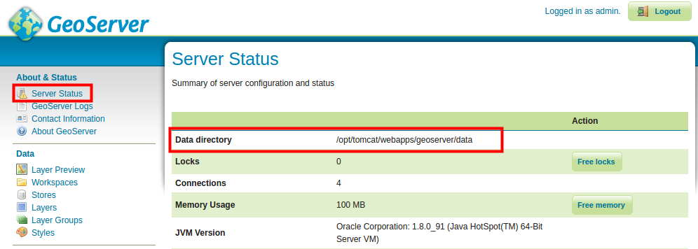
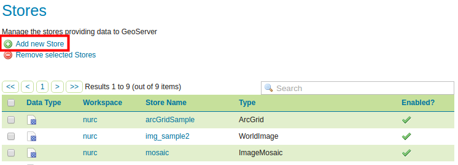
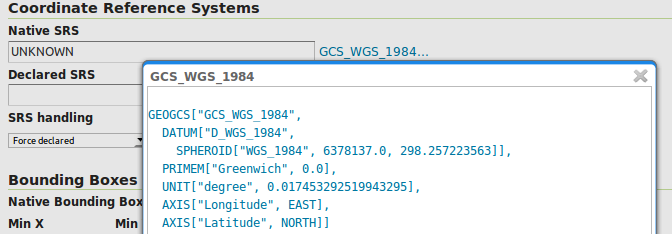
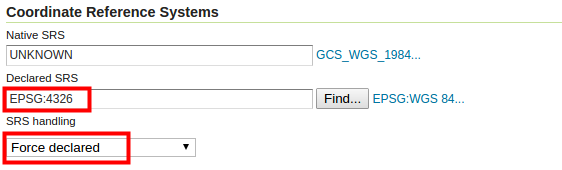
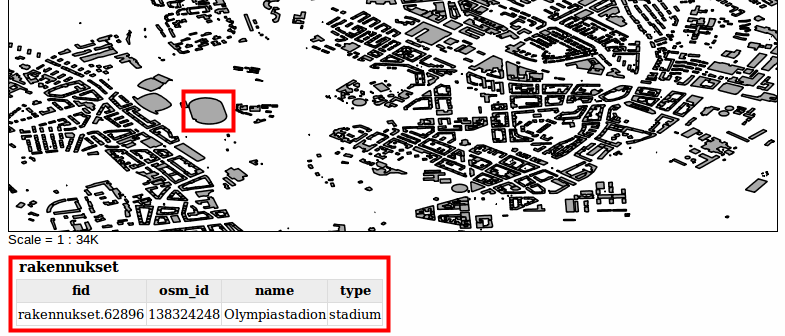

# Harjoitus 1.3: VEKTORIAINEISTOT

**Harjoituksen sisältö**

Harjoituksessa lisätään vektoriaineistoja GeoServer-palvelimelle ja muokataan tason asetukset WFS-palvelun julkaisemista varten.

**Harjoituksen tavoite**

Harjoituksen jälkeen opiskelija osaa lisätä vektoriaineistoja ja tehdä välttämättömät asetukset aineiston julkaisemiseksi.

**Arvioitu kesto**

40 minuuttia.

## **Valmistautuminen**

Kaikki koulutusaineistot ovat valmiiksi GeoServerin aineistohakemisto **/data/koulutus/**-kansiossa. Voit tarkistaa sen sijainnin omassa palvelimessasi **Server Status** -näkymästä. Sijainti on **Data directory** -kentässä; uusia aineistoja voidaan tarvittaessa lisätä siihen. 

Harjoituksessa käytettävät aineistot on ladattu käytössä oleville palvelimille.

GeoServerin aineistohakemistossa on paikkatiedon lisäksi muita aineistoja, kuten karttatyylejä ja tasoryhmien määrittelyjä. Tarkemmin, kurssin paikkatietoaineistot ovat koulutuskoneen kansiossa: 

::: note-box
/var/lib/tomcat8/webapps/geoserver/data/koulutus/
:::

::: hint-box
Psst! Aineistojen lisäämisen yhteydessä ilmenevät virheilmoitukset liittyvät usein tiedostojen ja hakemistojen käyttöoikeuksiin.
:::

Varmista, että koulutuskansio ja kaikki sen sisältämät alikansiot ja tiedostot ovat tomcat8-käyttäjän omistamia suorittamalla komentorivillä seuraava komento:

::: commandline-box
sudo chown -R tomcat8:tomcat8 /var/lib/tomcat8/webapps/geoserver/data/koulutus
:::

Koulutuskoneen **salasana on gispo**.

## **Vektoriaineisto Storen luominen**

Koulutuksen aineistosta löytyy muun muassa OpenStreetMapsin rakennukset Helsingistä shapefile-formaatissa **buildings.shp**, joka lisätään nyt GeoServeriin.

Aineiston formaatin ollen **shapefile** täytyy sille luoda **store**, joka on shapefile-formaatin kanssa yhteensopiva.

Päävalikosta valitse **Stores** ja paina sitten **Add new Store**.

Valitse Shapefile aineiston formaatiksi **New data source** -näkymässä, **Vector Data Sources -kohdan** alta.

Seuraavassa näkymässä pääset määrittelemään juuri luomasi store:n muut asetukset, kuten nimen ja tiedoston sijainnit. Nimeä ne seuraavalla tavalla:

-   **Valitse** workspaceksi helsinki

-   **Nimeä** aineisto hki_rakennukset

-   **Lisää** halutessasi aineistolle kuvaus, esimerkiksi "Helsingin OpenStreetMaps rakennukset"

Seuraavaksi määritellään mihin aineistoon (shape-tiedostoon) viitataan tämän store:n kautta. Muokkaa **Connection Parameters**:

-   Paina **Browse...**, ja selaa tiedostoon: **/koulutus/Helsinki.osm.shp/buildings.shp**

Pidä **Enabled** ruksattuna ja varmista näin tekemäsi store:n (ja siitä luotujen tasojen) käytettävyys GeoServer-palvelimelta. Tätä valintaa voidaan käyttää halutessa piilottaa joitakin aineistoja käyttäjiltä ilman niiden poistamista palvelimelta (ylläpitäjät voivat vielä käyttää niitä).

Tarkista vielä, että **DBF charset** arvo on **UTF-8**.

Loput asetukset voidaan pitää oletusarvoina.

Paina **Save**, niin store tallentuu GeoServerille ja on jatkossa käytettävissä

Storen luomisen jälkeen GeoServer olettaa, että halutaan julkaista uusi taso ja siksi uusi taso -näkymä (**New Layer**) aukeaa automaattisesti.

Paina **Publish** tason julkaisemiseksi.

## **Vektoritason julkaiseminen**

Luodaan ja julkaistaan nyt uusi taso. Jos et vielä tehnyt niin, paina **Publish** niin pääset muuttamaan julkaistavan tason ominaisuuksia.

::: hint-box
Psst! Jos ehdit poistumaan edellisestä näkymästä, samaan uuden tason luonti -näkymään pääsee päävalikosta Layers \> Add a new layer ja valitsemalla haluttu store (meidän tapauksessa helsinki:hki_rakennukset).
:::

Tason julkistamisen ominaisuudet ovat jaettu neljään välilehteen:

-   **Data**

-   **Publishing**

-   **Dimensions**

-   **Tile Caching**

## **Data asetukset**

Keskitytään nyt **Data**-välilehdessä oleviin valintoihin. Määrittele yleistiedot seuraavasti:

-   **Pidä** Enabled ja Advertised rastitettuna

-   **Nimeä** aineisto rakennukset

-   **Otsikoi** Helsingin OpenStreetMap rakennukset

**Lisää** halutessasi selitystä tasosta ja tasoon liittyviä avainsanoja (keywords). Avainsanojen avulla sekä Geoserverin ylläpitäjien ja käyttäjien on helpompi löytää heille tarpeellisia paikkatietoaineistoja.

### **Coordinate Reference Systems**

Selaa alaspäin kunnes löydät **Coordinate Reference Systems** -kohdan. Tässä määritellään tasolle koordinaattijärjestelmä.

Kun uutta aineistoa tuodaan GeoServeriin, se yrittää tunnistaa alkuperäisen koordinaattijärjestelmän EPSG-koodin. Jos tunnistus ei onnistu, niin **Native SRS** -kentän arvoksi tulee **UNKNOWN** ja sen oikealta puolelta löytyy linkki, josta saa tiedot aineiston alkuperäisen koordinaattijärjestelmän selvittämistä varten.

Tässä tapauksessa, projektiotiedot tulevat shapefilen aineiston .prj-tiedostosta. Paina **GCS_WGS_1984...** -linkkiä, niin saat auki projektiotiedot.

::: hint-box
Psst! Huomaa, että Native SRS tiedot ovat tarkoitettu vaan esikatselua varten. Tiedot tulevat suoraan alkuperäisen aineiston asetuksista, esimerkiksi shapefilen tai PostGIS-tason koordinaattijärjestelmätiedoista. Siksi niitä ei voida muokata GeoServerin selaimessa käyttöliittymän kautta.
:::

Kirjoita **EPSG:4326** koodi **Declared SRS** -kohdassa. Voit myös etsiä EPSG-koodeja **Find** -toiminnolla.

Pidä **SRS handling** oletusarvo (**Force declared**) ennallaan.

### **Bounding Boxes**

Täytä alla **Bounding Boxes** -kohdassa tiedot aineiston laajuudesta.

::: hint-box
Psst! Laajuus olisi mahdollista määritellä automaattisesti, mutta GeoServer vaatii, että tämä asetus tehdään valvotusti. Syy on se, että suurien aineistojen kanssa palvelin voisi jäädä pitkäksi ajaksi laskemaan tasojen laajuutta. Pyyntö voisi jopa epäonnistua, jos palvelimen timeout-asetus ylittyisi ja näin aineiston lisääminen olisi hankala.
:::

Harjoituksen aineisto on sen verran pieni, että voimme käyttää automaattista määrittelyä. Paina ensin **Native Bounding Box → Compute from data** ja sitten **Lat/Lon Bounding Box → Compute from native bounds**.

### **Feature Type Details**

**Data**-näkymän loppuosasta löytyy **Feature Type Details**, josta nähdään vektoriaineiston ominaisuustiedot ja niiden tyypit.

Muita julkaisun ominaisuuksia katsotaan vielä myöhemmin. Paina nyt **Save**, ja aineisto on saatavilla GeoServeristä. Tarkista, että uusi taso **rakennukset** on tasojen listalla.

::: hint-box
Psst! Voit käyttää "etsi"-toimintoa kun haluat suodattaa näkymää.
:::

Avaa nyt **Layer Preview** -näkymä, jolla pääset esikatselemaan **rakennukset**-tasoa samalla tavalla kun aiemmin olet esikatselut muita demoaineistoja.

::: hint-box
Psst! Huomaa, että Layer Preview näkymässä (ja myös Layer näkymässä) tason nimen edessä on laitettu workspacen nimi. Helsingin rakennukset -tason nimi on siksi helsinki:rakennukset.
:::

OpenLayers esikatselu näyttää tältä: 

Zoomaa karttaan ja paina jonkun rakennuksen päällä niin saat sen ominaisuustiedot näkyviin.

## **Helsingin tiestön lisääminen**

Lisää nyt OpenStreetMap Helsingin tiestö GeoServeriin samalla tavalla kuin edellisessä harjoituksessa. Aineisto löytyy samasta kansiosta kuin **rakennukset-**aineisto, nimellä **roads.shp**.

Muista, että ennen kun tason voi lisätä GeoServeriin, sille täytyy luoda sopiva store. Nimeä uusi store **hki_tiesto** ja siitä luotu taso **tiesto** niin tasojen nimet pysyvät samankaltaisina. Muista korjata myös koordinaattijärjestelmä (**EPSG:4326**) ja **DBF charset** (**UTF-8**).
