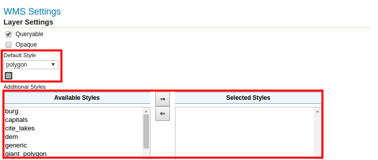
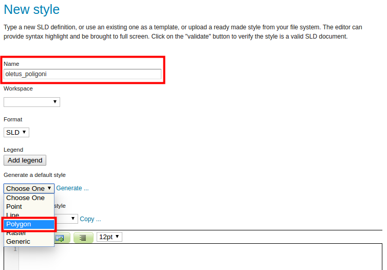
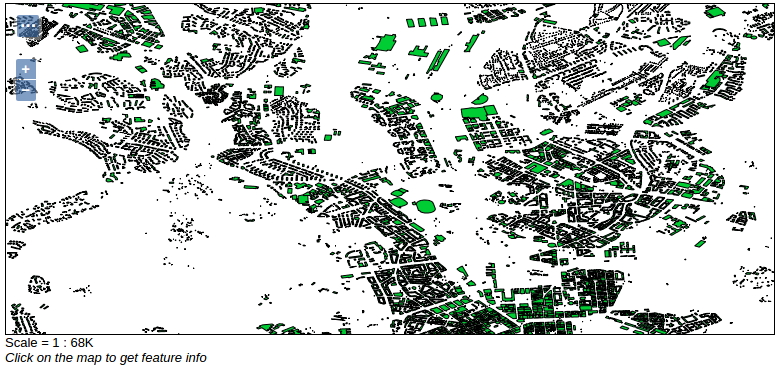
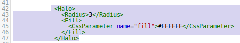

# HARJOITUS 1.4: KUVAUSTEKNIIKAN PERUSTEET (SLD)

**Harjoituksen sisältö**

Harjoituksessa käsitellään eri aineistoille sovellettavia kuvaustekniikoita ja hyödynnetään SLD-tyylejä karttojen visualisointiin.

**Harjoituksen tavoite**

Harjoituksen jälkeen opiskelija osaa hyödyntää peruskuvaustekniikoita GeoServerillä eri aineistojen visualisointiin, käyttäen SLD-kieltä.

**Arvioitu kesto**

40 minuuttia.

## **Valmistautuminen**

Käynnistä koneessa web-selain ja kirjaudu osoitteeseen:

Aiemmissa harjoituksissa on luotu GeoServerin palvelimelle taso **rakennukset**, johon luodaan nyt kuvaustekniikka.

## **GeoServerin kuvaustekniikka**

WMS-palvelut visualisoivat karttakuvia GeoServerissä ennalta määritetyillä kuvaustekniikoilla. Tähän asti olemme käyttäneet oletuskuvaustekniikoita aina lisättyämme uusia aineistoja, esimerkiksi kun olemme esikatselleet jotain tasoa.

Avaa päävalikosta **Layers**-näkymä ja **rakennukset**-taso. Avaa sitten **Publishing**-välilehti. 

Huomaa, että **WMS Settings** -kohdasta löytyy **Default Style** -valikko, johon on valittu **polygon**-kuvaustekniikka.

\

## **SLD-kuvaustekniikka**

Geoserverin tyylit on määritelty **Styled Layer Descriptorilla** (SLD), joka on XML-kieli.

Poistu tason näkymästä ja avaa **Data → Styles** näkymä päävalikon alta. Tässä näkymässä määritellään tyylit (kuvaustekniikat), joita WMS-karttatasoissa käytetään.

Listalla on parikymmentä tyyliä valmiina, jotka tulevat GeoServerin asennuksen mukana. Katsotaan aluksi, miltä **rakennukset**-tason käyttämä polygon-tyyli näyttää. Avaa se painamalla **polygon**-kohtaa.

Huomaa, että **Format** on **SLD**. Tutustu nyt tyylin koodiin: se muistuttaa verkkosivujen HTML-koodia. Siinä voit tunnistaa muun muassa **\<Fill\>**-ja **\<Stroke\>**-tagit, jotka määrittelevät monikulmion täyte- ja rajaviivan värejä.

Koodin toimivuutta voi kokeilla **Validate**- ja selitteen esikatselua **Preview legend** -toiminnolla.

Palaa **Styles**-näkymään painamalla **Cancel**.

## **Uuden tyylin luominen**

Laaditaan nyt oma kuvaustekniikka Helsingin rakennukset -aineistolle.

**Data → Styles** näkymässä, lisää uusi SLD-tyyli painamalla **Add a new style**.

Anna uudelle tyylille nimeksi **oletus_polygoni**. Valitse workspace:ksi **helsinki**.

Helpottaakseen omien tyylien kirjoittamisen aloittamista, SLD-koodikentän täyttämiseen voidaan valita malliksi GeoServerin oletustyylit tai kopioida olemassa oleva tyyli.

Valitse **Generate a default style** -alasvetovalikosta **Polygon** ja paina sen jälkeen **Generate...**

Voit nyt testata SLD-koodia **Validate-**toiminnolla. Testauksen onnistuminen näkyy ilmoituksena sivun yläpuolella.

Tallenna muutokset painamalla ensin **Submit**.

## **SLD-kuvaustekniikan käyttöönotto**

Kun uusi tyyli on luotu, voimme käyttää sitä aineistojen visualisoinnissa, esimerkiksi Helsingin rakennuksien esittämiseen kartalla. Sitä varten ilmoitamme GeoServerille, millä tyylillä **rakennukset**-taso on piirrettävä.

Avaa **rakennukset**-tason editointinäkymä päävalikosta **Data → Layers**. 

**Publishing** välilehdellä valitse **Default Style** -valikosta uusi **oletus_polygoni**-tyyli.

Paina sitten **Save**.

**Data → Layer Preview** näkymästä voit nyt esikatsella **rakennukset**-tasoa, uusi tyyli on nyt käytössä.

## **SLD Cookbook**

Kannattaa tutustua SLD-tyylien kirjoittamiseen SLD Cookbook -sivuilta. SLD Cookbook on osa GeoServerin verkkodokumentaatiota ja sisältää erilaisia kuvaustekniikkaesimerkkejä.

Käytetään seuraavaksi pohjana uuteen tyyliimme esimerkkiä **SLD Cookbookista**. 

Avaa uudessa selainikkunassa GeoServerin SLD Cookbook alla olevasta linkistä (tai voit etsiä selaimella Googlesta "geoserver sld cookbook"). Etsi **Polygon with styled label** -kohta ja paina sitä:

::: note-box
<http://docs.geoserver.org/stable/en/user/styling/sld/cookbook/>
:::

Löydät lyhyen esityksen kuvaustekniikasta ja SLD-koodin. Tutustu lyhyesti koodiin ja yritä löytää tärkeimmät elementit (tagit) kuten monikulmion viivan ja täytön värit sekä tekstien fonttimääritelmät. Voit kirjoittaa muistiinpanoja tärkeimmistä elementeistä ja määritelmistä harjoituksen viimeiselle sivulle.

Esimerkissä **\<Stroke\>**-koodissa on määritelty reunaviivan väri ja paksuus.

**\<TextSymbolizer\>** sisältää tekstitysominaisuudet eli labelit (kartan kohteiden, esimerkiksi katujen nimet) kuten **\<Label\>**, joka määrittää tekstejä varten käytettävän kentän/sarakkeen  ominaisuustiedoista.

Tavanomaisen SLD-kielen lisäksi tämä mallikoodi sisältää kaksi GeoServerin omaa lisäosaa, joita käytetään SLD:ssä tekstien sijoittamiseen. Tunnistat tällaiset kohdat koodista **\<VendorOption\...\>**-tageista.

Etsi SLD-tyylien esimerkkisivuilta **View and download the full "Polygon with styled label" SLD** -linkki, avaa se uudessa ikkunassa ja tallenna kyseinen sivu .sld-tiedostona, käyttämällä selaimen tallennus (save as / tallenna nimellä) toimintoa. Anna tiedostolle nimi, jonka muistat vielä myöhemmin (esimerkiksi polygon_polygonwithstyledlabel.sld).

Palaa nyt GeoServerin käyttöliittymään ja paina koodilaatikon alta **Browse**. Etsi äskettäin ladattu SLD-tyyli levyltä ja paina lopuksi **Upload**.

Anna uudelle tyylille nimeksi **rakennukset**. Valitse **helsinki** workspace:ksi.

::: hint-box
Psst! Huomaa, että jos olit aiemmin määritellyt tyylin nimen ja workspacen, GeoServer mahdollisesti korvaa niitä kun lataat .sld tiedostoa.
:::

Voit nyt testata SLD-koodia **Validate-**toiminnolla. Voit esikatsella karttamerkkien selitettä painamalla **Preview legend**.

Muokkaa vielä monikulmion SLD-tyyli seuraavasti:

-   **Täyteväri** (PolygonSymbolizer → FILL) vaaleanpunaiseksi (#FFCC99)

-   **Reunaviivan väri** (PolygonSymbolizer → Stroke) mustaksi (#000000)

-   **Reunaviivan paksuudeksi** 0.5

-   **Aseta** ensimmäisellä rivillä encoding="UTF-8"

::: hint-box
Psst! Huomaa, että GeoServerissä desimaalierottimena toimii ainoastaan piste ".". Tämä pätee kaikissa GeoServerin asetuksissa.
:::

Tallenna sitten muutokset painamalla ensin **Submit**.

Lopuksi vaihda **rakennukset**-tasolle tyyliksi **rakennukset**-tyyli (**Data → Layers → rakennukset → Publishing**).

## **SLD-kuvaustekniikan muokkaaminen**

Lisätään vielä teksteille puskuri (halo), niin tekstiä on helpompi lukea.

Palaa **Styles**-näkymälle ja valitse taas **rakennukset**-tyyli. Poista SLD-koodista **\<TextSymbolizer\>**-tagin sisältä:

::: code-box
\<Fill\>\
   \<CssParameter name="fill"\>#000000\</CssParameter\>\
\</Fill\>\
:::

ja korvaa sen tilalle:

::: code-box
\<Halo\>\
   \<Radius\>3\</Radius\>\
    \<Fill\>\
        \<CssParameter name="fill"\>#FFFFFF\</CssParameter\>\
    \</Fill\>\
\</Halo\>
:::

SLD-koodi ikkunassa näyttää tältä:

Paina sitten **Validate**.

Jos koodin käytössä tulee virheilmoituksia tai se ei toimi, pyydä kouluttajalta apua. Muuten paina **Submit**, niin tyyli tallentuu.

Päivitetty tyyli on heti käytössä palvelimella ja sitä voi esikatsella **rakennukset**-tason avulla. Selainikkunan voit päivittää painamalla **F5**-näppäintätai **CTRL+R**-näppäimiä.

Osoitteessa <http://colorbrewer2.org/> voi tutustua erilaisiin visualisointityyleihin ja valita  sopivia värejä visualisointiin.

## **Tiestön tyylin luominen**

Luo nyt uusi tyyli, jota tullaan käyttämään tiestön kuvaamiseen.

Samalla tavalla kuin aiemmin, käytä hyväksi GeoServerissa olemassa oleva tyyli. **Tiger_roads**-tyyli sopii tiestön kuvaamiseen. Esikatsele tiger_roads-tasoa.

Kadut on kuvattu leveinä valkoisina kaistoina kun karttaa lähennetään tarpeeksi. Tehdään seuraavaksi samankaltainen tyyli aikaisemmin julkaistua tiesto-aineistoa varten.

Luo uusi tyyli (**Data → Styles → Add a new style**), nimeä se **tiesto**. Kopioi **simple_roads** tyyli.

Etsi **\<Rule\>** kappaleen sisällä oleva **\<Title\>** ja lisää sen alle:

::: code-box
\<MinScaleDenominator\>32000\</MinScaleDenominator\>
:::

Paina sitten **Submit**.

Aseta vielä tiesto-tason oletustyyliksi **tiesto-tyyli**. (**Data → Layers → helsinki:tiesto → Publishing**).

Paina **Save** ja esikatsele tasoa. Huomaa, että kun loitonnat karttaa siten että mittakaava on pienempi kuin 1:32 000, tiet eivät enää tule näkyviin.

Lisätään nyt tiet myös mittakaavaan 1:32 000 ja suuremmille. Tämä onnistuu luomalla **\<Rule\>**-osio, jossa maksimimittakaava (**\<MaxScaleDenominator\>**) on määritelty **32000** arvoksi.

Voit hyödyntää edellisen sääntö osiota: kopioi koko **\<Rule\>** kappale. Lisää se **\</Rule\>** jälkeen.

Muuta vielä:

::: code-box
\<MinScaleDenominator\>32000\</MinScaleDenominator\>
:::

\... tällaiseksi:

::: code-box
\<MaxScaleDenominator\>32000\</MaxScaleDenominator\>
:::

Vaihda viivan väri harmaaksi **#666666**, otsikoksi **Paksu viiva** ja paksuudeksi **7**.

Paina **Submit** ja esikatsele.Huomaa, että nyt kun lähennät karttaikkunaa (suurennat mittakaavaa), niin teiden väri ja paksuus muuttuu.

Lisätään vielä täyteväri viivoille lisäämällä uusi sääntö. Kopioi edellinen **\<Rule\>** -koodi kappale (jolla on \<MaxScaleDenominator\>32000\</MaxScaleDenominator\>) ja liitä se kopioidun kappaleen jatkoksi.

Muuta taas otsikko, väri ja paksuus kuvan mukaisesti:

Tämä viiva tulee piirretyksi edellisen paksumman viivan päälle, josta aiheutuu viivareunan efekti.

Esikatsele lopputulosta:

