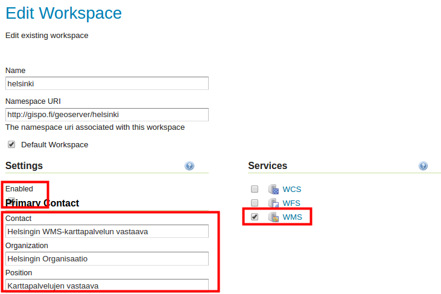
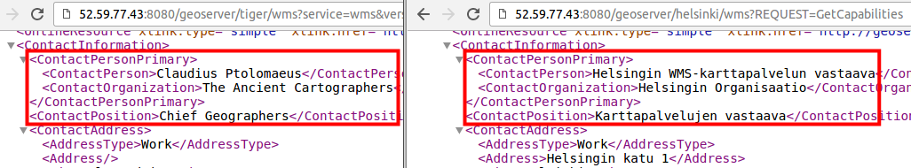
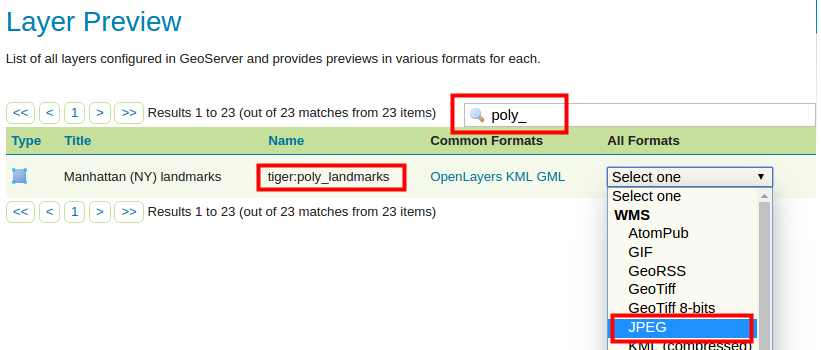
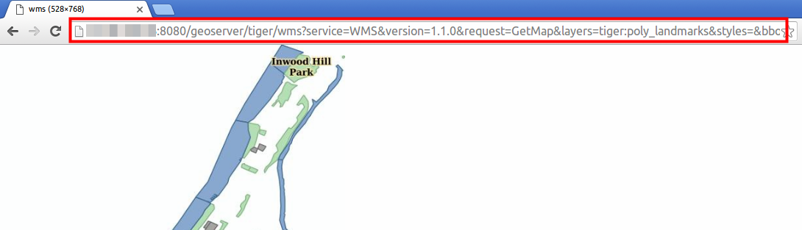
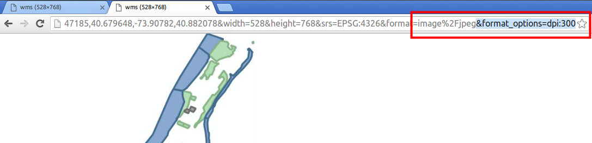
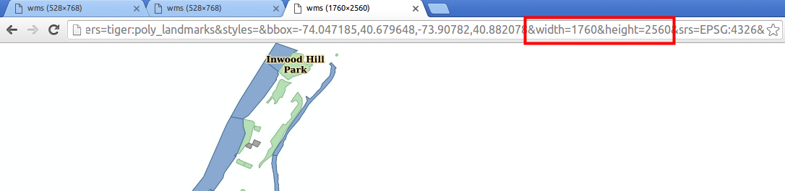

# HARJOITUS 1.5: WMS- JA WCS-PALVELUT

**Harjoituksen sisältö**

Harjoituksessa tutustutaan GeoServerin WMS- ja WCS-palveluiden asetuksiin.

**Harjoituksen tavoite**

Harjoituksen jälkeen opiskelija ymmärtää eri karttapalvelujen kokonaisuudet ja osaa muokata niiden perusasetuksia.

**Arvioitu kesto**

50 minuuttia.

## **Valmistautuminen**

Aiemmissa harjoituksissa on luotu GeoServerin palvelimeen taso **rakennukset**, ja sille tasolle on luotu uusi kuvaustekniikka (rakennukset).

## **OGC-standardit**

Kaikista tasoista, jotka on lisätty GeoServeriin, voidaan julkaista erilaisia rajapintapalveluja.

Yleisin rajapintapalvelu on karttapalvelu **Web Map Service** (**WMS**). GeoServerin avulla voidaan tuottaa WMS-palvelu eri paikkatietoaineistoja ja kuvaustekniikoita hyväksikäyttäen.

Muita rajapintapalveluja ovat muun muassa **Web Coverage Service** (**WCS**), joka mahdollistaa raakarasteriaineistojen julkaisemisen ja **Web Feature Service** (**WFS**), jota käytetään vektoriaineistojen rajapintapalveluna.

## **Yleiset karttapalveluasetukset**

Eri rajapintapalvelujen yleiset asetukset löytyvät päävalikosta **Services**-kohdasta. Näitä yleisiä asetuksia käytetään oletuksena aina, kun aineistoja julkaistaan GeoServerin kautta.

Käytännössä kaikki aiemmin lisätyt aineistot ovat jo valmiiksi julkaistu rajapintapalveluina, koska kaikki edellä käydyt kolme palvelua (WMS, WCS ja WFS) on aktivoitu koulutuksen GeoServerin oletusasennuksessa.

Olemme esimerkiksi käyttäneet WMS-karttapalvelua aina kun olemme esikatselleet jotain tasoa selaimella.

Avaa **Services → WMS-näkymä**.

Asetusten sivun alussa löytyy **Service Metadata** -tiedot.

Tarkista, että **Enable WMS** -valinta on rastitettuna. Toiminnon ollessa valittuna GeoServer-palvelin tuottaa WMS-karttapalvelua. Jos tämä valinta ei ole rastittu, mikään aineisto ei ole saatavilla WMS-karttapalveluna. Rajapintapalveluiden saatavuutta voidaan hallita myös workspace-kohtaisesti.

Kaikkien karttapalveluiden toiminnallisuutta ja palvelinasetuksia voi myös määrittää seuraavien kohtien mukaisesti: **Maintainer**, **Online resource**, **Title**, **Abstract**, **Fees**, **Access Constraints** ja **Keywords**-asetusten avulla määritetään tietoja palvelusta ja sen ylläpitäjästä.

::: hint-box
Psst! Nämä metadatan asetukset ovat samankaltaiset myös WFS- ja WCS-palvelujen kohdalla.
:::

Määrittele näitä tietoja WMS-palvelulle. Voit kirjoittaa muistiinpanot harjoituksen viimeiselle sivulle.

## **WMS**

**Web Map Services** (**WMS**) -karttapalvelu tuottaa georeferoituja karttakuvia.

::: hint-box
Psst! Karttakuvat luodaan aina GeoServerin saadessa WMS-pyyntöjä käyttöliittymästä. Lisäksi GeoServer käyttää hyväkseen palvelimen välivarastossa (cache) olemassa olevia karttakuvia. GeoServer saa pyyntöjä aina kun palvelimeen otetaan yhteys, mutta myös silloin kun kartalla zoomataan (vaihdetaan mittakaavaa) tai siirrytään paikasta toiseen.
:::

Avaa **Services → WMS** uudelleen.

Perustietojen lisäksi jokaisella karttapalvelulla on omat asetuksensa, jotka määrittävät karttapalvelun toiminnallisuutta. Näitä on runsaasti WMS-palvelun osalta. Esimerkiksi, kuvien luomiseen voi valita interpoloinnin menetelmäksi **Raster Rendering Options** -kohdassa: **Nearest Neighbor**, **Bilinear** tai **Bicubic**. Oletuksena valittu **Nearest neighbor** -menetelmä on suositeltava valinta rasterien perusvisualisointiin.

Yksi kiinnostava asetus WMS-palvelulle on vesileimojen käyttäminen. Vesileimoja voidaan lisätä WMS-karttakuviin **Watermark Settings** -kohdasta. Huomaa kuitenkin, että päävalikon WMS-asetuksissa määritellään oletuksia kaikille GeoServerin aineistoille. Tasokohtaisia vesileimoja ei voi määrittää, mutta vesileimoja voidaan määrittää workspace-kohtaisesti.

Kokeillaan asettaa palvelimen WMS-palvelulle GeoServer-logo vesileimaksi.

Avaa **Services → WMS** ja etsi kohta **Watermark Settings** ja varmista, että **Enable watermark** on rastittuna.

Käytä sitten **Browse\...** valitsemaan GeoServerin logo (**/koulutus/GeoServer_100.png)**

Laita vielä läpinäkyvyyttä **30**:ksi ja sijainniksi **Bottom right**.

Paina nyt **Submit** tallentaaksesi muutokset WMS-palveluun. Kaikkien WMS-palvelukartan kautta saatujen karttojen pitäisi nyt sisältää vesileima.

Avaa **Data → Layer Preview**, ja esikatsele joitakin tasoja. Tarkista, että vesileima tulee näkyviin kaikissa WMS-pyynnöissä.

Esimerkiksi, **states**-taso näyttää tältä OpenLayers-esikatselunäkymässä:

Kokeile myös muita karttatasoja ja huomaa, että kaikissa on nähtävissä nyt GeoServer-logon vesileima ja se pysyy siellä karttaa liikuteltaessa. States-aineisto on vektoriaineisto.

::: hint-box
Mikä GeoServer-palvelu (WMS, WFS tai WCS) käyttää OpenLayersia? Psst! Kannattaa katsoa selaimen osoitteeseen.
:::

WMS-palvelua hyödyntävä verkkokartta tuotetaan alkuperäisten aineistojen ja tyylien kautta palvelimessa ja välitetään kuvana selaimen kautta. Vektoriaineistoja, rasteriaineistoja ja niiden yhdistelmiä (ryhmätasoina) voidaan välittää WMS-palvelun kautta.

## **Workspace-kohtaiset palvelimen asetukset**

Äsken määriteltiin vesileima WMS-karttapalvelulle yleisesti. Asetuksia voi määrittää myös workspace-kohtaisesti. Tätä tehdään workspace-asetusten näkymässä.

Avaa **Data → Workspaces**.

Muokataan seuraavaksi **helsinki**-workspacen asetuksia. Valitse se **Workspace Names** -kohdan alta. 

Rastita sitten **Settings → Enabled** ja oikealta **Services** → **WMS**.

Voit täyttää nyt tämän workspace-kohtaiset yhteystiedot kuvaamaan Helsingin WMS-karttapalvelua.

Selaa alaspäin ja paina **Save**.

Nyt muut GeoServer-palvelimessasi olevat WMS-karttapalvelut sisältävät oletustiedot (määritelty **About & Status → Contact Information**), kun taas **helsinki**-workspace WMS-palvelun tiedot ovat ne jotka juuri määritettiin.

Tiedot voit tarkistaa Getcapabilities-pyynnöllä seuraavasti:

-   Helsinki-workspace: [http://xx.xx.xx.xx/geoserver/helsinki/wms?REQUEST=GetCapabilities](http://xx.xx.xx.xx/geoserver/helsinki/wms?REQUEST=Getcapabilities)

-   Tiger-workspace: [http://xx.xx.xx.xx/geoserver/tiger/wms?REQUEST=GetCapabilities](http://xx.xx.xx.xx/geoserver/helsinki/wms?REQUEST=Getcapabilities)

-   Geoserver oletus: [http://xx.xx.xx.xx/geoserver/wms?REQUEST=GetCapabilities](http://xx.xx.xx.xx/geoserver/helsinki/wms?REQUEST=Getcapabilities)

\

## **WMS-karttapalvelun kuvan DPI-resoluutio**

Karttapalvelimet palauttavat kuvat oletuskuvaresoluutiossa, jonka OGC on määritellyt arvolla **90 DPI** (Dots Per Inch). Tämä dpi-arvo on varsin pieni, mutta sopiva yleisimmissä käyttöyhteyksissä eli tietokoneella tai älypuhelimella. Suurempi karttakuvaresoluutio on tarpeellista esimerkiksi silloin kun työasemapaikkatieto-ohjelmistojen avulla halutaan tuottaa karttatulosteita, joissa on WMS-tasoja.

::: hint-box
Psst! DPI-arvo on oletusarvoisesti pieni, jotta se ei ylikuormita palvelinta ja mahdollistaa saumattoman karttapalveluiden toimimisen.
:::

Palveluille on mahdollista määrittää muita kuvaresoluutioita muokkaamalla WMS-karttapyyntöjen parametreja.

Kokeile nyt esikatsella **poly_landmarks-**tasoa JPEG-kuvana. Löydät tason helposti **Layer preview** -näkymästä:

Tuloksena saat karttakuvan JPEG-formaatissa oletusresoluutiolla eli DPI-arvolla 90:\

Jos suurennat kuvaa selaimessa (tai tallennat sen kovalevylle ja katselet sitä valokuvien/kuvien katseluohjelmassa) huomaat, että resoluutio on varsin huono.

Valitse ja kopioi koko selaimessa oleva osoitteen teksti. Avaa tekstinkäsittelyohjelma ja liimaa teksti siihen. Se on http-pyyntö GeoServerin palvelimellesi ja se muistuttaa seuraavaa tekstiä:

::: note-box
[http://xx.xx.xx.xx:8080/geoserver/tiger/wms?service=WMS&version=1.1.0&request=GetMap &layers=tiger:poly_landmarks&styles=&bbox=-74.047185,40.679648,-73.90782,40.882078 **&width=528&height=768**&srs=EPSG:4326**&format=image%2Fjpeg**](http://xx.xx.xx.xx:8080/geoserver/tiger/wms?service=WMS&version=1.1.0&request=GetMap%20&layers=tiger:poly_landmarks&styles=&bbox=-74.047185,40.679648,-73.90782,40.882078%20&width=528&height=768&srs=EPSG:4326&format=image%2Fjpeg)
:::

Tekstiin on korostettu tärkeimmät parametrit koskien WMS-kuvaa. Niistä voi tulkita seuraavaa:

-   **&width** ja **&height**:kuvan koko on 528\*768 pikseliä ja 

-   **&format**: formaatti on JPEG

-   Kuvan resoluutiosta ei ole mitään mainittu pyynnössä, joten käytössä on oletusresoluutio.

Määrittääksesi kuvaresoluutiota voit lisätä seuraavan parametrin http-pyynnön loppuun: **&format_options=dpi:300**. Lisää se siis WMS-pyyntösi loppuun, ja kopioi ja liimaa se nyt kokonaisuudessaan uuteen selainikkunaan vertailua varten. Painamalla **enter** saat aikaiseksi uuden kuvan:

Huomataan, että tyylit eivät täsmää aikaisempaan. Se johtuu siitä, että pyynnössä pitää myös muokata kuvan kokoa, joka on laskettu oletusresoluutiolle sopivaksi. Nyt WMS-karttapalvelun tuottama JPEG-kuva on tuotettu kuitenkin jo korkeammalla resoluutiolla kuin aikaisemmin.

Resoluutiot voidaan tarkistaa halutessaan tallentamalla molemmat kuvat kovalevylle ja vertaamalla niitä zoomaamalla käyttämäsi käyttöjärjestelmän kuvien esikatseluohjelman avulla.

Kuten sanottu, tyylit eivät nyt näytä oikeilta, koska oletuspyynnössä on kuvan koko laskettu 90 DPI resoluution mukaiseksi. Nyt on siis muokattava **&width-** ja **&height**-parametrien arvot yhteensopivaksi uuteenresoluutioon eli arvolle **300 DPI**. Tämä tapahtuu käyttämällä seuraavaa yhtälöä:

-   uusi_leveys = kuvan_oletusleveys \* (uusi_resoluutio/90)

-   uusi_pituus = kuvan_oletuspituus \* (uusi_resoluutio/90)

Eli meidän tapauksessamme:

-   uusi_leveys = 528 \* (300/90) → **&width=1760**

-   uusi_pituus = 768 \* (300/90) → **&height=2560**

Palaa uudelleen tekstinkäsittelyohjelmistoon ja muokkaa wms-pyyntöäsi yllä mainituilla tiedoilla. Kun kokeilet uutta pyyntöä selaimella, kuvan koko, resoluutio ja tyylit ovat oikein:

WMS-palveluja käyttävät ohjelmistot, kuten QGIS, rakentavat automaattisesti edellä kuvatun prosessin mukaisia pyyntöjä esimerkiksi karttataitossa (tulostekartta), mikä säästää käyttäjän määrittämästä manuaalisesti kuvan kokoa ja resoluution arvoa.

## **WCS**

Avaa **Services → WCS**.

Totuttuun tapaan voidaan päättää, halutaanko GeoServerin tuottavan raakarasterikarttaa. Se määritellään **Enable WCS** -valinnalla. Raakarasteriaineistojen jakamista on hyvä harkita tarkasti. Palvelu voi aiheuttaa suuria datasiirtomääriä verkkoyhteydelle. Lisäksi WCS-palvelun materiaaliksi sopii käytännössä vain luokitellut rasteriaineistot, ilma- ja satelliittikuvat. 

**Coverage processing** -kohdan alta löytyy WCS-palvelun asetukset. **Use subsampling** -valinnan aktivointi pienentää käsiteltävää datamäärää, mikä on hyödyllistä käytettäessä aineistoa alkuperäistä pienemmällä resoluutiolla.

Samalla tavalla, **Overview policy** -toiminto mahdollistaa aineiston yleiskatsausten käytön (näiden ollessa olemassa palvelimessa), mikä osaltansa vähentää siirrettävän tiedon määrää (vähemmän gigatavuja). Oletus on, ettei yleiskatsausta käytetä. Huomaa, että yleiskatsaukset aineistoista on luotava erikseen.

**Resource Consumption Limits** -valintaa käyttämällä ylläpitäjä voi asettaa resurssien käytölle rajoja raakarasteriaineistoja käsiteltäessä. Raaka-aineistojen koko voi olla hyvinkin suuri (lähtökohtaisesti kymmeniä tai satoja gigatavuja) ja palvelin voi ylikuormittua pyyntöjä käsiteltäessä.

