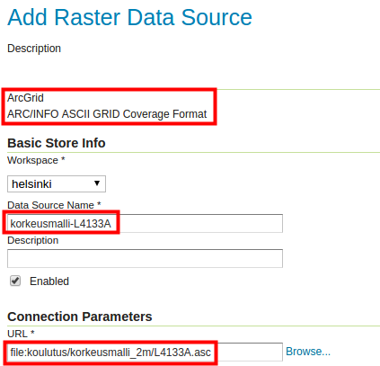
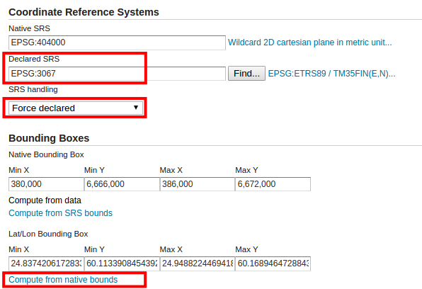
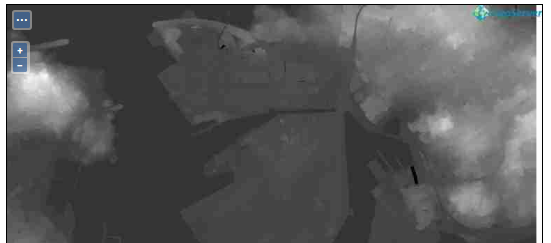
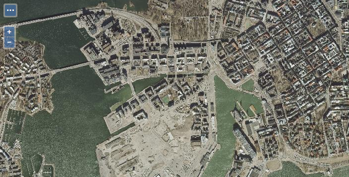
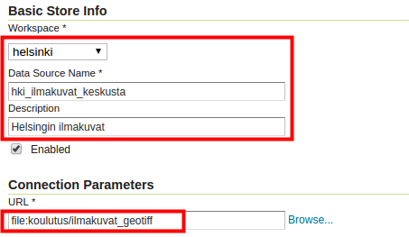
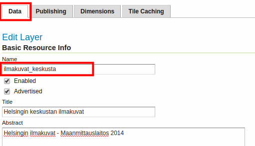
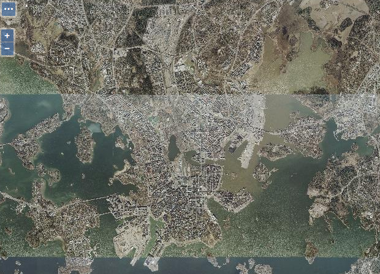
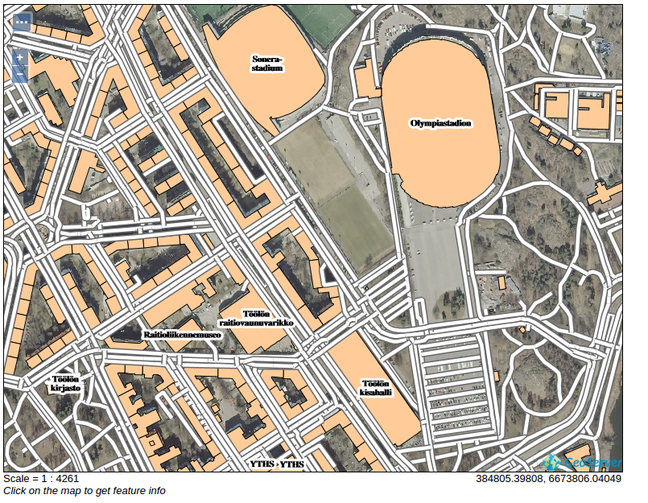
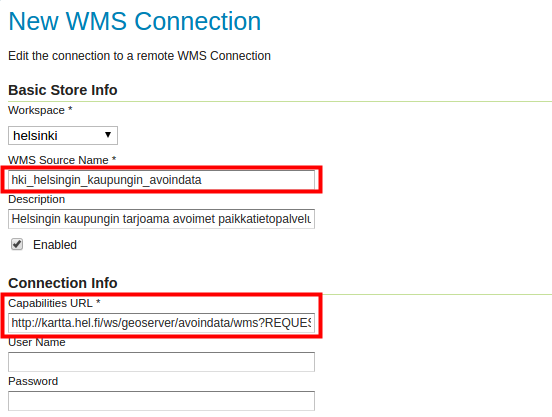

# HARJOITUS 1.6: RASTERIAINEISTOT

**Harjoituksen sisältö**

Harjoituksessa lisätään rasteriaineistoja GeoServer-palvelimelle ja muokataan tason asetuksia WCS-palvelun julkistamista varten.

**Harjoituksen tavoite**

Harjoituksen jälkeen opiskelija osaa lisätä rasteriaineistoja ja tehdä välttämättömät asetukset aineiston julkaisemiseksi.

**Arvioitu kesto**

40 minuuttia.

## **Valmistautuminen**

Aiemmissa harjoituksissa on luotu **helsinki**-workspace, joihin on määritelty muun muassa vesileima näkyväksi.

GeoServerin palvelimen aineistohakemistoon on valmiiksi ladattu muutama rasteriaineisto: yksi korkeusmalli ja neljä ilmakuvaa Helsingin alueelta.

## **Rasteriaineiston lisääminen**

Rasteriaineiston lisääminen GeoServeriin tapahtuu melko samalla tavalla kun aiemmissa harjoituksissa vektoriaineistojen kanssa. Ladataan nyt GeoServeriin käytettäväksi rasteriaineisto, jonka alkuperäinen formaatti on **ArcGrid** (ASCII-pohjainen rasteriformaatti). Rasteriaineisto on Maanmittauslaitoksen korkeusmalli Helsingin alueelta (ruutukoolla 2 m x 2 m).

Ensin meidän pitää luoda viitereferenssi aineistoon, jotta GeoServer tietäisi, missä aineisto sijaitsee fyysisesti. Muista, että tämä tapahtuu luomalla storeja.

Luo uusi store valitsemalla **Stores → Add new Store**. Paina sitten **ArcGrid** storen formaatiksi.

Valitse taas **helsinki**-workspace ja nimeä uusi store: **hki_korkeusmalli_L4133A**.

Selaa sitten kansioon **/koulutus/korkeusmalli_2m/** ja valitse tiedosto **L4133A.asc**.\

Paina sitten **Save** ja sen jälkeen **Publish**.

Kuten aiemmin vektoriaineistojen luomisen yhteydessä, pääset nyt tason editointinäkymään. Tarkista yleisasetukset niin, että sekä **Enabled** että **Advertised** ovat valittuna.

Laita nimeksi **korkeusmalli** ja otsikoksi **Helsingin korkeusmalli** ja lisätiedoksi **Korkeusmalli 2m -- Maanmittauslaitos.**

Huomaa, että **Coordinate Reference Systems** -kohdassa, koordinaattijärjestelmä on määritelty väärin. Aineiston oikea järjestelmä on **ETRS89 / ETRS-TM35FIN** (**EPSG:3067**). Korjaa sitä käsin **Declared SRS** -kentässä ja valitse **SRS handling** kentästä **Force declared**. Käytä sen jälkeen pikalinkkejä määrittääksesi aineiston laajuuden.

Paina sitten **Save.**

Tarkista, että taso on **Data → Layers**-taulussa. Voit esikatsella uutta rasteritasoa **Data → Layer Preview** -ikkunan kautta.\

## **Ilmakuvan lisääminen**

Samalla tavalla kun lisäsit edellisessä kohdassa ArcGrid-tiedoston voit lisätä GeoTIFF-aineistoja. 

Seuraa edellisen kohdan ohjeita ja lisää samalta alueelta ilmakuva. GeoTIFF-tiedosto löytyy täältä: **/koulutus/ilmakuvat_geotiff/L4133A.tif**.

Nimeä seuraavasti: \
	store:	**hki_ilmakuva\
** taso:	**ilmakuva**

Ilmakuva esikatselussa:

## **Image Mosaic**

GeoServerin avulla voi julkaista useita rasteriaineistoja (esim. GeoTIFF-tiedostoja) yhtenä WMS-palveluna käyttämällä **Image mosaic** -formaattia.

Mosaiikin muodostaminen vaatii, että kaikki aineistot ovat samassa kansiossa ja tiedostoformaatissa sekä samassa koordinaattijärjestelmässä. Rasteriformaatti tulee olla tuettuna GeoServerissä, esim. GeoTIFF tai ArcGrid.

Tämä storen tyyppi on tarkoitettu käytettäväksi samantyyppisten rasteriaineistojen kanssa. Esimerkiksi useita ilmakuvia, jotka muodostavat mosaiikin suositellaan julkaistavaksi kyseisellä tavalla välttäen tasokohtaista julkaisemista.

Edellisen ilmakuvan kansiossa on muutamia ilmakuvia Helsingistä. Aineisto on ladattu Maanmittauslaitoksen aineistopalvelusta. Ne ovat **GeoTIFF-**formaatissa ja **TM35FIN**-**koordinaattijärjestelmässä** (**EPSG:3067**). Kuten nähdään kyseinen aineisto täyttää kaikki mosaiikin muodostamiseen vaatimukset.

Luo uusi store **helsinki** workspaceen. Valitse formaatiksi **ImageMosaic - Image mosaicking plugin**.

Selaa kansioon **/koulutus/ilmakuvat_geotiff/** ja paina **OK**. Täten, kaikki kuvat kansiossa yhdistetään yhteen ja mosaiikkia käsitellään sen jälkeen yhtenä tasona.

Anna nimi ja selitys esimerkiksi seuraavan kuvan mukaisella tavalla:

Paina sitten **Save** ja sen jälkeen julkista taso painamalla **Publish**.

Laita tason nimeksi **ilmakuvat_keskusta** ja otsikoksi **Helsingin keskustan ilmakuvat**. Lisätiedoksi voit kirjoittaa esimerkiksi **Helsingin ilmakuvat - Maanmittauslaitos 2014**. Tarkista tason editointinäkymästä, että **Enabled** ja **Advertised** ovat rastitettuna.

Huomaa, että GeoTIFF-tiedoston koordinaattijärjestelmän tiedot (EPSG:3067) ja aineiston laajuus on tässä määrittynyt oikein automaattisesti (oletusarvojen mukaisesti).

::: hint-box
Psst! Kuten aiemmin mainittiin, GeoServer pyrkii tulkitsemaan alkuperäisen aineiston koordinaattijärjestelmän alkuperäisistä tiedoista, joka tässä tapauksessa oli EPSG-muodossa.
:::

Paina lopuksi **Save**.

Tarkista, että uusi taso löytyy **Data → Layers** -näkymältä. Voit myös esikatsella sitä tuttuun tapaan käyttäen **Data → Layers Preview**.

## **Layer Groups**

GeoServerin tasoja ja/tai aiemmin luotuja tasoryhmiä voidaan ryhmittää. Tasoryhmissä voi yhdistää eri vektori- ja rasteriformaatteja. Yksi selkeä käyttötapaus on taustakartan julkaiseminen yhtenä WMS-tasopalveluna. 

Luodaan nyt tasoryhmä käyttäen aiemmin palvelimelle lisättyjä **ilmakuvat_keskusta-**, **rakennukset-** ja **tiesto**-tasoja.

Valitse päävalikosta **Data → Layer Groups** ja sitten **Add new layer group**.

Laita ryhmätason nimeksi **taustakartta** ja otsikoksi **Helsingin taustakartta**. Lisää **Abstract** kentälle \"Helsingin keskustan taustakartta\".

::: hint-box
Psst! Joissain selaimissa ääkkösten käyttö ei välttämättä onnistu. Vältä ääkkösten käyttöä tasojen nimissä ja otsikoissa.
:::

Valitse **helsinki** workspace:ksi.

Selaa sivua alaspäin, paina **Add Layer...** ja lisää **ilmakuvat_keskusta**-taso. Taso on nyt lisätty **Layers**-listalle.

Paina **Generate Bounds** ja huomaa, kuinka tason alkuperäinen koordinaatistojärjestelmä ja laajuus on nyt määritettynä niille kuuluvissa kentissä. Pidetään ryhmätason järjestelmänä **ETRS89 / TM35FIN**.

Lisää samalla tavalla Helsingin **rakennukset**- ja **tiesto**-tasot.

Huomaa, että voit järjestää tasot käyttämällä **Drawing order** -nuolia. Ylempänä oleva (sija 1) piirretään ensimmäiseksi; sen päälle piirretään seuraava taso, ja niin edelleen. Järjestele tasot tämän kuvan mukaan:

Varmista, että **Default Style** ovat rastittuina.

Paina lopulta uudelleen **Generate Bounds** päivittämään ryhmätason laajuustiedot, jotta myös uudet aineistot otetaan huomioon laajuustietojen määrittämisessä. Aina kun lisäät uutta aineistoa tasoryhmään tulisi painaa uudelleen **Generate Bounds** päivittääksesi ryhmätason laajuustiedot.

Paina vielä **Save**.

Voit esikatsella ryhmätasoa samalla tavalla kuin muitakin tasoja:

### **Ryhmätasojen julkaisemisen muoto**

Palaa ryhmätason asetuksiin (**Data → Layer Groups → taustakartta**). Selaa alaspäin **Mode**-kohdalle asti. Tässä kohdassa voit valita erilaisia muotoja ryhmätason tasoille:

-   **Single**-ryhmätaso on nähtävissä yhtenä tasona, lähtötasoja ei voi erotella toisistaan

-   **Named Tree** -ryhmätaso on nähtävissä ryhmänä ja yksittäisinä tasoina

-   **Container Tree** -ryhmätaso on nähtävissä ainoastaan yksittäisinä tasoina

-   **Earth Observation Tree** -ryhmätaso on tarkoitettu Earth Observation -aineistoa varten ja se on nähtävissä vain ryhmätason esikatselunäkymässä

Pidä oletus **Single** valittuna. Se asettaa WMS-tasot näkyville yhtenä tasona.

Pidä loput asetukset oletuksina ja paina lopuksi **Save**. Ryhmätasoja voidaan esikatsella samalla tavalla kuin muita tasoja. Mene **Layer Preview** -näkymään ja avaa uuden ryhmätason esikatselutila OpenLayers-linkin avulla. Huomaa, että oletuskuvaustekniikka on käytössä. Tämän ryhmätason kuvaustekniikkaa parannetaan vielä myöhemmin.

Kun olet saanut ryhmätason valmiiksi, voit palata ryhmätason asetuksiin ja kokeilla muita **Mode**-asetuksia. Seuraavat esimerkkikuvat ovat QGISin WMS-palvelun työkalusta. .

**Mode → Single** näyttää tältä:

Tässä muodossa koko ryhmätaso on aina ladattavissa yhtenä pakettina, eikä sen alitasoista ole saatavilla tietoa erikseen tai niitä voida ladata erikseen.

Kun taas **Mode →  Named Tree** näyttää tältä:

Tässä muodossa on mahdollista ladata tasoja yksitellen.

### **Muiden WMS-palvelujen hyödyntäminen (cascading WMS)**

Rasteriaineisto voi olla peräisin myös muista WMS-palveluista. Tätä kutsutaan englanniksi **cascading-**tyyppiseksi ratkaisuksi. Käytännössä voidaan ketjuttaa WMS-tasoja toisista palveluista siten, että loppukäyttäjä ei huomaa eroa. Ketjuttaminen mahdollistaa esimerkiksi muiden paikkatietopalvelujen käytön GeoServeristämme. Heikkona puolena on se, että pitkistä ketjutuksista voi syntyä tilanne, jossa palvelun käytettävyys (vasteaika ja saatavuus) huononee oleellisesti.

Lisää uusi store (**Data → Stores → Add new Store**), valitse **WMS**-listalta.

Lisätään Helsingin kaupungin avoimet paikkatietopalvelut GeoServeriimme uudeksi WMS-yhteydeksi (remote WMS connection). Kyseinen Helsingin kaupungin palvelu löytyy osoitteesta: 

::: note-box
 [**https://kartta.hel.fi/ws/geoserver/avoindata/wms?REQUEST=Getcapabilities**](https://kartta.hel.fi/ws/geoserver/avoindata/wms?REQUEST=Getcapabilities).
:::

Täytä tiedot seuraavan kuvan mukaisesti, laita yllä oleva osoite **Capabilities URL** -kenttään:

Loput asetukset voit jättää oletuksiin. Paina sitten **Save**.

Seuraavasti voit julkaista tasoja suoraan siitä palvelusta. Julkaise esimerkiksi **Ajantasa_asemakaava**.

Uuden tason oletusasetukset ovat oikein. Selaa sivun loppuun ja paina **Save**.

Voit nyt esikatsella uutta tasoa samalla tavalla kuin aiemmin:

::: hint-box
Psst! Huomaa, että WMS-cascade-tasojen tyyliin tai sisältöön ei voida vaikuttaa, sillä ne ovat Helsingin kaupungin omassa palvelimessa. 
Helsingin kaupungin paikkatietopalvelujen metatietoihin voit tutustua tässä: http://ptp.hel.fi/avoindata/aineistot/Aineistolista_wms_avoindata_ulkoverkko.html.
:::
