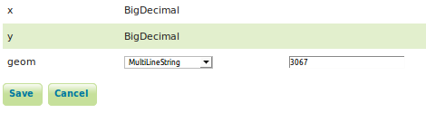
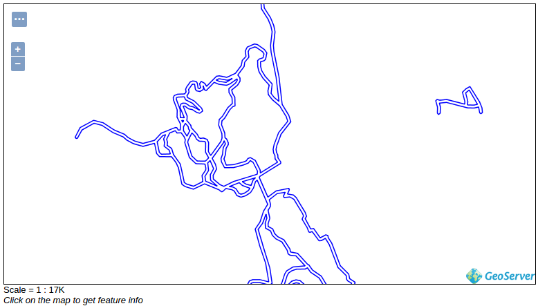

# HARJOITUS 1.7: PAIKKATIETOKANNAT

**Harjoituksen sisältö**

Harjoituksessa lisätään aineistoja GeoServeriin tietokantalähteestä.

**Harjoituksen tavoite**

Harjoituksen jälkeen opiskelija osaa yhdistää paikkatietokannan tietoja GeoServeriin ja julkaista sillä niiden aineistoja.

**Arvioitu kesto**

30 minuuttia.

## **Valmistautuminen**

Käynnistä koneessa web-selain ja kirjaudu osoitteeseen:

Palvelinkoneeseen on asennettu PostgreSQL-tietokanta ja sen PostGIS-laajennos. Tietokantaan on ladattu valmiiksi erilaisia vektoriaineistoja.

## **Yhteyden muodostaminen paikkatietokantaan**

GeoServer tukee useimpia paikkatietokantoja, kuten PostGIS, ArcSDE, Oracle ja Microsoft SQL Server. 

PostGIS-paikkatietokannat ovat hyödynnettävissä automaattisesti GeoServerin oletusasennuksien kautta. Muiden tietokantojen tuki asennetaan lisäosien kautta.

Koulutusympäristöön on asennettu valmiiksi PostGIS-tietokanta, josta löytyy valmiina erilaisia vektoriaineistoja. Aineistot ovat **Helsinki Region Infoshare**, **Jyväskylän yliopiston avoimen datan palveluista** ja **OpenStreetMap -kartta-aineistosta** (geofabrik.de-palvelusta).

Kuten muiden aineistojen kanssa, jotta aineistoja voidaan käyttää GeoServerissa, niihin on viitattava luomalla sopiva store.

Luo uusi store (**Data → Stores → Add new Store**).

Valitse formaatiksi **PostGIS - PostGIS Database**:

Valitse **Workspaceksi** tuttu **helsinki**-workspace ja nimeä se **hki_lipas** (**Data Source Name**).

Täytä sitten PostGIS-tietokannan **Connection Parameters** -yhteysasetukset seuraavasti:

+--------------------+---------------+
| ##### **Dbtype**   | postgis       |
+--------------------+---------------+
| ##### **Host**     | localhost     |
+--------------------+---------------+
| ##### **Port**     | 5432          |
+--------------------+---------------+
| ##### **Database** | gs_training   |
+--------------------+---------------+
| ##### **Schema**   | lipas         |
+--------------------+---------------+
| ##### **User**     | postgres      |
+--------------------+---------------+
| ##### **Passwd**   | gispo         |
+--------------------+---------------+

Jätä loput asetukset oletuksiin ja paina lopulta **Save**.

Samalla tavalla kuin aiemmin, uuden tason luomisen näkymä tulee esiin automaattisesti storen luomisen jälkeen. Näkymässä on listattu kaikki tasot, jotka löytyvät kyseisessä tietokannassa.

Aineistoon on nyt tehty viittaukset **hki_lipas**-storen kautta ja voit nähdä, mitä aineistoja se sisältää:

## **PostGIS-tason lisääminen**

Voit heti julkaista jonkin tason storen luomisen jälkeen painamalla **Publish**. Julkaise nyt **pisteet**-taso. Lipas on Jyväskylän yliopiston hallinnoima valtakunnallinen liikunnan paikkatietojärjestelmä.

::: hint-box
Psst! Kun myöhemmin haluat julkaista muita tasoja hki_HRI-storesta se onnistuu päävalikosta Data → Layers → Add a new layers ja valitsemalla haluamasi store.
:::

Tason editoinnin näkymässä, tason nimi ja otsikko on automaattisesti täytettynä. Pidä oletusnimet ja lisää halutessasi lisätietoja **Abstract**-kentälle.

Tarkista, että **Enabled** ja **Advertised** ovat rastittuina.

Kuten olet varmasti nyt huomannut, uuden tason asetukset ovat samanlaiset, oli kyseessä sitten shapefile-formaatti tai PostGIS-tietokanta.

Katso vielä **Coordinate Reference Systems** -osiosta, että GeoServer on tunnistanut koordinaattijärjestelmäksi **EPSG:3067**. PostGIS ja GeoServer käyttävät EPSG-koodeja määrittääkseen koordinaattijärjestelmän, joten useimmiten koordinaattijärjestelmä tulee oikein määritellyksi automaattisesti.

Ennen kuin tallennetaan tason julkaisuasetukset, määritä tason **Bounding Boxes** samalla tavalla kuin aikaisemmin lisäämiesi aineistojen kanssa.

Paina lopulta **Save**. Voit esikatsella uutta tasoa **Layer Preview**:n kautta.\

## **Monikulmio- ja viiva-tason lisääminen PostGIS-tietokannasta**

Lisää samalla tavalla vielä kaksi uutta tasoa PostGIS-tietokannasta:

-   **lipas_kaikki_alueet**

-   **lipas_kaikki_reitit**

Muista, että saat tasoja lisättyä **Data → Layers → Add new layer** -toiminnon kautta ja valitsemalla **helsinki:hki_lipas** lähteeksi. Esikatsele sen jälkeen näitä tasoja tarkistaen niiden toimivuus.

::: hint-box
Mitkä vaiheet ovat pakollisia tason julkaisemiseksi? Mitkä ovat tasojen koordinaattijärjestelmät ja niiden laajuudet?
:::

## **Tasojen oletustyylien asettaminen**

Vaihda lopuksi oletustyylit kyseisille tasoille käyttäen GeoServerin valmiita kuvaustekniikoita (default styles). Voit vaihtaa tason tyylin päävalikosta **Data → Layers** ja avaamalla haluamasi tason. Tyylit määritellään **Publish** välilehdestä. Käytä seuraavia tyylejä:

+--------------------------+-----------------+
| ##### **Taso**           | ##### **Tyyli** |
+==========================+=================+
| **lipas_kaikki_pisteet** | burg            |
+--------------------------+-----------------+
| **lipas_kaikki_alueet**  | giant_polygon   |
+--------------------------+-----------------+
| **lipas_kaikki_reitit**  | simple_roads    |
+--------------------------+-----------------+

Voit vielä lopuksi tehdä aineistoista ryhmätason. Kuvassa on yhdistetty Helsingin taustakartta-ryhmätaso ja lipas-aineistot yhteen karttapalvelutasoon:

## **SQL-näkymät**

GeoServerin avulla voidaan hyödyntää myös SQL-kyselyitä paikkatietoaineistojen jakamisessa.

Lisätään toistamiseen **lipas_kaikki_reitit**-aineisto uutena tasona palvelimelle. Tavoite on luoda taso, jossa ainoastaan Helsingissä olevat aineistot näytetään.

Annan nimeksi **lipas_kaikki_reitit_helsinki**.

::: hint-box
Psst! SQL-näkymä voitaisiin luoda myös suoraan tietokantaan ja käyttää tuota näkymää (view) tason luomiseen.
:::

SQL-kyselyjen tekemiseksi on hyvä ensin selvittää tietokannan taulujen kenttien nimet ja tyypit. Voit tarkistaa aineiston kentät avaamalla tason **Data → Layers**-näkymästä; kentät on lueteltu **Data**-välilehden lopussa. Aineiston ominaisuustietojen tyyppejä pääset tarkastelemaan parhaiten käyttäen muita ohjelmistoja kuten pgAdmin tai QGIS. Voit  myös tutustua niihin Lipas-sivuilta (<http://www.liikuntapaikat.fi/lipas>). Attribuuttitiedot GeoServerissä näyttävät tältä:

Aineiston tarkastelemisen jälkeen voidaan päätellä, että paikkakuntatieto löytyy **kunta_nimi**-kentästä.

Avaa **Data → Layers → Add new layer** ja valitse **helsinki:hki_lipas**. Painamalla **Configure new SQL view...** pääset määrittelemään SQL-kielellä, mitkä tiedot haluat julkaista kyseisestä aineistosta.

Määrittele näkymän nimeksi **lipas_kaikki_reitit_helsinki**. Kirjoita **SQL statement** -kenttään seuraavaa SQL-lauseke:

::: code-box
SELECT \*

FROM lipas.reitit

WHERE kunta_nimi = 'Helsinki'
:::

Rastita **Guess geometry type and srid** -toiminto ja paina sitten **Refresh**. Huomaa, että olla olevassa kuvassa on virhe SQL-kyselyssä. Ole tarkkana! kunta_nimi_fi-tekstin sijaan siinä pitäisi lukea vain kunta_nimi.

Tarkista sitten, että **geom**-nimisen kentän kohdalla **SRID** on määritelty oikean EPSG-tunnuksen mukaisesti (meidän tapauksessamme tunnus on **3067**).

Paina lopulta **Save**.

Määrittele seuraavaksi tason ulottuvuudet (Bounding Box) ja paina **Save**. Voit esikatsella Helsingin liikuntareitit -tasoa nyt.

## **Paikkatietotoiminnot SQL-näkymien kautta**

Voit käyttää SQL-lausekkeissa myös paikkatietofunktioita. Käytetään esimerkkinä vyöhyke-funktiota (ST_Buffer).

Avaa tason  **lipas_kaikki_reitit_helsinki** uudelleen (**Data → Layers**)

Selaa **Data** välilehdessä sivun loppuun. Sieltä löytyy **Edit sql view** -toiminto.

Päivitä **SQL statement** seuraavaksi:

::: code-box
SELECT ST_Union (ST_Buffer ( geom, 10 ))

FROM lipas.reitit

WHERE kunta_nimi = 'Helsinki'
:::

Päivitä taas attribuuttien formaatti ja paina sitten **Save**.

Esikatselussa huomaat, että reitit-aineisto on nyt puskuroitu 10 metrillä:

