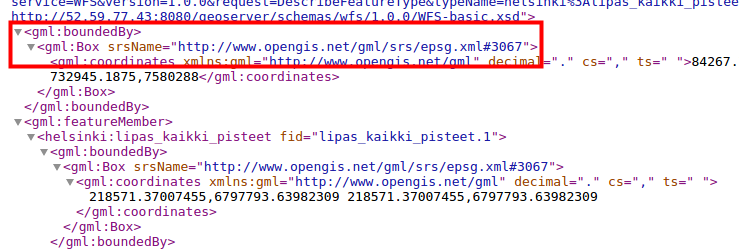
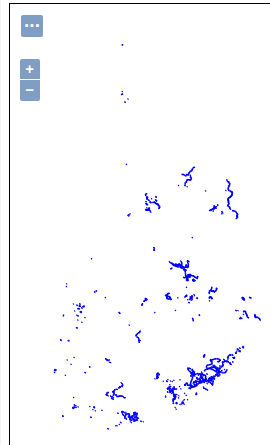

# HARJOITUS 2.1: WFS-PALVELUT

**Harjoituksen sisältö**

Harjoituksessa tutustutaan WFS-karttapalvelujen asetuksiin ja toiminnallisuuteen.

**Harjoituksen tavoite**

Harjoituksen jälkeen opiskelija osaa muuttaa WFS-karttapalvelujen julkaisuasetukset ja käyttää WFS-T-karttapalvelua.

**Arvioitu kesto**

30 minuuttia.

## **Valmistautuminen**

GeoServeriin on lisätty storeja, joissa on vektoriaineistoja.

## **OGC-standardit**

Aiemmin tarkasteltiin Open Geospatial Consortiumin (OGC) määrittämien WMS- ja WCS-rajapintapalvelujen asetuksia. Web Feature Service (WFS) -latauspalvelu on myös OGC:n määrittelemä rajapintapalvelu, jonka kautta vektoriaineistoja ja niiden ominaisuustietoja voi ladata edelleen hyödynnettäväksi.

## **WFS-asetukset**

WFS-palveluiden avulla voidaan käsitellä vektoriaineistoja sekä niiden geometria- ja attribuuttitietoja verkon yli.

Avaa **Services → WFS**. Heti näkymän alusta löytyy palvelun yleistiedot (**Service Metadata**).

WFS-kohtaiset asetukset löytyvät alempaa, josta määritellään, miten WFS-kohtaisia palvelupyyntöjä käsitellään ja miten niihin vastataan.

## **Tietomäärä pyynnöissä**

**Maximum number of features** ja **Maximum number of features for preview** estävät liian ison aineistomäärän lataamisen. Jos latauspyyntö sisältää paljon kohteita (features), niin vain osa niistä latautuu.

Toiminnon testaamista varten määrittele kyseisten ominaisuuksien arvoksi **1**.

Paina sitten **Submit**.

Katsele sen jälkeen **tiesto**-tasoa WFS-rajapinnan kautta Layer Previewin GML-esikatselun kauttatai esim. QGIS-sovelluksella.

::: hint-box
Miten äsken määritellyt ominaisuudet ovat vaikuttaneet lopputulokseen? Miksi?
:::

Esikatsele samaa **tiesto**-tasoa nyt käyttäen **GML**-linkkiä.

Palvelun vastaus (xml-muodossa) sisältää nyt vain yhden geometrian, kuten olimme määritelleet asetuksissa.

Palaa vielä **Services → WFS**-näkymään ja rastita **Return bounding box with every feature**. Esikatsele taas samaa tasoa ja vertaile sitä aiemman palvelupyynnön tulokseen. Tietyissä sovelluksissa voi olla tarpeen saada tiedot jokaisen paikkatietokohteen sijainnin rajauksesta (bounding box).

Tarkista tiesto-tason GML-esikatselusta, että GeoServerin lähettämä vastaus sisältää nyt myös geometrioita rajaavan suorakaiteen.

Palaa uudelleen **Services → WFS** -näkymään ja palauttaa oletuksiin **Maximum number of features**: **1 000 000** ja **Maximum number of features for preview**: **50**.

Paina **Submit**.

Voit vielä tarkistaa, että nyt GML-esikatselussa tulee vain 50:n kohteen geometriat, vaikka tiesto-tasolla on paljon enemmän paikkatietokohteita.

::: hint-box
Psst! "Maximum number of features for preview" on tärkeä asetus, jolla saa rajattua WFS-pyyntöjen tuloksien määrää tason esikatselutilassa. Saat helposti tietokoneen jumiin, jos kaikki tason tiedot tulevat vastauksena yhtä aikaa.
:::

## **Useiden koordinaattijärjestelmien määrittäminen**

GeoServer pystyy projisoimaan aineistoa ja palvelemaan sitä kaikissa yli 5000:ssa tuetussa koordinaattijärjestelmässä. On kuitenkin huomioitava, että palvelimessa käytössä olevat järjestelmät on määriteltävä käsin sen sijaan, että kaikki 5000+ koordinaattijärjestelmää tulisi ilmoitettua GetCapabilities-pyynnön kautta.

::: hint-box
Psst! Tämä asetus vaikuttaa vain GetCapabilities-pyynnön sisältöön; projisointi onnistuu edelleen käyttämällä mitä tahansa client-järjestelmää (esim. paikkatieto-ohjelmistoa).
:::

Määrittele **Extra SRS codes for WFS capabilities generation** -kentässä käytetyt koordinaattijärjestelmät pilkulla eroteltuina: **4326, 3047, 3067**.

::: hint-box
Mitkä koordinaattijärjestelmät ovat kyseessä?
:::

Voit tarkistaa nyt, että WFS-toiminnallisuuksien dokumentissa yllä mainitut koordinaattijärjestelmät ovat ilmoitettuna.

Paina **GeoServer-logoa** vasemmasta yläkulmasta (palaa siis web-käyttöliittymän etusivulle) ja sen jälkeen valitse sivun oikealta laidalta **WFS** → 1.1.0 tai **2.0.0**.

Etsimällä "**EPSG**" sivulta löydät EPSG-koodit WFS-palvelun dokumentaatiosta (xm-formaatissa):

Huomaa, ettei tämä asetus toimi WFS 1.0.0, sillä siinä ilmoitetaan EPSG-koodit vain tasokohtaisesti.

## **Service Levels**

GeoServerissa voidaan julkaista vektoriaineisto editoitavaksi **WFS-T (Transactional)** -palvelun avulla.

**Service Level** -valinnat määrittävät millaisen palvelutason WFS tarjoaa.

+-------------------------+-------------------------------------------------------------------------------------------------------------------------------------------------------------+
| ##### **Basic**         | Tarjoaa perustoiminnallisuuden: GetCapabilities, DescribeFeatureType ja GetFeature                                                                          |
+-------------------------+-------------------------------------------------------------------------------------------------------------------------------------------------------------+
| ##### **Transactional** | (WFS-T) perustoiminnallisuuden lisäksi transaktio-toiminto on käytettävissä                                                                                 |
+-------------------------+-------------------------------------------------------------------------------------------------------------------------------------------------------------+
| ##### **Complete**      | Lisää vielä LockFeature-tuen, joka estää paikkatietokohteiden (feature) muokkauksen sen jälkeen, kun toinen käyttäjä on jo aloittanut kohteiden muokkauksen |
+-------------------------+-------------------------------------------------------------------------------------------------------------------------------------------------------------+

Jätä asetus **Complete**-tasolle. GeoServer sallii oletuksena aineistojen muokkauksen vain admin-ryhmään kuuluville käyttäjille, eivätkä tunnistautumattomat käyttäjät pysty muokkaamaan aineistoja. **Basic**-tasoa voidaan käyttää, jos halutaan estää täysin aineistojen muokkaus WFS-T:n avulla.

## **GML-asetukset**

**GML** on XML:ään perustuva kieli, jonka OGC on määrittänyt. GML käytetään mallintamaan geometriaelementtejä. GeoServer tuottaa vektoriaineistoja GML-muotoisina.

Erilaiset WFS-palvelun versiot palauttavat oletuksena eri GML-formaatit:

+---------------------+---------------+
| ##### **WFS 1.0.0** | GML 2         |
+---------------------+---------------+
| ##### **WFS 1.1.0** | GML 3         |
+---------------------+---------------+
| ##### **WFS 2.0.0** | GML 3.2       |
+---------------------+---------------+

Jokaiselle GML-formaatille on mahdollista määritellä koordinaattijärjestelmäformaatti, joka tulee ottaa huomioon GML-tuloksessa. Tämä on tärkeä etenkin kun kehitetään WFS-palveluita hyödyntäviä sovelluksia.

**EPSG-KOODIT JA KOORDINAATIEN FORMAATIT GML-DOKUMENTISSA**

+--------------------------+-----------------------------------------------------------------------------------------------------------+
| **EPSG Code**            | srsName="EPSG:4326"                                                                                       |
|                          |                                                                                                           |
|                          | Koordinaatit formaatissa: longitude/latitude (x/y)                                                        |
+--------------------------+-----------------------------------------------------------------------------------------------------------+
| **OGC HTTP URL**         | srsName="[http://www.opengis.net/gml/srs/epsg.xml#4326"](http://www.opengis.net/gml/srs/epsg.xml#4326%22) |
|                          |                                                                                                           |
|                          | Koordinaatit formaatissa: longitude/latitude (x/y)                                                        |
+--------------------------+-----------------------------------------------------------------------------------------------------------+
| **OGC Experimental URN** | srsName="<urn:x-ogc:def:crs:EPSG:4326>"                                                                   |
+--------------------------+-----------------------------------------------------------------------------------------------------------+
| **OGC URN**              | srsName="<urn:ogc:def:crs:EPSG>::4326"                                                                    |
|                          |                                                                                                           |
|                          | Koordinaatit formaatissa: latitude/longitude (y/x)                                                        |
+--------------------------+-----------------------------------------------------------------------------------------------------------+
| **OGC HTTP URI**         | srsName="[http://www.opengis.net/def/crs/EPSG/0/4326"](http://www.opengis.net/def/crs/EPSG/0/4326%22)     |
+--------------------------+-----------------------------------------------------------------------------------------------------------+

Esimerkiksi **Lipas-alueet**-taso GML2-esikatselusta (EPSG-koodi muodossa OGC HTTP URL):

## **Workspace kohtaiset asetukset**

Samalla tavalla kun WMS-palvelujen kanssa, myös WFS-asetuksia on mahdollista määrittää workspace-kohtaisesti. Esimerkiksi WFS-T toiminnallisuus voidaan sallia vain yhden workspacen kautta ja pääsynhallinnan avulla sallia vain tunnistetut käyttäjät muokkaamaan aineistoja.

Avaa **Data → Workspaces** ja valitse sitten **helsinki**-workspace. Rastita sitten **Services → WFS** ja paina sen jälkeen **WFS**-linkkiä.

Varmista, että **Service Level** asetus on **Complete**.

Paina sen jälkeen **Submit** (sivun lopussa).

Paina lopuksi vielä **Save** sivun alaosasta.

Workspace-kohtaisilla asetuksilla voidaan esim. rajoi

ttaa, missä koordinaattijärjestelmissä workspacen aineistot ovat saatavilla, tai poistaa WFS-T -palvelu tietyn workspacen aineistoista.

## **Editointi WFS-T-palvelun kautta**

Yksi tärkeä ominaisuus WFS-palveluissa on mahdollisuus editoida vektoriaineistoja suoraan palvelimessa. WFS-T-palvelulle voidaan myös asettaa lukitus-mahdollisuus (**Complete** service-taso), joka on tarpeellinen tehdessä editointeja jaetulla aineistolla.

Editointia voidaan tehdä eri client-ohjelmistojen avulla, esimerkiksi QGISin tai web-sovellusten kautta.

Helpoiten saadaan testattua editointi-toiminnallisuutta QGIS-paikkatietojärjestelmän avulla.

Tarvitaan ensin WFS-palvelun osoite. Saat tämän esimerkiksi GeoServerin etusivulta, jonne pääset klikkaamalla vasemman yläkulman GeoServer-logoa. Klikkaa hiiren oikealla painikkeella etusivun **Service Capabilities**-paneelin WFS-kohdan alla olevaa linkkiä **1.1.0**.

 Osoite on muotoa:

::: note-box
<http://%3Cip.osoite%3E:8080/geoserver/ows?service=wfs&version=1.1.0&request=GetCapabilities>
:::

GeoServerin oletusasetuksilla workspace-kohtaisen osoitteen saa lisäämällä osoitteeseen workspacen URI:n. Esimerkiksi helsinki-workspacen osoite olisi:

::: note-box
<http://%3Cip.osoite%3E:8080/geoserver/ows?service=wfs&version=1.1.0&request=GetCapabilities>
:::

Avaa QGIS työpöydän pikakuvakkeesta. Lisää uusi WFS-palvelu ja liitä URL-kenttään äsken kopioimasi osoite. Syötä myös käyttäjänimi (admin) sekä salasana (gispo).

Tarvittaessa, seuraa kouluttajan ohjeita **QGISin** käytössä. Yhdistä QGIS omaan WFS-karttapalveluusi, lisää karttaprojektiin **lipas_kaikki_reitit**-taso, jonka lisäsit aiemmin toisessa harjoituksessa. Editoi joitakin paikkatietokohteita ja tallenna muutokset.

Katso jälkeenpäin GeoServerin esikatselusta editoimasi kohteet ja totea, että muutokset ovat todella tallentuneet palvelimeen.

## **Muiden WFS-palvelujen hyödyntäminen (cascading WFS)**

Samalla tavalla kun on mahdollista edelleen julkaista WMS-palveluja (**cascading WMS**), niin GeoServerin avulla voidaan myös edelleen julkaista WFS-palveluja (**cascading WFS**).

Lisää uusi store (**Data → Stores → Add new Store**), valitse **Web Feature Server (NG)** listalta.

Lisätään Lipas-WFS palvelu. Nimeä uusi vektori-store **lipas_WFS** ja laittaa **WFS GetCapabilities URL** arvoksi:

::: note-box
<http://lipas.cc.jyu.fi/geoserver/lipas/ows?service=WFS&REQUEST=Getcapabilities>
:::

Loput asetukset voit jättää oletusarvoihin. Paina sitten **Save**.

Uusi store sisältää karttatasoja, jotka on jaettu alkuperäisessä  WFS-palvelimessa:

Voit julkaista tasoja suoraan palvelusta. Julkaise esimerkiksi **lipas_retkikartta_reitit**. Paina oikealta **Publish** ja määrittele **Bounding  Boxes** totutulla tavalla.

Paina sitten **Save**.

Voit nyt esikatsella uutta tasoa (oletusnimeksi tulee **retkikartta_reitit**).

::: hint-box
Psst! Mikäli aineisto on suuri ja maksimilatausaika on määritelty alhaiseksi, GeoServer voi tuottaa error-koodin kun aineistoa ei saada ladattua määrättyyn aikaan mennessä. Muuta tätä aikaa, mikäli aineisto on suuri.
:::
