# HARJOITUS 2.2: KARTTATIILIPALVELUT

**Harjoituksen sisältö**

Harjoituksessa hyödynnetään GeoServerissa olevia karttatiilien ja ruudukkojen luontityökaluja.

**Harjoituksen tavoite**

Harjoituksen jälkeen opiskelija pystyy luomaan ja säätämään omia karttatiilipalveluja.

**Arvioitu kesto**

40 minuuttia.

## **Valmistautuminen**

GeoServerin palvelimeen on ladattu ja julkaistu useita rasteri- ja vektoriaineistoja. GeoServerin oletusasennukseen on myös integroitu GeoWebCache, jota GeoServer käyttää karttatiilien luomiseen ja hallitsemiseen.

## **Tile Caching**

GeoServer sisältää **Tile**-palvelut osana **GeoWebCache-**palvelua.

Avaa **Tile Caching → Caching defaults** ja tarkista, mitkä karttatiilipalvelut ovat käytössä GeoServerin asennuksessasi.

Oletuksena aktivoituna ovat **WMS-C**- (WMS Service-Cached) ja **TMS** (Tile Map Service)-karttatiilipalvelut.

Avaa vielä **Tile Caching → Tile Layers** ja huomaa myös, että kaikille tasoille on automaattisesti luotu oma karttatiilitaso.\

## **GeoWebCache-käyttöliittymä**

Yleisimmät karttatiilipalvelun asetukset määritellään jo tutuiksi tulleissa eri GeoServerin web-käyttöliittymän asetusosissa. Tarkemmin karttatiilipalvelun toimintaa hallitaan GeoWebCache:n käyttöliittymästä.

Palaa **Tile Caching → Caching Defaults** -näkymään ja avaa vielä GeoWebCache:n oma asetusnäkymä painamalla **Go to the embedded GeoWebCache home page**.\
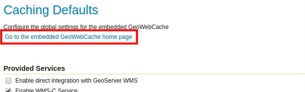

GeoWebCache on oletuksena asennettu GeoServeriin ja se hallitsee kaikkia karttatiiliä, joita jaetaan karttatiilipalvelujen kautta.

Avaa lista demoista **A list of all the layers and automatic demos**.

Kaikilla GeoServerin tasoilla on oma karttatiilipalvelu käytössä: 

Avaa **helsinki:ilmakuvat** OpenLayers **png**-esikatselu linkkiä ja selaile karttaa. Huomaat, miten eri karttatiilet lasketaan ja piirretään näyttöön sen mukaan kun palvelin saa niitä luotua.

Testaa, että karttatiilet pysyvät palvelimessa uudelleen käytettävänä siirtymällä kartalla paikasta toiseen suurin piirtein samalla kartta-alueella. Karttatiilet tulevat nyt nopeammin näkyviin, koska GeoServerin ei enää tarvitse piirtää niitä, vaan se vain välittää palvelimella jo valmiina olevia karttatiiliä.

## **Tasokohtaiset asetukset**

Tasojen karttatiiliasetukset löytyvät päävalikon **Tile Caching → Tile Layers** -näkymän kautta. Avaa **helsinki:ilmakuvat_keskusta** -tason ominaisuudet painamalla tason linkkiä taulusta. 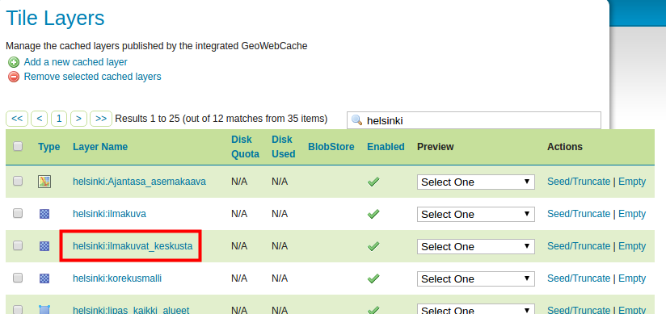

Valitse sitten **Tile Caching**.

Oletusasetukset on määritelty siten, että kaikille uusille tasoille luodaan automaattisesti karttatiilet. Myös sekä jpeg- että png-kuvatiilet ovat oletuksena aktivoituna.

Selaa vielä tämän näkymän alaosaan, josta selviää **Available gridsets** -osiosta, että kaksi eri karttatiiliruudukkoa on oletuksena käytössä: **EPSG:4326** (WGS 84) ja **EPSG:900913** (Google Mercator): 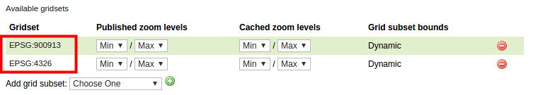

::: hint-box
Psst! Tasokohtaisia tiilitysasetuksia pääset myös muokkaamaan Data → Layers näkymän kautta valitsemalla tason ja sen jälkeen Tile Caching -välilehden.
:::

## **Karttatiilien esiluominen**

Palaa **Tile Caching → Tile Layers** näkymään. Tältä sivulta voit myös esikatsella tiilitettyjä karttapalveluita.

**Preview**-sarakkeen alta valikosta löytyy kyseiselle tasolle saatavilla olevat tiilitysvaihtoehdot. Saat aikaiseksi saman esikatselun kuin käyttäessäsi GeoWebCache:n näkymää.

**Actions**-sarakkeen alta löytyy vielä linkki **Seed/Truncate**, jolla pääse GeoWebCache:n tasojen esitiilittämiseen. **Empty**-linkillä tyhjennetään kaikki tasolle aiemmin tallennetut karttatiilet. 

Valitse nyt **Seed/Truncate** -linkki Helsingin ilmakuvien tason karttatiilien luomista varten.

**GeoWebCache**-näkymässä sivun yläosasta löytyy yleisiä toimintoja ja lista meneillään olevista tehtävistä. Karttatiilien luominen on hyvin resurssi-intensiivinen ja kohtuullisia levytiloja vaativa prosessi. On myös tyypillistä, että tehtävien eli karttatiilien luominen voi kestää hyvinkin pitkään (tunteja, jopa päiviä). Sivun tiedot päivitetään käyttämällä **Refresh list** -toimintoa. 

Tiilien luomista varten asetukset löytyvät sivun alapuolelta **Create a new task** -osiosta.

+----------------------------+----------------------------------------------------------------------------------------------+
| **Number of tasks to use** | Määrittää kuinka monta prosessia käynnistetään karttatiilien luomiseksi                      |
+----------------------------+----------------------------------------------------------------------------------------------+
| **Type of operation**      | Tiilien luomisen toimintotapa                                                                |
|                            |                                                                                              |
|                            | Reseed: luodaan kaikki karttatiilet, korvataan vanhat karttatiilet                           |
|                            |                                                                                              |
|                            | Seed: luodaan vain puuttuvat karttatiilet                                                    |
|                            |                                                                                              |
|                            | Truncate: poistetaan karttatiilet palvelimesta                                               |
+----------------------------+----------------------------------------------------------------------------------------------+
| **Grid set**               | Määrittää mille karttatiiliruudukolle luodaan karttatiilet                                   |
+----------------------------+----------------------------------------------------------------------------------------------+
| **Format**                 | Karttakuvan tiedostomuoto (esim. jpg, png)                                                   |
+----------------------------+----------------------------------------------------------------------------------------------+
| **Zoom start, Zoom stop**  | Mittakaavavälit luotavalle karttatiilille (mittakaavat on määritelty karttatiiliruudukoille) |
+----------------------------+----------------------------------------------------------------------------------------------+
| **Bounding box**           | Sijainnin suorakaiderajaus, jolta karttatiilet luodaan                                       |
+----------------------------+----------------------------------------------------------------------------------------------+

Aseta **Number of tasks to use** -asetukseksi 1.

::: hint-box
Psst! 2\*tietokoneen_suorittimien_lukumäärä on hyvä lähtökohta kokeilulle.
:::

Aseta tehtävän asetukset seuraavalla tavalla, huomaa erityisesti **Zoom stop** -asetus. Laita arvoksi 15, niin lasketaan valmiiksi mittakaavatasot 0-15:

Paina **Submit**.

GeoServer (GeoWebCache) muodostaa nyt karttatiilet valitusta palvelusta mittakaavatasoista 0--15.

Muodostamisen ajan käyttöliittymässä voi seurata karttatiilien valmistumista:

Paina **Refresh list** -linkkiä, kun haluat päivittää tiedot laskennan etenemisestä.

Karttatiiliruudukon määritelmä ja tason sijainnin rajauksen mukaan mittakaavoille 0-15 tarvitaan 1 922 karttatiiltä. Kuvien piirtäminen kestää etäpalvelimella näillä asetuksilla minuutin verran.\

Huomaa, että karttatiilet luodaan oletuksena tason sijainnin rajauksen mukaisesti (ellei sitä toisin ole määritelty). 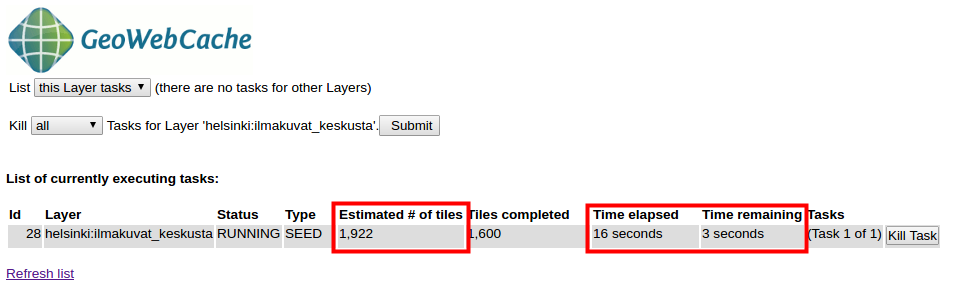

Laske vielä karttatiilet **tasolle 16** (määrittele zoomaus aloitus- ja lopputasoksi 16). Päivitä laskennan aikana sivua ja tutki karttatiilien luomisen etenemistä.\

Jos erehdyt määrittelemään vääriä asetuksia, voit pysäyttää laskennan käyttämällä **Kill all Tasks...** -toimintoa painamalla **Submit**-näppäintä. 

Taso 16 vastaa mittakaavaa 1:4 262. Kaikkiaan sen tiilittämiseen tarvitaan 3 700 karttatiiliä, joiden luomiseen menee noin pari minuuttia. Laske vielä taso 17 samalla tavalla ja kirjoita muistiinpanot prosessorimäärästä, karttatiilistä sekä ajasta.

Taso 17 näyttää kartalla tältä: 

## **Karttatiilien kovalevyn käyttö**

Edellisessä kohdassa laskettiin karttatiiliä vain yhdelle tasolle (**ilmakuvat_keskusta**), vain yhteen karttatiiliruudukkoon (**EPSG:4326**) ja vain yhdelle kuvaformaatille (**png**). Tämän karttatason mittakaavatason 16 karttatiilet vievät noin 300 MB levytilaa.

Karttatasoilla saattaa olla useita karttatiilipalveluita riippuen siitä, kuinka monta karttatiiliruudukkoa ja kuvatyyppiä on tason tiilitysasetuksissa määritelty.

Karttatiilien luominen kannattaa suunnitella etukäteen ja toteuttaa huolellisesti. Yksi tärkeä asetus karttatiilipalveluissa on karttatiilien kovalevyn käytön tarkkaileminen ja hallinnointi. Siihen on GeoWebCache:ssa erilaisia asetuksia ja osaa niistä voi säätää suoraan GeoServeristä.

Avaa **Tile Caching → Tile Layers** -näkymästä **ilmakuvat_keskusta** tason asetukset. Avaa vielä **Tile Caching** välilehti.

Sivun asetuksista voit tarkistaa, että sekä **jpeg**- että **png**-kuvaformaatit ovat rastitettuina. Sen lisäksi on määritelty **kaksi eri karttatiiliruudukkoa** käytettäväksi. Tämä tarkoittaa sitä, että tämä taso on saatavilla kuudella eri karttatiilitasolla. Äskettäin laskettiin valmiiksi karttatiiliä vain yhdelle.

Voit tarkistaa kovalevyn käytön tasokohtaisesti **Tile Caching → Tile Layers** -näkymästä. Huomaa kuitenkin, että oletusasetuksilla tämä tieto ei ole saatavilla (**N/A**). 

Tiedon näkymiseksi pitää ensin määrittää, kuinka paljon kovalevytilaa karttatiilipalvelulla on lupa käyttää. Oletuksena GeoWebCache voi käyttää koko palvelimen levytilan.

Palataan hetkeksi takaisin näkymään **Tile Caching** → **Disk Quota**. Rastita siellä **Enable disk quota** ja määrittele vielä **Maximum tile cache size** -arvoksi **2 GiB**. 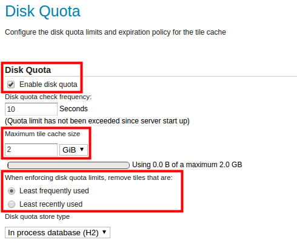

Paina lopulta **Submit**, niin asetukset tulevat tallennetuksi.

::: hint-box
Psst! Käyttöliittymässä käytetään lyhenteitä GiB ja GB. Niiden ero tulee siitä, että GiB (Gibibyte) on binäärijärjestelmä monikerta kun GB (Gigabyte) on kymmenjärjestelmä monikerta: GiB on 1024 MiB ja tavuina 230 tavua → eli 1 073 741 824 tavua GB on 1000 MB ja tavuina 109 tavua → eli 1 000 000 000 tavua
:::

Huomaa vielä, että **When enforcing disk quota limits, remove tiles that are** -asetus tarkoittaa se, että GeoServer/GeoWebCache ei lopeta karttatiilien luomista, vaikka määritelty maksimi-karttatiilien levykäyttö saavutettaisiin. Sallitun levytilan täyttymisen jälkeen palvelin alkaa poistaa automaattisesti joko vähiten tai pitkän aikaan käyttämättä olleita karttatiiliä. Karttatiiliä tuotetaan siis jatkuvasti, vaikka maksimilevytilan raja tulisikin täyteen.

Paina **Submit** ja palaa **Tile Caching → Tile Layers -**näkymään.

Tarkista, että nyt **Disk Used** -sarakkeessa näkyy tarvittavat tiedot. Ilmakuvien karttatiilet vievät tällä hetkellä alle 500 megatavua. Muut tasot eivät käytä yhtään levytilaa. 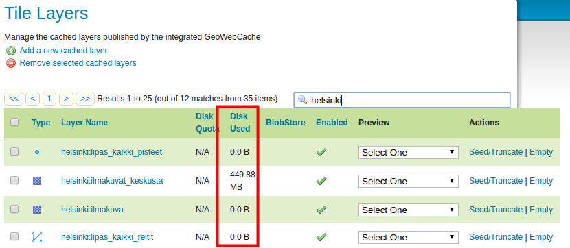

Karttatiilet tulevat myös tallennetuksi automaattisesti aina karttatiilipalvelun luodessa karttatiiliä. Kokeile esikatsella eri tasojen karttatiilitasoja (**Tile Caching** → **Tile Layers** → **Preview**). Esimerkiksi rakennukset- ja taustakartta-tasoja. 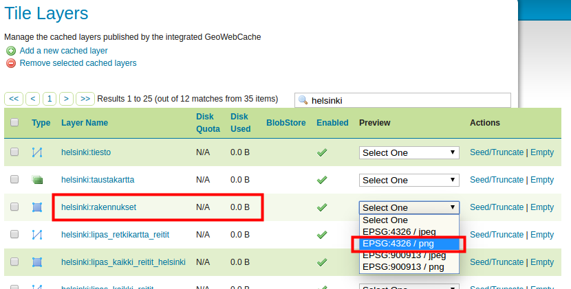

Voidaan todeta, että sen jälkeen myös niiden kohdalla **Disk Used** -sarakkeessa on tietoa levytilan käytöstä. Niiden levytilan käyttö kasvaa sitä mukaan kun eri kartta-alueita ja tiilitasoja käytetään. 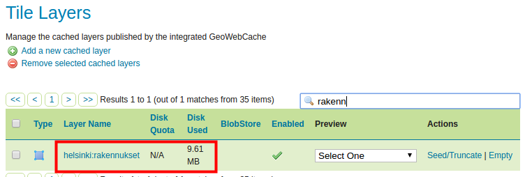

Edellisessä kohdassa laskettiin muutama karttatiilitasoja. Esimerkiksi Helsingin ilmakuvien mittakaavatason 16 karttatiilet vievät levytilaa reilut 300 megatavua.

Tasojen käyttämää levytilaa voidaan myös vapauttaa. Voit halutessasi tyhjentää tietyn tason kaikki karttatiilet käyttäen tason **Empty**-linkkiä. Kokeile tyhjentää **hki-rakennukset**-tason karttatiilet.

On mahdollista myös tyhjentää ainoastaan tietyn mittakaavan karttatiilet GeoWebCache-käyttöliittymällä: 

-   Avaa **ilmakuvat_keskusta**-tason oikealta **Seed/Truncate** ja valitse mittakaavataso 17 alku- ja loppumittakaavaksi.

-   Valitse toiminnoksi **Truncate** ja lopuksi **Submit**. Tällä tavalla poistat palvelimesta kaikki mittakaavatason 17 karttatiiltä.

-   Voit tarkistaa **Tile Layers** -näkymästä **ilmakuvat_keskusta**-tason nykyisen kovalevyn käytön.

::: hint-box
Psst! Helsingin ilmakuvien mittakaavataso 17 vaatii 1,4 GB.
:::

## **Karttatiiliruudukot**

GeoServerin oletusasennuksesta löytyy muutama valmiiksi määritelty karttatiiliruudukko. Nämä ruudukot ovat joko WGS 84 tai Web Mercator -koordinaattijärjestelmässä.

Avaa **Tile Caching → Gridsets** ja paina sitten **EPSG:4326** -nimistä ruudukkoa. 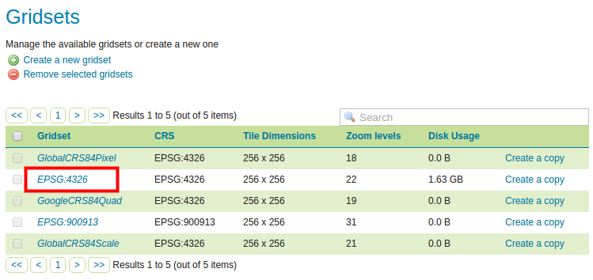

Karttatiiliruudukon määritelmiin kuuluvat muun muassa:

+---------------------------------+-----------------------------------------------------------------------------------------------------------------------------------------------------------------+
| **Coordinate Reference System** | Koordinaattijärjestelmä, jolla ruudukot määritellään.\                                                                                                          |
+---------------------------------+-----------------------------------------------------------------------------------------------------------------------------------------------------------------+
| **Gridset bounds**              | Karttalehtijaon sijainnin rajaus, jolla määritetään, mille sijainnille karttatiiliruudukko on rajattu.                                                          |
+---------------------------------+-----------------------------------------------------------------------------------------------------------------------------------------------------------------+
| **Tile Matrix Set**             | Karttatiilimalli (kuvapyramidi), jolla määritellään karttatiiliruudukolle valitut mittakaavat. Tämä voidaan määritellä joko resoluution tai mittakaavan mukaan. |
+---------------------------------+-----------------------------------------------------------------------------------------------------------------------------------------------------------------+

Karttatiiliruudukkoja voi myös laatia omiin tarpeisiin.

## **JHS180 mukainen karttatiiliruudukko**

JHS180 suosituksesta löytyy muun muassa suositus kansallisesta karttatiiliruudukosta, joka perustuu OGC-standardien määrittelyihin. Suosituksesta löytyy muun muassa seuraavat määritelmät:

+------------------------------+----------------------------------------------------------------------------------------------------------------+
| **Rajapintastandardi**       | OGC:n WMS-T standardi                                                                                          |
+------------------------------+----------------------------------------------------------------------------------------------------------------+
| **Koordinaattijärjestelmä**  | ETRS89 / TM35-FIN (EPSG:3067)                                                                                  |
+------------------------------+----------------------------------------------------------------------------------------------------------------+
| **Käytettävä origo**         | Itä -548 576 m, pohjoinen 8 388 608 m (tiilien ankkuripiste on vasen yläkulma)                                 |
+------------------------------+----------------------------------------------------------------------------------------------------------------+
| **Resoluutiotasot**          | 0.25 m, 0.5 m, 1 m, 2 m, 4 m, 8 m, 16 m, 32 m, 64 m, 128 m, 256 m, 512 m, 1 024 m, 2 048 m, 4 096 m ja 8 192 m |
+------------------------------+----------------------------------------------------------------------------------------------------------------+
| **Tiilien koko pikseleissä** | 256\*256 pikseliä                                                                                              |
+------------------------------+----------------------------------------------------------------------------------------------------------------+
| **Kuvaformaatti**            | Image/png                                                                                                      |
+------------------------------+----------------------------------------------------------------------------------------------------------------+

Näillä määritelmillä, karkeimmalla resoluutiotasolla (taso 0) on vain yksi tiilikuva kooltaan 2 097 152 m \* 2 097 152 m (8 192\*8 192 pikseliä). Tämän kuvatiilen pohjois-etelä -suuntainen keskilinja sijoittuu projektiokaistan keskimeridiaanille (27 astetta). Ja tiilen pohjoisreunan pohjoiskoordinaatti on tiilen koon monikerta päiväntasaajalta laskien (4 \* 2 097 152).

Seuraava taso (taso 1) muodostuu jakamalla 0 tason ainoa tiili neljään yhtä suureen osaan. Ja niin edelleen muodostuvat seuraavat tasot, taso 15 asti. Katso tarkemmin luentomateriaalista.

## **Uuden karttatiiliruudukon luominen**

Luodaan GeoServerin palvelimelle uusi karttatiiliruudukko JHS180-suositusten mukaisesti.

Valitse **Tile caching → Gridset** päävalikosta ja luo uusi karttatiiliruudukko painamalla **Create a new gridset**.

Anna nimeksi esimerkiksi **JHS180_EPSG3067** ja kirjoita lyhyt määritelmä ruudukosta.

Valitse **Coordinate Reference System** -arvoksi **EPSG 3067**.

Määrittele vielä ruudukon kattavuus aiemmin mainituilla JHS180 suosituksella, eli karkeamman tason kattavuus.

Suosituksissa sanotaan, että vasemman yläkulman koordinaatit (origo) ovat itäkoordinaatti **-548 576** m ja pohjoiskoordinaatti **8 388 608** m. Näitä vastaavat **Min X** ja **Max Y** koordinaatit. Karkeamman tason koko metreinä on 2097152 \* 2097152 joten:

**Max X** on sitten: -548576 + 2097152 = **1 548 576** m

**Min Y** on sitten: 8388608 -- 2097152 = **6 291 456** m

+------------------------------------------------------------------------------------------+
| **  JHS180-mukaisen ruudukon kattavuus**                                                 |
+=================================================+========================================+
| Min X: -548 576 m                               | Max X: 1 548 576 m                     |
+-------------------------------------------------+----------------------------------------+
| Min Y: 6 291 456 m                              | Max Y: 8 388 608 m                     |
+-------------------------------------------------+----------------------------------------+

Pidä tiilen pikselikoko oletuksena, **256** px.

Samat arvot löydät suosituksen mukaisesta tiiliruudukosta.

Täytä karttatiiliruudukon tiedot yllä mainituilla arvoilla, kuitenkin siten, että et käytä välilyöntejä koordinaatteja kirjoittaessasi.

Määritellään seuraavaksi resoluutiotasot. **Tile Matrix Set** -asetuksissa voit määritellä JHS180 suosituksessa mainitut **resoluutiotasot**.

Pidä valittuna **Resolutions**. Aloita määrittelemällä taso 0. 

Paina **Add zoom level** ja huomaa, että **Pixel Size** -arvoksi tulee **8 192** (pilkut numeroissa johtuvat englannin numeroformaatista), joka on juuri suosituksessa mainittu kuvatiilen pikselikoko tällä tasolla. Huomaa, että **Scale**-arvo täyttyy myös automaattisesti.

Kun painat uudelleen **Add zoom level**, uuden tason **Pixel Size** -arvo tulee automaattisesti puoleksi edellisen tason pikselikoosta, eli 4 096.

Luo loput resoluutiotasot (tasolle 15 asti) samalla tavalla.

**Tiles**-kohdalta voit tarkista kuinka monta tiiliä tarvitaan jokaisen tason puolelta.

Paina lopulta **Save**, niin uusi JHS180-karttatiiliruudukko on käytettävissä palvelimessasi.\
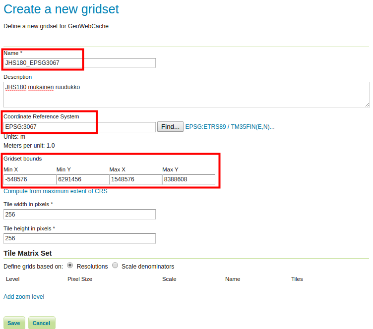

## **Suomen OpenStreetMap-tiestö**

Äskettäin luomamme karttatiiliruudukko soveltuu aineistoihin, jotka kattavat koko Suomen.

Aiemmissa harjoituksissa olet harjoitellut aineistojen käyttöönottoa GeoServerissä. Samasta jo aiemmin käytetystä **gs_training** PostGIS-tietokannasta löytyy Suomen OpenStreetMap-tiestöaineisto **EPSG 3067** -koordinaattijärjestelmässä.

Luo uusi taso tiestö-aineistosta. Suomen aineisto löytyy tietokannasta **suomi**-skeemasta nimellä **osm-tiet**.

::: hint-box
Psst! Muista, että ensin luodaan store, josta luodaan viittaus edellä mainittuun skeemaan ja sen jälkeen voidaan lisätä tasoja GeoServer-palvelimelle.
:::

**Voit katsoa ohjeita paikkatietokannat-harjoituksesta**, jossa lisättiin aineistoja GeoServeriin PostGIS-paikkatietokannasta. Voit myös kysyä tarvittaessa kouluttajalta.

Luo workspace, anna sille nimeksi **suomi**.

Luo PostGIS-store, laita se suomi-workspaceen ja nimeä se **suomi_tiesto_3067**:ksi (tietokannan nimi on **gs_training**, skeema on **suomi**, käyttäjä on **postgres** ja salasana on **gispo**).

Kyseisestä storesta löytyy ainoastaan yksi aineisto (osm-tiet). Luo siitä uusi GeoServer-taso, nimeä se **suomi_tiesto_3067**:ksi (täytä myös muuta tarvittavat tiedot).

Tarpeen vaatiessa, voit katsoa mallia alla olevasta kuvakaappauksesta PostGIS-storen luomisesta:\
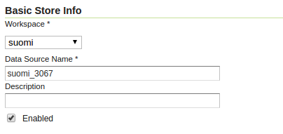 

## **Oman karttatiiliruudukon käyttöönotto**

Avaa **Tile Caching → Tile Layers** ja paina **suomi_tiesto_3067** -linkkiä. Avaa vielä **Tile Caching** -välilehti ja selaa sivun loppuun, josta löydät karttatiiliruudukko-asetukset.

Valitse **Available gridsets** -osion alta **Add grid subset** -kohdasta uusi **JHS180_EPSG3067**-karttatiiliruudukko. Paina vielä **plus**-kuvaketta.

Tarvittaessa voit määritellä, mitkä zoomaus-tasot ovat käytettävissä tai mitkä tallentuvat välimuistiin käyttäen **Published**- ja **Cached zoom levels -asetuksia**.

Paina lopulta **Save**. 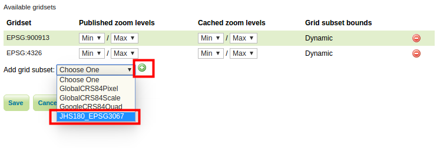

Esikatsele nyt **suomi_tiesto_3067** uudella karttatiiliruudukolla näkymästä **Tile Caching → Tile Layers**. Valitse tiestötason kohdalla **JHS180_EPSG3067/png**. 

Esikatselussa on käytössä luomasi EPSG:3067 karttatiiliruudukko (alla huomataan, kuinka käytössä ovat karttatiilet, ja kuinka Etelä-Suomea kohti mentäessä karttatiilet eivät vielä ole ehtineet renderöitymään ruudulle näytönkaappauksen ottohetkeen mennessä):

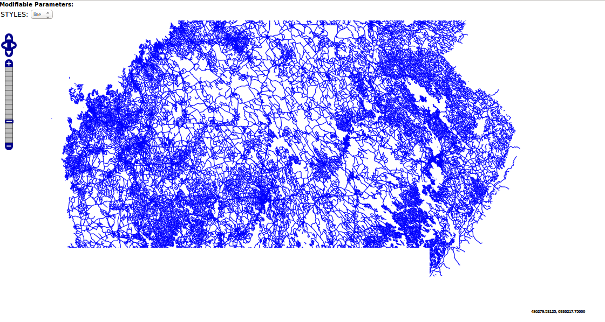

\
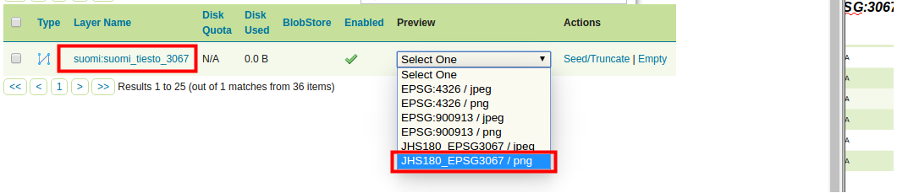

## **Paikallisen karttatiiliruudukon muodostaminen**

Geoserveriin voidaan muodostaa tarpeiden mukaan hyvin monenlaisia karttatiiliruudukoita. Joissakin tapauksissa voi olla tarpeen luoda oma paikallinen karttatiiliruudukko. Paikallisen karttatiiliruudukko voi olla tarpeellinen, jos karttatiilipalvelulle on runsaasti käyttöä ja aineistoihin halutaan yhdistää paikallisessa koordinaattijärjestelmässä olevia tietoaineistoja (vektori- tai rasteriaineistoja).

Luodaan nyt Helsingin alueelle oma karttatiiliruudukko, joka käyttää **ETRS89 / GK25FIN (EPSG:3879)** -koordinaattijärjestelmää. Määritellään resoluutiotasot mittakaavan mukaan.

Palaa **Tile Caching** → **Gridsets**-näkymään ja paina **Create a new gridset** -toimintoa. Nimeä uusi karttatiiliruudukko **HKI-GK25FIN**-nimellä.

Määrittele sitten **EPSG:3879** koordinaattijärjestelmäksi ja paina vielä **Compute from maximum extent of CRS**.

Rastita **Tile Matrix Set** -osion alta **Scale denominators** ja lisää kymmenen karttatiilitasoa (tasot 0-9) painamalla **Add zoom level**. 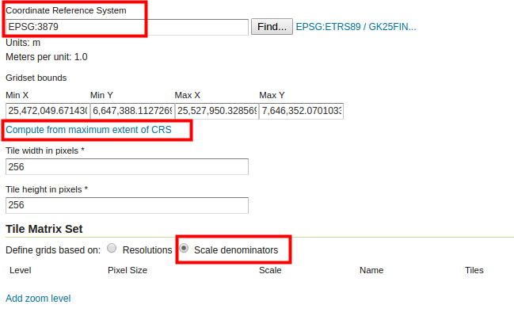

Määrittele ensimmäisen tason mittakaava käsin **Scale**-sarakkeessa, anna arvoksi 500 000. Määrittele loput: 250 000, 100 000, 50 000, 20 000, 10 000, 5 000, 2 500, 1 000 ja 500 . 

Paina lopussa **Save**.

Ota uusi karttatiiliruudukko käyttöön samalla tavalla kuin aiemmin.

Avaa **Tile Caching → Tile Layers → taustakartta → Tile Caching**. Ryhmätasoillekin voidaan määritellä karttaruudukkoja.

Selaa sivun loppuun, josta löydät tiilitysasetukset.

Valitse **Available gridsets** -osion alta **Add grid subsret** -kohdasta uusi **HKI_GK25FIN**-karttatiiliruudukko. Paina vielä **plus**-kuvaketta.

Paina lopulta **Save**.

Näkymästä **Tile Caching → Tile Layers**, esikatsele nyt **ortokartta** uudella karttatiiliruudukolla (valitse esimerkiksi **HKI_GK25FIN/jpeg**). Huomaa, että mittakaavatasoja on vain kymmenen ja ne vastaavat karttatiiliruudukon asetuksissa määriteltyjä mittakaavoja. 
