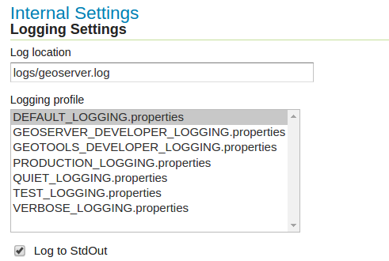

# HARJOITUS 2.3: ARKKITEHTUURI JA KÄYTTÖÖNOTTO

**Harjoituksen sisältö**

Harjoituksessa tutustutaan tarkemmin GeoServerin lokeihin ja erilaisiin asetuksiin, jotka vaikuttavat suorituskykyyn.

**Harjoituksen tavoite**

Harjoituksen jälkeen opiskelija osaa arvioida GeoServerin suorituskykyä lokien avulla ja tunnistaa erilaisia ongelmatilanteita.

**Arvioitu kesto**

30 minuuttia.

## **Valmistautuminen**

GeoServerin palvelimeen on ladattu erilaisia aineistoja ja GeoServerin **Monitor**-lisäosa on asennettu palvelimeen.

## **Yleistiedot GeoServerin palvelimesta**

Avaa GeoServerin vasemmasta palkista **About & Status → Server Status**. 

**Locks**-toiminnon kautta voit tarkistaa olemassa olevat WFS-T -aineistojen lukitukset. Voit tarvittaessa vapauttaa lukitukset painamalla **Free locks**.

**Connections**-tieto viittaa siihen, kuinka monta vektori-storea on saatavilla. 

Voit tarkistaa ja vapauttaa GeoServerin käyttämää muistia **Memory Usage** kohdalla.

## **Image Processing -asetukset**

Tarkista vielä, mitkä Java-asetukset ovat voimassa palvelimessa kuvien käsittelyä varten. Lähtökohtaisesti ei ole kovin tehokasta käsitellä kuvia kokonaisina tietokoneen muistissa. Yleisesti käytetty tapa on jakaa kuvat pienempiin osiin (tiilet/tiles) ja tehdä mahdolliset kuvaoperaattorit pienempiin kuviin. JAI-asetukset (määritelty **Image Processing** -asetuksissa) hallinnoivat näiden menetelmien toimintaa.

JAI (Java Advanced Imaging) asetuksia voit muokata **Settings → Image Processing** -näkymän kautta. 

TAULUKKO TÄHÄN DOCSISTA

Asetusten muutokset näkyvät **Server Status** -sivulla.

## **Raster Access**

Toisin kuin WMS-kuvapyynnöt, WCS-pyynnöt tuottavat mahdollisesti hyvin suuria kuvatiedostoja. Näissä tapauksissa kuvien lataaminen muistista ei ole hyvä ratkaisu, vaan olisi suotavaa käyttää väliaikaista tiedostoa.

**Raster Access** -asetukset määräävät GeoServerin toimintaa kuvapyyntöjen saapuessa. Saat asetukset näkyviin **Settings → Raster Access** -näkymästä:

+-----------------------------------------+------------------------------------------------------------------------------------------------------------------------+
|                                         | #### **Raster Access -asetukset**                                                                                      |
+-----------------------------------------+------------------------------------------------------------------------------------------------------------------------+
| **ImageIO cache memory threshold (KB)** | Tätä arvoa suurempia kuvapyyntöjä käsitellään väliaikasta tiedosto-cachea käyttäen, muuten käytetään välimuisti-cachea |
+-----------------------------------------+------------------------------------------------------------------------------------------------------------------------+
| **CPU Use**                             | Rasterikuvien luomisen aikana käytettävien prosessien asetukset                                                        |
+-----------------------------------------+------------------------------------------------------------------------------------------------------------------------+

**Server Status** -näkymän lopussa on palvelimeen liittyviä asetuksia:

+-------------------------------+---------------------------------------------------------------------------------------------------------------------------------------------------------------------------+
|                               | #### **Muut palvelimen asetukset**                                                                                                                                        |
+-------------------------------+---------------------------------------------------------------------------------------------------------------------------------------------------------------------------+
| **Update Sequence**           | Kertoo kuinka monta kertaa muutoksia on tehty palvelimen asetuksiin.                                                                                                      |
+-------------------------------+---------------------------------------------------------------------------------------------------------------------------------------------------------------------------+
| **Resource cache**            | GeoServer tallentaa store-yhteydet, ulkopuoliset kuvat sekä kohdetyyppien, fonttien ja koordinaattijärjestelmien määritykset. Tarvittaessa cachen tiedot voidaan poistaa. |
+-------------------------------+---------------------------------------------------------------------------------------------------------------------------------------------------------------------------+
| **Configuration and catalog** | Kaikki GeoServer-konfiguraation asetukset on ladattu palvelimen muistiin. Tarvittaessa niitä voidaan ladata uudelleen.                                                    |
+-------------------------------+---------------------------------------------------------------------------------------------------------------------------------------------------------------------------+

## **GeoServerin loki**

Tutustutaan GeoServerin lokin sisältöön ja sen asetuksiin suorittamalla pyyntöjä palvelimeen käyttäen esikatselun toimintoa.

Avaa erilliseen selainikkunaan jonkun tason esikatselu (**Layer Preview**) ja pidä karttaikkuna auki.

Avaa eri selainikkunaan **Settings → Global** näkymää oikeasta palkista.

Avaa kolmanteen selainikkunaan GeoServerin lokien esikatselu (**GeoServer Logs**).

Tutustu asetuksiin kouluttajan ohjauksella sekä lukemalla lisää tietoa asetuksista Geoserverin manuaalista (**Web Administration Interface → Server → Global Settings**). Avaa manuaali erilliseen selainikkunaan.

Suorita nyt muutamia toimintoja (zoom in, zoom out, pan) karttaikkunassa. 

Tarkista tuliko lokeihin mitään: paina **Refresh**, niin uusimmat rivit lokitiedostosta tuleva näkyville. Voit myös vähentää lokirivien määrää (**Maximum console lines**).

GeoServerin asennuksessa on valmiina ladattuja erilaisia loki-profiileja, jotka raportoivat erilaisia tietoja lokiin.

Voit nyt vaihtaa erilaisia lokitus profiileja ja havainnoida toimintojen aiheuttamat vaikutukset lokitiedostoihin. Kokeile asettaa profiiliksi VERBOSE_LOGGING.properties ja liikuttele karttaa. Päivitä tämän jälkeen loki (refresh) ja katso mitä rivejä lokiin on ilmestynyt.

## **REST API:n toimintaa**

GeoServerin palvelimen asetuksia on mahdollista hallita myös REST-rajapinnan kautta.

Voit tarkistaa REST-rajapinnan kautta saatavilla olevat aineistot kirjoittamalla seuraavan osoitteen web-selaimeen (käytä oman palvelimesi ip-osoitetta):

::: note-box
<http://%3Eoma-ip-osoite:8080/geoserver/rest/workspaces/>
:::

Etsi tiedot edellisissä harjoituksissa luoduista karttatasoista.

::: hint-box
Kuinka toteuttaisit uuden kuvaustekniikan tallentamisen GeoServeriin REST-rajapinnan avulla?
:::

::: hint-box
Psst! Tutustu REST API:n kuvaukseen GeoServerin ohjeessa.
:::

## **Monitor-lisäosan käyttö**

GeoServerin **Monitor**-lisäosa on valmiiksi asennettu koulutus palvelimiin ja se näkyy päävalikosta alapuolelta.

Avaa **Monitor → Activity**.

Kokeile esikatsella eri tasoja ja katso sen jälkeen **Monitor → Activity → Daily**-osiosta järjestelmän aktiviteettigrafiikkaa, jonka pitäisi näyttää seuraavanlaiselta:  
