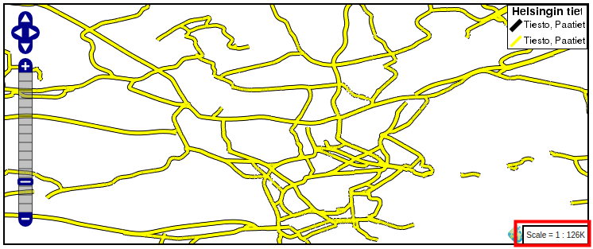
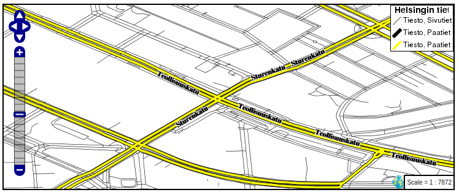

# HARJOITUS 2.4: CSS-KUVAUSTEKNIIKKA

**Harjoituksen sisältö**

Harjoituksessa käsitellään eri aineistoille sovellettavia kuvaustekniikoita ja hyödynnetään CSS-tyylejä karttojen visualisoinnissa.

**Harjoituksen tavoite**

Harjoituksen jälkeen opiskelija osaa hyödyntää peruskuvaustekniikoita GeoServerillä eri aineistojen visualisointiin käyttäen CSS-kieltä.

**Arvioitu kesto**

40 minuuttia.

## **Valmistautuminen**

Erilaisia aineistoja on ladattu GeoServer-palvelimelle. CSS-lisäosa on asennettu GeoServeriin.

## **CSS-tyylit**

Kun CSS-lisäosa on asennettu, voidaan kirjoittaa kuvaustekniikkatyylejä CSS-kielellä, joka SLD-kieleen verrattuna on käyttäjäystävällisempi tapa muokata kuvaustekniikkaa.

Lisäosa toimii niin, että CSS-kielellä kirjoitettava koodi kääntyy SLD-kieleksi automaattisesti.

## **Tyylin luominen**

Luodaan nyt uusi tyyli **tiesto**-tasolle.

Avaa päävalikosta **Styles** ja paina **Add a new style**.

Määrittele uuden tyylin nimeksi **tiesto_css** ja jätä workspace-kohta tyhjäksi.

Valitse **Style Content** valikosta geometriatyypiksi **Line** ja paina **Generate**.

**Style Editor** -laatikossa on nyt seuraavankaltainen teksti:

::: code-box
/\* \@title red line \*/\
\* {\
    stroke: #ff3300;\
}\
:::

Paina **Submit**. Avaa **Styles**-valikosta juuri luomasi tyyli ja valitse **Layer Preview** -välilehti. Valitse esikatseltavaksi tasoksi tiestötaso.

Lähennä karttaa siten, että tiet alkavat näkyä kunnolla.

Pystyt muokkaamaan CSS-koodia myös **Layer Preview** -välilehdellä. Huomaa merkki "**\***". Se tarkoittaa, että sääntö koskee kaikkia kohteita (samoin kuin \*-merkki esimerkiksi tiedostojen listauksessa komentoriviltä). 

Vaihda nyt **stroke**-komennon arvoksi **blue**.

::: code-box
\* { stroke: blue;
:::

Paina **Apply** ja esikatsele karttaa. Nyt tiet näkyvät kartassa sinisinä.

## **Aineiston luokittelu**

Luokitellaan nyt tiet kahteen luokkaan: **päätiet** ja **muut**. Kullekin luokalle voidaan määritellä oma tyyli.

Päätiet luokitellaan korvaamalla merkki "**\***" seuraavalla koodilla (huomaa, että rajauksessa käytetään **type**-kentän tietoja):

::: code-box
[type = 'motorway' or type = 'primary' or type = 'secondary' or type = 'trunk']\
{ stroke: red;}
:::

Paina **Apply**. Nyt vain päätiet ovat näkyvissä.

Luo nyt tyyli muille teille.

Muokkaa CSS-tyyliä vielä seuraavasti:

Kopioi pääteiden luokitus-koodi ja laita se koodilaatikon loppuun.

Korvaa "**=**"-merkki "**eri kuin**"-merkillä "**\<\>**", niin tulee määrittelyksi tiet, jotka eivät kuulu edelliseen luokitukseen, eli toisin sanoen pienemmät tiet.

Vaihda vielä "**or**"-komento "**and**"-komennoksi. 

Kopioi sitten vielä edellisen CSS-tyylin koodinpätkä (aaltosulut ja niiden sisällä oleva koodi) ja liitä kopioitu koodi muiden teiden luokittelu-osion jälkeen.

Vaihda muiden teiden tyyli niin, että viivan väri on musta (black).

Pääteiden ja muiden teiden tyylit näyttävät nyt tältä:

::: code-box
[type = 'motorway' or type = 'primary' or type = 'secondary' or type = 'trunk']\
{ stroke: red;}\
[type \<\> 'motorway' and type \<\> 'primary' and type \<\> 'secondary' and type \<\> 'trunk']\
{ stroke: black;}\
:::

Esikatsele nyt tulos painamalla **Apply**.

## **Tyylin virittäminen**

Tiet ovat vielä vaikea erottaa toisistaan. Tehdään nyt pari parannusta tyyliin. Määrittele pääteiden viivan paksuus 0.5:ksi komennolla "**stroke-width**". Lisää uusi rivi "**stroke: red;**"-kohdan jälkeen, johon kirjoitetaan "**stroke-width: 0.5;**".

Määrittele samalla tavalla muille teille viivan paksuudeksi **0.1**:

::: code-box
[type = 'motorway' or type = 'primary' or type = 'secondary' or type = 'trunk']\
{ stroke: red;\
stroke-width: 0.5;}\
[type \<\> 'motorway' and type \<\> 'primary' and type \<\> 'secondary' and type \<\> 'trunk']\
{ stroke: black;\
stroke-width: 0.1;}\
:::

Paina sitten **Apply** niin esikatselu päivittyy: päätiet ja pienemmät tiet erottuvat paremmin.

Kokeile seuraavaksi lisätä seuraava CSS-koodi, jonka avulla luodaan **pääteille** selkeämpi visualisointityyli.

Poista vanha "**stroke**"-määrittely ensin. Tarkoituksena on visualisoida pääteitä keltaisen ja mustan viivan avulla siten, että keltainen viiva on kapeampi ja jää mustan viivan päälle.  Pyydä kouluttajalta apua tarvittaessa ja korvaa pääteiden tyyli seuraavalla koodilla CSS-tyylien muokkaustilassa:

::: code-box
stroke: black, yellow;\
stroke-width: 5px, 3px;\
z-index: 0, 3;
:::

Huomaa, että tällä tavalla määrittelet pääteille päällekkäiset tyylit, jotka muodostavat monimutkaisempia visualisointeja.

Paina vielä **Submit** ja visualisoi lopputulos:

**Z-index** -komennolla määritellään, missä järjestyksessä eri tyylit piirtyvät. Indeksin arvolla 0 viitataan mustaan viivaan, jonka paksuus määritellään viiteen pikseliin. Indeksin arvo kolme viittaa keltaiseen viivaan , jonka paksuus on kolme pikseliä. Huomaa, kuinka Z-indeksin pienemmät arvot piirtyvät ensin ja suuremmat arvot myöhemmin.

::: hint-box
Psst! Huomaa, että esikatselun selite ei ymmärrä näitä monimutkaisia tyylejä oikein. Työkalu vaatii kehitystä, mutta nopeaa esikatselua varten kartta on riittävän hyvä.
:::

Kokeile vaihtaa symbolien järjestystä, värejä ja paksuuksia.

Koodisi näyttäisi tässä vaiheessa tältä:

::: code-box
 [type = 'motorway' or type = 'primary' or type = 'secondary' or type = 'trunk']\
     { stroke: black, yellow;\
     stroke-width: 5px, 3px;\
     z-index: 0, 3;}\
\
 [type \<\> 'motorway' and type \<\> 'primary' and type \<\> 'secondary' and type \<\> 'trunk']\
     { stroke: black;\
     stroke-width: 0.1;}\
:::

## **Luokkien nimeäminen**

Lisätehtävänä voit muokata selitteen tekstejä (Legend) CSS-kielellä. Eri tasojen selitteen teksti määritellään "**/\* \@title**"-avaus ja "**\*/**"-sulkukomennoilla, ja ne sijoitetaan ennen hakasulkujen sisään asetettuja tasomäärityksiä seuraavalla tavalla. Tämän avulla saadaan nimet näkymään esikatselukartan selitteessä, ja samalla koodin lukeminen helpottuu.

Laita pääteiden määrittelyn eteen **/\* \@title Paatiet \*/**:

::: code-box
 /\* \@title Paatiet \*/\
 [type = 'motorway' or type = 'primary' or type = 'secondary' or type = 'trunk']\
     {stroke: black, yellow;\
     stroke-width: 5px, 3px;\
     z-index: 0, 3;}\
:::

Laita myös **/\* \@title Sivutiet \*/**: sivuteiden määrittelyn eteen samalla tavalla.

Lisää vielä koodin loppuun seuraava koodi: 

::: code-box
/\* \@title Tiesto \*/ \* { font-family: Helvetica; }
:::

Edellä esitetty ja viimeinen taso/koodi määrittää "**\***"-merkin toimesta kokonaisvaltaisia CSS-tyylisääntöjä, joissa tässä on määritelty "**Tiesto**"-etuliite symboliikan teksteihin ja **Helvetica**-tyyli kartan tekstityksiin.

Paina nyt **Apply**, jolloin kartta päivittyy.

Koodisi tässä vaiheessa pitäisi näyttää jotenkin tältä:

::: code-box
 /\* \@title Paatiet \*/\
 [type = 'motorway' or type = 'primary' or type = 'secondary' or type = 'trunk']\
     { stroke: black, yellow;\
     stroke-width: 5px, 3px;\
     z-index: 0, 3;}\
\
 /\* \@title Sivutiet \*/\
 [type \<\> 'motorway' and type \<\> 'primary' and type \<\> 'secondary' and type \<\> 'trunk']\
     { stroke: black;\
     stroke-width: 0.1;}\
\
 /\* \@title Tiesto \*/\
  \* { font-family: Helvetica;}\
:::

## **Mittakaavaperusteinen näkyvyys**

Laitetaan vielä pätkä koodia, jonka avulla määrittelemme muille teille mittakaavaperusteinen rajaus, jotta ne eivät näkyisi kaikilla zoomaus-tasoilla:

Laita pienempien teiden tyylin eteen:

::: code-box
[\@scale \< 50000]
:::

Paina **Apply**.

Nyt muut tiet näkyvät vain, jos **zoom**-taso on tarkempi kuin **1:50 000**. Ja kun zoomataan kauemmaksi, niin vain päätiet näkyvät kartalla: 

Koodisi tässä vaiheessa pitäisi näyttää jotenkin tältä:

::: code-box
 /\* \@title Paatiet \*/

 [type = 'motorway' or type = 'primary' or type = 'secondary' or type = 'trunk']

     { stroke: black, yellow;

     stroke-width: 5px, 3px;

     z-index: 0, 3;}

\

 /\* \@title Sivutiet \*/

 [\@scale \< 50000]

 [type \<\> 'motorway' and type \<\> 'primary' and type \<\> 'secondary' and type \<\> 'trunk']

     { stroke: black;

     stroke-width: 0.1;}

\

 /\* \@title Tiesto \*/ 

 \* { font-family: Helvetica;}
:::

## **Tekstityksen lisääminen**

Lisätään nyt tekstit teille. 

Avaa **Layer Attributes** -välilehti ja tarkista, että muun muassa **name**-sarake löytyy listalta. Ota se käyttöön lisäämällä **label**-komento pääteiden koodiin:

::: code-box
label: [name];
:::

Muuta vielä tekstien kirjaimia:

::: code-box
font-weight: bold; font-fill: black; font-size: 12;
:::

Esikatsele tuloksia painamalla **Apply**.

Tulos ei ole vielä hyvä, tarvitaan muutama teksteihin tarkoitettu erikoiskomento:

::: code-box
-gt-label-follow-line: true; -gt-label-max-angle-delta: 90; -gt-label-max-displacement: 400; -gt-label-repeat: 150;
:::

**-gt-label-\*** kertoo, miten tekstit eli labelit piirretään. Kokeile muuttaa edellisten komentojen arvoja.

Lisää vielä puskuri teksteille:

::: code-box
halo-color: white; halo-radius: 1;
:::

Voit määritellä pienemmille teille myös nimiöt samalla tavalla kun äsken tehtiin pääteille.

Tässä on esimerkkikoodi, jossa kaikki aiemmin mainitut tyylit ovat käytössä:

::: code-box

/\* \@title Paatiet \*/

[type = 'motorway' or type = 'primary' or type = 'secondary' or type = 'trunk']

{ stroke: black, yellow;

stroke-width: 5px, 3px;

z-index: 0, 3;

label: [name];

font-weight: bold;

font-fill: black;

font-size: 12;

-gt-label-follow-line: true;

-gt-label-max-angle-delta: 90;

-gt-label-max-displacement: 400;

-gt-label-repeat: 150;

halo-color: white;

halo-radius: 1;}

\

/\* \@title Sivutiet \*/

[\@scale \< 50000]

[type \<\> 'motorway' and type \<\> 'primary' and type \<\> 'secondary' and type \<\> 'trunk']

{ stroke: black;

stroke-width: 0.1;

label: [name];

font-fill: black;

font-size: 9;

-gt-label-follow-line: true;

-gt-label-max-angle-delta: 90;

-gt-label-max-displacement: 400;

-gt-label-repeat: 150;

halo-color: white;

halo-radius: 1;}

\

/\* \@title Tiesto \*/ 

\* { font-family: Helvetica;}

:::

Tämän tyylin esikatselu näyttää kartassa tältä:

Voit vielä kokeilla erilaisia komentoja virittämään karttasi tyyliä pidemmälle. GeoServer CSS-lisäosan nettisivuilla löytyy ohjeita ja esimerkkejä: http://docs.geoserver.org/stable/en/user/extensions/css/index.html.

## **Kuvaustekniikan soveltaminen**

Avaa **Publishing**-välilehti ja aseta ruksi **Default**-sarakkeeseen tiestötason kohdalle. Paina vielä **Apply** asettaaksesi luomasi tyylin tiestötason oletustyyliksi. Tarkista **Data → Layers → tiesto → Publishing**-sivulta, että oletustyyli tälle tasolle on nyt **tiesto_css**.

Voit vielä tehdä tyylipäivitykset **taustakartta**-tasolle. Avaa **Data → Layer Groups → taustakartta**, ja varmista, että **Layers**-taulussa **Default Style** on rastitettu kaikille tasoille. Paina lopuksi **Save**.

Esikatsele **taustakartta**-taso. Lopputulos näyttää tältä:

