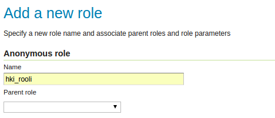
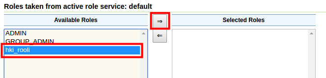
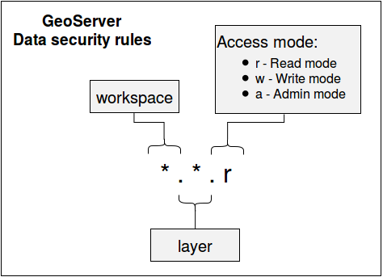
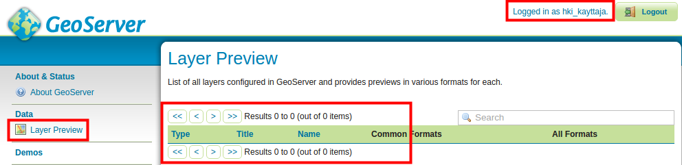
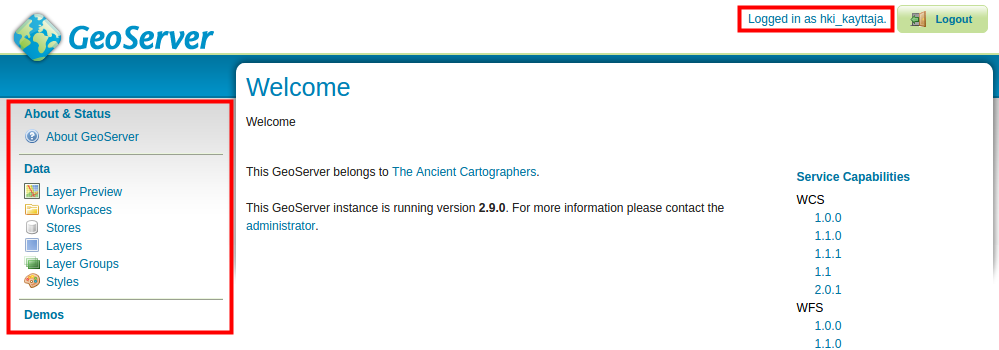
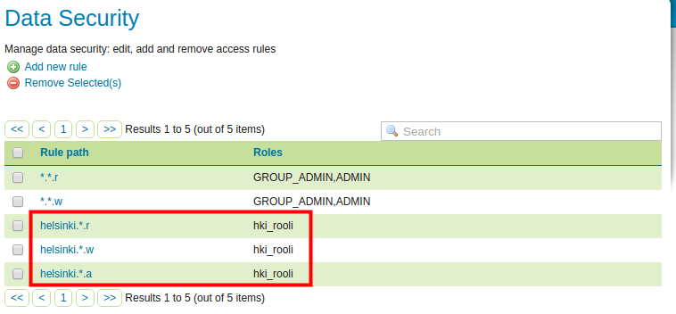
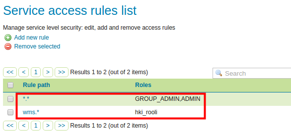

# HARJOITUS 2.5: PÄÄSYNHALLINTA

**Harjoituksen sisältö**

Harjoituksessa tutustutaan erilaisiin turvallisuusasetuksiin ja luodaan käyttäjiä ja rooleja. Asetetaan käyttöoikeuksia palveluille, aineistoille ja käyttäjille.

**Harjoituksen tavoite**

Harjoituksen jälkeen opiskelija osaa asettaa palvelimen perusasetuksia, luoda käyttäjiä ja rooleja. Opiskelija osaa myös asettaa käyttöoikeuksia palveluille ja aineistoille.

**Arvioitu kesto**

40 minuuttia.

## **GeoServerin yleiset turvallisuusasetukset**

Avaa **Security → Settings**. Tässä näkymässä voit määritellä yleisesti käytössä olevia turvallisuusasetuksia.

Tässä näkymässä voidaan myös määrittää, mikä **Active role service** (roolipalvelu) on käytössä. GeoServer sallii valittavaksi vain yhden roolipalvelumuodon palvelimelle. Roolipalvelu  sisältää kaikki palvelimen käyttäjä-, ryhmä- ja roolisäännöt. Pidetään **default-**roolipalvelu käytössä.

**Encryption**-kohdan alta löytyy salaukseen liittyviä asetuksia. **Encrypt web admin URL parameter** -valinta salaa käyttäjäliittymän URL-parametreja selaimella.

Esimerkiksi, **Security**-valikon selaimen URL (missä nyt ollaan)... 

... ilman salausta on:

::: note-box
<http://localhost:8080/geoserver/web/?wicket:bookmarkablePage=:org.geoserver.security.web.SecuritySettingsPage>
:::

... salauksen kanssa se on:

::: note-box
<http://localhost:8080/geoserver/web/?x=xAiOmyK-CQmBXDhILZrWpny28bhFcImLrBRYk0INwrBDmbzQlmeLRdiaRoNSaBSx3o6elVC9JMPcy5gkRljLXMKGrvMx3Yui3*ANGkUW-hE>
:::

Huomaa, että palvelimessa ei ole asennettu Java policy -tiedostoja, joten vahvaa salausta ei voida ottaa käyttöön.

::: hint-box
Psst! Java policy -tiedostojen asennus riippuu siitä, mikä Java ohjelmisto on palvelimessa asennettu. Jos asennettu on Open JDK, niin policy-tiedostot on oletuksena asennettu ja Strong cryptography käytössä. Jos taas asennetaan Oracle Java (joka on aikaisemmin ollut GeoServerin suositus) niin täytyy ladata Oraclen JCE policy jars ja purkaa ne JRE_HOME/lib/security -kansioon, jonka jälkeen Strong cryptography on käytössä.
:::

**Password encryption** määrittää, mikä salauksen tyyli on käytössä salasanojen varastossa: **Plain text**, **Weak PBE** ja **Strong PBE**.

Pidä **Weak PBE** ja paina **Save**.

## **Tunnistautuminen**

**Authentication**-asetusten (tunnistautuminen) kautta määritellään, miten GeoServer kerää käyttäjätunnuksia ja verifioi niitä.

Oletuksena GeoServerin asetukset sallivat palvelimen käytön (eli WMS-, WFS- ja WCS-palvelujen käytön) ilman mitään käyttäjätunnusta. Voit tarkistaa tämän seuraavasti.

Esikatsele tasoa **ilmakuvat_keskusta** samalla tavalla kuin aiemmin muita tasoja. Taso aukeaa selaimella ongelmitta, koska olet kirjautunut **admin**-tunnuksella.  Älä sulje esikatselusivua vielä.

Mene nyt takaisin GeoServerin ylläpitosivulle ja paina **Logout**.

Palaa esikatselusivulle ja lataa sivu uudelleen painamalla F5. Sivu latautuu edelleen normaalisti.

Muutetaan asetuksia nyt niin, että palvelujen käyttö vaatii käyttäjältä tunnistautumisen, eivätkä kirjautumattomat käyttäjät pysty enää käyttämään palveluja. Avaa taas **Security → Authentication**, etsi **Filter Chains** ja paina **default**-linkkiä.

Valitse nyt **Chain filters** -kohdasta, **Selected**-laatikosta **anonymous** ja siirrä se **Available**-laatikkoon käyttäen laatikkojen välistä löytyviä siirtonuolia. Anonymous-tunnistautumistyyli sallii palveluiden käytön tunnistautumattomille käyttäjille.

Nyt ainoastaan **basic**-tunnistautumisen tyyli on Selected-laatikossa eli käytössä. Tämä tarkoittaa sitä, että jatkossa tarvitaan aina tunnus ja salasana palvelimen käyttöön.

Paina nyt **Close** ja pääset takaisin **Authentication** valikkoon. Paina sitten **Save**, niin muutokset tulevat voimaan.

Jos kirjaudut nyt ulos GeoServeristä ja päivität aiemmin avattua esikatselusivua uudelleen, tunnuksella ja salasanalla tunnistautuminen on pakollista.

::: hint-box
Psst! Palvelimen pääsynhallinnan asetuksia voi helpoiten testata käyttämällä eri web-selainta (Internet Explorer / FireFox / Chrome) tai selaimen yksityisyyden salaavaa toimintoa (Incognito-mode) normaalin selaimen rinnalla. Toisella selaimella ollaan kirjautuneet ylläpitäjän tunnuksilla (kuten tähän asti) ja toisella kokeillaan erilaisia kirjautumistiloja. Voit kysyä opastusta kouluttajalta tarvittaessa. Huomaa, että mahdollisesti sinun täytyy kirjautua ulos ja uudelleen sisään asetusten uudelleen lataamista varten.
:::

## **Uuden roolin ja käyttäjän luominen**

GeoServerin pääsynhallinnassa keskeisessä asemassa ovat käyttäjä-, ryhmä- ja rooliasetukset.

Luodaan nyt uusi käyttäjä, jolla on vain oikeuksia käsitellä **helsinki**-workspace:n aineistoa.

Avaa päävalikosta **Security → Users**, **Groups, and Roles**.

**Services**-välilehdestä löytyvät käyttäjien ja roolien pääsynhallinnan asetukset. Niihin tallennetaan tietoja siitä, ketkä käyttäjät kuuluvat mihinkin ryhmään tai mitä rooleja on ylipäätänsä määritelty pääsynhallinnassa.

Listalla on GeoServerin luomia **default**-asetuksia. Käytetään niitä nyt hyväksi.

Luodaan ensin rooli, johon uusi käyttäjä tulee kuulumaan.

::: hint-box
Psst! Pääsynhallinnan hallinnoimisen helpottamiseksi, oikeudet määritellään roolikohtaisesti.
:::

Avaa **Roles**-välilehti ja paina **Add new role**, anna uudelle roolille nimeksi **hki_rooli**.

Paina sitten **Save**.

Luodaan nyt uusi käyttäjä. Avaa **Users/Groups** -välilehti.

Huomaa, että täällä on määritelty **admin**-tunnus, jota olet käyttänyt koulutuksen aikana.

Luo uusi käyttäjä painamalla **Add new user**.

Laita käyttäjän nimeksi **hki_kayttaja** ja salasanaksi **hki-kayttaja**.

::: hint-box
Psst! Huomaa, että erikoismerkit ja ääkköset ovat sallittuja GeoServerissä, mutta tarkoituksenmukaisuuden ja eri selainten välisten erojen vuoksi tässä koulutuksessa vältetään niiden käyttöä.
:::

Uudelle käyttäjälle annetaan oikeuksia määrittämällä mitä rooleja käyttäjällä on. Roolit on määritelty **Roles taken from active role service: default** -kohdassa. Siinä on valittavissa muun muassa **hki_rooli**, lisää se **Selected Roles** -laatikkoon käyttäen laatikkojen välistä löytyviä siirtonuolia.

Paina sitten **Save**,niin uusi käyttäjä **hki_kayttaja** on luotu ja sillä on oikeudet **hki_rooli**:nmukaisesti. Koska **hki_rooli**:lle ei vielä ole määritelty oikeuksia, niin uudella käyttäjälläkään ei ole vielä määritelty mitään oikeuksia.

Kokeile uuden käyttäjän oikeudet kirjautumalla sisään uudella käyttäjätunnuksella. Voit joko kirjautua uudestaan tai käyttämällä toista selainta, kuten aikaisemmin on mainittu.

## **Aineiston käyttöoikeuksien rajoittaminen**

Avaa **Security → Data.** Tässä näkymässä näkyvät GeoServer-palvelimen käyttäjille (rooleille) määritetyt säännöt. Oletusasennuksessa vain kaksi sääntöä on määritelty eli luku (r) ja kirjoitusoikeudet (w):

**Rule path** -sarakkeen alla olevat säännöt ovat muodoltaan **\*.\*.r**, joka antaa lukemisoikeudet kaikille tasoille kaikissa workspace:ssa.

Huomaa vielä, että **Roles**-sarakkeen alla on määritelty, mille rooleille oikeudet on myönnetty. Tässä on määritelty **\***-merkillä, joka tarkoittaa "kaikki roolit".

Seuraava kuva esittää GeoServerin aineistosääntöjen määrittelyä:

Sääntö koostu kolmesta osasta, pisteellä eroteltuina. Ensimmäinen osa määrittelee workspacen, jolla sääntö on voimassa. Toinen osa määrittelee tason (layer), jolla sääntö on voimassa. Kolmas ja viimeinen osa määrittelee, mikä toiminto sallitaan. Toimintoja on kolme: lukeminen (r = read), kirjoittaminen (w = write) ja ylläpitäminen (a = admin).

::: hint-box
Psst! Kaikissa osissa voidaan käyttää myös \*-merkkiä, jolla voidaan viitata kaikkiin workspaceihin, tasoihin tai oikeuksiin.
:::

Paina listalta **\*.\*.r**.

Tässä säännössä määritellään, että kaikkiin workspace:ihin ja kaikkiin tasoihin on lukemisoikeus.

**Roles**-osion alla on määritelty se, että tämä sääntö kuuluu kaikille rooleille (**Grant access to any role**). Huomaa, että **Grant access to any role** on rastittu, joten kaikki roolit voivat lukea kaikki tasoja kaikista workspace:sta.

Rajoitetaan nyt sääntöä vain ylläpitäjien rooleille.

Rastita pois **Grant access to any role** ja lisää roolit **Admin** ja **GROUP_ADMIN** laatikkoon **Selected Roles**.

Paina lopuksi **Save**.

Tee lopuksi samat muutokset **\*.\*.w** -säännölle.

Näiden muutosten jälkeen, vain **Admin**-tunnuksella on lukemis- ja esikatseluoikeudet.

Kokeile nyt esikatsella jotain aineistoja **hki_kayttaja**-tunnuksella, yhtään aineistoa ei ole tarjolla.

## **Aineiston käyttäjäkohtaiset käyttöoikeudet**

Seuraavaksi määritellään **hki_kayttaja**-tunnukselle luku- ja kirjoitusoikeudet **helsinki**-workspace:en. Käytännössä pitää määritellä oikeudet roolille johon käyttäjä kuuluu, eli **hki_rooli**-roolille.

Tähän asti **hki_rooli**:lle ei ole annettu vielä mitään oikeuksia, täten **hki_kayttaja**:llä ei ole enää oikeuksia mihinkään aineistoon (ellei joku sääntö on määritelty kaikille rooleille käyttäen **\***-merkkiä).

Lisätään nyt **hki_kayttaja**:lle **Read**- ja **Write**-käyttöoikeudet, mutta vain **helsinki-**workspace:en. Tämä tapahtuu määrittämällä lisää aineiston sääntöjä.

::: hint-box
Psst! Varmista, että olet kirjautunut ylläpitäjänä (tunnus: admin ja salasana: gispo).
:::

Avaa taas **Security → Data** ja lisää nyt kaksi uutta sääntöä käyttäen **Add new rule** -valintaa.

Laita **Workspace**-kohtaan **helsinki** ja jätä **Layer**-arvoksi "**\***", joka viittaa kaikkiin tasoihin.

Aseta **Access mode** -valikkoon arvoksi **Read**, joka antaa lukemisoikeudet edellä määrätyille aineistoihin.

Siirrä lopulta **hki_rooli** laatikosta **Available Roles**, laatikkoon **Selected Roles**.

Paina lopuksi **Save**. 

Nyt **hki_kayttaja**:llä on read-oikeudet kaikkiin helsinki workspace:n tasoihin.

Lisää samalla tavalla vielä **Write**. Kirjoitusoikeudet sallivat käyttäjälle aineistojen muokkausoikeudet aina kun se on sallittu GeoServerissa, esimerkiksi WFS-T-palvelun kautta.

Kokeile uudelleen esikatsella aineistoja **hki_kayttaja**-tunnuksella. Esikatselu on mahdollista nyt kaikkien **helsinki**-workspacen tasojen kanssa, mutta muut tasot eivät näy.

Huomaa, että käyttäjällä ei ole kuitenkaan oikeuksia lisätä GeoServeriin uusia aineistoja tai tasoja. Voit antaa **hki_kayttaja**-tunnukselle **Admin**-oikeudet määrittämällä vielä ylläpitäjän oikeudet.

Loppujen lopuksi on luotu kolme uutta sääntöä, jotka ovat **hki_rooli**:lla voimassa.

Kirjaudu uudelleen palvelimelle käyttäen **hki_kayttaja**-tunnusta ja tarkista, että **helsinki**-workspacen tasot ovat käytettävissä ja aineiston ylläpitäminenkin onnistuu. Huomaa, että muut workspacet eivät näy lainkaan.\

## **Karttapalvelukohtaiset oikeudet**

Kirjaudu **admin**-tunnuksella uudelleen Geoserver palvelimelle.

Samalla tavalla kuin äsken määriteltiin käyttäjäkohtaisesti oikeudet yhdelle workspace:lle, voidaan asettaa oikeudet palvelukohtaisesti eri käyttäjille.

Avaa **Security → Services**. Määriteltynä on oletuksena vain yksi sääntö **\*.\***. Samalla tavalla kuin aiemmin, tämä tarkoittaa se, että kaikki palvelujen toiminnot (säännön toinen **\***-merkki) ovat käytettävissä kaikissa palveluissa (säännön ensimmäinen **\***-merkki).

Seuraava kuva esittää GeoServerin palvelusääntöjen määrittelyä:

Avaa sääntö **\*.\*** ja rajoita sen käyttöä vain ylläpitäjille.

Paina **Save**. Nyt GeoServerin palvelut ovat käytettävissä ainoastaan ylläpito-rooleille.

Luo sen jälkeen sääntö, joka on käytössä vain **hki_rooli**:lle ja sillä on oikeudet käyttää kaikkia **WMS-karttapalvelujen** toimintoja.

::: hint-box
Psst! Huomaa, että säännöt eivät välttämättä tule voimaan kuin vasta käyttäjän seuraavalla istunnolla.
:::

Lopussa **Service access rules list** -näkymä näyttää tältä:

Kirjaudu taas **hki_kayttaja**:nä ja kokeile esikatsella jotain aineistoa sekä WMS- että WFS-karttapalveluna. WFS-esikatselu ei enää onnistu, koska kyseisellä käyttäjällä ei ole oikeuksia WFS-toimintoihin, vain WMS-toimintoihin. 

Poista lopuksi edellisessä kuvassa näkyvä sääntö (wms.\*), jotta wms-palvelu olisi taas käytettävissä kaikilla käyttäjillä.
