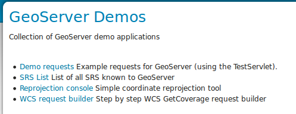
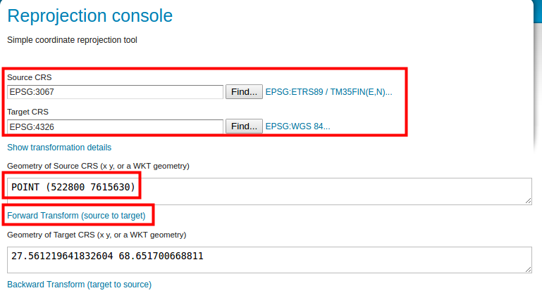
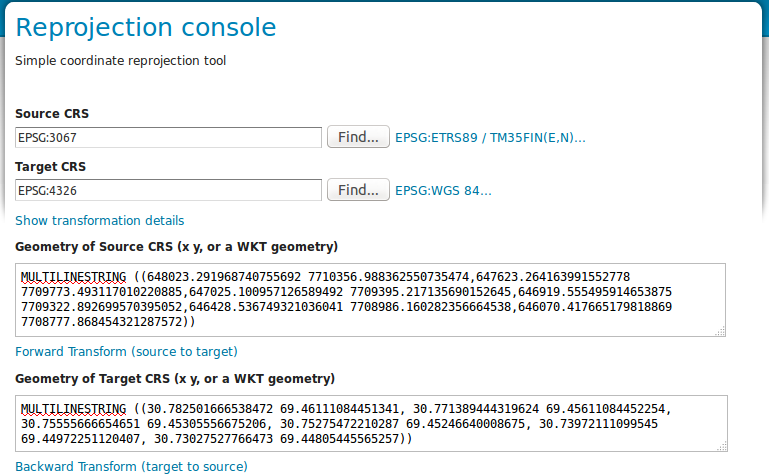

# EXERCISE 1.1: INSTALLATION AND COMMISSIONING

**Content of the exercise**

The existing GeoServer server is accessed via a web browser. We learn how to edit the server's general information and how to set the administrator's user profile information (ID and password).

**The aim of the exercise**

After the exercise, the student will be able to log into GeoServer as an administrator and have a general knowledge of its user interface.

**Estimated duration**

40 minutes.

## **Preparation**

Start a web browser on your computer and log in at:

::: note-box
<http://localhost:8080/geoserver>
:::

If you are using a remote server, ask your teacher for your ip address and port. Then edit the network address according to the instructions in the **localhost:8080** section.

In front of you is the GeoServer interface. Before you log in, you will see some general information about the server.

**In the middle (1)** is general information about the server and its owner/operator (these will be updated soon). In the middle is the version number of the installed GeoServer, which is 2.23.2 in the picture. This is the start page of the GeoServer server and can always be accessed by pressing the **GeoServer-logo** from the top left.

By default, the centre displays details of the options in the sidebar on the left (hereafter "main menu" (2)).

The **Main menu (2)** is used to manage and view the server's functions.

The **Top bar (3)** contains login information and the GeoServer logo, which always takes you to the home page.

The **sidebar (4)** on the right side shows the map services and their versions supported by the server in the home screen.

## **Main menu**

The main menu has only a few functions visible on the start page. These are visible to anyone who knows the server address (URL).

-   The **About & Status** section provides only the **About GeoServer** option, which provides more detailed information about the GeoServer installation and links to GeoServer documentation. You can also check the version information of GeoTools and GeoWebCache software on this page.

-   In the **Data** section there is a **Layer Preview** option to preview the layers published on the server.

-   The **Demos** section allows you to learn more about the fuctionality of a few types of map services.

Take a brief look at them now, and ask the tariner what the different elements mean.

### **About GeoServer**

Open **About GeoServer** and check which version of GeoServer you have and which versions of other software you have installed. This type of information is important for troubleshooting server problems, whether you are solving the problem yourself or with the help of a support service.

### **Layer Preview**

Try **Layer Preview function** and preview the default GeoServer datasets. This view will be used frequently during the course. Now take a few minutes to learn its basic functionality.

### **Service Capabilities**

Press **GeoServer-logo** to return to the main server page. On the right hand side you will find the **Service Capabilities bar**.

Before logging in to the server, you can see which interface services can be published by the GeoServer installation you are using.

By default, WCS, WFS, WMS, TMS, WMS-C and WMTS are installed on the GeoServer of the exercise. Other interface services, such as the WPS service, can be published to GeoServer via extensions. By pressing the version numbers on the interface services, you can access their capabilities.

This sidebar is only visible on the home page. Remember that you can always access the home page by pressing the GeoServer logo.

### **Demos**

Under this menu you will find some of GeoServer's test tools:\

### **Demo requests**

Try out the results of different queries (functionalities) and see what each query command produces. Test the functionality of the **WMS_getMap_OpenLayers.url** query by selecting the query by selecting the query from the menu and pressing **Submit**.

The different functions and operations of GeoServer are composed of parameters related to the URL. The parameters control the interface services of the GeoServer: which map layer to query, which region to retrieve data from or generate an image of, the coordinate system of the response etc.

Edit the query parameters BBOX, WIDTH and HEIGHT. What effect do the changes have on the response?

## **SRS List ja Reprojection console**

The SRS List function lists the coordinate systems supported by GeoServer. GeoServer contains most of the coordinate system used, the CRSs (Coordinate Reference System). SRS (Spatial Reference System) is a synonym for CRS.

You can experiment with tarnsformations and conversions between coordinate systems using the Reprojection Console.

The coordinates are presented in WKT format (Well Known Text).

The following figure shows the point geometry defined in WKT format in the EPSG:3067 coordinate system **POINT (522800 7615630)**:

You can also try ETRS89/TM35FIN line geometry. You can find the example file in the training folder as **esimerkki_wkt_geometry_3067.txt**. Open it in a text editor and use it in the **Reprojection console** tool. Try converting it to, for example, WGS 84.

## **WCS request builder**

This feature allows you to test the functionality of the Web Coverage Service.

Download **nurc:mosaic** data as PNG file in the Finnish national coordinate system (**ETRS89/TM35FIN** (EPSG 3067)). Leave the other settings as default:

Press **Get Coverage** at the end.
