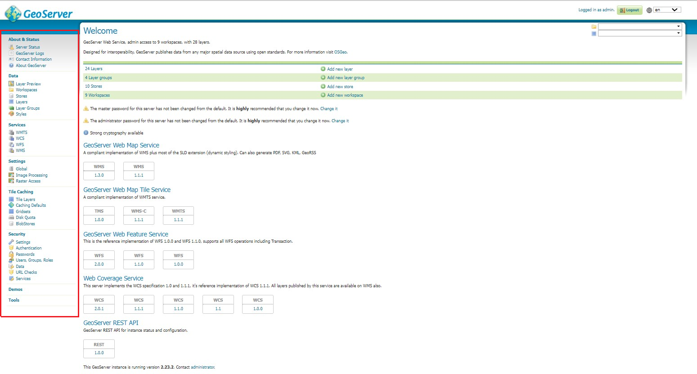
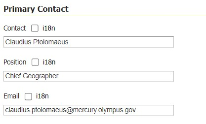
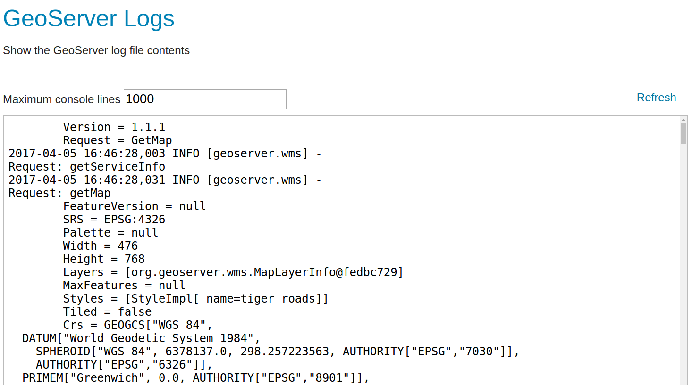
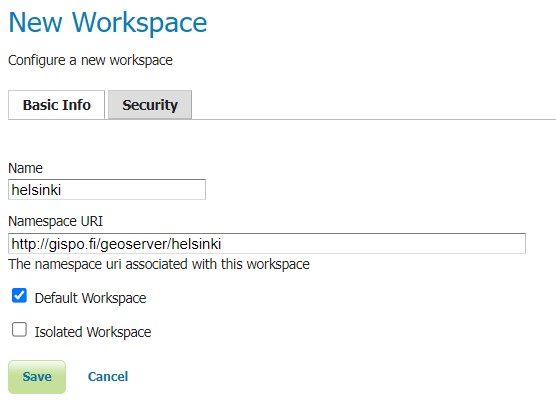
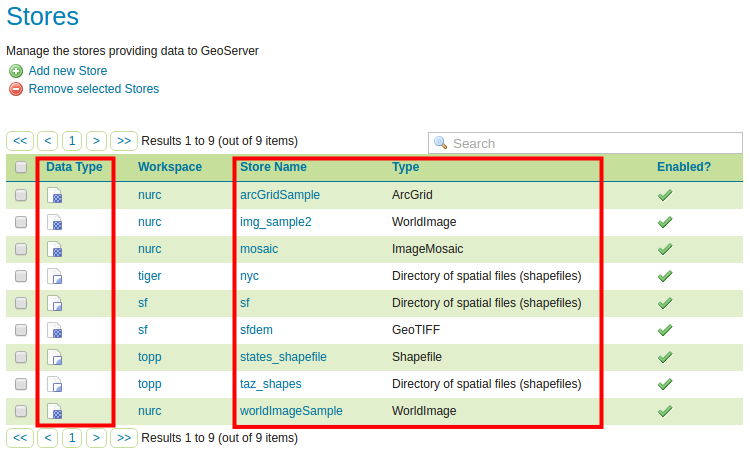
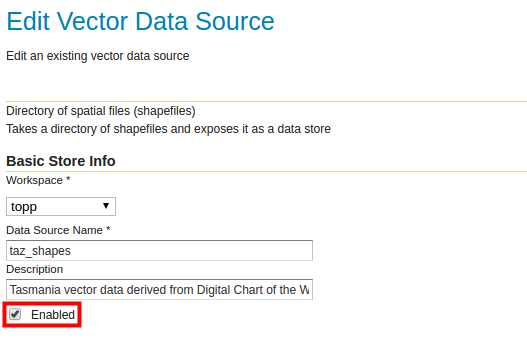

# Exercise 1.2: GeoServer web interface

**Content of the exercise**

The exercise will introduce you to the main functions of GeoServer through the user interface. The main options and main features of the different sections of the interface will be discussed.

**Aim of the exercise**

After the exercise, the student will understand how GeoServer works and the management tools of the different sections.

**Estimated duration**

35 minutes.

## **Preparation**

In the previous exercise, we went thorugh some of the menus in the GeoServer web interface. Accessing these menus and functions did not require a login. In this exercise, we will log in to the GeoServer web interface as administrators, which will open up more menus and functions.

## **Administrator interface**

Until now, the interface has only displayed the functionalities and resources open to all (without authentication). These can be restricted on a per-user basis through different access control settings. The basics of access control will be introduced later in the course.

Now log in to the server using **admin** as ID and **gispo** as password.

::: hint-box
Psst! The default password for GeoServer is 'geoserver', but for training purposes this has been changed for security reasons.
:::

The administrator view is similar to the interface we just saw. The structure is the same but there is much more functionality and information available.

The GeoServer functions in the main menu are grouped according to their purpose:

+--------------------------+-----------------------------------------------------------------------------------+
| ##### **About & Status** | General information about GeoServer installation and status                       |
+--------------------------+-----------------------------------------------------------------------------------+
| ##### **Data**           | Includes data download, configuration and styling functions \|                    |
+--------------------------+-----------------------------------------------------------------------------------+
| ##### **Services**       | The menu allows you to define the properties of different spatial data services\| |
+--------------------------+-----------------------------------------------------------------------------------+
| ##### **Tile Caching**   | Settings for map tile services \|                                                 |
+--------------------------+-----------------------------------------------------------------------------------+
| ##### **Security**       | Settings related to the access control \|                                         |
+--------------------------+-----------------------------------------------------------------------------------+
| ##### **Demos**          | Demo functions for testing GeoServer services\|                                   |
+--------------------------+-----------------------------------------------------------------------------------+
| ##### **Tools**          | Additional server tools \|                                                        |
+--------------------------+-----------------------------------------------------------------------------------+

In addition to these, GeoServer extensions can add menus to the user interface.

**Main Menu** now features new menus and functionality. 

The menus that have been recently reviewed have also changed their format. They now contain more information and offer the possibility to edit various data and settings.

::: hint-box
Psst! Note that now the middle part of the interface also says "No Strong cryptography available...". Depending on the installation, enabling strong cryptography functionality may require a separate installation (Java policy jar files).
:::

## **Master and Administrator users**

The default GeoServer setup has two user profiles, **master** and **admin**. The passwords have been changed from the default as follows:

**Master** →  gispogispo

**Admin** →   gispo

::: hint-box
Psst! The difference between master and admin users is that the admin user is intended to be used to manage the web interface. For editing the server settings themselves, the master user is used, who has access to manage the GeoServer root settings both directly on the server and via the web interface. Avoid using these credentials when maintaining production servers.
:::

The passwords of these users can be changed if necessary using the access management tools (**Security** menu).

## **About & Status settings**

### **Contact Information**

Let's start by updating your contact details. Select **About & Status → Contact Information** from the main menu.

Fill in at least the fields **Contact**, **Organization** and **Email** with your own data.

To return to the **Welcome** screen, you can always press the **GeoServer-logo** at the top left of the page.

### **Server Status**

The Server Status page provides information about the various settings and status of the GeoServer For example, note the location of the **Data directory** folder.

In your notes (last page of the exercise), write the location of your server's **Data directory**.\

### **GeoServer Logs**

The GeoServer Logs options allows you to view the server logs. 

## **Data menu**

This menu contains the main functions of GeoServer. Data sets are added and defined using these functions. Also the preview of the data is done using the functions in here. Note the connections between the menu and the data organization shown in the image.

**Styles** defines for the layers (**Layers**) the styling technique, the visualization. 

**Styles** (styling technique) is always used when layers are published as WMS service. The styling technique is not dependent on the layers: the same styling technique can be used on several layers and they can have several optional styling techniques.

### **Layer Preview**

This menu allows you to preview map layers published on GeoServer.

The default installation of GeoServer includes a few demo layers that can be used and previewed immediately.

The output of the layers can be raster or vector, the format is described by these icons:

  Raster

  Point (vector)                                   Polygon (vector)

  Line (vector)                                   Layer group

The layer preview opens as an OpenLayers map window in a new browser window. Note that the **OpenLayers** preview of the data uses a styling technique that is defined as the default on GeoServer. More information on this topic will be provided later.

Using the drop-down menu (**Select one**), you can also download this layer in different file formats (GeoTIFF, csv, shapefile\...).

### **Workspaces**

**Workspace** is GeoServer's way of storing and organizing references to data (**Stores**). The data itself is stored in a directory (or database) to which GeoServer has access rights.

Typically, similar data and/or data from the same source are kept in the same workspace. For example, an organisation's data can be organised by theme in a workspace (environment, zoning, population, health, etc.)

Open the **Workspaces** menu, some workspaces are already created for GeoServer:

Press **Add new workspace**.

Create a new workspace that will be used for the training, name it **helsinki** and write in the **Namespace URI** field [**http://gispo.fi/geoserver/helsinki**](http://gispo.fi/geoserver/helsinki):

Check **Default Workspace**, so in the future the workspace you just created will be the default when adding data and layers to GeoServer.

If you check **Isolated Workspace** choice the content of the workspace will not be available via the default GeoServer service endpoint (<https://geoserver-url/geoserver>).

::: hint-box
Psst! URI (Uniform Resource Identifier) is a text that defines the name of a particular resource. It can be a web address or even a relative directory on a hard drive.
:::

Press **Save** and you have now added a new workspace to GeoServer.

Open the workspace you just created by clicking on **helsinki** workspace under the **Workspace Name** and you will see that more choices are now available. We will return to these later when adjusting the workspace-specific settings.

Return to the **Workspace** view by pressing **Cancel**.

Workspaces can be deleted by selecting one or more workspaces and pressing **Remove selected workspace(s)**.

### **Stores**

The GeoServer refers to data sources using **Stores**. Data sources can be individual files, groups of files, directories, databases or interface services.

By default, **Store** references to example data are provided:

Next to each Store is an icon indicating the type of data:

Take a look at some of the settings in the store. For example, **sfdem** refers to raster data (note the icon) and **taz_shapes** refers to vector data.

Open sfdem-store and taz_shapes-store. Write down the answers to the following questions in your notes:

::: hint-box
What data does sfdem-store refer to?
:::

::: hint-box
What data does taz_shapes-store refer to?
:::

Note that [**file:data/**](file:data/){.uri} refers to the GeoServer Data Directory. The location of the directory on the disk system can be found via the **About & Status → Server Status** menu.

Store **taz_shapes** refers to a directory containing multiple vector files, in this case .shp files.

Open the **taz_shapes**-store again and notice that **Enabled** is checked in the settings. This determines whether the material is available from the server or not.

In other words, if you want to pevent access to some data via GeoServer, all you have to do is leave **Enabled** unchecked in either the layer, store or even workspace menu.\

### **Layers**

Layers (**Layers**) define the publishing porperties of a single data source (**Store**), such as styling technique, coordinate system, metadata, service properties, tile caching specifications, etc.

One layer corresponds to one piece of data. Material can be published in several different layers, for example with different styling techniques etc.

In the **Layers** view it is possible to edit, add or delete layers. In the **Layers** view, the table shows a few layers and their names (**Name**). The table also shows the title of the layer (**Title**) and the **Store** where the data is located.

The **Enabled** column shows whether the layer is available from the server or not. Note that the availability can be set for the whole store (i.e. the data source) or separately for the layers (the data views). The native coordinate system of the layer is also indicated in the table, **Native SRS**.

Open the **Manhattan (NY) landmarks** layer settings view by pressing the layer title (**Title**) or name (**Name**) in the column. 

The layer settings are extensive and are therefore divided into **Data**, **Publishing**, **Dimensions** and **Tile Caching** tabs. 

Now take a look at the settings in the different tabs to get an idea of how layers are defined in GeoServer. Discuss them with the trainer.

We will look at the layer settings in more detail later when we add our own data to GeoServer.

## **Layer Groups**

**Layer Groups** function is used to create layer groups. Layer Groups are used to create map layers that are combination of several map layers. Both map layers and layer groups can be added to layer groups. Among other things, the order of layers and styling techniques can be specified in the layer group settings.

## **Styles**

Open the **Styles** menu, you will see a list of styling techniques available on GeoServer.

Open the **giant_polygon** style and learn about the imagery format used by GeoServer. The layer descriptor is defined using the Styled Layer Descriptor (SLD) language.

Styling is a very broad subject; it will be covered separately later. The implementation of this technique can be facilitated by using the CSS extesion, which will also be covered later on the training.

The general settings for Geoserver interface services (WFS, WMS and WCS) are defined through the **Services** menu; these will be explained in more detail later.

## **Settings**

This menu contains various settings such as:

|                                      |                                                                               |
|--------------------------------------|-------------------------------------------------------------------------------|
| **Global**                           | Interface services settings and log settings \|                               |
| **Image Processing & Raster Access** | Settings for processing images and raw image data (coverage) on the server \| |

## **Tile Caching**

This menu is used to define the settings for tile caching services. The tile services will be explained in more detail later.

## **Security**

This menu contains the settings related to access control in GeoServer. Note that access control, among other things, can be configured on a per-user, per-group, per-role, per-subject and per-service basis. Now take a look at the **Users**, **Groups, and Roles** menu.

Access control will be discussed in more detail later.
