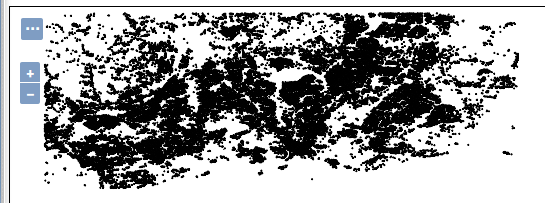

# Exercise 1.3: VECTOR DATA

**Content of the lecture**

This exercise adds vector data to the GeoServer server and configures the layer settings for publishing to the WFS service.

**The aim of the exercise**

After the exercise, the student will be able to add vector data and make the necessary settings to publish the data.

**Estimated duration**

40 minutes.

## **Preparation**

All training materials are in the GeoServer data directory **/data/koulutus/**. You can check its location on your server in the **Server Status** view. The location is in the **Data directory** field; new data can be added there if necessary. 

The materials used in the exercise are uploaded to the servers in use.

The GeoServer data directory contains not only spatial data but also other data, such as map styles and layer group definitions. More specifically, the geospatial data sets for this course are located in the training machine folder: 

::: note-box
/var/lib/tomcat8/webapps/geoserver/data/koulutus/
:::

::: hint-box
Psst! Error messages when adding files are often related to file and directory access rights.
:::

Make sure that the training folder and all subfolders and files in it are owned by the tomcat8 user by running the following command on the command line:

::: commandline-box
sudo chown -R tomcat8:tomcat8 /var/lib/tomcat8/webapps/geoserver/data/koulutus
:::

The **password for the training machine is gispo**.

## **Creating vector data store**

The training material includes OpenStreetMap buildings of Helsinki in the shapefile format **buildings.shp**, which is now added to GeoServer.

Since the format of the data is **shapefile**, a **store** compatible with the shapefile format must be created for it.

From the main menu, select **Stores** and then press **Add new Store**.

Select Shapefile as the data format in the **New data source** view, under**Vector Data Sources**.

In the next view, you can configure the other settings of the store you just created, such as the name and file locations. Name them as follows:

-   **Choose** helsinki as a workspace

-   **Name** data hki_buildings

-   **Add** a description to the data if you wish, for example "Helsinki OpenStreetMap buildings"

The next step is to define which data (shape file) is referenced by this store. Edit **Connection Parameters**:

-   Press **Browse...** and browse to the file: **/koulutus/Helsinki.osm.shp/buildings.shp**

Keep **Enabled** checked to ensure that the store (and the layers created from it) are available from the GeoServer server. This option can be used if you want to hide some data from users without removing it from the server (administrators can still access it).

Check again that the **DBF charset** value is **UTF-8**.

The rest of the settings can be kept as defaults.

Press **Save** to save the store to GeoServer and make it available for future use.

After creating a store, GeoServer assumes that you want to publish a new layer and therefore the **New Layer** view opens automatically.

Press **Publish** to publish the layer.

## **Publishing vector layer**

Let's create and publish a new layer now. If you haven't done so yet, press **Publish** to change the properties of the layer to be published.

::: hint-box
Psst! If you left the previous view, you can access the same Create a new layer view from the main menu Layers \> Add a new layer and select the desired store (in our case helsinki:hki_buildings).
:::

The layer publishing features are divided into five tabs:

-   **Data**

-   **Publishing**

-   **Dimensions**

-   **Tile Caching**

-   **Security**

## **Data settings**

Let's now focus on the options in the **Data** tab. Define the general information as follows:

-   **Keep** Enabled and Advertised checked

-   **Name** data buildings

-   **Headline** Helsinki OpenStreetMap buildings

**Add** an explanation of the layer and keywords related to the layer if you want. These keywords make it easier for Geoserver administrators and users to find the spatial data sets they need.

### **Coordinate Reference Systems**

Scroll down until you find **Coordinate Reference Systems**. Here you define the coordinate system for the layer.

When new data is imported into GeoServer, it will try to identify the EPSG code of the original coordinate system. If the identification fails, the **Native SRS** field will be set to **UNKNOWN** and on its right side you will find a link to get the information to find out the original coordinate system of the data.

In this case, the project data comes from the .prj file of the shapefile. Click on the **GCS_WGS_1984...** link to open the project data.

::: hint-box
Psst! Please note that the Native SRS data is for preview purposes only. The data comes directly from the settings of the original data, e.g. shapefile or PostGIS coordinate system data. Therefore, they cannot be edited in the GeoServer browser through the interface.
:::

Enter **EPSG:4326** code in the **Declared SRS** field. You can also search for EPSG codes using the **Find** function.

Keep the default value of **SRS handling** (**Force declared**) unchanged.

### **Bounding Boxes**

Please fill in the **Bounding Boxes** below with information on the extent of the data.

::: hint-box
Psst! It would be possible to set the extent automatically, but GeoServer requires that this setting is done in a controlled way. The reason is that with large datasets, the server could get stuck for a long time calculating the extent of the layers. The request could even fail if the server timeout setting was exceeded, making it difficult to add data.
:::

The data for the exercise is small enough that we can use automatic specification. First press **Native Bounding Box → Compute from data** and then **Lat/Lon Bounding Box → Compute from native bounds**.

### **Feature Type Details**

At the end of the **Data** view, you will find **Feature Type Details**, which shows the vector data feature details and their types.

Other features of the release will be looked at later. Now press **Save** and the data is available from GeoServer. Check that the new layer **Buildings** is in the list of layers.

::: hint-box
Psst! You can use the "search" function to filter the view.
:::

Now open the **Layer Preview** view, which allows you to preview the **Buildings** layer in the same way you have previously previewed other demo data.

::: hint-box
Psst! Note that in the Layer Preview view (and also in the Layer view) the layer name is preceded by the workspace name. The name of the Helsinki Buildings layer is therefore helsinki:buildings.
:::

OpenLayers preview looks like this: 

Zoom in on the map and press on a building to see its properties.

## **Add Helsinki road network**

Now add the OpenStreetMap Helsinki road network to GeoServer in the same way as in the previous exercise. The data can be found in the same folder as the **buildings** data, under the name **roads.shp**.

Remember that before you can add a layer to GeoServer, you need to create a store for it. Name the new store **hki_roads** and the layer created from it **roads** so the layer names remain similar. Remember to also correct the coordinate system (**EPSG:4326**) and **DBF charset** (**UTF-8**).
