# Exercise 1.4: Basics of styling (SLD)

**Content of the exercise**

This exercise will cover the styling techniques applicable to different data sets and will use SLD styles to visualize maps.

**Aim of the exercise**

After the exercise, the student will be able to use basic styling techniques on GeoServer to visualise different data using the SLD language.

**Estimated duration**

40 minutes.

## **Preparation**

Start a web browser on your computer and log in at:

::: note-box
<http://localhost:8080/geoserver>
:::

In the previous exercises, a layer **Buildings** has been created on the GeoServer server. In this exercise a styling technique will be created for this layer.

## **GeoServer styling technique**

WMS services visualize map images in GeoServer using predefined styling techniques. Until now, we have used the default stylings whenever we added new data, for example when we previewed a layer.

From the main menu, open the **Layers** view and the **Buildings** layer. Then open the **Publishing** tab. 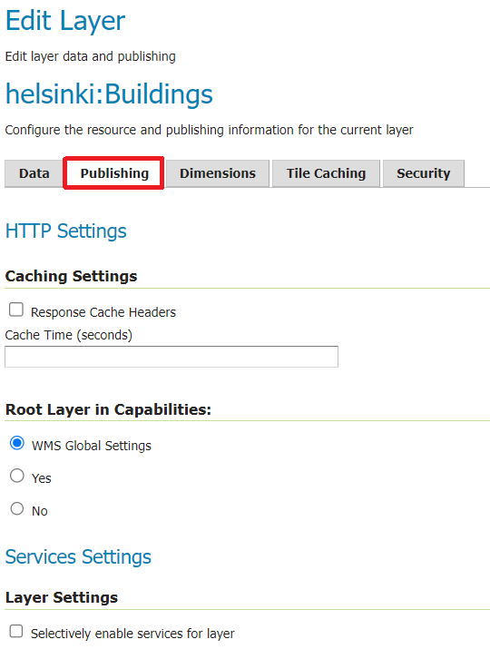

Note that under **WMS Settings**, you will find the **Default Style** menu with **polygon** style selected.

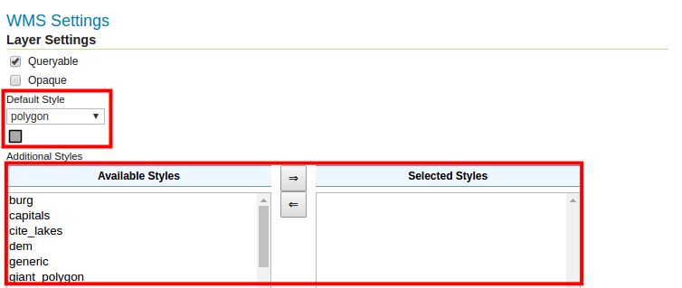

## **SLD-styling**

GeoServer styles are defined by the **Styled Layer Descriptor** (SLD), which is an XML language.

Exit the layer view and open the **Data → Styles** view from the main menu. This view defines the styles (styling techniques) used in the WMS map layers.

The list has twenty styles ready to go, which come with the GeoServer installation. First, let's see what the polygon style used by the **buildings** layer looks like. Open it by pressing the **polygon** button.

Note that **Format** is **SLD**. Now look at the style code: it is similar to the HTML code of a web page. In it, you can identify, among other things, the **\<Fill\>** and **\<Stroke\>** tags, which define the fill and border colors of a polygon.

You can test the functionality of the code with **Validate** and preview the legend with **Preview legend**.

Press **Cancel** to return to the **Styles** view.

## **Creating a new style**

Let's now develop our own styling technique for the Helsinki Buildings data.

In the **Data → Styles** view, add a new SLD style by pressing **Add a new style**.

Give the new style a name **default_polygon**. Select workspace **helsinki**.

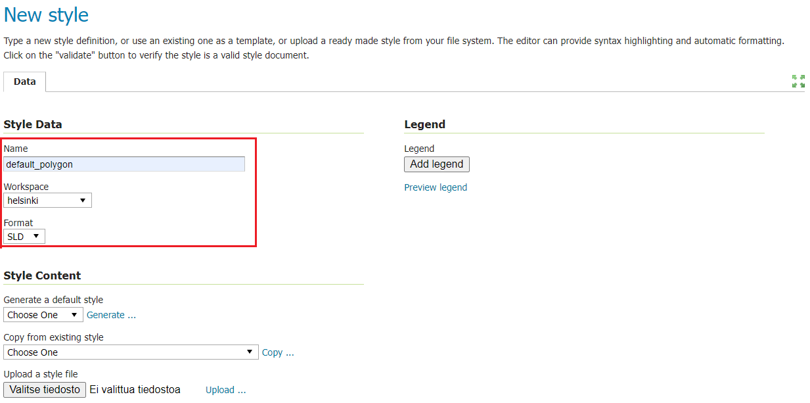

To make it easier to start writing your own styles, the default GeoServer styles can be chosen as a template for filling in the SLD code field, or an existing style can be copied.

Select **Polygon** from the **Generate a default style** drop-down menu, then press **Generate...**

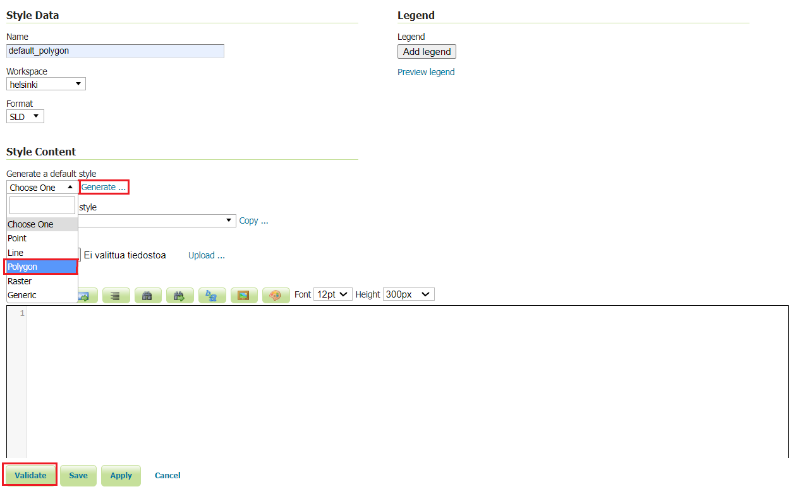

You can now test the SLD code with the **Validate** function. Successful testing is indicated by a message at the top of the page.

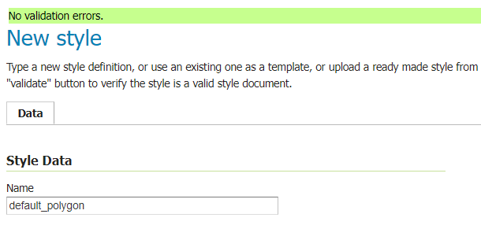

Save the changes by pressing **Submit** first.

## **Deployment of SLD styling technique**

Once a new style has been created, we can use it to visualise the data, for example to show buildings on a map of Helsinki. To do this, we tell GeoServer which style to use to draw the **buildings** layer.

Open the edit view of the **Buildings** layer from the main menu **Data → Layers**. 

On the **Publishing** tab, select a new **default_polygon** style from the **Default Style** menu.

Then press **Save**.

From the **Data → Layer Preview** view, you can now preview the **buildings** layer, the new style is now enabled.

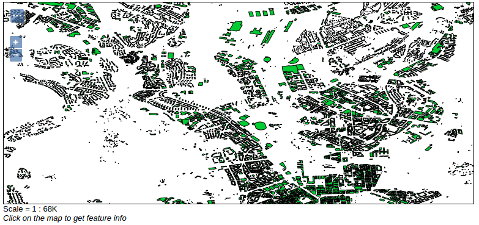

## **SLD Cookbook**

You can find out more about writing SLD styles on the SLD Cookbook website. The SLD Cookbook is part of GeoServer online documentation and contains various examples of styling techniques.

Let's use an example from the **SLD Cookbook** as a basis for our new style.

In a new browser window, open GeoServer SLD Cookbook from the link below (or you can Google "geoserver sld cookbook" in your browser). Look for **Polygon with styled label** and click on it:

::: note-box
<http://docs.geoserver.org/stable/en/user/styling/sld/cookbook/>
:::

You will find a short presentation of the styling technique and the SLD code. Take a brief look at the code and try to find the most important elements (tags) such as polygon line and fill colours and font definitions for texts. You can write notes on the most important elements and definitions on the last page of the exercise.

In the example **\<Stroke\\\>** code, the color and thickness of the border line is specified.

The **\<TextSymbolizer\>** contains text properties, i.e. labels (names of map objects, e.g. streets), such as **\<Label\>**, which defines the field/column to be used for texts from the property data.

In addition to the standard SLD language, this model code includes two GeoServer proprietary plugins that are used in SLD to place texts. You can identify such sections of the code by the **\<VendorOption\...\>** tags.

On the sample SLD styles page, find the **View and download the full "Polygon with styled label" SLD** link, open it in a new window and save the page as an .sld file, using the browser's save as function. Give the file a name that you will remember later (for example polygon_polygonwithstyledlabel.sld).

Now return to the GeoServer interface and click **Browse** under the code box. Find the newly uploaded SLD style on the disk and press **Upload**

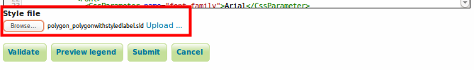

Give the new style the name **buildings**. Select **helsinki** as workspace.

::: hint-box
Psst! Note that if you had previously specified a style name and workspace, GeoServer may overwrite them when you upload the .sld file.
:::

You can now test the SLD code with the **Validate** function. You can preview the legend of map labels by pressing **Preview legend**.

Modify the SLD style of the polygon as follows:

-   **Filling colour** (PolygonSymbolizer → FILL) to pink (#FFCC99)

-   **Boundary line colour** (PolygonSymbolizer → Stroke) to black (#000000)

-   **Boundary line thickness** 0.5

-   **Set** on the first line encoding="UTF-8"

::: hint-box
Psst! Note that in GeoServer only dot "." is used as a decimal separator. This is valid for all GeoServer settings.
:::

Then press **Submit** first to save the changes.

Finally, change the **Buildings** layer to **Buildings** style (**Data → Layers → Buildings → Publishing**).

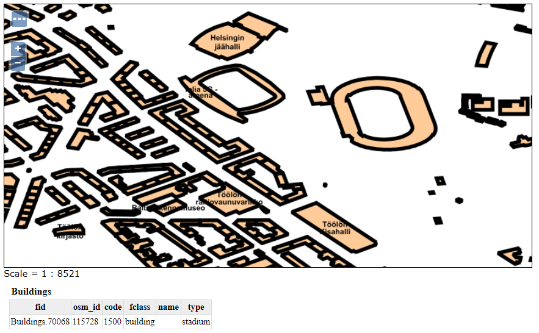

## **Editing SLD styling technique**

Add a buffer (halo) to the text to make it easier to read.

Return to the **Styles** view and select the **Buildings** style again. In the SLD code, remove the **\<TextSymbolizer\>** tag:

::: code-box
\<Fill\>\
   \<CssParameter name="fill"\>#000000\</CssParameter\>\
\</Fill\>\
:::

and replace it with:

::: code-box
\<Halo\>\
   \<Radius\>3\</Radius\>\
    \<Fill\>\
        \<CssParameter name="fill"\>#FFFFFF\</CssParameter\>\
    \</Fill\>\
\</Halo\>
:::

The SLD code in the window looks like this:

Then press **Validate**.

If you get error messages or the code does not work, ask the trainer for help. Otherwise, press **Submit** to save the style.

The updated style is immediately available on the server and can be previewed using the **buildings** layer. You can update the browser window by pressing the **F5** key or **CTRL+R** keys.

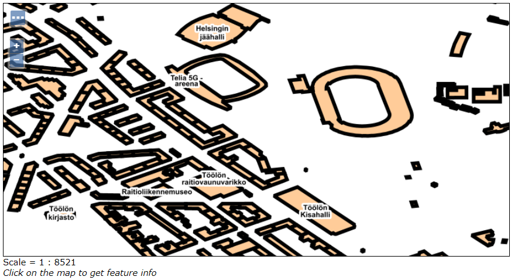

Visit <http://colorbrewer2.org/> to learn about different visualisation styles and choose the right colours for your visualisation.

## **Create a road style**

Now create a new style that will be used to describe the road.

In the same way as before, take advantage of the existing style in GeoServer. The **Tiger_roads** style is suitable for describing roads. Preview the tiger_roads style.

Streets are shown as wide white strips when the map is zoomed in enough. Next, let's do a similar style for the previously published road data.

Create a new style (**Data → Styles → Add a new style**), name it **roads**. Copy the **simple_roads** style.

Find **\<Rule\>** inside the paragraph **\<Title\>** and add this below it:

::: code-box
\<MinScaleDenominator\>32000\</MinScaleDenominator\>
:::

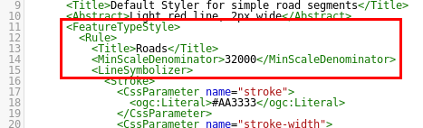

Then press **Submit**.

Set the default style of the roads layer to **roads style** (**Data → Layers → helsinki:roads → Publishing**).

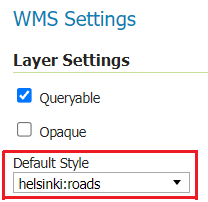

Press **Save** and preview the layer. Note that when you zoom the map to a scale smaller than 1:32 000, the roads will no longer be visible.

Let's add roads also at a scale of 1:32 000 and larger. This is done by creating a **\<Rule\>** partition with the maximum scale (**\<MaxScaleDenominator\>**) set to **32000**.

To make use of the previous rule partition: copy the whole **\<Rule\>** section. Paste it after **\</Rule\>**.

Then change this:

::: code-box
\<MinScaleDenominator\>32000\</MinScaleDenominator\>
:::

\... to this:

::: code-box
\<MaxScaleDenominator\>32000\</MaxScaleDenominator\>
:::

Change the line colour to grey **#666666**, the title to **Thick line** and the thickness to **7**.

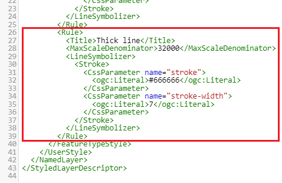

Press **Submit** and preview. Note that now when you zoom in on the map window (increase the scale), the colour and thickness of the roads will change.

Add a new rule to add a filling colour to the lines. Copy the previous piece of **\<Rule\>** code (with \<MaxScaleDenominator\>32000\</MaxScaleDenominator\>) and paste it as a continuation of the copied piece.

Again, change the title, colour and thickness as shown in the picture:

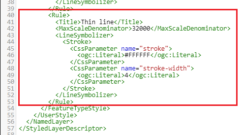

This line will be drawn on top of the previous thicker line, creating a line edge effect.

Preview the result:

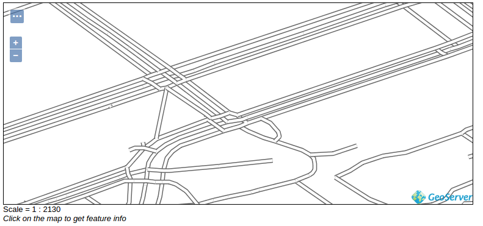
