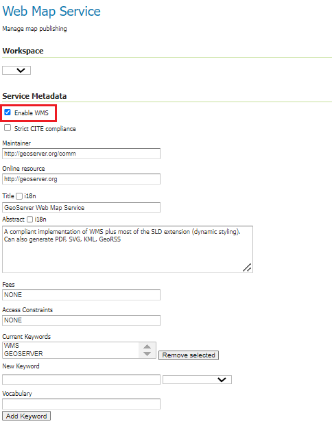
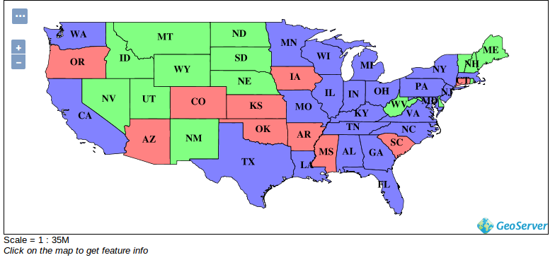
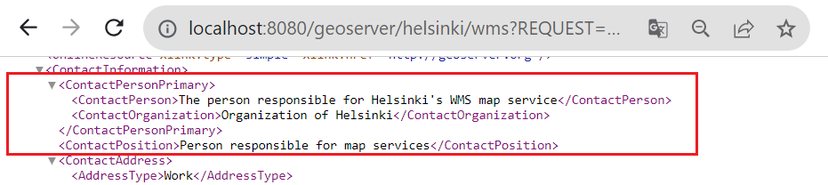
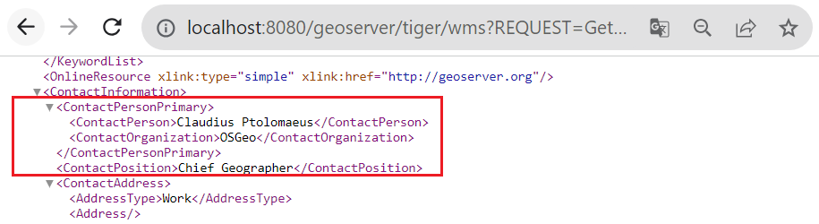
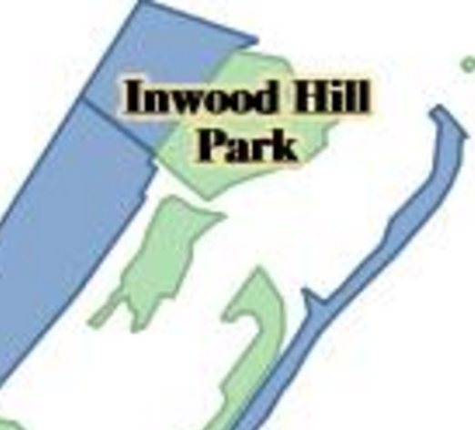

# EXERCISE 1.5: WMS AND WCS SERVICES

**Content of the exercise**

This exercise introduces you to the settings of the WMS and WCS services in GeoServer.

**Aim of the exercise**

After the exercise, the student will understand the different map services and be able to modify their basic settings.

**Estimated duration**

50 minutes.

## **Preparation**

In previous exercises, a layer **Buildings** has been created and a new styling definition (buildings) has been created for this layer.

## **OGC-standards**

For all layers added to GeoServer, different interface services can be published.

The most common interface service is the **Web Map Service** (**WMS**). GeoServer can be used to produce a WMS service using different spatial data sets and styling techniques.

Other interface services include the **Web Coverage Service** (**WCS**), which enables the publication of raw raster data, and the **Web Feature Service** (**WFS**), which is used as an interface service for vector data.

## **General map service settings**

The general settings for the various interface services can be found in the **Services** section of the main menu. These general settings are used by default whenever data is published via GeoServer.

In practice, all previously added data are already published as interface services, because all three services (WMS, WCS and WFS) are activated in the default installation of the training GeoServer.

For example, we have used the WMS map service whenever we have previewed a layer in the browser.

Open **Services → WMS view**.

At the top of the settings page you will find **Service Metadata** information.

Check that the **Enable WMS** option is checked. If this option is checked, the GeoServer server will provide a WMS map service. If this option is not checked, no data is available as WMS map service. The availability of interface services can also be managed on a workspace-by-workspace basis.

The functionality and server settings of all map services can also be configured according to the **Maintainer**, **Online resource**, **Title**, **Abstract**, **Fees**, **Access Constraints** and **Keywords** settings to specify information about the service and its administrator.

::: hint-box
Psst! These metadata settings are also similar for WFS and WCS services.
:::

Configure this information for the WMS service. You can write the notes on the last page of the exercise.

## **WMS**

The **Web Map Services** (**WMS**) map service produces georeferenced map images.

::: hint-box
Psst! Map images are always created when GeoServer receives WMS requests from the interface. In addition, GeoServer makes use of existing map images in the server cache. GeoServer receives requests whenever the server is connected to, but also when the map is zoomed in or out or moved from one location to another.
:::

Open **Services → WMS** again.

In addition to the basic information, each map service has its own regulations that define the functionality of the map service. There are many of these for the WMS service. For example, to create images, you can select **Nearest Neighbor**, **Bilinear** or **Bicubic** as the interpolation method in **Raster Rendering Options**. The default **Nearest neighbor** method is the recommended choice for basic raster visualization.

One interesting setting for the WMS service is the use of watermarks. Watermarks can be added to WMS map images from **Watermark Settings**. Note, however, that the WMS settings in the main menu define defaults for all GeoServer data. Layer-specific watermarks cannot be defined, but watermarks can be defined per workspace.

Let's try watermarking the server's WMS service with the GeoServer logo.

Open **Services → WMS** and look for **Watermark Settings** and make sure **Enable watermark** is checked.

Then use **Browse\...** to select the GeoServer logo (**/training/GeoServer_100.png)**

Set the transparency to **30** and the position to **Bottom right**.

Now press **Submit** to save the changes to the WMS service. All maps received via the WMS service map should now contain a watermark.

Open **Data → Layer Preview**, and preview some layers. Check that the watermark appears in all WMS requests.

For example, the **states** layer will look like this in the OpenLayers preview view: 

Try the other map layers and notice that all of them now have the GeoServer logo watermark visible and it stays there when you move the map. States data is vector data.

::: hint-box
Which GeoServer service (WMS, WFS or WCS) uses OpenLayers? Psst! You should have a look at your browser address.
:::

The WMS web map is produced from the original data and styles on the server and transmitted as an image via the browser. Vector data, raster data and their combinations (as group layers) can be transmitted via the WMS service.

## **Workspace-specific server settings**

A watermark was just configured for the WMS map service in general. You can also configure settings on a workspace-specific basis. This is done in the workspace settings view.

Open **Data → Workspaces**.

Next, let's edit the settings of the **helsinki** workspace. Select it under **Workspace Names**.

Then check **Settings → Enabled** and from the right **Services** → **WMS**.

You can now fill in this workspace-specific contact information to describe the Helsinki WMS map service.

 

Scroll down and press **Save**.

Now the other WMS map services on your GeoServer server will contain the default information (defined in **About & Status → Contact Information**), while the **helsinki**-workspace WMS service will have the information that was just defined.

You can check the information with a GetCapabilities request as follows:

-   Helsinki-workspace: [http://xx.xx.xx.xx/geoserver/helsinki/wms?REQUEST=GetCapabilities](http://xx.xx.xx.xx/geoserver/helsinki/wms?REQUEST=Getcapabilities)

-   Tiger-workspace: [http://xx.xx.xx.xx/geoserver/tiger/wms?REQUEST=GetCapabilities](http://xx.xx.xx.xx/geoserver/helsinki/wms?REQUEST=Getcapabilities)

-   GeoServer default: [http://xx.xx.xx.xx/geoserver/wms?REQUEST=GetCapabilities](http://xx.xx.xx.xx/geoserver/helsinki/wms?REQUEST=Getcapabilities)

 

## **DPI resolution of the WMS map service image**

Map servers return images at the default image resolution set by the OGC to **90 DPI** (Dots Per Inch). This DPI value is quite low, but suitable for the most common use contexts, i.e. on a computer or smartphone. A higher map image resolution is necessary, for example, when using workstation location software to produce map output with WMS layers.

::: hint-box
Psst! The DPI value is set low by default to avoid overloading the server and to allow seamless map services.
:::

It is possible to specify other screen resolutions for services by modifying the parameters of WMS map requests.

Now try to preview **poly_landmarks-** as a JPEG image. You can easily find the layer in the **Layer preview** view: 

The result is a map image in JPEG format at the default resolution of 90 DPI:\

If you enlarge the image in your browser (or save it to your hard drive and view it in a photo/image viewer) you will notice that the resolution is quite poor.

Select and copy the full text of the address in the browser. Open a text editor and paste the text into it. It is an http request to your GeoServer server and resembles the following text:

::: note-box
[http://xx.xx.xx.xx:8080/geoserver/tiger/wms?service=WMS&version=1.1.0&request=GetMap &layers=tiger:poly_landmarks&styles=&bbox=-74.047185,40.679648,-73.90782,40.882078 **&width=528&height=768**&srs=EPSG:4326**&format=image%2Fjpeg**](http://xx.xx.xx.xx:8080/geoserver/tiger/wms?service=WMS&version=1.1.0&request=GetMap%20&layers=tiger:poly_landmarks&styles=&bbox=-74.047185,40.679648,-73.90782,40.882078%20&width=528&height=768&srs=EPSG:4326&format=image%2Fjpeg)
:::

The text highlights the most important parameters concerning the WMS image. They can be interpreted as follows:

-   **&width** and **&height**: image size is 528\*768 pixels and

-   **&format**: the format is JPEG

-   The resolution of the image is not mentioned in the request, so the default resolution is used.

To specify the image resolution, you can add the following parameter to the end of the http request: **&format_options=dpi:300**. So add it to the end of your WMS request, and now copy and paste it in its entirety into the new browser window for comparison. Press **enter** to create a new image: 

It is noted that the styles do not match the previous ones. This is because the request also needs to edit the image size, which is calculated to fit the default resolution. However, now the JPEG image produced by the WMS map service is already produced at a higher resolution than before.

Resolutions can be checked if desired by saving both images to a hard disk and comparing them by zooming in using the image previewer of the operating system you are using.

As I said, the styles don't look correct now, because the default request has the image size calculated to 90 DPI resolution. So now we need to modify the values of the **&width** and **&height** parameters to match the new resolution of **300 DPI** using the following equation: 

-   new_width = image_defaultwidth \* (new_resolution/90)

-   new_length = image_defaultlenght \* (new_resolution/90)

So in our case:

-   new_width = 528 \* (300/90) → **&width=1760**

-   new_length = 768 \* (300/90) → **&height=2560**

Go back to your text editor and edit your wms request with the above information. When you try the new request in your browser, the image size, resolution and styles will be correct: 

Software that uses WMS services, such as QGIS, automatically builds requests according to the process described above, for example in a map (output map), saving the user from having to manually specify the image size and resolution value.

## **WCS**

Open **Services → WCS**.

As usual, you can decide whether you want GeoServer to produce a raw raster map. This is defined by the **Enable WCS** option. The sharing of raw raster data should be carefully considered. The service may cause high data transfer volumes on the network connection. Furthermore, in practice only classified raster data, aerial and satellite imagery are suitable for the WCS service. 

Under **Coverage processing** you will find the settings for the WCS service. Activating the **Use subsampling** option reduces the amount of data to be processed, which is useful when using data at a lower resolution than the original.

Similarly, the **Overview policy** option allows the use of overviews of the data (if they exist on the server), which contributes to reducing the amount of data to be transferred (fewer gigabytes). The assumption is that the overview is not used. Note that overviews of data sets must be created separately.

The **Resource Consumption Limits** option allows the administrator to set resource consumption limits when processing raw raster data. The size of raw resources can be very large (tens or hundreds of gigabytes by default) and the server can become overloaded when processing requests.

