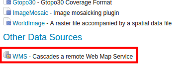
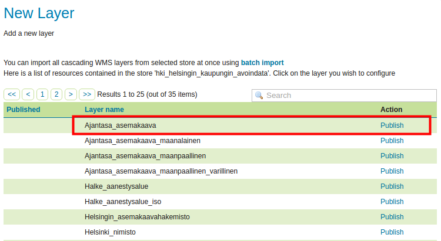

# Exercise 1.6: Raster data

**Content of the exercise**

The exercise involves adding raster data to the GeoServer server and modifying layer settings for publishing to the WCS service.

**Aim of the exercise**

After the exercise, the student will be able to add raster data and make the necessary settings to publish the data.

**Estimated duration**

40 minutes.

## **Preparation**

In previous exercises, **helsinki** workspace has been created, where, among other things, a watermark has been defined to be visible.

A few raster files have been uploaded to the data directory of the GeoServer server: one elevation model and four aerial photographs of the Helsinki area.

## **Adding raster data**

Adding raster data to GeoServer is done in much the same way as in the previous exercises with vector data. We now load a raster file into GeoServer for use, the original format of which is **ArcGrid** (ASCII-based raster format). The raster data is a height model of the Helsinki area from National Land Survey of Finland (grid size 2 m x 2 m).

First, we need to create a reference to the data so that GeoServer knows where the data is physically located. Remember that this is done by creating stores.

Create a new store by selecting **Stores → Add new Store**.
Then click **ArcGrid** for the store format.

Select **helsinki**-workspace again and name the new store: **hki_elevation_model_L4133A**.

Then browse to the folder **/training/elevation_model_2m/** and select the file **L4133A.asc**..

Then press **Save** and after that press **Publish**.

As before when creating vector files, you can now access the layer editing view.
Check the general settings so that both **Enabled** and **Advertised** are checked.

Set the name to **elevation model** and the title to **Helsinki elevation model** and the additional information to **Elevation model 2m -- National Land Survey of Finland.**

Note that in **Coordinate Reference Systems**, the coordinate system is incorrectly defined.
The correct system for the data is **ETRS89 / ETRS-TM35FIN** (**EPSG:3067**).
Correct it manually in the **Declared SRS** field and select **SRS handling** in the **Force declared** field, then use the shortcuts to determine the extent of the data.

Press **Save.**

Check that the layer is in the **Data → Layers** table.
You can preview the new raster layer via the **Data → Layer Preview** window.\

## **Adding an aerial image**

In the same way as you added an ArcGrid file in the previous step, you can add GeoTIFF data.

Follow the instructions in the previous section and add an aerial image of the same area.
The GeoTIFF file can be found here: **/training/aerialimage_geotiff/L4133A.tif**.

Name as follows:\
store: **hki_aerialimage\
** layer: **aerialimage**

Aerial image in preview: 

## **Image Mosaic**

GeoServer allows you to publish multiple raster data (e.g. GeoTIFF files) as a single WMS service using the **Image mosaic** format.

To create a mosaic, all data must be in the same folder, in the same file format and in the same coordinate system.
The raster format must be supported by GeoServer, e.g.
GeoTIFF or ArcGrid.

This type of store is intended for use with the same type of raster data.
For example, multiple aerial images that form a mosaic are recommended to be published in this way, avoiding layer-by-layer publication.

The previous aerial image folder contains some aerial images of Helsinki.
The data has been downloaded from the data service of the National Land Survey of Finland.
They are in **GeoTIFF** format and in the **TM35FIN** coordinate system\*\* (**EPSG:3067**).
As can be seen, this data set meets all the requirements for mosaicking.

Create a new store in **helsinki** workspace.
Select **ImageMosaic - Image mosaicking plugin** as the format.

Browse to the folder **/training/images_geotiff/** and press **OK**.
This way, all images in the folder will be merged together and the mosaic will then be treated as a single layer.

Enter a name and an explanation, for example as shown in the following picture: (päivitä kuva)

Press **Save** and then press **Publish** to publish the layer.

Name the layer **Aerialimages_ofthecitycentre** and title it **Aerial images of the city centre of Helsinki**.
For additional information you can write for example **Aerial images of Helsinki - National Land Survey of Finland 2014**.
Check in the edit view of the layer that **Enabled** and **Advertised** are checked.

Please note that the coordinate system data (EPSG:3067) and the extent of the data in the GeoTIFF file are correctly defined here automatically (according to the default values).

::: hint-box
Psst!
As mentioned before, GeoServer tries to interpret the original coordinate system of the data from the original information, which in this case was in EPSG format.
:::

Then press **Save**.

Check that the new layer can be found in **Data → Layers** view.
You can also preview it in the usual way using **Data → Layers Preview**.

## **Layer Groups**

GeoServer layers and/or previously created layer groups can be grouped.
Layer groups can combine different vector and raster formats.
One obvious use case is the publication of a background map as a single WMS layer service.

Now create a layer group using the **aerialimages**, **buildings-** and **roadworks** layers previously added to the server.

From the main menu, select **Data → Layer Groups** and then **Add new layer group**.

Name the group layer **Background map** and title it **Helsinki background map**.
Add "Helsinki city centre background map" to the **Abstract** field.

::: hint-box
Psst!
Some browsers may not allow the use of ä or ö.
Avoid using these alphabets in layer names and titles.
:::

Select **helsinki** as workspace.

Scroll down the page, press **Add Layer...** and add the **Aerialimages_ofthecitycentre** layer.
The layer is now added to the **Layers** list.

Press **Generate Bounds** and notice how the layer's original coordinate system and extent are now defined in their respective fields.
Let's keep the group layer coordinate system as **ETRS89 / TM35FIN**.

In the same way, add the Helsinki **buildings** and **road** layers.

Note that you can arrange the layers using the **Drawing order** arrows.
The top layer (layer 1) is drawn first; the next layer is drawn on top of it, and so on.
Arrange the layers according to this picture below:

Make sure **Default Style** are checked.

Finally, press **Generate Bounds** again to update the group layer scope data, so that new data are also taken into account when determining the scope data.
Whenever you add new material to a layer group, you should press **Generate Bounds** again to update the group layer scopes.

Press **Save** again.

You can preview the group layer in the same way as other levels: 

### **Form of publication of group layers**

Return to the group layer settings (**Data → Layer Groups → background map**).
Scroll down to **Mode**.
Here you can select different formats for the group layers:

-   **Single** group layer is visible as a single layer, output layers cannot be separated from each other

-   The **Named Tree** group layer can be viewed as a group and as individual layers.

-   **Container Tree** group layer is only visible as individual layers

-   **Earth Observation Tree** is a group layer for Earth Observation data and is only visible in the group layer preview view

Keep the default **Single** checked.
It will make the WMS layers visible as a single layer.

Keep the rest of the settings as default and finally press **Save**.
Group layers can be previewed in the same way as other layers.
Go to **Layer Preview** and open a new group layer preview using the OpenLayers link.
Note that the default styling technique is enabled.
The stlyling technique for this group layer will be improved later.

Once you have completed the group layer, you can return to the group layer settings and try other **Mode** settings.
The following sample images are from the QGIS WMS service tool.

**Mode → Single** looks like this:

In this format, the entire group layer is always downloadable as a single package, and no information is available or downloadable separately for its sub-layers.

Whereas **Mode → Named Tree** looks like this: 

In this format, it is possible to download layers one by one.

### **Use of external WMS services (cascading WMS)**

The raster data may also be derived from external WMS services.
This is called a **cascading-** type solution.
In practice, WMS layers from other services can be cascaded so that the end user does not notice the difference.
For example, cascading allows the use of other spatial data services from our GeoServer.
The drawback is that long cascading can lead to a situation where the availability (response time and availability) of the service is substantially reduced.

Add a new store (**Data → Stores → Add new Store**), select **WMS** from the list.

Add the City of Helsinki's open spatial data services to our GeoServer as a new WMS connection (remote WMS connection).
This City of Helsinki service can be found at: 

::: note-box
 [https://kartta.hel.fi/ws/geoserver/avoindata/wms?REQUEST=Getcapabilities](https://kartta.hel.fi/ws/geoserver/avoindata/wms?REQUEST=Getcapabilities).
:::

Fill in the information as shown in the following image, put the above address in the **Capabilities URL** field:

The rest of the settings can be left as defaults.
Then press **Save**.

Next, you can publish layers directly from that service.
For example, publish **Ajantasa_asemakaava**.

The default settings for the new layer are correct.
Scroll to the bottom of the page and press **Save**.

You can now preview the new layer in the same way as before: 

::: hint-box
Psst!
Please note that the style or content of the WMS cascade levels cannot be influenced, as they are hosted by the City of Helsinki in their own server.
For metadata on the City of Helsinki spatial data services, please click here: <http://ptp.hel.fi/avoindata/aineistot/Aineistolista_wms_avoindata_ulkoverkko.html>.
:::
