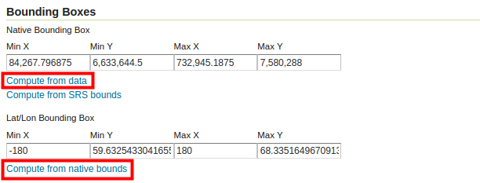
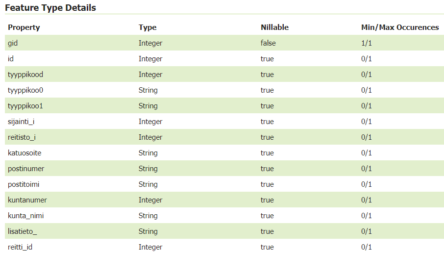
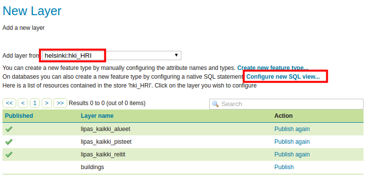
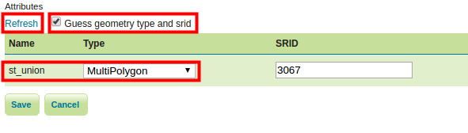

# EXERCISE 1.7: SPATIAL DATABASES

**Content of the exercise**

The exercise involves adding data to GeoServer from a database source.

**Aim of the exercise**

After the exercise, the student will be able to connect geodatabase data to GeoServer and publish their data there.

**Estimated duration**

30 minutes.

## **Preparation**

Start a web browser on your computer and log in for your practice session.

The PostgreSQL database and its PostGIS extension are installed on the server machine. The database is pre-loaded with a variety of vector data.

## **Connecting to the geodatabase**

GeoServer supports most spatial databases, including PostGIS, ArcSDE, Oracle and Microsoft SQL Server.

PostGIS spatial databases can be automatically accessed through GeoServer's default settings. Support for other databases is installed via plugins.

A PostGIS database is pre-installed in the training environment, with a variety of vector datasets ready for use. The data are from **Helsinki Region Infoshare**, **University of Jyväskylä open data services** and **OpenStreetMap map data** (from geofabrik.de).

As with other datasets, in order to use them in GeoServer, they must be referenced by creating an appropriate store.

Create a new store (**Data → Stores → Add new Store**).

Select the format **PostGIS - PostGIS Database**: 

Select the **helsinki** workspace as **Workspace** and name it **hki_lipas** (**Data Source Name**).

Then fill in the **Connection Parameters** of the PostGIS database as follows:

+--------------------+-------------+
| ##### **Dbtype**   | postgis     |
+--------------------+-------------+
| ##### **Host**     | localhost   |
+--------------------+-------------+
| ##### **Port**     | 5432        |
+--------------------+-------------+
| ##### **Database** | gs_training |
+--------------------+-------------+
| ##### **Schema**   | lipas       |
+--------------------+-------------+
| ##### **User**     | postgres    |
+--------------------+-------------+
| ##### **Passwd**   | gispo       |
+--------------------+-------------+

Leave the rest of the settings as defaults and press **Save**. 

In the same way as before, the new layer creation view will appear automatically after creating a store. This view lists all the layers that can be found in that database.

The data is now referenced via the **hki_lipas** store and you can see what data it contains: 

## **Adding a PostGIS layer**

You can publish a layer immediately after creating a store by pressing **Publish**. Now publish the **pisteet (points)** layer. Lipas is a national geographic information system for physical education managed by the University of Jyväskylä.

::: hint-box
Psst! When you later want to publish other layers from the hki_HRI-store, you can do it from the main menu Data → Layers → Add a new layers and select the desired store.
:::

In the editing view of a layer, the layer name and title are automatically filled in. Keep the default names and add additional information in the **Abstract** field if you wish.

Check that **Enabled** and **Advertised** are checked.

As you will have noticed by now, the settings for the new layer are the same, whether it is a shapefile format or a PostGIS database.

In the **Coordinate Reference Systems** section, check that GeoServer has identified **EPSG:3067** as the coordinate system. PostGIS and GeoServer use EPSG codes to determine the coordinate system, so in most cases the coordinate system will be correctly determined automatically. 

Before saving the publishing settings for a layer, configure the **Bounding Boxes** layer in the same way as you did with the data you added earlier. 

Finally, press **Save**. You can preview the new layer via **Layer Preview**.\

## **Adding a polygon and line layer from PostGIS database**

Add two more layers from the PostGIS database in the same way:

-   **alueet (areas)**

-   **reitit (routes)**

Remember that you can add layers via **Data → Layers → Add new layer** and by selecting **helsinki:hki_lipas** as source. Then preview these layers to check their functionality.

::: hint-box
Which steps are mandatory to publish a layer? What are the coordinate systems of the layers and their scopes?
:::

## **Setting default styles for layers**

Finally, change the default styles for those layers using GeoServer's default styles. You can change the layer style from the main menu **Data → Layers** and open the layer you want to change. The styles are defined in the **Publish** tab. Use the following styles:

+---------------+---------------+
| ### **Layer** | ### **Style** |
+---------------+---------------+
| **pisteet**   | burg          |
+---------------+---------------+
| **alueet**    | giant_polygon |
+---------------+---------------+
| **reitit**    | simple_roads  |
+---------------+---------------+

Finally, you can make the data into a group layer. In the picture, the Helsinki background map group layer and the lipas data have been combined into one map service layer: 

## **SQL views**

GeoServer also allows SQL queries to be used to share spatial data sets.

Let's add again **lipas_kaikki_reitit** data as a new layer on the server. The goal is to create a layer where only data from Helsinki is displayed.

I will name it **lipas_kaikki_reitit_helsinki**.

::: hint-box
Psst! An SQL view could also be created directly in the database and use that view to create a layer.
:::

To perform SQL queries, it is a good idea to first find out the names and types of the fields in the database tables. You can check the fields in the data by opening a layer in the **Data → Layers** view; the fields are listed at the end of the **Data** tab. The types of attribute data in the dataset are best viewed using other software such as pgAdmin or QGIS. You can also check them out on the Lipas website (<http://www.liikuntapaikat.fi/lipas>).

The attribute data in GeoServer looks like this:

After examining the data, it can be concluded that the location information can be found in the **municipality_name** field.

Open **Data → Layers → Add new layer** and select **helsinki:hki_lipas**. Press **Configure new SQL view...** to configure in SQL which data you want to publish from this dataset. (päivitä kuva jos onnistuu taulujen nimeäminen englanniksi)

Define the view name as **lipas_kaikki_reitit_helsinki**. Enter the following SQL query in the **SQL statement** field:

::: code-box
SELECT \*

FROM lipas.reitit

WHERE kunta_nimi = 'Helsinki'
:::

Check the **Guess geometry type and srid** option and then press **Refresh**. Please note that there is an error in the SQL query in the image below. Pay attention! Instead of the kunta_nimi_fi text, it should just read kunta_nimi. 

Then check that **SRID** in the **geom** field is specified with the correct EPSG identifier (in our case **3067**).

Then press **Save**.

Next, define the dimensions of the layer (Bounding Box) and press **Save**. You can now preview the Helsinki liikuntareitit layer. 

## **Geographical data functions via SQL views**

You can also use spatial functions in SQL queries. The zone function (ST_Buffer) is used as an example.

Reopen layer **lipas_kaikki_reitit_helsinki** (**Data → Layers**)

In the **Data** tab, scroll to the bottom of the page. There you will find the **Edit SQL view** function.

Update the **SQL statement** next:

::: code-box
SELECT ST_Union (ST_Buffer ( geom, 10 ))

FROM lipas.reitit

WHERE kunta_nimi = 'Helsinki'
:::

Update the format of the attributes again and then press **Save**. 

In the preview, you will notice that the route data is now buffered by 10 metres: 
