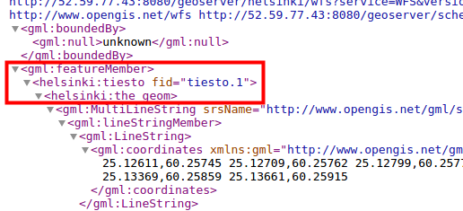
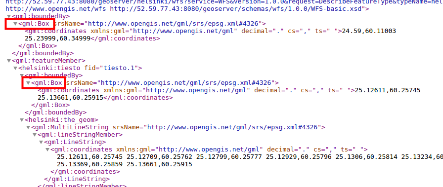
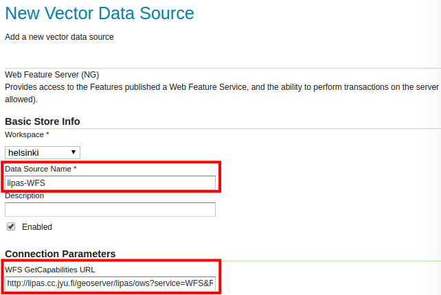
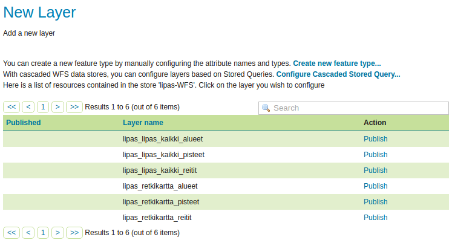

# Exercise 2.1: WFS services

**Content of the exercise**

The exercise will introduce the student to the settings and functionality of the WFS map services.

**Aim of the exercise**

After the exercise, the student will be able to change the publishing settings of the WFS map services and use the WFS-T map service.

**Estimated duration**

30 minutes.

## **Preparation**

Stores with vector data have been added to GeoServer.

## **OGC-standards**

Previously, the configuration of the WMS and WCS interface services defined by the Open Geospatial Consortium (OGC) was examined. The Web Feature Service (WFS) download service is also an interface service defined by the OGC through which vector data and their feature information can be downloaded for further exploitation.

## **WFS settings**

WFS services allow vector data, their geometry and attributes to be processed over the network.

Open **Services → WFS**. Right at the beginning of the view, you will find the general information about the service (**Service Metadata**).

The WFS-specific settings can be found below, which define how WFS-specific service requests are handled and responded to.

## **Number of data requested**

**Maximum number of features** and **Maximum number of features for preview** will prevent the download of too much data. If a download request contains a large number of features, only a subset of them will be downloaded.

To test this function, set the value of these features to **1**.

Press **Submit**.

Then view the **tiesto** layer through the WFS interface via the Layer Preview GML preview or e.g. with the QGIS application.

::: hint-box
How have the attributes you have just identified influenced the final result? Why?
:::

Preview the same **tiesto** layer now using the **GML** link.

The service response (in xml format) now contains only one geometry, as we had specified in the settings.

Return to the **Services → WFS** view and check **Return bounding box with every feature**. Preview the same layer again and compare it with the result of the previous service request. For certain applications, it may be necessary to obtain information about the bounding box for each spatial feature.

Check in the tiesto-layer GML preview that the response sent by GeoServer now also includes the rectangle delimiting the geometries.

Go back to **Services → WFS** view and reset the defaults to **Maximum number of features**: **1 000 000** and **Maximum number of features for preview**: **50**.

Press **Submit**.

You can still check that now the GML preview only shows the geometries of 50 features, although there are many more spatial features at the tiesto-layer.

::: hint-box
Psst! "Maximum number of features for preview" is an important setting to limit the number of WFS request results in layer preview mode. It is easy to get your computer stuck if all the layer information comes in response at once.
:::

## **Specifying several coordinate systems**

GeoServer is able to project and serve data in any of the more than 5000 supported coordinate systems. However, it should be noted that the systems used by the server must be manually specified, rather than having all 5000+ coordinate systems declared via a GetCapabilities request.

::: hint-box
Psst! This setting only affects the content of the GetCapabilities request; projection is still possible using any client system (e.g. geospatial software).
:::

Specify the coordinate systems used in the **Extra SRS codes for WFS capabilities generation** field, separated by commas: **4326, 3047, 3067**.

::: hint-box
Which coordinate systems are involved?
:::

You can now check that the above coordinate systems are specified in the WFS functionality document.

Click on the **GeoServer logo** in the top left corner (returning to the home page of the web interface) and then select **WFS** → 1.1.0 or **2.0.0** from the right side of the page.

By searching "**EPSG**" you can find the EPSG codes in the WFS service documentation (in xm format):

Note that this setting does not work for WFS 1.0.0, which only reports EPSG codes per layer.

## **Service Levels**

In GeoServer, vector data can be published for editing using **WFS-T (Transactional)**.

The **Service Level** options define the service level provided by WFS.

+-------------------------+--------------------------------------------------------------------------------------------------------------------------------------+
| ##### **Basic**         | Provides basic functionality: GetCapabilities, DescribeFeatureType and GetFeature \|                                                 |
+-------------------------+--------------------------------------------------------------------------------------------------------------------------------------+
| ##### **Transactional** | (WFS-T), in addition to the basic functionality, a transactional function is available                                               |
+-------------------------+--------------------------------------------------------------------------------------------------------------------------------------+
| ##### **Complete**      | Add LockFeature support, which prevents editing of spatial objects (features) after another user has already started editing them \| |
+-------------------------+--------------------------------------------------------------------------------------------------------------------------------------+

Leave the setting at **Complete**. By default, GeoServer only allows users in the admin group to edit data, and unauthenticated users cannot edit data. The **Basic** level can be used to completely prevent editing of data by WFS-T.

## **GML settings**

**GML** is a language based on XML, defined by the OGC. GML is used to model geometry elements. GeoServer produces vector data in GML format.

Different versions of the WFS service return different GML formats by default:

+---------------------+---------+
| ##### **WFS 1.0.0** | GML 2   |
+---------------------+---------+
| ##### **WFS 1.1.0** | GML 3   |
+---------------------+---------+
| ##### **WFS 2.0.0** | GML 3.2 |
+---------------------+---------+

For each GML format, it is possible to define a coordinate system format that must be taken into account in the GML result. This is particularly important when developing applications using WFS services.

**EPSG CODES AND COORDINATE FORMATS IN GML DOCUMENT**

|                          |                                                                                                                                                                     |
|--------------------------|---------------------------------------------------------------------------------------------------------------------------------------------------------------------|
| **EPSG Code**            | srsName="EPSG:4326" \| \| Coordinates in the format: longitude/latitude (x/y)                                                                                       |
| **OGC HTTP URL**         | srsName="[http://www.opengis.net/gml/srs/epsg.xml#4326"](http://www.opengis.net/gml/srs/epsg.xml#4326%22) \| \| Coordinates in the format: longitude/latitude (x/y) |
| **OGC Experimental URN** | srsName="<urn:x-ogc:def:crs:EPSG:4326>"                                                                                                                             |
| **OGC URN**              | srsName="<urn:ogc:def:crs:EPSG>::4326" \| \| Coordinates in the format: latitude/longitude (y/x)                                                                    |
| **OGC HTTP URI**         | srsName="[http://www.opengis.net/def/crs/EPSG/0/4326"](http://www.opengis.net/def/crs/EPSG/0/4326%22)                                                               |

For example, the **Lipas areas** layer from a GML2 preview (EPSG code in the form of an OGC HTTP URL):

## **Workspace specific settings**

As with WMS services, it is also possible to configure WFS settings on a workspace-by-workspace basis. For example, WFS-T functionality can be enabled only through a single workspace and access control can be used to allow only identified users to edit data.

Open **Data → Workspaces** and then select the **helsinki** workspace. Then check **Services → WFS** and then click on the **WFS** link.

Make sure that **Service Level** is set to **Complete**.

Then press **Submit** (at the bottom of the page).

Finally, press **Save** at the bottom of the page.

Workspace-specific settings can be used, for example, to limit coordinate systems in which the workspace data is available, or to remove the WFS-T service from the data of a specific workspace.

## **Editing via WFS-T service**

One important feature of WFS services is the ability to edit vector data directly on the server. The WFS-T service can also be configured with a locking option (**Complete** service level), which is necessary when editing on shared data.

Editing can be done using different client software, e.g. QGIS or web applications.

The easiest way to test the editing functionality is to use the QGIS spatial data system.

First you need the address of the WFS service. For example, you can get this from the GeoServer home page, which you can access by clicking on the GeoServer logo in the top left corner. Right-click on the link **1.1.0** under the WFS section of the **Service Capabilities** panel on the home page.

The address will be in the format:

::: code-box
http://%3Cip.address%3E:8080/geoserver/ows?service=wfs&version=1.1.0&request=GetCapabilities
:::

With GeoServer's default settings, a workspace-specific address is obtained by adding the workspace URI to the address. For example, the address of a helsinki workspace would be:

::: code-box
http://%3Cip.address%3E:8080/geoserver/ows?service=wfs&version=1.1.0&request=GetCapabilities
:::

Open QGIS from the desktop icon. Add a new WFS service and paste the address you just copied into the URL field. Also enter your username (admin) and password (gispo).

If necessary, follow the trainer's instructions for using **QGIS**. Connect QGIS to your WFS map service, add the **lipas_all_routes** layer you added earlier in the second exercise to the map project. Edit some spatial data objects and save the changes.

Afterwards, look at the GeoServer preview of the objects you edited and verify that the changes have indeed been saved to the server. \## **Muiden WFS-palvelujen hyödyntäminen (cascading WFS)**

In the same way that it is possible to continue publishing WMS services (**cascading WMS**), GeoServer can also continue publishing WFS services (**cascading WFS**).

To add a new store (**Data → Stores → Add new Store**), select **Web Feature Server (NG)** from the list.

The Lipas-WFS service will be added. Name the new vector-store **lipas_WFS** and set **WFS GetCapabilities URL**:

::: code-box
http://lipas.cc.jyu.fi/geoserver/lipas/ows?service=WFS&REQUEST=Getcapabilities
:::

The rest of the settings can be left at default values. Then press **Save**.

The new store will contain the map layers that were shared on the original WFS server:

You can publish layers directly from the service. For example, publish **lipas_excursion_map_routes**. Right click on **Publish** and define **Bounding Boxes** as usual.

Press **Save**.

You can now preview the new layer (the default name will be **Excursion_routes**).

::: hint-box
Psst! If the data is large and the maximum download time is set low, GeoServer may generate an error code when the data cannot be loaded by the specified time. Change this time if the data is large.
:::
