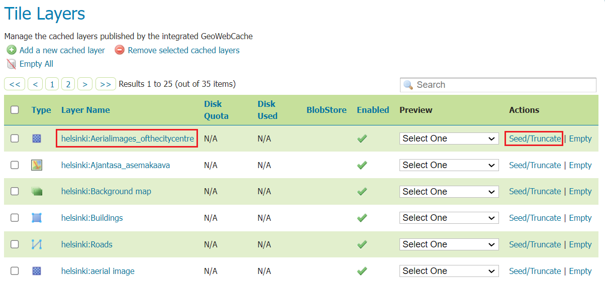
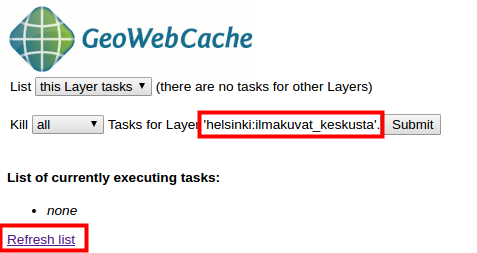
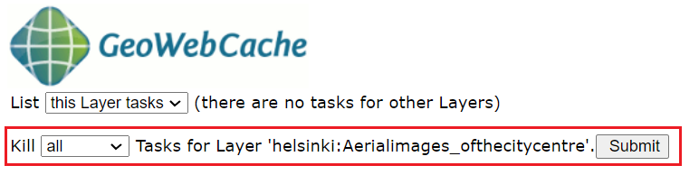
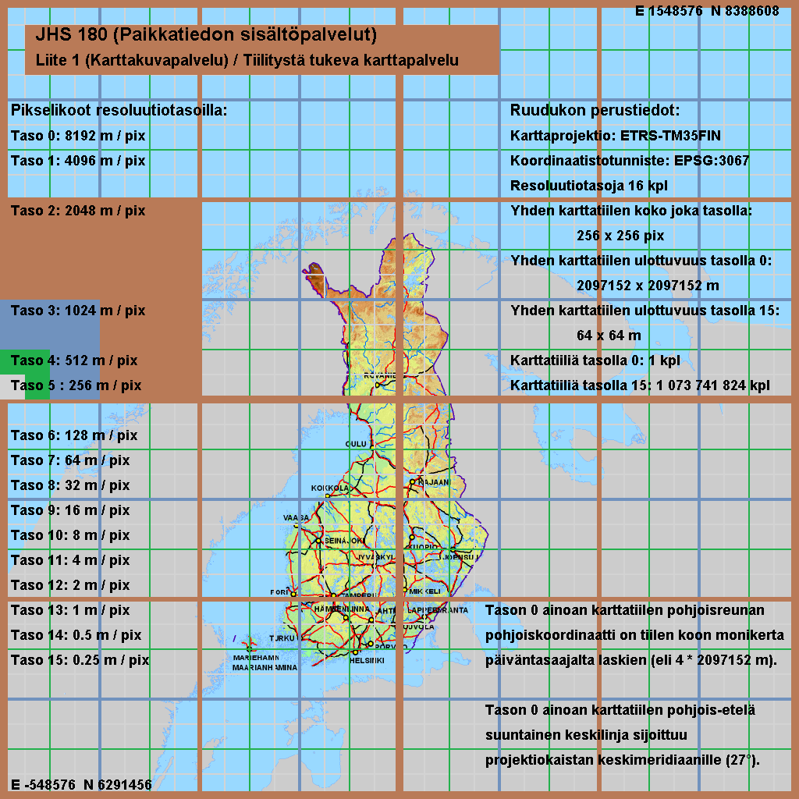
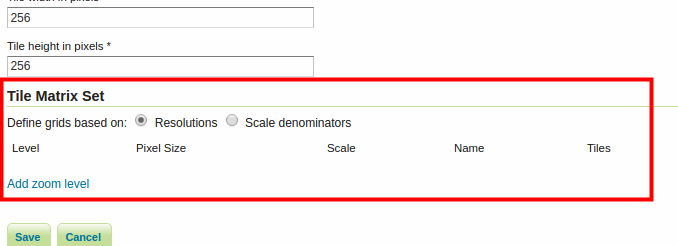
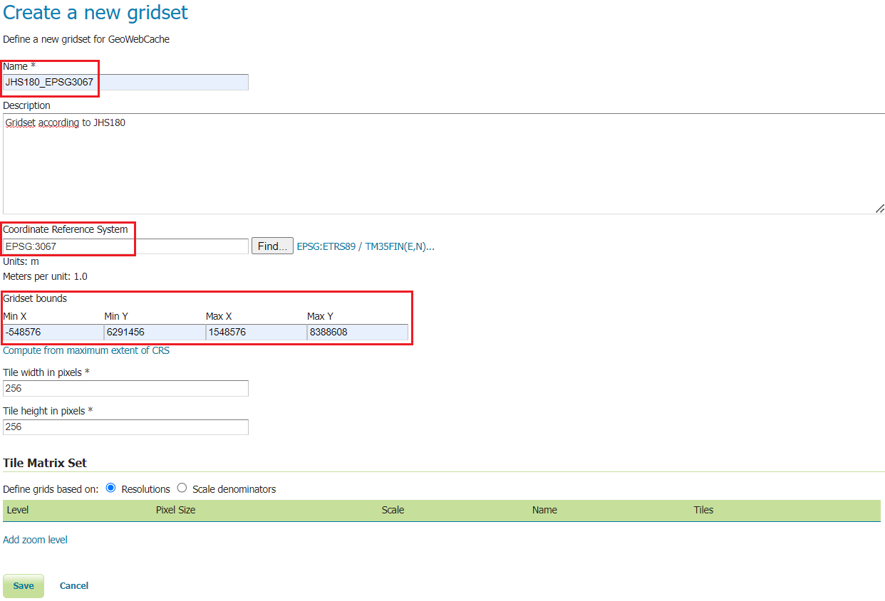
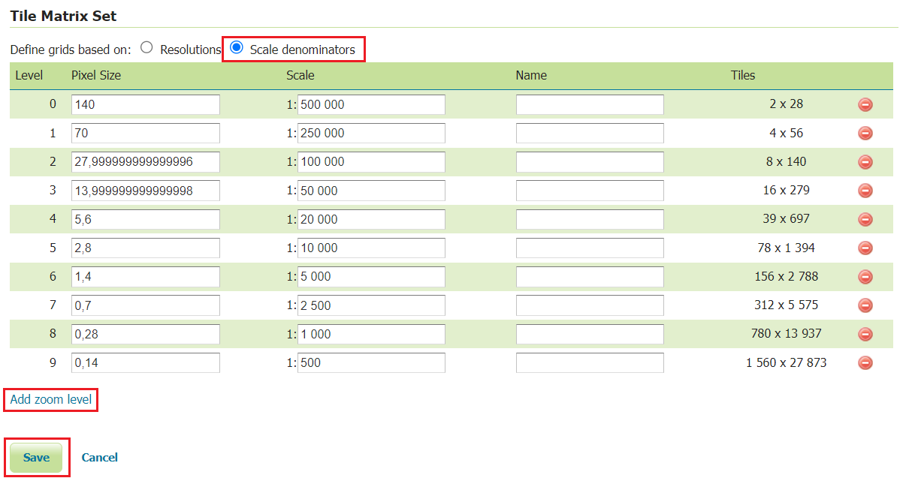

# Exercise 2.2: Map tile services

**Content of the exercise**

In this exercise we will use map tiles and grid creation tools available in GeoServer.

**Aim of the exercise**

After the exercise, the student will be able to create and configure their own map style services.

**Estimated duration**

40 minutes.

## **Preparation**

Several raster and vector datasets have been uploaded and published on the GeoServer server. The GeoServer default installation also includes GeoWebCache, which GeoServer uses to create and manage map tiles.

## **Tile Caching**

GeoServer includes **Tile** services as part of the **GeoWebCache** service.

Open **Tile Caching → Caching defaults** and check which mapping tile services are enabled in your GeoServer installation.

By default, the **WMS-C** (WMS Service-Cached) and **TMS** (Tile Map Service) map tile services are activated.

Open **Tile Caching → Tile Layers** and you will also notice that a map tile layer is automatically created for each layer.\

## **GeoWebCache user interface**

The most common settings for the map tile service are defined in the various settings sections of the GeoServer web interface that you are already familiar with. More specifically, the operation of the map tile service is controlled from the GeoWebCache interface.

Return to **Tile Caching → Caching Defaults** and click **Go to the embedded GeoWebCache home page**..

GeoWebCache is installed by default on GeoServer and manages all map tiles that are shared through the map tiles services.

Open the list of demos **A list of all the layers and automatic demos**.

All GeoServer layers have their own map tile service enabled: 

Open **helsinki:aerial image** OpenLayers **png** preview link and browse the map. You will see how the different map tiles are calculated and drawn on the screen as the server generates them.

Test that the map tiles remain reusable on the server by moving from one place on the map to another in roughly the same map area. The map tiles will now appear more quickly because GeoServer no longer needs to draw them, it just passes on the map tiles that are already available on the server.

## **Layer-specific settings**

The map tile settings for the layers can be found in the **Tile Caching → Tile Layers** view of the main menu. Open the **helsinki:aerial_images** layer properties by clicking on the layer link in the table. 

Then select **Tile Caching**.

The default settings are defined so that map tiles are automatically created for all new layers. Also, both jpeg and png image tiles are activated by default.

Scroll down to the bottom of this view again, and you will see in the **Available gridsets** section that two different map tile grids are enabled by default: **EPSG:4326** (WGS 84) and **EPSG:900913** (Google Mercator): 

::: hint-box
Psst! You can also edit layer-specific tiling settings via the Data → Layers view by selecting a layer and then the Tile Caching tab.
:::

## **Pre-creation of map tiles**

Return to **Tile Caching → Tile Layers** view. From this page you can also preview the tiled map services.

Under the **Preview** column, the menu will list the available tiling options for that layer. You will get the same preview as when using the GeoWebCache view.

Under the **Actions** column, there is also a link **Seed/Truncate** to access the GeoWebCache tier pre-tiling. The **Empty** link clears all map tiles previously saved on the layer.

Now select the **Seed/Truncate** link to create Helsinki aerial image layer map tiles.

In the **GeoWebCache** view at the top of the page you will find general functions and a list of ongoing tasks. Creating map tiles is a very resource-intensive process and requires a reasonable amount of disk space. It is also typical that the creation of tasks, i.e. map tiles, can take a very long time (hours, even days). The information on a page is updated using the **Refresh list** function. 

For creating tiles, the settings can be found at the bottom of the page in the **Create a new task** section.

|                                 |                                                                                                                                                                                      |
|---------------------------------|--------------------------------------------------------------------------------------------------------------------------------------------------------------------------------------|
| **Number of tasks to use**      | Specifies how many processes to start to create map tiles                                                                                                                            |
| **Type of operation**           | Type of operation for creating tiles \| Reseed: create all map tiles, replace old map tiles \| Seed: create only the missing map tiles \| Truncate: remove map tiles from the server |
| **Grid set**                    | Specifies which map tiles are created on which map tiles grid                                                                                                                        |
| **Format**                      | Map image file format (e.g. jpg, png)                                                                                                                                                |
| **Zoom start, Zoom stop**       | Scale intervals for the map tiles to be created (scales are defined for the map tiles)                                                                                               |
| **Bounding box**                | The rectangular delineation of the location from which the map tiles are generated                                                                                                   |

Set **Number of tasks to use** to 1.

::: hint-box
Psst! 2\*number_of_computer_processors is a good starting point for experimentation.
:::

Set the task settings as follows, paying particular attention to the **Zoom stop** setting. Set the value to 15 to calculate the scale levels 0-15:

Press **Submit**.

GeoServer (GeoWebCache) will now generate map tiles of the selected service from scale levels 0--15.

During the generation process, the interface allows you to monitor the completion of the map tiles:

Click on the **Refresh list** link to refresh information on the progress of the calculation.

The map tile grid definition and the layer position delimitation indicate that 1 922 map tiles are required for scales 0-15. With these settings, it takes about a minute to draw the images on the remote server. 

Note that map tiles are created by default according to the boundary of the layer location (unless otherwise specified). 

Calculate further map tiles **for level 16** (specify zooming start and end level as 16). During the calculation, refresh the page and check the progress of the map tiles creation. 

If you make a mistake and specify the wrong settings, you can stop the calculation by using the **Kill all Tasks...** function by pressing the **Submit** key. 

Level 16 corresponds to a scale of 1:4 262. In total, 3 700 map tiles are needed to tile it, which takes about a couple of minutes to create. Calculate level 17 in the same way and make notes of the number of processors, map tiles and time.

Level 17 looks like this on the map: 

## **Using the hard disk of the map tiles**

In the previous section, the map tiles were computed for only one layer (**Aerialimages_ofthecitycentre**), only one map tile grid (**EPSG:4326**) and only one image format (**png**). Map tiles at scale level 16 of this map layer take up about 300 MB of disk space.

Map layers may have multiple map tile services depending on the number of map tile grids and image types defined in the layer's style settings.

The creation of map tiles should be planned in advance and carried out carefully. One important setting in the map tile service is to monitor and manage the use of the map tile hard disk. GeoWebCache has various settings for this and some of them can be configured directly from GeoServer.

From the **Tile Caching → Tile Layers** view, open the **Aerialimages_ofthecitycentre** layer settings. Open the **Tile Caching** tab again.

In the page settings, you can check that both **jpeg** and **png** image formats are checked. In addition, **two different map tiles** are defined for use. This means that this layer is available in six different map tile levels. Recently, the map tiles were calculated for only one level.

You can check the hard disk usage per layer in the **Tile Caching → Tile Layers** view. Note, however, that with default settings this information is not available (**N/A**). 

To see the data, you must first specify how much hard disk space the map tile service is allowed to use. By default, GeoWebCache can use the entire disk space of the server.

Go back to **Tile Caching** → **Disk Quota** for a moment, check **Enable disk quota** and set **Maximum tile cache size** to **2 GiB**. 

Finally, press **Submit** to save the settings.

::: hint-box
Psst! The abbreviations GiB and GB are used in the interface. The difference comes from the fact that GiB (Gibibyte) is a binary system multiple while GB (Gigabyte) is a decimal system multiple: GiB is 1024 MiB and 230 bytes → 1 073 741 824 bytes GB is 1000 MB and 109 bytes → 1 000 000 000 000 bytes.
:::

Note also that the **When enforcing disk quota limits, remove tiles that are** option means that GeoServer/GeoWebCache will not stop creating map tiles even if the specified maximum disk usage for map tiles is reached. After the allowed disk space has been filled, the server will automatically start removing either the least used or the longest unused map tiles. This means that map tiles are continuously generated even if the maximum disk space limit is reached.

Press **Submit** and return to **Tile Caching → Tile Layers** view.

Check that the **Disk Used** column now shows the necessary information. Aerial image tiles currently take up less than 500 megabytes. Other layers do not use any disk space. 

Map tiles are also automatically saved each time a map tile is created by the map tile service. Try to preview the map tile layers of different layers (**Tile Caching** → **Tile Layers** → **Preview**). For example, buildings and background map layers. 

It can be noted that the **Disk Used** column then also contains information about disk space usage. Their disk space usage increases as different map areas and tile levels are used. 

In the previous section, a few map tile layers were calculated. For example, the map tiles for Helsinki aerial photos at scale level 16 take up over 300 megabytes of disk space.

The disk space used by the layers can also be freed up. If you wish, you can empty all map tiles on a particular layer using the **Empty** link on the layer. Try emptying the map tiles of the **hki-buildings** layer.

It is also possible to clear only map tiles of a certain scale using the GeoWebCache interface:

-   Open **Seed/Truncate** from the right of the **aerialimages_ofthecitycentre** layer and select scale layer 17 as the start and end scale.

-   Select **Truncate** as the action and finally press **Submit**. In this way you will remove all scale 17 map tiles from the server.

-   In the **Tile Layers** view, you can check the current hard disk usage of the **aerialimages_ofthecitycentre** layer.

::: hint-box
Psst! Helsinki aerial photos at scale 17 require 1.4 GB.
:::

## **Map tile grids**

In the default GeoServer installation you will find a few predefined mapping grids. These grids are either in the WGS 84 or Web Mercator coordinate system.

Open **Tile Caching → Gridsets** and then click on the grid named **EPSG:4326**. 

Definitions of the map tile grid include:

|                                 |                                                                                                                                                   |
|---------------------------------|---------------------------------------------------------------------------------------------------------------------------------------------------|
| **Coordinate Reference System** | The coordinate system used to define the grids.                                                                                                   |
| **Gridset bounds**              | The location delimiter for the map sheet layer, which specifies the location to which the map tile grid is delimited.                             |
| **Tile Matrix Set**             | A map tile model (image pyramid) that defines the scales selected for the map tile grid. This can be defined either by resolution or by scale.    |

You can also create map tiles to suit your own needs.

## **Map tile grid according to JHS180**

The JHS180 Recommendation includes a recommendation for a national map tile grid based on the OGC standards specifications. Among others, the following definitions can be found in the recommendation:

|                                   |                                                                                                                 |
|-----------------------------------|-----------------------------------------------------------------------------------------------------------------|
| **Interface standard**            | OGC's WMS-T standard                                                                                            |
| **Coordinate reference system**   | ETRS89 / TM35-FIN (EPSG:3067)                                                                                   |
| **Usable origo**                  | East -548 576 m, North 8 388 608 m (anchor point of tiles is upper left corner)                                 |
| **Resolution levels**             | 0.25 m, 0.5 m, 1 m, 2 m, 4 m, 8 m, 16 m, 32 m, 64 m, 128 m, 256 m, 512 m, 1 024 m, 2 048 m, 4 096 m ja 8 192 m  |
| **Size of tiles in pixels**       | 256\*256 pixels                                                                                                 |
| **Image format**                  | Image/png                                                                                                       |

With these definitions, at the coarsest resolution level (level 0) there is only one tile image of size 2 097 152 m \* 2 097 152 m (8 192\*8 192 pixels). The north-south centreline of this image file lies on the centreline of the projection strip (27 degrees). And the north coordinate of the northern edge of the tile is a multiple of the size of the tile from the equator (4 \* 2 097 152).

The next level (level 1) is formed by dividing the only tile in level 0 into four equal parts. And so on through the following levels, up to level 15. See the lecture material for more details.

## **Creating a new gridset**

Create a new mapping grid on the GeoServer server according to the JHS180 recommendations.

Select **Tile caching → Gridset** from the main menu and create a new gridset by pressing **Create a new gridset**.

Enter a name such as **JHS180_EPSG3067** and enter a short definition of the gridset.

Select **EPSG 3067** as **Coordinate Reference System**.

Finally, define the coverage of the grid using the JHS180 recommendation mentioned earlier, i.e. a coarser level of coverage.

The recommendations say that the coordinates of the upper left corner (origo) are the east coordinate **-548 576** m and the north coordinate **8 388 608** m. These correspond to the coordinates **Min X** and **Max Y**. The size of the coarser level in metres is 2097152 \* 2097152:

**Max X** is then: -548576 + 2097152 = **1 548 576** m

**Max Y** is then: 8388608 -- 2097152 = **6 291 456** m

|                    | **Coverage of the JHS180 grid**    |
|--------------------|------------------------------------|
| Min X: -548 576 m  | Max X: 1 548 576 m                 |
| Min Y: 6 291 456 m | Max Y: 8 388 608 m                 |

Keep the default pixel size of the tile, **256** px.

The same values can be found in the recommended tile grid.

Fill in the map tile grid with the above values, but make sure that you do not use spaces when entering the coordinates.

Next, let's define the resolution levels. In the **Tile Matrix Set** settings, you can specify the **resolution levels** mentioned in the JHS180 recommendation.

Keep **Resolutions** selected. Start by specifying level 0. 

Press **Add zoom level** and notice that **Pixel Size** is set to **8 192** (the commas in the numbers are due to the English number format), which is the exact pixel size of the image tile at this level as recommended. Note that the **Scale** value is also filled in automatically.

When you press **Add zoom level** again, the **Pixel Size** of the new level will automatically be half the pixel size of the previous level, i.e. 4 096.

Create the remaining resolution levels (up to level 15) in the same way.

Under **Tiles** you can check how many tiles are needed on each side of each layer.

Finally, press **Save** to make the new JHS180 mapping grid available on your server.\

## **Finland OpenStreetMap road network**

Our newly created gridset is suitable for data covering the whole of Finland.

In previous exercises you have practiced deploying the data in GeoServer. The same **gs_training** PostGIS database already used in the past contains the Finnish OpenStreetMap road data in the **EPSG 3067** coordinate system.

Create a new layer of road data. The Finnish data can be found in the database under **suomi**-scheme as **osm-tiet**.

::: hint-box
Psst! Remember, first create a store to reference the above schema and then you can add layers to the GeoServer server.
:::

**You can look at the instructions from the spatial databases exercise**, which added data to GeoServer from the PostGIS spatial database. You can also ask the trainer if necessary.

Create a workspace, name it **suomi**.

Create a PostGIS store, put it in the suomi workspace and name it **suomi_roads_3067** (the database name is **gs_training**, the schema is **suomi**, the user is **postgres** and the password is **gispo**).

There is only one dataset (osm data) in this store. Create a new GeoServer layer from it, name it **suomi_roads_3067** (fill in the other necessary information).

If needed, you can see a sample screenshot of the PostGIS store creation below:\
 

## **Using your own map tile grid**

Open **Tile Caching → Tile Layers** and press the **suomi_roads_3067** link. Open the **Tile Caching** tab again and scroll to the bottom of the page where you will find the map tile grid settings.

Under **Available gridsets**, select a new **JHS180_EPSG3067** map tile grid from **Add grid subset**. Press the **plus** icon again.

If required, you can specify which zoom levels are available or which are cached using the **Published** and **Cached zoom levels** options.

Then press **Save**. 

Now preview **suomi_roads_3067** in the new map tile grid from **Tile Caching → Tile Layers**. Select **JHS180_EPSG3067/png** for the road layer.

In the preview, the EPSG:3067 map tile grid you created is in use (note below how the map tiles are in use, and how as you move towards Southern Finland the map tiles have not yet had time to render to the screen by the time the screenshot is taken):

## **Create a local map tile grid**

A wide range of map tile grid types can be created on the geoserver, depending on your needs. In some cases it may be necessary to create your own local map tile grid. A local map tile grid may be necessary if there is a high usage of the map tile service and the data needs to be combined with data sets (vector or raster data) in the local coordinate system.

Now let's create a separate map tile grid for the Helsinki area using the **ETRS89 / GK25FIN (EPSG:3879)** coordinate system. Define resolution levels according to scale.

Return to **Tile Caching** → **Gridsets** view and press **Create a new gridset**. Name the new gridset **HKI-GK25FIN**.

Then specify **EPSG:3879** as the coordinate system and press **Compute from maximum extent of CRS**.

Under **Tile Matrix Set**, check **Scale denominators** and add ten map tile levels (levels 0-9) by pressing **Add zoom level**. 

Define the scale of the first level manually in the **Scale** column, enter 500 000. Define the rest: 250 000, 100 000, 50 000, 20 000, 10 000, 5 000, 2 500, 1 000 and 500 . 

Press **Save** at the end.

Enable the new map grid in the same way as before.

Open **Tile Caching → Tile Layers → background map → Tile Caching**. You can also define map grids for group layers.

Scroll to the bottom of the page to find the tiling options.

Under the **Available gridsets** section, select **Add grid subsret** to add a new **HKI_GK25FIN** map tile grid. Press the **plus** icon again.

Finally, press **Save**.

From the **Tile Caching → Tile Layers** view, now preview the **orto map** with the new map tile grid (for example, select **HKI_GK25FIN/jpeg**). Note that there are only ten scale levels and they correspond to the scales defined in the map tile grid settings. 
