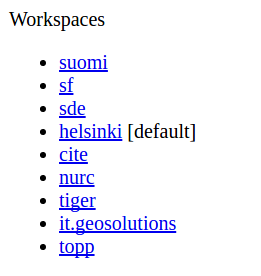
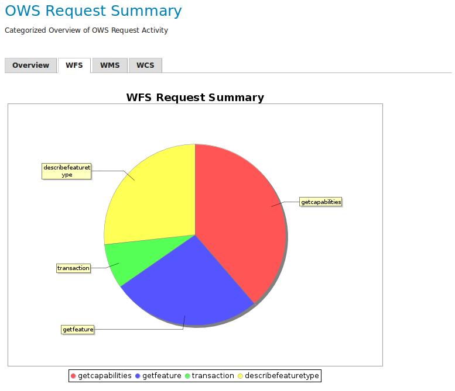

# Exercise 2.3: Architecture and deployment

**Content of the exercise**

This exercise will introduce you to the GeoServer logs and the different settings that affect performance.

**Aim of the exercise**

After the exercise, the student will be able to evaluate GeoServer's performance using logs and identify different problem situations.

**Estimated duration**

30 minutes.

## **Preparation**

The GeoServer server has been loaded with various data and the GeoServer **Monitor** plugin has been installed on the server.

## **General information about the GeoServer server**

Open **About & Status → Server Status** from the left bar of GeoServer. 

The **Locks** function allows you to check existing locks on WFS-T data. If necessary, you can release the locks by pressing **Free locks**.

The **Connections** information refers to the number of vector stores available. 

You can check and release the memory used by GeoServer under **Memory Usage**.

## **Image processing settings**

Check again which Java settings are in use on the server for image processing. By default, it is not very efficient to process images as a whole in computer memory. A commonly used method is to split images into smaller parts (tiles) and do any image operators on the smaller images. The JAI settings (defined in the **Image Processing** settings) control the operation of these methods.

You can edit the JAI (Java Advanced Imaging) settings via **Settings → Image Processing** view. 

PUT A TABLE HERE FROM DOCS (?)

Changes to the settings are visible in the **Server Status** page.

## **Raster Access**

Unlike WMS image requests, WCS requests produce potentially very large image files. In these cases, downloading images from memory is not a good solution and it would be preferable to use a temporary file.

The **Raster Access** settings determine the behaviour of GeoServer when image requests arrive. You can view the settings in the **Settings → Raster Access** view:

+-----------------------------------------+------------------------------------------------------------------------------------------------------------------------+
|                                         | **Raster Access settings**                                                                                      |
+-----------------------------------------+------------------------------------------------------------------------------------------------------------------------+
| **ImageIO cache memory threshold (KB)** | Image requests above this value will be handled using a temporary file cache, otherwise a cache memory will be used  |
+-----------------------------------------+------------------------------------------------------------------------------------------------------------------------+
| **CPU Use**                             | Settings for the processes used during the creation of raster images                                                   |
+-----------------------------------------+------------------------------------------------------------------------------------------------------------------------+

At the end of the **Server Status** view, you will find settings related to the server:

+-------------------------------+---------------------------------------------------------------------------------------------------------------------------------------------------------------------------+
|                               | **Other server settings**                                                                                                                                          |
+-------------------------------+---------------------------------------------------------------------------------------------------------------------------------------------------------------------------+
| **Update Sequence**           | Tells you how many times changes have been made to the server settings.                                                                                                   |
+-------------------------------+---------------------------------------------------------------------------------------------------------------------------------------------------------------------------+
| **Resource cache**            | GeoServer stores store connections, external images, and the configuration of object types, fonts and coordinate systems. If necessary, the cache data can be deleted.  |
+-------------------------------+---------------------------------------------------------------------------------------------------------------------------------------------------------------------------+
| **Configuration and catalog** | All GeoServer configuration settings are loaded into the server memory. If necessary, they can be reloaded.                                                             |
+-------------------------------+---------------------------------------------------------------------------------------------------------------------------------------------------------------------------+

## **GeoServer log**

Explore the contents of the GeoServer log and its settings by making requests to the server using the preview function.

In a separate browser window, open a layer preview (**Layer Preview**) and keep the map window open.

In a different browser window, open **Settings → Global** from the right bar.

In the third browser window, open the GeoServer logs preview (**GeoServer Logs**).

Familiarise yourself with the settings with the guidance of your trainer and by reading more about the settings in the Geoserver manual (**Web Administration Interface → Server → Global Settings**). Open the manual in a separate browser window.

Now perform some operations (zoom in, zoom out, pan) in the map window.

Check if anything was added to the logs: press **Refresh** and the latest lines from the log file will be displayed. You can also reduce the number of log lines (**Maximum console lines**).

The GeoServer installation comes pre-loaded with different log profiles that report different information to the log.

You can now switch between different logging profiles and observe the effects of actions on log files. Try setting the profile to VERBOSE_LOGGING.properties and drag the map. Then refresh the log and see what lines have appeared in the log.

## **REST API functionality**

It is also possible to manage GeoServer server settings via the REST interface.

You can check the data available through the REST interface by typing the following address in a web browser (use the ip address of your own server):

::: code-box
http://[your-training-instance]/geoserver/rest/workspaces/
:::

Find information on the map layers created in the previous exercises.

::: hint-box
How would you implement the storage of a new styling technique in GeoServer using a REST interface?
:::

::: hint-box
Psst! See the description of the REST API in the GeoServer Help.
:::

## **Using the Monitor plugin (tarkista nämä vielä)**

The GeoServer **Monitor** plugin is pre-installed on the training servers and can be seen in the main menu below.

Open **Monitor → Activity**.

Try previewing the different layers and then look in **Monitor → Activity → Daily** at the system activity graph, which should look like this:  
