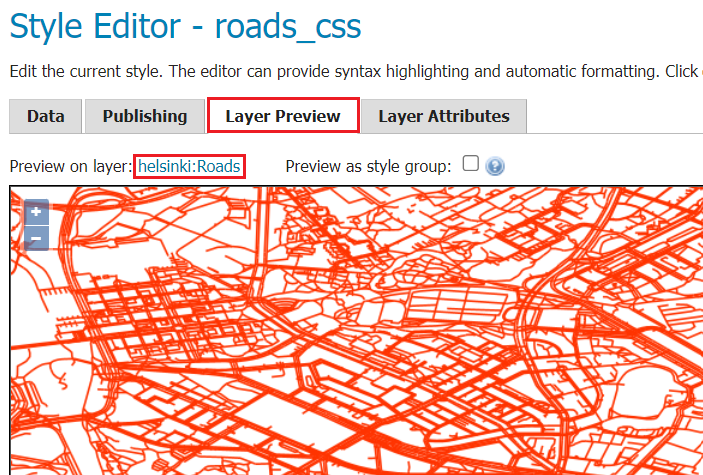

# EXERCISE 2.4: CSS-STYLING

**Content of the exercise**

The exercise will cover styling techniques applicable to different data and make use of CSS styles for visualising maps.

**Aim of the exercise**

After the exercise, the student will be able to use basic styling techniques on GeoServer to visualise different data using the CSS language.

**Estimated duration**

40 minutes.

## **Preparation**

Various data are uploaded to the GeoServer server. The CSS plugin is installed on GeoServer.

## **CSS-styles**

Once the CSS plugin is installed, you can write styles in CSS, which is a more user-friendly way to customize your styles than SLD.

The plugin works by automatically translating code written in CSS into SLD.

## **Creating a style**

Let's create a new style for the **roads** layer.

Open the main menu **Styles** and press **Add a new style**.

Specify **roads_css** as the name of the new style and leave the workspace field empty.

In the **Style Content** menu, select **Line** as the geometry type and press **Generate**.

The **Style Editor** box now contains text like the following:

::: code-box
/\* \@title red line \*/\
\* {\
    stroke: #ff3300;\
}\
:::

Press **Submit**. From the **Styles** menu, open the style you just created and select the **Layer Preview** tab. Select a road layer as the layer to preview.

Zoom in on the map so that the roads start to show up properly.

You can also edit the CSS code in the **Layer Preview** tab. Note the "**\***" character. It means that the rule applies to all items (just like the \* character in a file listing on the command line, for example).  

Now change the **stroke** command to **blue**.

::: code-box
\* { stroke: blue;
:::

Press **Apply** and preview the map. The roads will now appear blue on the map. 

## **Classification of data**

Let's now classify the roads into two categories: **main roads** and **other**. Each category can have its own style.

The main roads are classified by replacing the character "**\***" with the following code (note that the **type** field is used for delimitation):

::: code-box
[type = 'motorway' or type = 'primary' or type = 'secondary' or type = 'trunk']\
{ stroke: red;}
:::

Press **Apply**. Now only the main roads are visible.

Now create a style for the other roads.

Further modify the CSS style as follows:

Copy the classification code for the endpoints and put it at the end of the code box.

Replace the "**=**" character "**less than**" with "**\<\>**" to specify roads that do not belong to the previous classification, i.e. smaller roads.

Change the "**or**" command to "**and**".

Then copy the code snippet from the previous CSS style (the braces and the code inside them) and paste the copied code after the classification section for the other roads.

Change the style of the other roads so that the line colour is black.

The styles of the main roads and other roads now look like this:

::: code-box
[type = 'motorway' or type = 'primary' or type = 'secondary' or type = 'trunk']\
{ stroke: red;}\
[type \<\> 'motorway' and type \<\> 'primary' and type \<\> 'secondary' and type \<\> 'trunk']\
{ stroke: black;}\
:::

Now preview the result by pressing **Apply**. 

## **Tuning the style**

Roads are still difficult to distinguish. Now let's make a few tweaks to the style. Set the stroke width of the main roads to 0.5 with the command "**stroke-width**". Add a new line after "**stroke: red;**" with "**stroke-width: 0.5;**".

In the same way, define a line thickness of **0.1** for the other roads:

::: code-box
[type = 'motorway' or type = 'primary' or type = 'secondary' or type = 'trunk']\
{ stroke: red;\
stroke-width: 0.5;}\
[type \<\> 'motorway' and type \<\> 'primary' and type \<\> 'secondary' and type \<\> 'trunk']\
{ stroke: black;\
stroke-width: 0.1;}\
:::

Then press **Apply** and the preview will be updated: main roads and smaller roads will be more visible.

Next, try adding the following CSS code to create a clearer visualisation style for **main roads**.

Remove the old "**stroke**" definition first. The idea is to visualize the main paths with a yellow and a black line, so that the yellow line is narrower and stays on top of the black line. Ask the trainer for help if needed and replace the style of the suffixes with the following code in the CSS styles editing mode:

::: code-box
stroke: black, yellow;\
stroke-width: 5px, 3px;\
z-index: 0, 3;
:::

Note that in this way you define overlapping styles for the main paths, which form more complex visualisations.

Press **Submit** and visualize the result: 

The **Z-index** command defines the order in which the different styles are drawn. An index value of 0 refers to a black line with a thickness of five pixels. An index value of three refers to a yellow line with a thickness of three pixels. Note how the lower values of the Z-index are drawn first and the higher values are drawn later.

::: hint-box
Psst! Please note that the preview explanation does not understand these complex styles correctly. The tool needs development, but for a quick preview the map is good enough.
:::

Try changing the order, colours and thickness of the symbols.

Your code would look like this at this point:

::: code-box
 [type = 'motorway' or type = 'primary' or type = 'secondary' or type = 'trunk']\
     { stroke: black, yellow;\
     stroke-width: 5px, 3px;\
     z-index: 0, 3;}\
\
 [type \<\> 'motorway' and type \<\> 'primary' and type \<\> 'secondary' and type \<\> 'trunk']\
     { stroke: black;\
     stroke-width: 0.1;}\
:::

## **Category naming**

As an additional task, you can edit the legend texts in CSS. The legend text for the different levels is defined with the "**/\* \@title**" and "**\*/**" closing commands, and placed before the level definitions inside the square brackets as follows. This allows the names to be displayed in the legend of the preview map, and at the same time makes it easier to read the code.

Put **/\* \@title Main roads \*/** in front of the definition of main roads:

::: code-box
 /\* \@title Paatiet \*/\
 [type = 'motorway' or type = 'primary' or type = 'secondary' or type = 'trunk']\
     {stroke: black, yellow;\
     stroke-width: 5px, 3px;\
     z-index: 0, 3;}\
:::

Also put **/\* \@title Sidepaths \*/**: in front of the sidepath definition in the same way.

Add the following code at the end of the code: 

::: code-box
/\* \@title Roads \*/ \* { font-family: Helvetica; }
:::

The above and last level/code defines by the "**\***" tag global CSS style rules, where here the "**Tiesto**" prefix for symbology texts and the **Helvetica** style for map text are defined.

Now press **Apply** to update the map. 

Your code at this point should look something like this:

::: code-box
 /\* \@title Paatiet \*/\
 [type = 'motorway' or type = 'primary' or type = 'secondary' or type = 'trunk']\
     { stroke: black, yellow;\
     stroke-width: 5px, 3px;\
     z-index: 0, 3;}\
\
 /\* \@title Sivutiet \*/\
 [type \<\> 'motorway' and type \<\> 'primary' and type \<\> 'secondary' and type \<\> 'trunk']\
     { stroke: black;\
     stroke-width: 0.1;}\
\
 /\* \@title Roads \*/\
  \* { font-family: Helvetica;}\
:::

## **Multi-scale visibility**

Let's add a snippet of code to assign scale-based cropping to other roads so that they don't show up at all zoom levels:

Put smaller roads in front of the style:

::: code-box
[\@scale \< 50000]
:::

Press **Apply**.

Now other roads will only be shown if the **zoom** level is more accurate than **1:50 000**. And when you zoom out, only the main roads are shown on the map: 

Your code at this point should look something like this:

::: code-box
 /\* \@title Paatiet \*/

 [type = 'motorway' or type = 'primary' or type = 'secondary' or type = 'trunk']

     { stroke: black, yellow;

     stroke-width: 5px, 3px;

     z-index: 0, 3;}

\

 /\* \@title Sivutiet \*/

 [\@scale \< 50000]

 [type \<\> 'motorway' and type \<\> 'primary' and type \<\> 'secondary' and type \<\> 'trunk']

     { stroke: black;

     stroke-width: 0.1;}

\

 /\* \@title Roads \*/ 

 \* { font-family: Helvetica;}
:::

## **Adding subtitles**

We will now add the texts for you.

Open the **Layer Attributes** tab and check that the **name** column, among others, is in the list. Enable it by adding the **label** command to the header code:

::: code-box
label: [name];
:::

Change the letters in the texts:

::: code-box
font-weight: bold; font-fill: black; font-size: 12;
:::

Press **Apply** to preview the results.

The result is not good yet, a few special commands for texts are needed:

::: code-box
-gt-label-follow-line: true; -gt-label-max-angle-delta: 90; -gt-label-max-displacement: 400; -gt-label-repeat: 150;
:::

**-gt-label-\*** tells you how to draw the texts or labels. Try changing the values of the previous commands.

Add a buffer for texts:

::: code-box
halo-color: white; halo-radius: 1;
:::

You can also define names for smaller roads in the same way as we just did for main roads. 

Here is a sample code with all the previously mentioned styles in use:

::: code-box
/\* \@title Paatiet \*/

[type = 'motorway' or type = 'primary' or type = 'secondary' or type = 'trunk']

{ stroke: black, yellow;

stroke-width: 5px, 3px;

z-index: 0, 3;

label: [name];

font-weight: bold;

font-fill: black;

font-size: 12;

-gt-label-follow-line: true;

-gt-label-max-angle-delta: 90;

-gt-label-max-displacement: 400;

-gt-label-repeat: 150;

halo-color: white;

halo-radius: 1;}

\

/\* \@title Sivutiet \*/

[\@scale \< 50000]

[type \<\> 'motorway' and type \<\> 'primary' and type \<\> 'secondary' and type \<\> 'trunk']

{ stroke: black;

stroke-width: 0.1;

label: [name];

font-fill: black;

font-size: 9;

-gt-label-follow-line: true;

-gt-label-max-angle-delta: 90;

-gt-label-max-displacement: 400;

-gt-label-repeat: 150;

halo-color: white;

halo-radius: 1;}

\

/\* \@title Tiesto \*/ 

\* { font-family: Helvetica;}
:::

A preview of this style looks like this on the map: 

You can still try different commands to tune your map beyond the style. The GeoServer CSS plugin website has instructions and examples: <http://docs.geoserver.org/stable/en/user/extensions/css/index.html>.

## **Application of styling technology**

Open the **Publishing** tab and check the **Default** column for the road layer. Press **Apply** to set the style you created as the default style for the road layer. On the **Data → Layers → layer → Publishing** page, check that the default style for this layer is now **roads_css**.

You can still make style updates to the **background map** layer. Open **Data → Layer Groups → Background Map**, and make sure that **Default Style** is checked for all layers in the **Layers** table. Finally, press **Save**.

Preview the **background map** layer. The final result will look like this:

