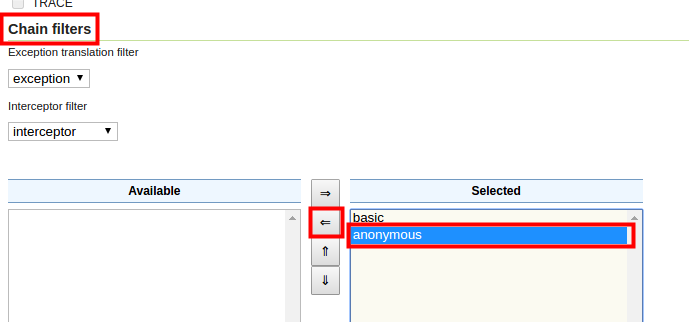
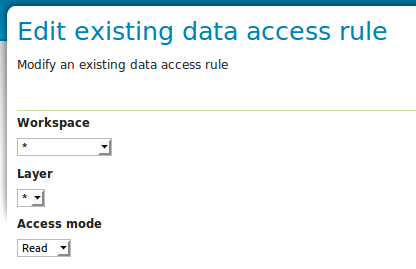
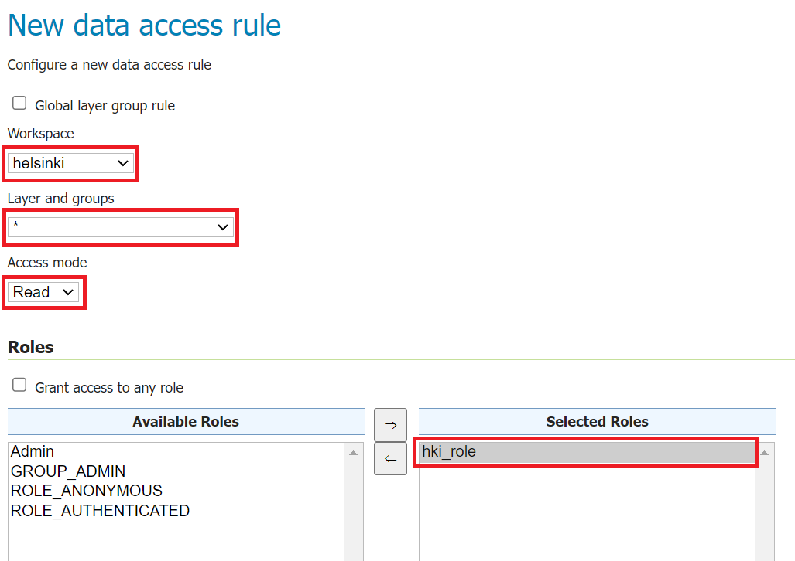
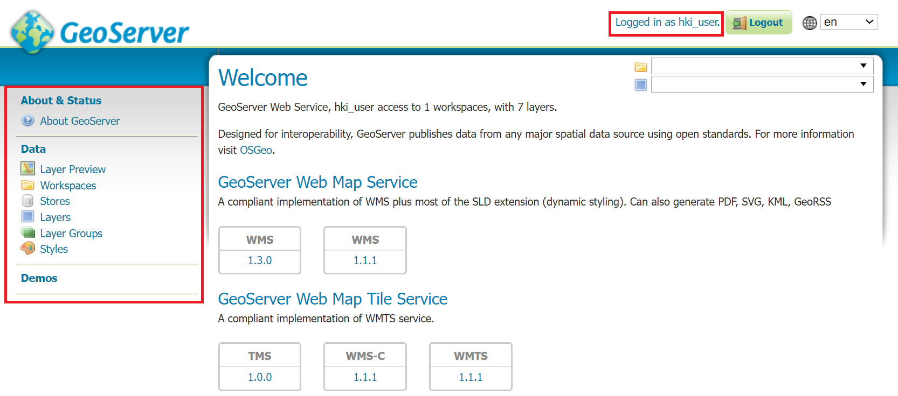
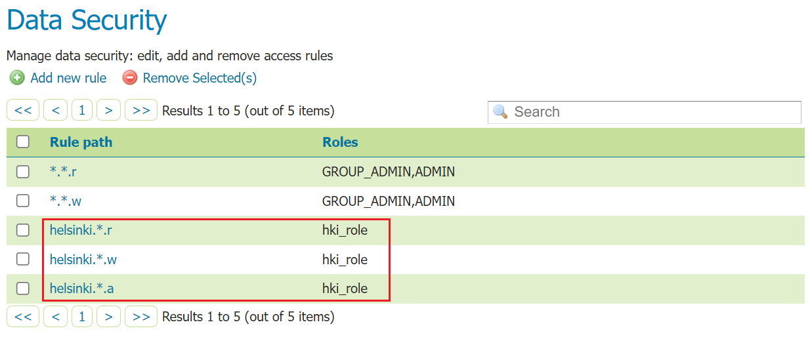

# Exercise 2.5: Access control

**Content of the exercise**

The exercise will introduce the student to different security settings and create users and roles. Set permissions for services, datas and users.

**Aim of the exercise**

After the exercise, the student will be able to set up basic server settings, create users and roles. The student will also be able to set permissions for services and data.

**Estimated duration**

40 minutes.

## **GeoServer general security settings**

Open **Security → Settings** This view allows you to configure commonly used security settings.

In this view, you can also specify which **Active role service** is enabled. GeoServer allows only one role service type to be selected for a server. The role service contains all user, group and role rules for the server. Keep **default** role service enabled.

Under **Encryption** you will find settings related to encryption. The **Encrypt web admin URL parameter** option encrypts the URL parameters of the user interface in the browser.

For example, the URL of the browser in the **Security** menu (where we are now)...

... without encryption is:

::: note-box
[http://[your-training-instance]/geoserver/web/?wicket:bookmarkablePage=:org.geoserver.security.web.SecuritySettingsPage](http://localhost:8080/geoserver/web/?wicket:bookmarkablePage=:org.geoserver.security.web.SecuritySettingsPage){.uri}
:::

... with encryption it is:

::: note-box
[http://[your-training-instance]/geoserver/web/?x=xAiOmyK-CQmBXDhILZrWpny28bhFcImLrBRYk0INwrBDmbzQlmeLRdiaRoNSaBSx3o6elVC9JMPcy5gkRljLXMKGrvMx3Yui3\*ANGkUW-hE](http://localhost:8080/geoserver/web/?x=xAiOmyK-CQmBXDhILZrWpny28bhFcImLrBRYk0INwrBDmbzQlmeLRdiaRoNSaBSx3o6elVC9JMPcy5gkRljLXMKGrvMx3Yui3*ANGkUW-hE){.uri}
:::

::: hint-box
Psst! The installation of Java policy files depends on the Java Software installed on your server. If Open JDK is installed, then the policy files are installed by default and Strong cryptography is enabled. If, on the other hand, Oracle Java is installed (which has been GeoServer's recommendation in the past) then you need to download Oracle's JCE policy jars and extract them to the JRE_HOME/lib/security folder, after which Strong cryptography is enabled.
:::

**Password encryption** specifies which encryption style is used for password storage: **Plain text**, **Weak PBE** and **Strong PBE**.

Hold **Weak PBE** and press **Save**.

## **Identification**

The **Authentication** settings define how GeoServer collects and verifies user IDs.

By default, GeoServer settings allow access to the server (i.e. WMS, WFS and WCS services) without any user ID. You can check this as follows.

Preview the layer **aerialimages_ofthecitycentre** in the same way as you previewed the other layers before. The level will open in your browser without any problems because you are logged in with **admin**. Do not close the preview page yet.

Now go back to the GeoServer maintenance page and press **Logout**.

Return to the preview page and reload the page by pressing F5. The page will still load normally.

Let's now change the settings so that the user must be logged in to access the services, and users who are not logged in will no longer be able to access the services. Open **Security → Authentication** again, search for **Filter Chains** and click on the **default** link.

Now, under **Chain filters**, select **anonymous** from the **Selected** box and move it to the **Available** box using the arrows between the boxes. Anonymous authentication style allows services to be accessed by unauthenticated users.

Now only the **basic** authentication style is in the Selected box, i.e. in use. This means that in the future, you will always need an ID and password to access the server.

Now press **Close** to return to the **Authentication** menu. Then press **Save** and the changes will take effect.

If you now log out of GeoServer and refresh the preview page you opened earlier, authentication with your login and password is mandatory.

::: hint-box
Psst! The easiest way to test the server's access control settings is to use a different web browser (Internet Explorer / FireFox / Chrome) or the browser's privacy encryption feature (Incognito mode) alongside your normal browser. One browser is used to log in with administrator identifiers (as up to now) and the other to test different login modes. You can ask the trainer for guidance if necessary. Please note that you may need to log out and log in again to reload the settings.
:::

## **Create a new role and user**

The user, group and role settings play a key role in GeoServer's access control.

Let's create a new user who only has rights to handle **helsinki** workspace data.

From the main menu, open **Security → Users**, **Groups, and Roles**.

The **Services** tab provides access control settings for users and roles. They store information about which users belong to which groups, or which roles are defined in the access manager in general.

The list contains **default** settings created by GeoServer. Let's take advantage of them now.

First, let's create the role to which the new user will belong.

::: hint-box
Psst! To facilitate access control management, access rights are defined on a role-by-role basis.
:::

Open the **Roles** tab and press **Add new role**, name the new role **hki_role**.

Then press **Save**.

A new user is now created. Open the **Users/Groups** tab.

Note that the **admin** ID you used during the training is defined here.

Create a new user by pressing **Add new user**.

Enter **hki_user** as user name and **hki-user** as password.

::: hint-box
Psst! Please note that special characters and letters ä & ö are allowed in GeoServer, but for reasons of expediency and differences between browsers, their use will be avoided in this training.
:::

A new user is given rights by specifying which roles the user has. The roles are defined in **Roles taken from active role service: default**. Among other things, **hki_role** can be selected, add it to the **Selected Roles** box using the transfer arrows found between the boxes.

Then press **Save**, then a new user **hki_user** has been created and has rights according to **hki_role**. Since no rights have been defined for **hki_role** yet, no rights have been defined for the new user either.

Try new user rights by logging in with a new username. You can either log in again or use a different browser, as mentioned earlier.

## **Limiting access rights to the data**

Open **Security → Data.** This view shows the rules assigned to users (roles) of the GeoServer server. In the default installation, only two rules are defined, i.e. read (r) and write rights (w):

The rules under the **Rule path** column are in the form **\*.\*.r**, which gives read access to all levels in all workspaces.

Please also note that under the **Roles** column it is defined which roles have been granted rights. Defined here with **\*** to mean "all roles".

The following image shows the definition of GeoServer's data rules:

The rule consists of three parts, separated by a period. The first part defines the workspace where the rule is valid. The second part defines the layer on which the rule is valid. The third and last part defines which action is allowed. There are three functions: reading (r = read), writing (w = write) and maintaining (a = admin).

::: hint-box
Psst! The \* character can also be used in all parts, which can be used to refer to all workspaces, layers or rights.
:::

Press **\*.\*.r** from the list.

This rule specifies that all workspaces and all layers have read access.

Under the **Roles** section, it is defined that this rule applies to all roles (**Grant access to any role**). Note that **Grant access to any role** is checked, so all roles can read all levels from all workspaces.

Now let's limit the rule to admin roles only.

Uncheck **Grant access to any role** and add the roles **Admin** and **GROUP_ADMIN** to the box **Selected Roles**.

Finally press **Save**.

Finally, make the same changes to the **\*.\*.w** rule.

After these changes, only **Admin** has read and preview access.

Now try to preview some data with the **hki_user** ID, no data is available.

## **User-specific access rights for the data**

Next, read and write rights to the **helsinki** workspace are defined for the **hki_user** ID. In practice, rights must be defined for the role to which the user belongs, i.e. for the **hki_role** role.

Until now, **hki_role** has not been given any rights, thus **hki_user** no longer has rights to any material (unless some rule has been defined for all roles using the **\*** character).

Let's now add **Read** and **Write** access rights to **hki_user**, but only to the **Helsinki** workspace. This is done by defining more rules for the data.

::: hint-box
Psst! Make sure you are logged in as an administrator (username: admin and password: gispo).
:::

Open **Security → Data** again and now add two new rules using the **Add new rule** option.

In **Workspace**, put **helsinki** and leave **Layer** as "**\***" which refers to all layers.

In the **Access mode** menu, set the value to **Read**, which gives reading rights to the data specified above.

Finally, move **hki_role** from the box **Available Roles**, to the box **Selected Roles**.

Finally press **Save**. 

Now **hki_user** has read rights to all layers of the Helsinki workspace.

Add **Write** in the same way. Write rights allow the user to edit data whenever it is allowed in GeoServer, for example through the WFS-T service.

Try again to preview data with the **hki_user** ID. Preview is now possible with all layers of the **helsinki** workspace, but other layers are not visible.

Please note that the user does not have rights to add new data or layers to GeoServer. You can give **hki_user** ID **Admin** rights by specifying administrator rights.

At the end of the day, three new rules have been created that apply to **hki_role**.

Log in to the server again using the **hki_user** ID and check that the layers of the **Helsinki** workspace are available and that the data can be maintained. Note that the other workspaces are not visible at all.\

 

## **Map service-specific rights**

Geoserver documentation says that “The default service security configuration in GeoServer contains no rules and allows any anonymous user to access any operation of any service. The following are some examples of desired security restrictions and the corresponding rules.” So, this means that there are no rules to be defined. The security page should look like this:

The following image shows the definition of GeoServer's service access rules:

