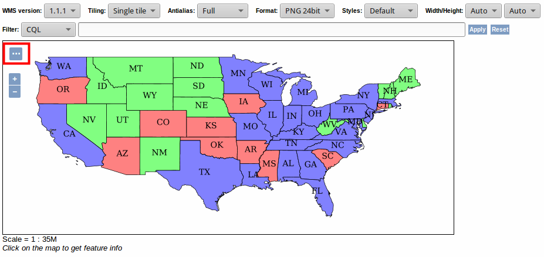

# EXERCISE 2.6: FILTERING

**Content of the exercise**

The exercise will introduce you to CQL (Common Query Language) and ECQL (Extended CQL). 

**Aim of the exercise**

After the exercise, the student will be able to set up filters based on attributes or geometry.

**Estimated duration**

25 minutes.

## Filtering with attributes

Open the **topp:states** data set in the **Layer Preview** window:



Click the button on the top left to open additional options.

You can filter the features displayer on the map with CQL queries. CQL supports comparison operators such as = (equal to), \< (less than), \<= (less than or equal to) and \<\> (not equal to). At their simplest these queries can be for example ```fieldname = 1``` (show only features where the ```fieldname``` is equal to 1) or ```value \> 0``` (show only features whose ```value``` attribute is greater than 0).

::: hint-box
In which states the population exceeds 15 million? First click a state and check which attribute field contains the population number.
:::

::: hint-box
In which states the population is greater than a million but less than 3 million? How many states are displayed? You can use the operator "BETWEEN - - AND - - ".
:::

::: hint-box
Which states' names begin with the letter C? Use the LIKE operator and the wildcard symbol "%". Insert the state's name in single quotes (' ').
:::

::: hint-box
Which states have more male residents?
:::

::: hint-box
Which states intersect the 100th meridian west (100ºW)? Use this as a basis for the query: "BBOX(geometry_column, xmin, ymin, xmax, ymax)". The geometry column is named "the_geom".
:::

You can find more specific tutorials in the GeoServer documentation (**Tutorials → CQL and ECQL**).

Filter the WMS service of the **topp:states** so that only states with an unemployment rate less than 5% are displayed.

Add a style to the **topp:states** layer in which a point is displayed at the centroid of the state. Add grey borders for the states to the style.
