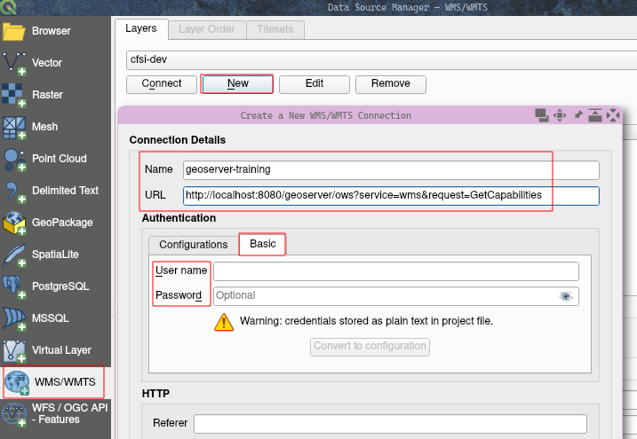
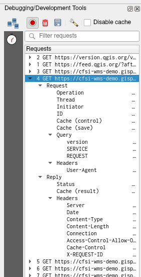

# Security and user management

GeoServer can be used to serve private information and spatial data to authenticated users.
One of the key functions of GS Layer security is preventing unauthorized access to such data.

A common measure to prevent accidental data leaks is to set up strict default security rules that block unauthenticated users from reading any data.
Read access can then be explicitly granted to specific workspaces or layers.

## Exercise - layer security

This exercise focuses on securing data access in GS.

### Check default permissions {#permissions}

Open a new incognito browser window (Ctrl+Shift+N in Chrome).
This is an easy way to test the behaviour of GS as an unauthenticated user.

Open the URL of your GS instance, and see if you can open the WMS GetCapabilities document.
If you have QGIS or another desktop GIS installed, add the WMS as a data source without providing a username/password and add a layer.



Optional: after opening the Capabilities document, pick a layer and form a GetMap query following the [WMS reference](https://docs.geoserver.org/latest/en/user/services/wms/reference.html) of GS documentation.
Run the GetMap query from your web browser, you should see an image as a result.
Here's an example that works if your GS instance uses the default demo dataset:

```
On one line for copying:
http://<base-url>/geoserver/ows?SERVICE=WMS&VERSION=1.3.0&REQUEST=GetMap&BBOX=24.95596700000000112,-124.7314220000000091,49.37173500000000104,-66.96984899999999641&CRS=EPSG:4326&WIDTH=1827&HEIGHT=772&LAYERS=topp%3Astates&STYLES=&FORMAT=image/png&DPI=96&MAP_RESOLUTION=96&FORMAT_OPTIONS=dpi:96&TRANSPARENT=TRUE

Split to multiple lines for clarity:
http://<base-url>/geoserver/ows?SERVICE=WMS
&VERSION=1.3.0
&REQUEST=GetMap
&BBOX=24.95596700000000112,-124.7314220000000091,49.37173500000000104,-66.96984899999999641
&CRS=EPSG:4326
&WIDTH=1827
&HEIGHT=772
&LAYERS=topp%3Astates
&STYLES=
&FORMAT=image/png
&DPI=96
&MAP_RESOLUTION=96
&FORMAT_OPTIONS=dpi:96
&TRANSPARENT=TRUE
```

:::{.hint-box}
**Hint**: if you have QGIS, an easy way to generate such queries is to use the Debugging/Development Tools panel.
:::

Open the panel from the QGIS menu under View → Panels.
Click the red "record" button in the panel to start recording queries.
Next, add a WMS layer and pan or zoom around the map.
You should see a list of queries made by QGIS in the Debugging/Development Tools panel:



Right-click a query and select "Open URL" to open the query in a browser window, you should see an image.

### Prevent unauthenticated access

Now it's time to create strict default rules to prevent access to any workspace.

Log in to GS, and follow the example in [Locking down GeoServer](https://docs.geoserver.org/latest/en/user/security/layer.html#locking-down-geoserver)
to secure every layer and workspace from unauthenticated users.
After setting the default rules, select 2 or 3 layers that you want to make publicly available.
Create or modify layer security rules to publish these layers.

### Verify rules

After setting layer security rules, it's time to test if they work.
Open another incognito browser window, open the URL of your GS instance, and try to open the WMS Capabilities document.
Can you open the document, why?

Try a GetMap query on one of the layers you decided *not* to publish.
The easiest way to do this is to open QGIS, add the WMS as a data source and add the layer to the map.
You should get an error message and not be able to see any image output.
You can also run the GetMap query in your web browser.

Try another GetMap query, this time on one of the layers you decided to make publicly available.
This time you should get an image as a result.

Finally, make an authenticated GetMap query.
This is easiest to do using QGIS by modifying the WMS data source (or adding a new one), and adding a username and password.
Then try to add a private layer to the map, you should see an output image.

## Extra — service-level settings

Access can be granted not only to layers but also services, and even to only specific service requests.
Try allowing public access to WMS, but prevent unauthenticated users from accessing the GetFeatureInfo request.

:::{.hint-box}
**Hint:** create a new rule from Security → Services.
:::

Like GetMap requests, the response format of GetFeatureInfo requests can also be defined using a parameter.
GetFeatureInfo supports GML2, plain text, GeoJSON, and HTML responses.
You can read more about the GetFeatureInfo request in the [GeoServer documentation](https://docs.geoserver.org/latest/en/user/services/wms/reference.html#getfeatureinfo).
GeoServer also supports [GetFeatureInfo templates](https://docs.geoserver.org/latest/en/user/tutorials/GetFeatureInfo/index.html) that can be used to customise the response HTML/GeoJSON document.

An easy way to test if your new rule works is with QGIS.
Add a WMS layer, select the blue "info" button in the top toolbar (Identify Features tool) and click on a feature on the map.
You should see attributes of the clicked layer in a side panel.
QGIS fetches this information using a GetFeatureInfo request — see the Debugging/Development Tools panel to see the request and verify.
Configure GS so the request does not work without providing login credentials.
