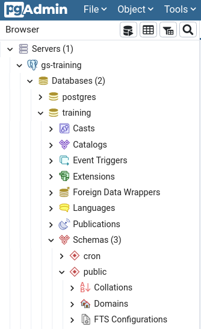
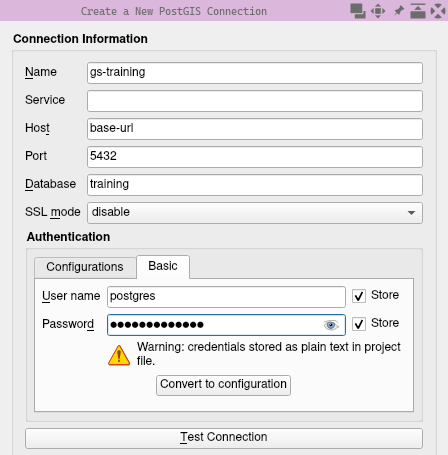
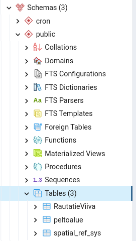
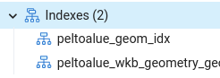
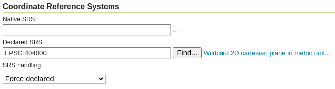

# Optimising vector data {#vectors}

While vector datasets are typically smaller compared to rasters, they can still grow to a size where optimisations are needed.
The single most important performance optimisation for vector data is indexing.
Adding a spatial index to a vector dataset greatly improves the read performance, as it improves the efficiency of spatial queries such as filtering by bounding box.

Vector data can be stored in multiple formats, the most common of which used to be ESRI Shapefile (.shp).
While shapefiles are still supported by the majority of GIS software, many better solutions exist.
For more reasons on why you shouldn't keep using shapefiles, see [switchfromshapefile.org](http://switchfromshapefile.org/).
GeoPackage is a popular, modern file format that allows storing multiple layers within a single file.
However, the most efficient way to store and utilise vector data is to not use files at all, and instead use a spatial database.

PostGIS is a spatial extension to the open-source PostgreSQL RDBMS.
It provides a suite of database functions and data types to handle and process spatial data.
The following exercise is focused on utilising PostGIS as a primary vector data store for GeoServer.

## Exercise - PostGIS and GeoServer

Besides GeoServer, the training machine provided to you has a PostGIS database for training purposes.
While this is not a PostGIS course, it's highly useful to learn how to load data to PostGIS and publish it using GeoServer.

Let's examine the database using pgAdmin 4, a browser-based database management tool for PostgreSQL.
To access pgAdmin, open the url `http://<base-url>/pgadmin4`.
Log in with the following credentials:
```
username: training@gispo.fi
password: gispotraining
```

:::{.note-box}
**Note:** if not using the training machine, PostgreSQL/PostGIS and pgAdmin can be installed locally with a small effort using Docker.
The training machine is using the containers [kartoza/postgis](https://hub.docker.com/r/kartoza/postgis) and [dpage/pgadmin4](https://hub.docker.com/r/dpage/pgadmin4/).
If running Postgres locally, `localhost` should be used as hostname.
:::

---

After logging in to pgAdmin, add a new database connection by clicking on Object → Create → Server in the top menu.
Give the new server a name, and switch over to the Connection tab.
Input the following details:

```
host name/address: postgres
port: 5432
maintenance database: postgres
username: postgres
password: gispotraining
```

After clicking save, you should now have the server visible in the sidebar.
Click on the small arrow next to the server name to see more details.

.

Take note of the different databases on the server and what schemas and tables they contain.

### Loading data into PostGIS

The `training` PostGIS database on the training machine contains no data, so the first order of business is to add some.
Pick any vector dataset you have on your own machine, or download a sample dataset from `http://<base-url>/data`.
As an example, we use `geoserver/nlsfi/YK_1M/RautatieViiva.shp` and other shapefiles from the same directory.

:::{.note-box}
**Note:** if downloading shapefiles from `http://<base-url>/data`, make sure to download all files with the same base name.
I.e., download `RautatieViiva.(shp & .shx & .dbf & prj)` and place all the files in the same directory.
:::

There's multiple ways of loading data to PostGIS, but we present two: QGIS and ogr2ogr.
QGIS is easier, while ogr2ogr is more powerful.
You can try both or pick only one, if you're already familiar with one of the methods it's a good idea to try the other one.

#### Loading data with QGIS

Loading data with QGIS is simple.
First, add a new database connection.
The connection parameters are mostly the same as before, but with a few notable exceptions.

```
host: <base-url> (without http:// prefix)
port: 5432
database: training
username: postgres
password: gispotraining
```

:::{.hint-box}
**Hint:** make sure to check store next to username and password.
Not storing the credentials can result in some unexpected inconveniences later on.
:::



Click on the Test connection button and verify everything works, then click OK.

Next, add the vector dataset of your choice to QGIS.
Open the QGIS browser panel if it's not already visible, by clicking View → Panels → Browser.
Expand PostGIS in the browser panel by clicking on the small arrow, then expand the database you just added, and then the public schema.
Finally, add the data to PostGIS by simply dragging the layer from the Layers panel to the public schema in the browser.

Another option is to use the DB Manager plugin, which can be opened from the top menu by clicking Database → DB Manager.
A new window opens.
Connect to the training database in the Providers panel by clicking on the small arrows, then click on the Import Layer/File button.
Fill the form and click OK.

After adding data to PostGIS, you can verify everything works by creating a new project and trying to add a layer from the database.
The easiest way to do this is to simply double-click a layer in the Browser panel, where you should be able to see layers you have added.

#### Loading data with ogr2ogr

Another way to load data to PostGIS is by using ogr2ogr, a powerful command-line tool.
If you have QGIS installed on Windows, ogr2ogr is available from the OSGeo4W shell, which you should be able to open from the start menu.

If you already added the RautatieViiva layer using QGIS, you can try loading another dataset from the `geoserver/nlsfi/YK_1M` directory.
For example, to load `PeltoAlue.shp` to the training database using ogr2ogr, run the following command:

```
ogr2ogr -f "PostgreSQL" "PG:host=<base-url> user=postgres dbname=training password=gispotraining" PeltoAlue.shp
```

Replace <base-url> with the address of your training machine, without the `http://` prefix or the final `/`.

:::{.note-box}
**Note:** in some cases, you may get an error relating to invalid geometry types when running ogr2ogr.
If this happens, you may have to explicitly set the geometry type using the `-nlt` flag.
See the [ogr2ogr documentation](https://gdal.org/programs/ogr2ogr.html#cmdoption-ogr2ogr-nlt) for more details.
:::

### Indexing

By now, you should have loaded some data into the training database.
Open pgAdmin again, right-click on the server on the Browser panel, and select Refresh.
This updates the database contents in the browser.
Then browse to the training database and see what tables the public schema contains.



Review all tables you have added and see what indexes they contain.
If you added data with ogr2ogr, the table should have an index such as `peltoalue_wkb_geometry_geom_idx`.
If you used the QGIS drag-and-drop method, you will likely find there are no indexes for those tables.

Try adding spatial indexes to tables you added.
If all tables are already properly indexed, try deleting the indexes.
Another option is to create another index on the same column but with a different name — a single column can have multiple indexes.

For instructions on how to add and remove spatial indexes, see [PostGIS documentation](http://postgis.net/workshops/postgis-intro/indexing.html).
The documentation also contains an explanation on how spatial indexing works and how it improves performance.

:::{.hint-box}
**Hint:** you can enter SQL queries in pgAdmin using the query panel, click Tools → Query Tool to open it.
:::

Create a new spatial index with:

```
CREATE INDEX peltoalue_geom_idx
ON public.peltoalue
USING GIST (wkb_geometry);
```

:::{.note-box}
**Note:** you may have to change the table name (public.peltoalue) and/or column name (wkb_geometry) to match the names in your database.
:::

Verify the spatial index was created correctly by using the pgAdmin browser (remember to right-click and select refresh first).



Overlooking the importance of indexes, whether they are spatial or not, is an easy way to degrade database performance.
Neglecting spatial indexing is a typical mistake when beginning to work with spatial databases.

Optional: try adding a non-spatial index to the id column of a table.
Non-spatial indexes can significantly increase database query performance when filtering or sorting by the indexed column.
See the [PostgreSQL documentation](https://www.postgresql.org/docs/current/sql-createindex.html) for instructions.

### Publish to GeoServer

After adding data to PostGIS and adding spatial indexes, it's time to publish using GeoServer.
Log in to GS using your admin account and add a new PostGIS store.
Fill in the same connection parameters used for pgAdmin: set hostname to `postgres`, database to `training`, and schema to `public`.
Also remember to fill the username and password.

After adding the store, publish a new layer from the store you just created.
You should be able to see the layers you added to PostGIS.
Finally, verify everything works OK by looking at the published layer using Layer Preview.



The image above shows missing "Native SRS" definition for the peltoalue layer added to PostGIS using ogr2ogr.
While the layer can still be published, it cannot be properly rendered by GeoServer.
This issue could have been avoided by using the flag `-a_srs "EPSG:3067"` when running ogr2ogr.
Fortunately, GeoServer has a quick way to fix the problem.
Click the Find button to select the correct EPSG (3067) as the Declared SRS and set SRS handling to "Force declared".
The layer should now behave normally.

:::{.hint-box}
**Hint:** A better solution would be to fix the root cause by setting the SRS in the database.
Read the documentation of the PostGIS [UpdateGeometrySRID](https://postgis.net/docs/UpdateGeometrySRID.html) function and see if you can fix the issue with pgAdmin.
Verify results by trying to publish the layer again — Native SRS should now be correctly recognised as EPSG:3067.
:::
