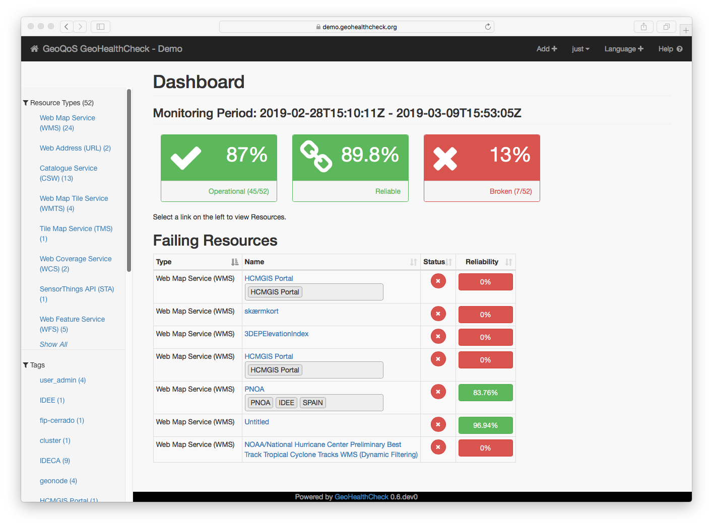
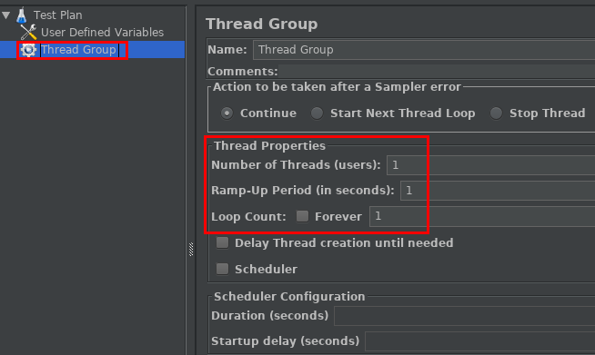
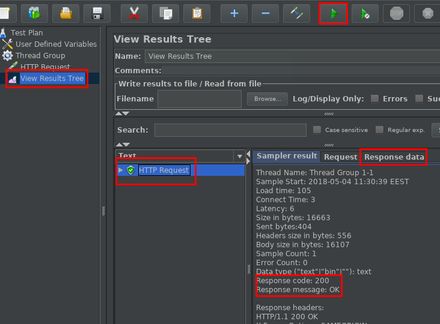

# Extensions {#extensions}

The functionalities of GeoServer can be expanded using various extensions.
These extensions are divided to two categories: extensions, which are officially supported plug-ins, and community modules, which are more experimental in nature.

Many features that are available in a current base installation of GeoServer by default were once implemented as part of an extension and later integrated to the GS core.

The source code of available extensions can be viewed at the [official GeoServer GitHub repository](https://github.com/geoserver/geoserver/).
Both [extensions](https://github.com/geoserver/geoserver/tree/main/src/extension) and [community modules](https://github.com/geoserver/geoserver/tree/main/src/community) are located under the src directory.

Community modules can only be installed on the absolute latest version of GeoServer, called the nightly build.
For this reason alone, they are not suitable for use in production environments.
Extensions are listed on the GeoServer [downloads page](http://geoserver.org/release/stable/) and distributed through SourceForge.
Most extensions are installed by simply downloading a zip file, extracting its contents to the correct location, and restarting GeoServer.
If running GS with Docker using the `kartoza/geoserver` image, extensions can be installed and uninstalled by modifying the `STABLE_EXTENSIONS` environment variable.

However, it's best to always check the documentation of the extension before installing.
Documentation for all extensions can be found on the main [GeoServer documentation](https://docs.geoserver.org/stable/en/user/extensions/index.html) page.
Pick 2-3 interesting extensions from the documentation page and try to answer the following questions:

- What is the main purpose of the extension, what functionalities or features does it add?
- What possible use cases do you have for it?
- How to install the extension?

## Useful tools {#gs-tools}

There are many useful tools for managing, monitoring, and configuring GeoServer.
[GeoHealthCheck](https://geohealthcheck.org/) is a Quality-of-Services (QoS) monitor for geospatial web services written in Python.
The easiest way to setup GeoHealthCheck is to use the [geopython/geohealthcheck](https://hub.docker.com/r/geopython/geohealthcheck) Docker image.
The [GeoHealthCheck documentation](https://docs.geohealthcheck.org/en/latest/) provides details on how to configure and use GeoHealthCheck.



Apache JMeter is another useful tool to use in conjunction with GeoServer.
JMeter is an open source Java tool designed for performing load testing and performance measurements.
If you have Java 8+ on your machine, you can download the latest binary version of JMeter from the [Apache website](https://jmeter.apache.org/download_jmeter.cgi).

If you don't have Java and are unable to install it, load testing can also be done on various online platforms, including [LoadView](https://www.loadview-testing.com/), [Flood](https://www.flood.io/tools/jmeter), and [Loader](https://loader.io/).
One advantage of these online platforms is easily being able to create multiple load generators running in parallel.
However, simulating concurrent load from multiple locations does not require using an online load testing service, as JMeter does support [distributed testing](https://jmeter.apache.org/usermanual/jmeter_distributed_testing_step_by_step.html).
With some additional setup work, this allows JMeter to run test plans on multiple machines simultaneously.

:::{.note-box}
**Note:** while services such as Flood usually provide a free tier, their use is typically limited to a set number of virtual user hours.
In order to use the services, you have to create an user account.
Most services also require you to provide credit card details before being able to actually run any load tests.
For this reason, the following exercise \@ref(jmeter) focuses exclusively on JMeter.
:::

## Exercise - JMeter {#jmeter}

Download and install the latest binary release of Apache JMeter in a zip archive from the [download page](https://jmeter.apache.org/download_jmeter.cgi).
Extract the archive and try opening the JMeter GUI by running the file `jmeter.bat` (on Windows), located inside the `bin` directory.


:::{.note-box}
**Note:** if you are unable to open JMeter, you may not have Java installed.
You can try installing the latest version of OpenJDK by following instructions on the [install page](https://openjdk.java.net/install/).
If you are unable to install Java or run JMeter, you can still follow the exercise by reading along.
:::

The JMeter GUI allows you to design test plans.
Actually running the tests is recommended to be done using the command line, but the GUI does allow you to quickly see if a test is working or not.
The UI consists of three main components: the toolbar on top, the test panel on the left, and the properties of a single test in the middle.

Let's build a simple test plan to run GetCapabilities requests on the WMS on your GeoServer training instance.
We need a HTTP Request element to make GetCapabilities requests to our server.
However, let's add a Thread Group element first.
These are used to generate multiple concurrent requests.
Add a new thread group by right-clicking on the Test Plan and choosing Threads (Users) → Thread Group.



By default, the number of threads and loop count are both 1, meaning the test plan is performed only one time.
Leave these values to default for now.
Later you can increase these values to 10 to run 10 GetCapabilities requests simultaneously for 10 times for a total of 100 requests.

Now, add the HTTP Request element by right-clicking on the **Thread Group** (not the test plan) in the test panel on the left and selecting Add → Sampler → HTTP Request.
Add in the following details:

```
Server Name or IP:  <base-url>
Port Number:        80
Method:             GET
Path:               geoserver/ows?
```

Add parameters to the HTTP request by clicking on the Add button near the bottom of the window.
Double-click on the empty column under Name or Value to set the values.
Add the following three parameters:

```
Name        Value
service     wms
version     1.3.0
request     GetCapabilities
```

Finally, before running our test, let's add an element to review our results.
Right-click on the **thread group** and select Add → Listeners → View Results Tree.

Now we can run the test by clicking on the green Start button in the top toolbar.
After running the test, view the results of the HTTP request by clicking on the View Results Tree element in the left panel.



The capabilities document can be examined on the Response data tab.
You can now try scaling up the test by changing the thread and loop count variables of the thread group to 10.
You can also try adding a ramp-up period.
For example, with 10 threads and 20 seconds of ramp-up time, a new thread/user is added every 2 seconds, until the maximum of 10 threads is reached or the test is aborted.

JMeter has many advanced features, including creating graphs and summaries of test runs.
It can also be used to generate random values within a given range.
This is highly useful for testing geospatial services such as WMS which require users to provide a bounding box as a parameter.
Making repeated requests with an identical bounding box can quickly lead to cache utilisation, which in is highly unlikely in typical WMS use.
Randomly generating a bounding box value prevents the server and network from caching the results, leading to more realistic results.

Try creating a new test plan that makes WMS GetMap requests to the training instance.
At first, don't worry about randomising the bounding box or other parameters, simply try to create a test plan that works.
If you need help with the parameters, take a look at the [WMS reference]() in the GS docs.
You can also use the Developer/Debugging Tools of QGIS to get a ready GetMap request, see Chapter \@ref(permissions) for more details on this.

After creating a successful GetMap test plan, try adding some randomisation.
It's easiest to start with randomising the layer name.
Try to edit the test plan so the layer name variable is selected randomly from three options, such as `tiger:poi`, `tiger:roads`, and `tiger:poly_landmarks`.
Ideally, the layers should be from the same area, so they can be called using the same bounding box.

:::{.hint-box}
**Hint:** add a random variable element by right-clicking in the test panel and selecting Add → Config Element → Random Variable.
These can be used to generate random numbers from within a range, such as 1-3.
You'll also need user defined variables element to create a connection from the number to layer name, add one by selecting Add → Config Element → User Defined Variables.
:::

You can also take a look at the [WMS simple performance tester](https://drive.google.com/file/d/1Y9C33ELky_9wEE9KBwKLg_7DNJ_8rUMD/view?usp=sharing) test plan for more inspiration on testing WMS with JMeter.
Simply download the .jmx file and open it with JMeter by clicking File → Open.
It may also be helpful to consult the official [JMeter user manual](https://jmeter.apache.org/usermanual/).
