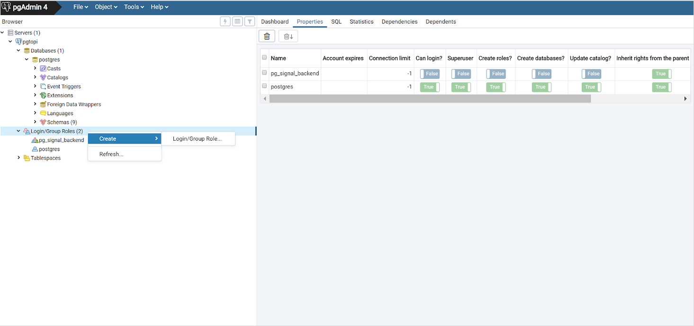

# Harjoitus 9: PostgreSQL:n ylläpito

**Harjoituksen sisältö** - PostgreSQL:n ylläpitoon liittyviä aiheita.

**Harjoituksen tavoite** - Opiskelija tuntee PostgreSQL:n ylläpitoon liittyviä perusasioita.

### Valmistautuminen

Avaa [pgAdmin](/pgadmin) selaimeen ja kirjaudu sisään.  Avaa **Query Tool** (Valitse _trainingdatabase_ **->** Ylhäältä **Tools** **->** **Query Tool**).

## Harjoitus 9.1: Taulutilat

Tarkista koulutuspalvelimen oletustaulutilojen sijainti. Käyttäjien tiedot sijaitsevat **pg_default**-taulutilassa, joka on data_directoryn base-hakemistossa. Järjestelmän yleiset tiedot sijaitsevat **pg_global**-taulutilassa, joka on data_directoryn global-hakemistossa. Datahakemiston sijainnin voit tarkistaa komennolla:

:::code-box
```sql
SHOW data_directory;
```
:::

## Harjoitus 9.2: Käyttäjäroolit

Oletusarvoisesti PostgreSQL:ään luodaan postgres-niminen rooli ja samanniminen tietokanta. Aiemmin harjoituksissa on luotu koulutusta varten tietokanta (trainingdatabase). Voit luoda uuden käyttäjän tietokantapalvelimeen seuraavalla SQL-komennolla:

:::code-box
```sql
DROP ROLE IF EXISTS matti;

CREATE ROLE
matti
LOGIN PASSWORD
'1234'
CREATEDB
VALID UNTIL
'infinity';
```
:::

**CREATEDB**-parametri määrittää roolille oikeudet tietokantojen luomiseen. VALID-parametri määrittää roolin voimassaolon ajan (tässä tapauksessa ikuisesti).

Luo uusi ylläpitäjän rooli seuraavalla SQL-komennolla:

:::code-box
```sql
DROP ROLE IF EXISTS dba;

CREATE ROLE
dba
LOGIN PASSWORD
'1234'
SUPERUSER
VALID UNTIL
'2050-12-31 00:00';
```
:::

Uudella roolilla on ylläpitäjän oikeudet (SUPERUSER) ja se on voimassa 1. tammikuuta 2024 asti.
Voit tarkastella käyttäjien tietoja pgAdminin puuhierarkian kohdassa **Login/Group Roles**.

## Harjoitus 9.3: Ryhmäroolit

Ryhmäroolit (group roles) luodaan seuraavalla SQL-komennolla:

:::code-box
```sql
DROP ROLE IF EXISTS admins;

CREATE ROLE
admins
INHERIT;
```
:::

INHERIT-parametri tarkoittaa sitä, että kaikki **our_admins**-ryhmän sisällä olevat roolit perivät ryhmän oikeudet. Poikkeuksena, **superuser**-oikeus ei koskaan periydy PostgreSQL:ssä.

Lisää roolit matti ja dpa ryhmään admins seuraavasti:

:::code-box
```sql
GRANT
admins
TO
matti, dba;
```
:::

Voit vaihtaa rooleja komennolla **SET ROLE**:

:::code-box
```sql
SET ROLE
matti;
```
:::

Käytössä olevan roolin voi tarkistaa komennolla:

::: code-box
```sql
SELECT current_user;
```
:::

Kokeile komentoa SELECT session_user.

:::code-box
```sql
SELECT ...
```
:::

:::hint-box
Mikä on current_user ja session_user välinen ero?
:::

## Harjoitus 9.4: Roolien lisääminen käyttöliittymässä



Roolien hallinta on selkeämpää pgAdminin käyttöliittymässä. Lisää uusi käyttäjä, valitse salasana ja lisää hänet myös admins-ryhmärooliin, huomaa SQL-välilehdelle muodostuva SQL-lauseke. Roolien poistaminen tapahtuu **DROP ROLE < roolin nimi >** -komennolla.

## Harjoitus 9.5: Uuden taulutilan luominen

Uutta taulutilaa varten pitää luoda ensin palvelimelle kansio. Kansion tulee olla postgres-käyttäjän omistuksessa ja käyttöoikeudet vain postgres-käyttäjälle. Hakemisto on luotu valmiiksi palvelimelle komennoilla:

```
sudo mkdir /usr/local/tmp_tbls
sudo chown -R postgres:postgres /usr/local/tmp_tbls/
sudo chmod 700 /usr/local/tmp_tbls/
```

Luo uusi taulutila SQL-komennolla psql:n tai pgAdminin avulla:

:::code-box
```sql
CREATE TABLESPACE tmp_tablespace
LOCATION '/usr/local/tmp_tbls';
```
:::

## Harjoitus 9.6: Tietokannan ja taulun taulutilan muuttaminen

Koko tietokannan taulutilan voi muuttaa yhdellä komennolla.

:::hint-box
**HUOM!** Tätä ei kuitenkaan voi tehdä jos tietokantaan on auki aktiivisia yhteyksiä!
:::

1. Sulje pgAdminin tietokantayhteys harjoitustietokantaasi klikkaamalla tietokantaa sivupaneelissa hiiren oikealla painikkeella ja valitsemalla **Disconnect Database**.
2. Avaa tämän jälkeen sivupaneelista postgres-tietokanta ja avaa **Query tool** (voit tehdä tämän myös psql:n avulla). Anna komento:

:::code-box
```sql
ALTER DATABASE trainingdatabase
SET TABLESPACE tmp_tablespace;
```
:::

:::hint-box
Mikäli tämä ei onnistu, ja pgAdmin4 kertoo, että tietokantaan on aktiivisia yhteyksiä, yritä kirjautua ulos ja takaisin sisään pgAdminiin.
:::


Jos joki yhteys jää auki niin voit tarvittaessa sulkea kaikki muut yhteyder käyttmällä seuraavaa kyselyä:

:::code-box
```sql
SELECT pg_terminate_backend(pid)
FROM pg_stat_activity
WHERE datname = 'trainingdatabase'
  AND pid <> pg_backend_pid();
```
:::

Voit tarkistaa tietokannan taulutilan sijainnin SQL-kyselyllä:

:::code-box
```sql
SELECT
spcname, pg_tablespace_location(oid)
FROM
pg_tablespace;
```
:::

Huomaat, että taulutilan sijainnin kohdassa on tyhjää. Tämä tarkoittaa, että taulutila sijaitsee kotihakemistossa.

Luo testausta varten tilapäinen taulu:

:::code-box
```sql
DROP TABLE IF EXISTS tmp_table;

CREATE TABLE tmp_table AS
SELECT x
FROM
generate_series(2,5000,2) AS x;
```
:::

Taulun käyttämän taulutilan voit tarkistaa seuraavalla komennolla:

:::code-box
```sql
SELECT
tablename, tablespace
FROM
pg_tables
WHERE
tablename = 'tmp_table';
```
:::

Muuta taulun taulutilaa seuraavalla komennolla:

:::code-box
```sql
ALTER TABLE
tmp_table
SET TABLESPACE
tmp_tablespace;
```
:::

Tarkista, että taulun taulutila on nyt muuttunut. Voit myös käyttää pgAdminin käyttöliittymää taulutilojen tarkastamiseen.

## Harjoitus 9.7: Indeksin taulutilan muuttaminen

Voit luoda indeksin tauluun komennolla:

:::code-box
```sql
CREATE INDEX
idx_tmp_x
ON tmp_table(x);
```
:::

Indeksit luodaan oletusarvoisesti **pg_default**-taulutilaan. Usein käytetyt indeksit voi olla tarpeen tallentaa sellaiseen taulutilaan, joka käyttää palvelimessa olevaa nopeinta levyä (esimerkiksi SSD-levyt). Indeksien taulutilan muuttaminen onnistuu seuraavasti:

:::code-box
```sql
ALTER INDEX
idx_tmp_x
SET TABLESPACE
tmp_tablespace;
```
:::

