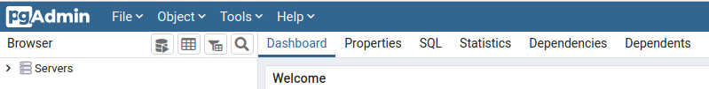
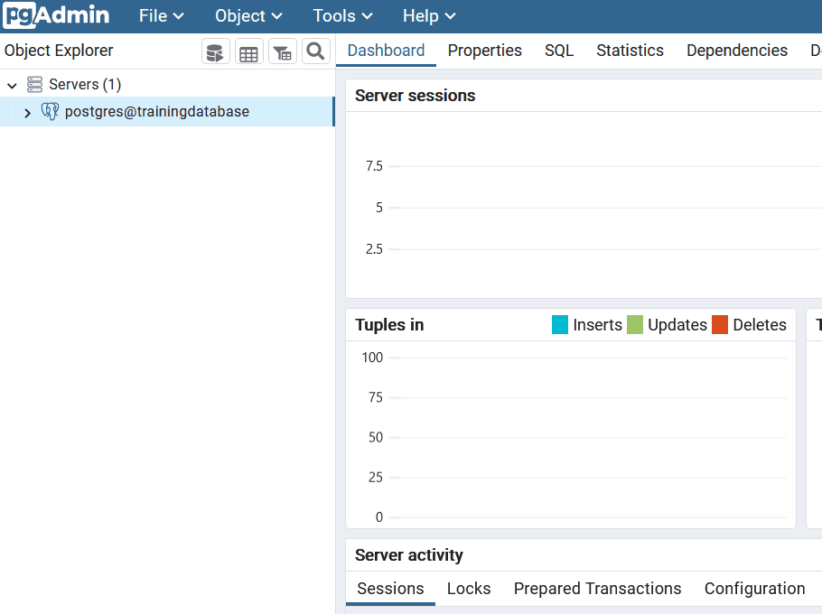
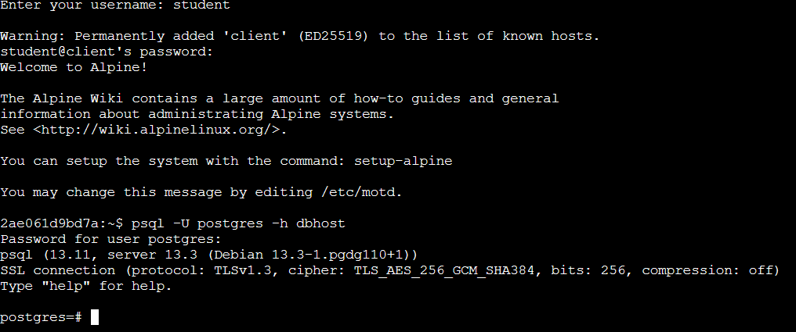
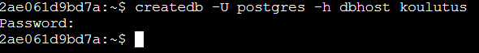

# Exercise 1: Training environment

**Contents** -- This exercise is an introduction to the pgAdmin 4 interface and psql. The exercise also covers how to create a new PostGIS database.

**Goal** -- After the exercise the trainee understands the basics of using pgAdmin 4 and psql.

## Exercise 1.1: pgAdmin 4

Start up pgAdmin 4 by following this link: [/pgadmin](/pgadmin). You can log into pgAdmin 4 which is hosted on a remote server with the following credentials:

TODO: päivitä ohjeet kirjautumiseen


### Registering a server connection

Connect the training environment's database to pgAdmin by right clicking **Servers** and choosing **Register \> Server...**. Enter the following information:

TODO: päivitä ohjeet kirjautumiseen

-   In the General tab
    -   Name: Name of the connection (typically \<username\>@\<database\>)
    -   In the Connection tab
        -   Host: **dbhost**
        -   Port: **5432**
        -   Maintenance database: **postgres**
-   Choose **Save password** if you don't want to rewrite your password when opening the connection

You can inspect the connected database in pgAdmin from the different tabs in the top panel:



PostGIS databases can also be used in other applications (with the psql commandline tool or with the QGIS **DB Manager**). The database looks like this in the QGIS **database manager**:


### Creating the training database

Let's create a database named **trainingdatabase** to be used throughout the exercises. This can be done through the pgAdmin **Graphical User Interface (GUI)**:


::: hint-box
**Note!** The database can also be created and deleted with the following SQL commands:

**CREATE DATABASE** trainingdatabase;\
**DROP DATABASE** trainingdatabase;
:::

### Executing SQL queries

The majority of the exercises involve using SQL. You can execute the SQL queries and commands using pgAdmin's **Query Tool**, which can be opened with the following instructions:

-   Choose your database cluster from the **Servers** section
-   Choose the database which was just created (**trainingdatabase**)
-   From the top panel click **Tools \> Query Tool**

You can write the SQL command in the window which opens up and then execute it by pressing the "play" button (**Execute/Refresh**) or by pressing **F5**. If you want to execute only a part of the query, you can select the part using your mouse and then press **F5**. The results of the query appear in the bottom panel. You may also save your SQL commands as **.sql** files from which they can be loaded later on.



Let's add the PostGIS extension to **trainingdatabase** using the following command:

::: code-box
``` sql
CREATE EXTENSION IF NOT EXISTS postgis;
```
:::

::: hint-box
What is included in the spatial_ref_sys table?

What views were created in the database? What information do they contain?
:::

A new table can be created by executing the following SQL command in the **Query Tool**

::: code-box
``` sql
-- Introduction to PostGIS
CREATE TABLE test_tmp(
    id serial,
    time time,
    num integer);
```
:::

::: hint-box
Note that the lines which start with two dashes "\-\-" are comments and do not affect the execution of the SQL command.
:::

Tables can also be created based on SQL query results.

Let's add rows to the table that was just created:

::: code-box
``` sql
INSERT INTO test_tmp (time,num)
(SELECT now(), generate_series(1,5000));
```
:::

Rows, like tables, can be added based on SQL query results.

You can list (some of the) the rows you just created with the following query:

::: code-box
``` sql
SELECT *
FROM test_tmp
LIMIT 10;
```
:::

You can delete the table with the following command:

::: code-box
``` sql
DROP TABLE test_tmp;
```
:::

### pg_dump ja pg_restore

There are separate command-line tools for creating and restoring backups: [pg_dump](https://www.postgresql.org/docs/13/app-pgdump.html) and [pg_restore](https://www.postgresql.org/docs/13/app-pgrestore.html). pgAdmin uses these internally.

## Exercise 1.2: psql

In addition to pgAdmin (and QGIS Database Manager) you can also execute SQL command with the psql command-line tool. Open the [command-line](/wetty) to start using psql. First log into the WeTTY terminal emulator:

TODO: päivitä ohjeet kirjautumiseen

Connect to your database cluster with the following command:

::: commandline-box
``` sh
psql -U postgres -h dbhost
```
:::



### Using psql

Once psql has been opened you can write both psql and SQL commands on the command-line. Commands used during a psql session are called interactive:

A few examples of interactive psql commands:

::: commandline-box
``` psql
\d = show tables, views and sequences
\dg = show database cluster roles (users)
\c database_name = connect to database
```
:::

Using the `help` or especially `\?` commands you get information about the different commands psql has. You can exit the list by pressing `q`.

psql commands run on the command-line (not in a psql session) are called non-interactive. These are used especially when you want to run psql straight from the operating system's command-line and the psql commands and SQL scripts are saved in a file. Non-interactive psql is especially well-suited for automating tasks. The commands mentioned previously are good examples of non-interactive psql commands. Try running the following command on the command-line:

::: commandline-box
``` sh
psql -U postgres -h dbhost -c "select current_database();"
```
:::

### Creating a database

Createdb is a command-line tool which makes creating a database easy. At its easiest you can create a database with the following command:

::: commandline-box
``` sh
createdb -U postgres -h dbhost new_database
```
:::



### Dropping a database

Like createdb, dropdb is a command-line tool. You can drop (or delete) a database with the following command:

::: commandline-box
``` sh
dropdb -U postgres -h dbhost database_to_be_deleted
```
:::

### Closing the database connection

To close the connection to a database enter the following command in psql:

::: commandline-box
`\q`
:::

### Information about the PostgreSQL installation

You can query the PostgreSQL version:

::: code-box
``` sql
SELECT version();
```
:::

You can check which extensions have been created:

::: code-box
``` sql
SELECT *
FROM pg_extension;
```
:::

### Closing the database connection

Right click the connection you've created and click **Disconnect from server**.

### Other notes

If you want to be able to use the PostGIS database from another computer, you have to edit the PostgreSQL configuration file (pg_hba.conf):

::: code-box
``` mysql
# IPv4 local connections:
#host  all     all      127.0.0.1/32      md5
host   all     all        0.0.0.0/0       trust
```
:::

::: hint-box
**NOTE!** This change allows connections from any computer and is a security risk in developmental database systems.
:::

By default the connection to the database is unprotected. It is recommended to secure the database connection using TLS.
