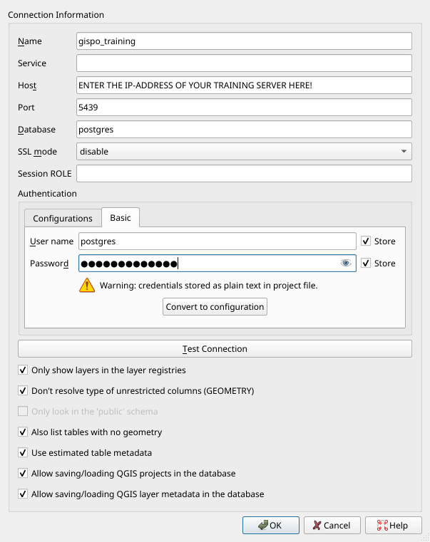
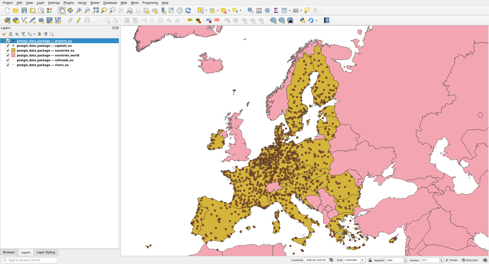
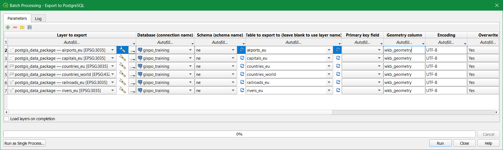

# Exercise 2: Importing data

**Contents** -- In this exercise we import spatial data into the PostGIS database.

**Goal** -- After the exercise the trainee understands the basics of importing spatial data into a database.

### Preparation

QGIS has to be installed for importing spatia data. Open [pgAdmin](/pgadmin) in the browser and log in. Open the **Query Tool** (Right click _trainingdatabase_ **->** **Query Tool**).

## Exercise 2.1: Importing from a text file

Many point data sets are saved in CSV files, where they are not necessarily in a spatial data format. In the first exercise we'll import a global dataset which contains information about airports. First create a table in the _trainingdatabase_ with the following SQL command:

::: code-box
``` sql
DROP TABLE IF EXISTS airports;

CREATE TABLE airports
(
    id            integer,
    name          text,
    city          text,
    country       text,
    IATA_code     char(3),
    ICAO_code     char(4),
    latitude      numeric,
    longitude     numeric,
    altitude      numeric,
    timezone      text,
    dst           text,
    tz_zone       text,
    type          text,
    source        text
);
```
:::

The data set has been already downloaded from [OpenFlights.org](http://openflights.org/data.html) and added to a folder inside of the database server.

Inspect the data set. You can open the file in your browser with [this link](/data/airports.dat).

You can import the data from the CSV file to the table you previously created with this command:

::: code-box
``` sql
COPY airports
FROM '/home/student/data/airports.dat'
WITH CSV;
```
:::

The **COPY** command refers to a file on the disk and imports it. In addition to CSV files the **COPY** command can also refer to [binary formats or text files.](https://www.postgresql.org/docs/current/sql-copy.html)

Check that the data was correctly imported:

::: code-box
``` sql
SELECT *
FROM airports
LIMIT 10;
```
:::

By inspecting the data set you can see that the table has coordinates, but they've been saved as numerical values and not as geometries / in a geographical data type.

To be able to use PostGIS functionalities with this data set, you have to add a geometry column to the table. PostGIS has a [function](https://postgis.net/docs/AddGeometryColumn.html) for this purpose. Read the documentation on how this function is used.

::: code-box
``` sql
SELECT AddGeometryColumn ('airports','geom',4326,'POINT',2);
```
:::

Inspect the table again.

::: code-box
``` sql
SELECT *
FROM airports
LIMIT 10;
```
:::

The table now has a new column which is empty. Let's update the contents of the table with the **UPDATE** command.

In the following command two functions are nested:

-   [ST_MakePoint](https://postgis.net/docs/ST_MakePoint.html) creates a point geometry from text fields.
-   [ST_SetSRID](https://postgis.net/docs/ST_SetSRID.html) sets a coordinate reference system for the field based on an EPSG code.

::: code-box
``` sql
UPDATE airports
SET geom = ST_SetSRID(ST_MakePoint(longitude, latitude),4326);
```
:::

Inspect the dataset with the pgAdmin map feature:


## Exercise 2.2: Importing spatial data

The Natural Earth data used in the coming exercises are uploaded to the [data folder](/data). You can download the postgis_data_package.gpkg from there.

### Option 1: Importing with QGIS

QGIS offers a handy graphical user interface for importing spatial data into a PostGIS database. Many QGIS tools also enable flexible loading and editing of data in the database.

First, let's connect from your local QGIS installation to the PostGIS database used in the training. Open QGIS and create a new database connection by clicking Layer \> Data Source Manager. Choose the PostgreSQL tab and click the 'New' button:

Enter the following information in the New Connection window:



Note that the 'Name' field means the name of your connection saved to QGIS and not the name of the database. It is generally a good idea to choose all the options listed under the database connection parameters. For example using estimated table metadata speeds queries up considerably.

Click **Test Connection** to make sure you can connect to the database and then click **OK**. You can also execute SQL queries inside QGIS using **DB Manager**.

In addition to the database named "postgres",
connect to the "trainingdatabase" database with QGIS.
We will be operating in this database for the rest of the course.
Creating the connection is nearly identical to
how we connected to the "postgres" database:
you must just specify a different name for the connection
(for example gispo_trainingdatabase).

Let's create a new schema in the trainingdatabase where we will import the Natural Earth data. Name the new schema 'ne'. Schemas help you organize tables and other relations. You can create the new schema in pgAdmin, QGIS or with the following SQL commands:

::: code-box
``` sql
CREATE SCHEMA IF NOT EXISTS ne;
```
:::

If you cannot see the schema you just created in QGIS, run the following SQL commands and restart the QGIS project.

::: code-box
``` sql
DROP TABLE IF EXISTS ne.example;

CREATE TABLE ne.example
(
    id            integer,
    name          text
);
```
:::

::: code-box
``` sql
INSERT INTO ne.example
VALUES (1, 'test');
```
:::

If you didn't already, download the [Natural Earth data geopackage](/data/postgis_data_package.gpkg) on your computer. You can add the layers to QGIS by clicking Layers \> Add Layer \> Add Vector Layer; opening the Vector tab inside the Data Source Manager, or by dragging and dropping the file from your computer's file manager.

Import the following layers into QGIS and PostGIS:

-   airports_eu
-   capitals_eu
-   countries_eu
-   countries_world
-   railroads_eu
-   rivers_eu

::: hint-box
QGIS might ask about a coordinate transformation. Click **OK** in the window which might open up when trying to add layers.
:::

Make sure that the QGIS project's Spatial Reference System is set as ETRS89 ETRS89-extended / LAEA Europe (EPSG:3035). You can check the project's SRS in the bottom right corner and the individual layer's SRS by right clicking the layer, selecting **Properties > Source > Assigned Coordinate Reference System**. All layers should be set to EPSG:3035, except the **countries_world** layer, which should be EPSG:4326.



In QGIS, open a processing tool named 'Export to PostgreSQL'. Click on the bottom **Run as Batch Process...** which allows exporting several tables into the database at the same time. Change the parameters so that the layers are exported to the correct schema and database. Using the **Fill Down** button you don't have to individually fill every parameter for each layer. Name the geometry column as "wkb_geometry". Make sure that the geopackage's name is not left in the **Table to export to** field and all the table names are set to export as follows:

-   airports_eu
-   capitals_eu
-   countries_eu
-   countries_world
-   railroads_eu
-   rivers_eu

You can check what other parameters the tool has, but leave them unchanged. The final parameters should look like this:



Click **Run**!

Make sure after running the tool that the data sets have been exported correctly. Check possible error messages and change parameters if needed.

::: code-box
``` sql
SELECT *
FROM ne.countries_world
LIMIT 10;
```
:::

### Option 2: Importing with the command line

Let's create a new schema in the trainingdatabase where we will import the Natural Earth data. Name the new schema 'ne'. Schemas help you organize tables and other relations. You can create the new schema in pgAdmin, QGIS or with the following SQL commands:

::: code-box
``` sql
CREATE SCHEMA IF NOT EXISTS ne;
```
:::

You can import data to a PostGIS database using the **shp2pgsql** or **ogr2ogr2** tools. By running the program without parameters you receive instructions on how to use them. After this you can import data into the schema you just created using the **ogr2ogr** tool. If you've installed the OSGeo4W package (included with QGIS) open the **OSGeo4W Shell** from your start menu and enter the following command:

::: commandline-box
``` sh
ogr2ogr -f "PostgreSQL" PG:"host=<hostname> port=<port> dbname=<database's name> user=<username> password=<password>" <dir>\postgis_data_package.gpkg -lco SCHEMA=ne
```
:::

Remember to check the file path and the other parameters!

The parameters used by **ogr2ogr** are as follows:

::: commandline-box
```         
-f   output file format name
-lco layer creation option

```
:::

You can explore the other parameters by
running the **ogr2ogr** command without parameters.

The **shp2pgsql** tool is included with the PostGIS installation.
With this tool you can create .sql files from .shp files.

Commandline tools enable you to import several files at once. For example in Windows you can import an entire folder of gml files to a database with the following command:

::: commandline-box
``` sh
for %i in (*.gml) do ogr2ogr -update -append -f PostgreSQL PG:"host=<hostname> port=5432 dbname=<database's name> user=<username> password=<password> schemas=gml" %i
```
:::
