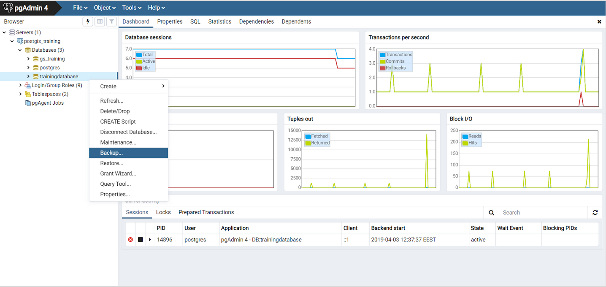
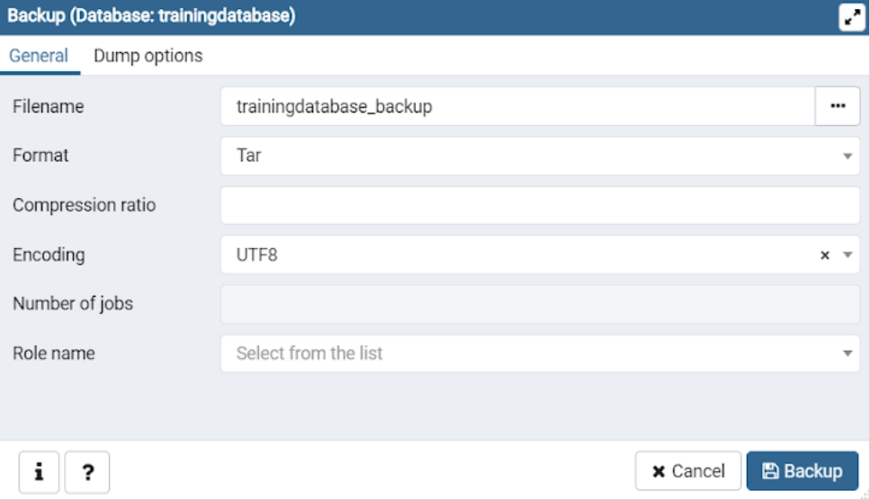
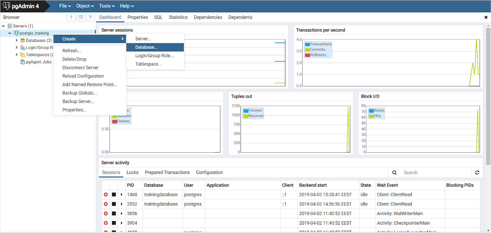
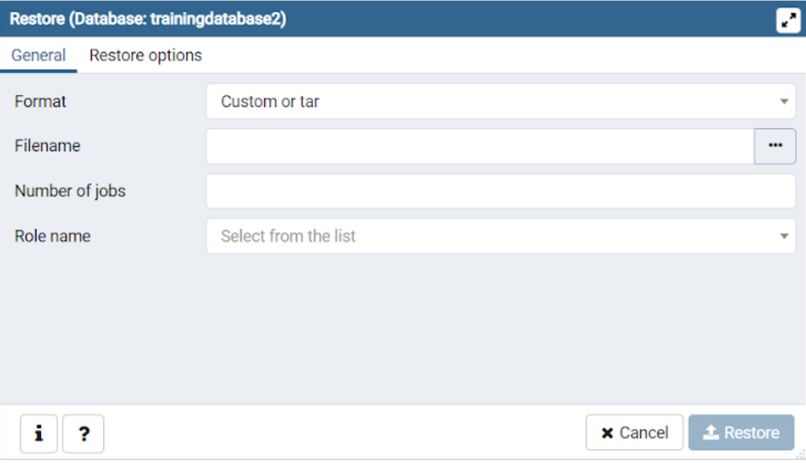
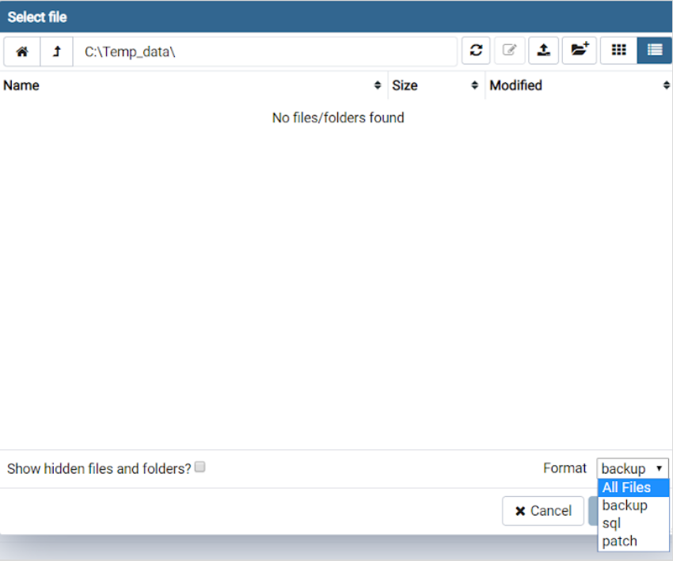

# Exercise 10: Creating and restoring backups

**Contents** -- Introduction to creating and restoring database backups.

**Goal** -- After the exercise the trainee knows how to create and restore a backup.

## Exercise 10.1: Creating a backup

Let's create a backup of the _trainingdatabase_ with pgAdmin. Right click the trainingdatabase and click **Backup...**

:::hint-box
If the Backup window doesn't open and instead you get an error message, do the following: File > Preferences > on the left side choose Paths > Binary Paths and write **/usr/bin** in the PostgreSQL Binary Path field.
:::

Fill the filename in the **Backup** window as **"trainingdatabase_backup"**. Make sure the format is **Tar** and the encoding is **UTF8**.

## Exercise 10.2: Restoring a database

### Create a new database

Right click your connection to the database cluster and click **Create > Database...**. Name the new database **"trainingdatabase2"**.

### Restore the data from the backup file

Let's restore the back up by right clicking the **trainingdatabase2** you just created. Choose **Restore... > Filename > ...** and choose the .tar file you just saved.

If you can't find the backup file, set the **Format** to **All Files** in the bottom right corner of the **Select file** window. You can inspect the features which will be restored before the restoration takes place with the **Display Object** feature.

:::hint-box
How can you copy the structure (schema) of the trainingdatabase to another database?
:::
