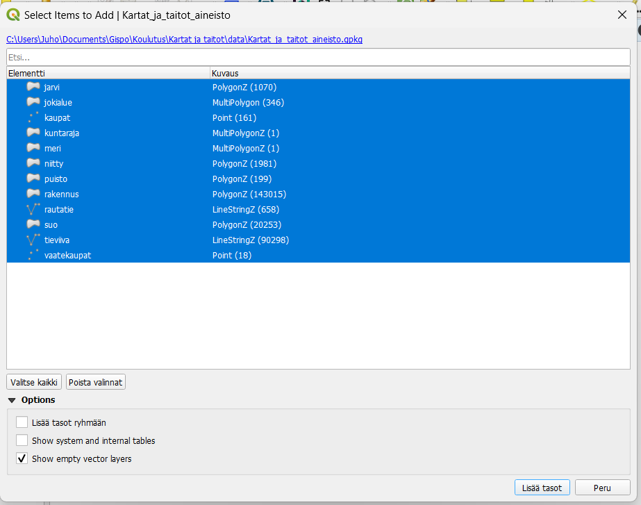
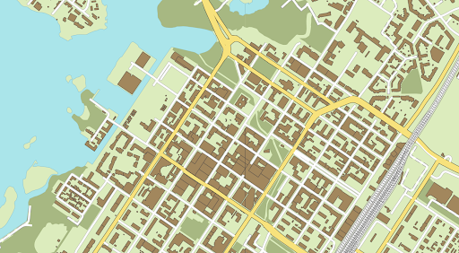
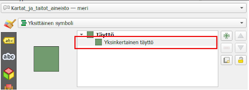
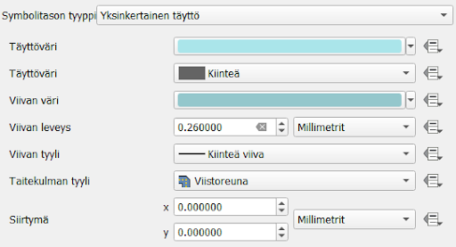
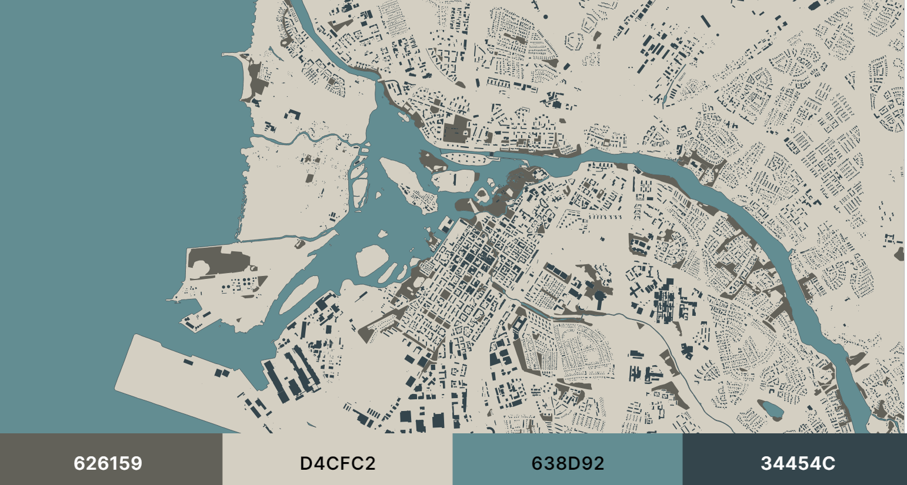
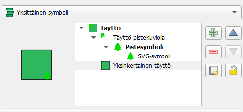

# Harjoitus 1a: Vektoriaineistojen visualisointi, pisteet ja alueet

## Harjoituksen sisältö

Harjoituksessa avataan QGIS ja tuodaan kurssilla käytettävät aineistot
ohjelmistoon. Tämän jälkeen aineistojen kuvaustekniikkaa muutetaan
joko oman tyylin tai esimerkkien mukaan.

## Harjoituksen tavoite

Kouluttautuja oppii tuomaan GeoPackage-muodossa olevia aineistoja QGISiin
ja visualisoimaan piste- ja polygonikohteita. Kouluttautuja ymmärtää vektori-
aineistojen visualisoinnissa käytettävien työkalujen mahdollisuudet.

## Kurssimateriaalin lataus

Kurssilla tarvittavat paikkatieto-aineistot on ladattavissa Google
Drivestä linkistä

::: note-box
[Kurssihakemisto.gpkg](https://drive.google.com/file/d/1W2rmf4YxLQtjO55jR4cKlJ8dZMiIHgVc/view)
:::

## Valmistautuminen

Avaa uusi QGIS-projekti (Projekti \> Uusi) ja tallenna se nimellä
**QGIS-harjoitus 1**. Lisää projektiin seuraavat aineistot:

-   **...kurssihakemisto/Kartat_ja_taitot.gpkg**

## Aineiston tuonti ja järjestely

Kurssimateriaali on koottu yhteen GeoPackageen, joka tuodaan QGISiin.
Samaa aineistoa käytetään kaikissa harjoituksissa.
Avaa **Tietolähteiden hallinta -\> Vektori -\> Etsi lataamasi
Kartat_ja_taitot.gpkg** ja Lisää. Valitse kaikki tasot ja paina **Lisää**.

Aineisto sisältää piste-, viiva- ja polygonikohteita. Voit tutkia
minkälaisia tasoja GeoPackagessa on. Helpottaaksemme käsittelyä voimme
jakaa kunkin aineistotyypin eri kansioihin. Luo piste-, viiva- ja
polygonikohteille omat kansionsa painamalla 
Tasot-paneelin yläreunasta. Nimeä tasoryhmä lisäämisvaiheessa, kun se on
aktiivinen tai klikkaamalla tasoryhmää tasoluettelossa hiiren oikealla
ja valitsemalla "Nimeä ryhmä". Kun olet luonut kolme uutta kansiota,
raahaa pistekohteet omaan kansioonsa, polygonit omaansa ja viivat
omaansa. Näin saadaan aineisto järkevästi järjesteltyä. Jos kaikki
kohteet eivät näy kunnolla, vaihda tasojen paikkaa raahaamalla
esimerkiksi pistetasot polygonien yläpuolelle. QGIS visualisoi kohteet
sen mukaan, miten ne ovat tasoluettelossa, eli ylimpänä olevat tasot
ovat karttaikkunassa päällimmäisenä.

## Tasojen visualisointi

Kun tuot uuden vektoriaineiston QGISiin, ohjelma arpoo satunnaiset värit
kaikille kohteille. Tämä johtuu siitä, että vektoriaineistossa ei ole
valmiiksi kuvaustekniikkaa mukana. Visualisoidaan karttakohteita 
järkevämmän näköiseksi karttakokonaisuudeksi.

Esimerkkikuva lopputuloksesta:

### Polygonien visualisointi

Avaa **Tason tyylit** -paneeli menemällä **Näytä \> Paneelit \> Tason
tyylit**. QGISiin avautuu uusi sivupalkki, jossa voit valita yläreunasta,
minkä tason kuvaustekniikkaa haluat muuttaa, ja tehdä muutokset.
Kuvaustekniikkaan tehdyt muutokset päivittyvät Tason tyylit -paneelin
kautta automaattisesti.

Aloitetaan kuvaustekniikan muokkaaminen isoimmista kohteista eli suurista 
polygoneista. Valitse esimerkiksi meri-taso ensimmäiseksi Tason tyylit 
-paneelista. Saat edistyneet visualisointityökalut auki painamalla 
Yksinkertainen täyttö -kohtaa:

Täältä saat muokattua tarkemmin polygonin väriä ja täyttötyyppiä sekä
ulkoviivan väriä ja ominaisuuksia. Värivalintaa painamalla saat
laitettua myös valmiin HTML-koodin valitsimeksi. Vaihda tason täyttöväri
ja viivan väri itsellesi mieluisiksi.

Alla on esimerkkinä mitä värejä harjoituksen esimerkkikuvassa on
käytetty. Voit testata myös eri värejä ja katsoa, miten ne toimivat
kartallasi.

::: hint-box
**Esimerkkikuvan värit**

**Kuntaraja:** täyttöväri: #dcecbd reunaviiva: #000000

**Rakennus:** täyttöväri: #a2875d reunaviiva: #60564b

**Puisto:** täyttöväri: #a7b882 ei reunaviivaa

**Niitty:** täyttöväri: #fedc8b reunaviiva: #888888

**Meri:** täyttöväri: #aae5ea reunaviiva: #94c7cc

**Jokialue:** täyttöväri: #aae5ea reunaviiva: #94c7cc

**Järvi:** täyttöväri: #aae5ea reunaviiva: #94c7cc
:::

Halutessasi voit käyttää myös pienempää väripalettia, kuten 
vanhoissa paperikartoissa. Oheisessa esimerkissä on käytetty
vain neljää eri väriä, joiden HTML-koodit löydät kuvasta:

::: hint-box
Joitain kohteita kannattaa visualisoida keskenään samalla tavalla.
Esimerkiksi vesistöt (meri, jokialue, järvi) on luontevaa kuvata 
samalla värillä ja reunaviivalla. Kun olet saanut yhdelle näistä 
tasoista kuvaustekniikan määritettyä, voit kopioida sen toiselle 
tasolle seuraavasti:

Klikkaa tasoa Tasot-paneelista hiiren oikealla ja valitse **Tyylit > 
Kopioi tyyli > Kaikki tyyliryhmät**. Sen jälkeen klikkaa hiiren oikealla 
tasoa, jolle haluat kopioida tyylin ja valitse **Tyylit > Liitä tyyli 
> Kaikki tyyliryhmät.**
:::

::: hint-box
Voit myös jättää rakennukset ilman reunaviivaa. Voit tarkastella karttaa
kauempaa, esimerkiksi 1:85000 -mittakaavassa, huomaat että rakennuksien
täyttöväri ei enää erotu, vaan niistä näkyy vain reunaviivan väri.
Kokeile ottaa reunaviiva pois ja katso, miten se vaikuttaa rakennusten
erottuvuuteen.
:::

### Pistekohteet

Harjoitusaineistossa on kaksi pistekohdetta, kaupat ja vaatekaupat. Emme
visualisoi kaupat-tasoa nyt, vaan palaamme siihen myöhemmin. Jätä se pois
näkyvistä klikkaamalla tason nimen edessä olevaa väkästä Tasot-paneelista. 
Avaa sen sijaan vaatekaupat-taso editoitavaksi **Tason tyylit** -paneeliin.

Klikkaa "Yksinkertainen pistesymboli" -kohtaa avataksesi edistyneet
visualisointitoiminnot. Valitse Symbolitason tyyppi -pudotusvalikosta
"SVG-symbolitaso".

Nyt voit valita pisteen sijasta jonkin muun symbolin vaatekaupoille.
Selaa eri kansioita ja hae mielestäsi hyvä symboli. Valitse haluamasi
symboli klikkaamalla sitä SVG-kuvat-ikkunassa.

Kuvake ei näy vielä välttämättä kovin hyvin, joten muuta sen kokoa niin,
että se erottuu helposti. Vaihda sille myös uusi täyttöväri halutessasi.

Kun olet valmis, tallenna projektitiedosto kurssihakemistoon
pikanäppäimellä **CTRL + S** tai päävalikosta **Projekti \> Tallenna**.

## Lisätehtävä: päällekäiset kuvaustekniikat samalle tasolle

Palaa polygonitasoihin ja valitse suot-taso. Luo tasolle toinen
kuvaustekniikka yksivärisen täytön lisäksi painamalla .

Tee alemmasta tasosta hieman läpinäkyvä säätämällä sen täyttövärin
peittävyyttä väriasetuksista 55 prosenttiin.

Esimerkkikuvan asetukset:
täyttöväri:: #0f7c79 täyttövärin läpinäkyvyys 55 % reunaviiva: #000000

Sen jälkeen vaihda päällimmäisen symbolitason tyypiksi **Täyttö
viivakuosilla**. Vaihda jaottelu täytön kohdalta ja viivan väri ja
leveys avaamalla viivatason edistyneet visualisointiominaisuudet.

Esimerkkikuvan asetukset:
viivakuosi jaottelu 2,400000 viivan leveys 0,10000 viivan väri #335175

Voit halutessasi visualisoida myös puistot niin, että lisäät täytön
pistekuviolla yksinkertaisen täytön lisäksi. Pistekohteeksi voit
puolestaan valita SVG-ikonin, esimerkiksi puun. Muuta puiden väriä 
ja reunaviivaa kuten aiemmin vaatekauppojen kohdalla.

Esimerkissä puistoalueissa on vihreä tausta ja vihreitä pieniä puita.

::: hint-box
**Psst!** Muista tallentaa QGIS-projekti harjoituksen lopuksi. Voit jättää projektin auki koneellesi seuraava harjoitusosiota varten.
:::
