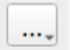
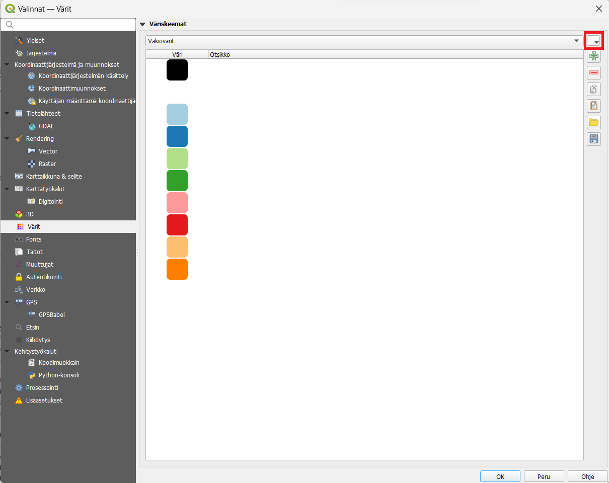
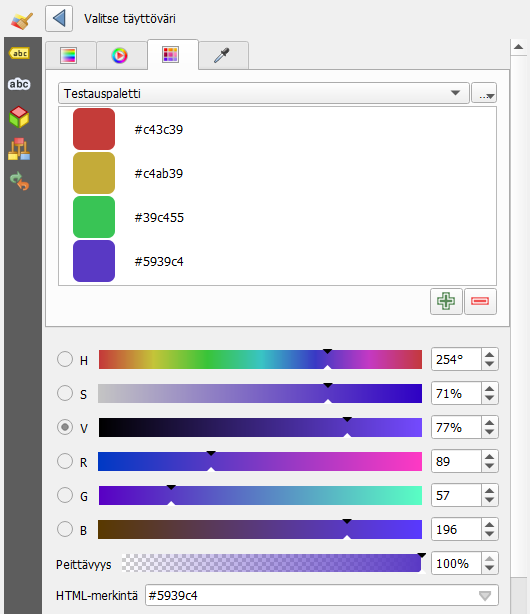
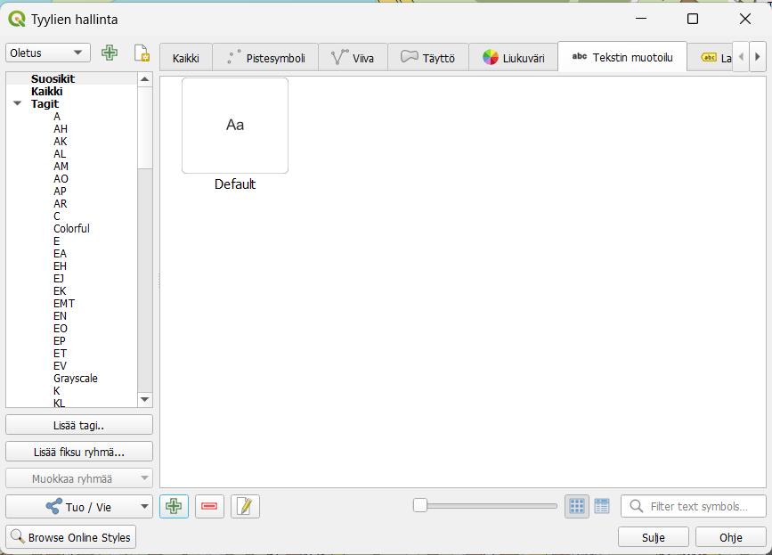
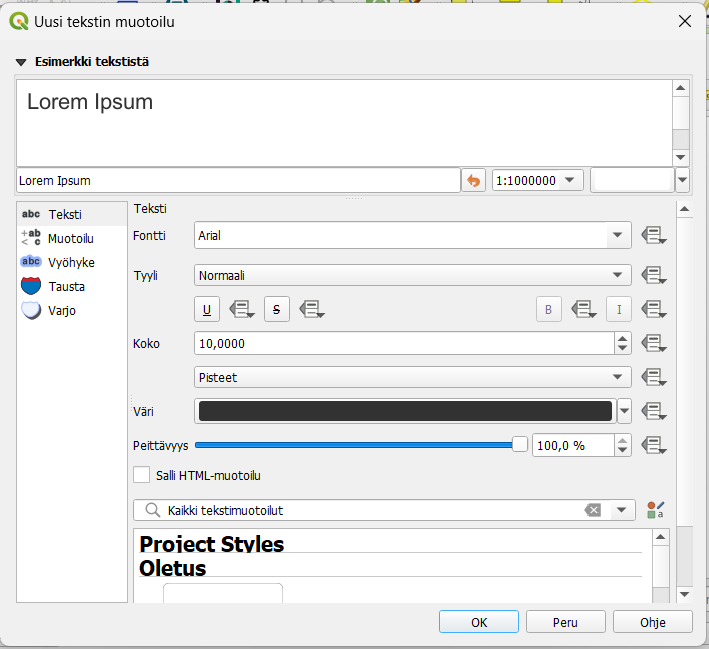
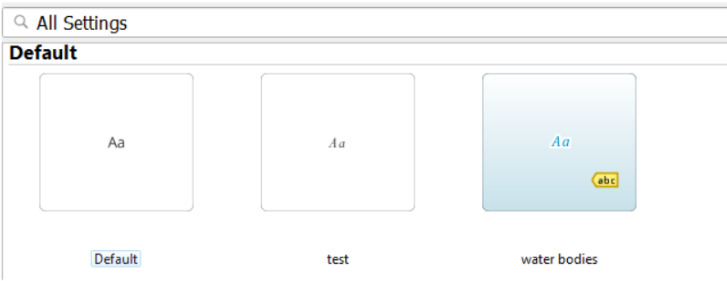

# Lisäharjoitus: Oman väripaletin ja oletusfontin lisääminen

## Harjoituksen sisältö
Harjoituksessa tehdään oma väripaletti ja oletusfontti.

## Harjoituksen tavoite
Koulutettava oppii luomaan valmiita väripaletteja QGISiin ja käyttämään Tyylien hallintaa.

## Väripalettien luominen

Voit luoda oman väripaletin kohdasta **Asetukset -> Valinnat -> Värit**. Voit luoda ja nimetä uusia väripaletteja painamalla  ja lisätä olemassaoleviin uusia värejä. Jos sinulla on valmiiksi määritettyjä värejä (RGB- tai HTML-koodeilla), voit käyttää niitä värien poimimiseen tai valita ne manuaalisesti värikartalta hiirellä.

Painamalla  voit luoda ja nimetä uuden väripaletin. Värien lisääminen tapahtuu  -symbolista.
 

 
Voit myös tallentaa paletin .glp-tiedostona jaettavaksi muille oikealla olevasta Tallenna-kuvakkeesta. Muut voivat ladata palettisi QGIS-ohjelmaansa tallennuskuvakkeen yläpuolella olevan tuontityökalun avulla ("Tuo värit tiedostosta").
 
Kun haluat käyttää määrittämiäsi värejä visualisointiin, löydät paletin Värikartta-välilehden pudotusvalikosta. Sieltä voit myös poistaa ja lisätä värejä tarvittaessa!

  
## Uusien oletusfonttien määrittely

Saatat myös tarvita yhtenäisiä fontteja organisaatiosi tai työryhmäsi käyttöön. Tämä voidaan tehdä kohdasta Asetukset -> Tyylien hallinta. Tekstin muotoilu -välilehdeltä voit luoda uuden tyylin vihreästä + -merkistä kuten ennenkin.
 

Nyt voit määrittää fontit, koot, tietyt muotoilut, maskit ja muut. Voit tallentaa muotoilut oletustyyleihin ponnahdusikkunassa, kun tallennat tyylin (Valitse kohtaan Destination: Oletus). Tallennuksen jälkeen voit viedä (export) tyylin lisäyskuvakkeen vierestä ja jakaa sen muille. Hae vain luomasi tyyli luettelosta ja vie se tavalliseen tapaan .xml-tiedostona. Tuonti voidaan tehdä samasta paikasta.

 
Kun sitten määrität nimiöitä vektoritasolle, luomasi uuden tyylin pitäisi näkyä tyyleissä normaalien tekstimuotoasetusten alapuolella. Esimerkkikuvassa näkyy luotu "test"-tyyli.
 

 
 
Voit kokeilla samaan tapaan myös uusien visualisointityylien tallentamista viiva- ja polygonikohteille Tyylien hallinnasta.

Kun olet valmis, tallenna projektitiedosto kurssihakemistoon pikanäppäimellä CTRL + S tai päävalikosta Projekti > Tallenna.

::: hint-box
**Psst!** Koulutuksen jälkeen saat henkilökohtaista tukea Gispon tukipalvelusta. Lähetä kysymyksesi tai kommenttisi osoitteeseen koulutustuki@gispo.fi!
:::
