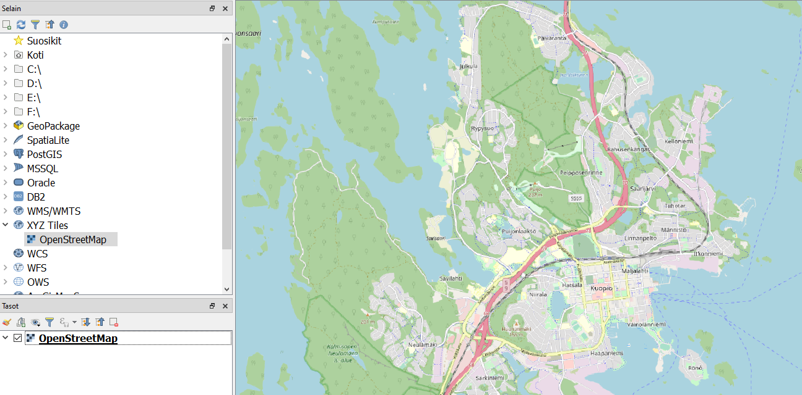

# Harjoitus 1: QGIS-käyttöliittymän konfigurointi

**Harjoituksen sisältö**

Harjoituksessa tutustutaan QGISin käyttöliittymän konfigurointimahdollisuuksiin.

**Harjoituksen tavoite**

Koulutettava löytää ja tunnistaa QGIS-ohjelmiston yleiset, profiilikohtaiset ja projektikohtaiset asetukset ja osaa luoda käyttäjäprofiileja.

**Arvioitu kesto**

30 minuuttia.

## Valmistautuminen

Avaa uusi QGIS-projekti (**Projekti \> Uusi**). Tässä harjoituksessa ei käsitellä aineistoja, joten projektia ei tarvitse tallentaa.

## Käyttöliittymän räätälöinti

QGIS käyttää oletuksena sitä kieltä, jolle koneen käyttöjärjestelmä on lokalisoitu. Näissä harjoituksissa on käytetty suomenkielistä versiota. Suomennos ei kuitenkaan ole täydellinen, ja joskus ohjeita ja vinkkejä on helpompi etsiä englanniksi. Halutessasi voit vaihtaa QGISin kielen valitsemalla yläpalkista **Asetukset \> Valinnat \> Korvaa järjestelmän alueasetukset**. Kielen lisäksi voit asettaa lokaalit numero-, valuutta- ja mittayksikköasetukset. Tämän toiminnon päivittyminen vaatii QGISin uudelleenkäynnistyksen.

**Karttaikkuna ja selite -välilehdellä** voit vaihtaa myös esimerkiksi karttaikkunasi taustavärin tai valintojen värin tai sen, mitä tapahtuu kun tuplaklikkaat tason nimeä. 

**Koordinaattijärjestelmä** -välilehdellä voit vaihtaa projektin ja aineistojen oletuskoordinaattijärjestelmän esim. suomalaisissa aineistoissa tyypilliseen   ETRS89/TM35FIN (EPSG:3067) tai oman organisaatiosi käyttämään GK-kaistaan.

**Järjestelmä** -välilehdellä määritellään tallennettujen **symbolikirjastojen sijainnit**, jotta niitä voi hyödyntää visualisoinnissa. Hyödyllinen on myös ruksi **Verkko**-välilehden kohdassa **Käytä proxya verkkohakuihin**. Se estää aikakatkaisun, jos rajapinnasta haetaan suuria aineistoja.

Kun käytät QGISiä jonkin aikaa, huomaat mitkä ovat useimmin tarvitsemasi paneelit ja työkalut. Voit valita näiden näkyvyyden ja asetella ne näytölle mieleiseesi järjestykseen. Klikkaa yläpalkista **Näytä \> Paneelit**. Voit luoda esimerkiksi **spatiaalisia kirjanmerkkejä** jotka vievät sinut aina tiettyyn sijaintiin, tai pitää **Tason tyylit** -ikkunan koko ajan näkyvissä omassa paneelissaan.

## Muokkauksen yleisasetukset

Muokkauksen toimintoa ja muita yleisiä muokkaustyöasetuksia voit muuttaa päävalikon ikkunassa **Asetukset \> Valinnat \> Digitointi**. Jos et esimerkiksi halua, että ominaisuustietojen muokkaus tulee esiin jokaisen polygonin piirtämisen jälkeen niin rastita **Älä näytä ominaisuustietojen pop-up lomaketta kohteen luonnin jälkeen**. Jätä se kuitenkin päälle tällä kertaa. Kokeile myös vaihtaa kohteiden muokkausväri keltaiseksi (Kuminauha) ja **Taitepisteen symbolin** tyyli ja koko. Paina **OK**, niin asetukset tulevat voimaan.

## Käyttäjäprofiilit

Jos käytät QGISia useampaan toisistaan poikkeavaan tarkoitukseen, tai vaikkapa useampi henkilö käyttää samaa konetta, voit luoda erilaisia käyttäjäprofiileja. Profiiliin tallentuvat tekemäsi kieli-, digitointi- ja  muut asetukset. Profiileihin voi myös luoda erilaisia etukäteen määriteltyjä tietokantayhteyksiä tai rajapintapalveluita sekä tallentaa oletushakemiston, josta aineistoja haetaan ja johon ne tallennetaan.

Profiileja voi luoda ja tallentaa valikosta **Asetukset \> Käyttäjäprofiilit**. Vaihtaessasi profiilia QGIS avaa uuden ikkunan.

## Pikanäppäimet

Voit tallentaa itsellesi pikanäppäinyhdistelmiä joilla esim. avata usein käytetty valikko tai työkalu. Pikanäppäimiä pääsee hallinnoimaan valikosta **Asetukset \> Pikanäppäimet.**

Etsi haluamasi toiminto, valitse se listasta, klikkaa Muuta ja anna valitsemasi näppäinyhdistelmä. Jos se on jo käytössä, voit muuttaa kyseisen yhdistelmän merkitystä tai valita jonkin uuden yhdistelmän.

## Taustakarttoja lisäosien avulla

QGISin lisäosat tarjoavat käyttöösi suuren valikoiman erilaisia taustakarttoja. Eri rajapinnoista saatavat taustakartat toimivat samaan tapaan kuin projektiin avatut rasteritasot: niiden läpinäkyvyyttä voi säätää, mutta ne eivät sisällä ominaisuustietoja.

Helpoin tapa lisätä OpenStreetMap-kartta on etsiä se **Selain-paneelista XYZ Tiles -rivin** alta:

Laajemman valikoiman erilaisia taustakarttoja saat käyttöösi lisäosalla nimeltä QuickMapServices. Asenna se yläpalkin **Lisäosat-valikosta** ja avaa sen jälkeen **Verkko-valikosta Search QMS**. Avautuvasta paneelista voit etsiä erilaisia taustakarttoja ja satelliittikuvia, suodattaa niitä sijaintisi perusteella, ja saada tarvittaessa lisätietoja (esim. käyttöoikeuksista) kartasta. Vihreä pallo kertoo että kartta on saatavilla. Etsi vaikkapa Stamen-nimellä eri tarkoituksiin sopivia taustakarttoja.

Jos sinulle jää aikaa, käy läpi muita lisäosia ja tarkastele mitä työkaluja sieltä löytyy, jotka voivat auttaa sinua omassa työssäsi.

::: hint-box
Psst! Koulutuksen jälkeen saat henkilökohtaista tukea Gispon tukipalvelusta. Lähetä kysymyksesi tai kommenttisi osoitteeseen tuki\@gispo.fi!
:::
