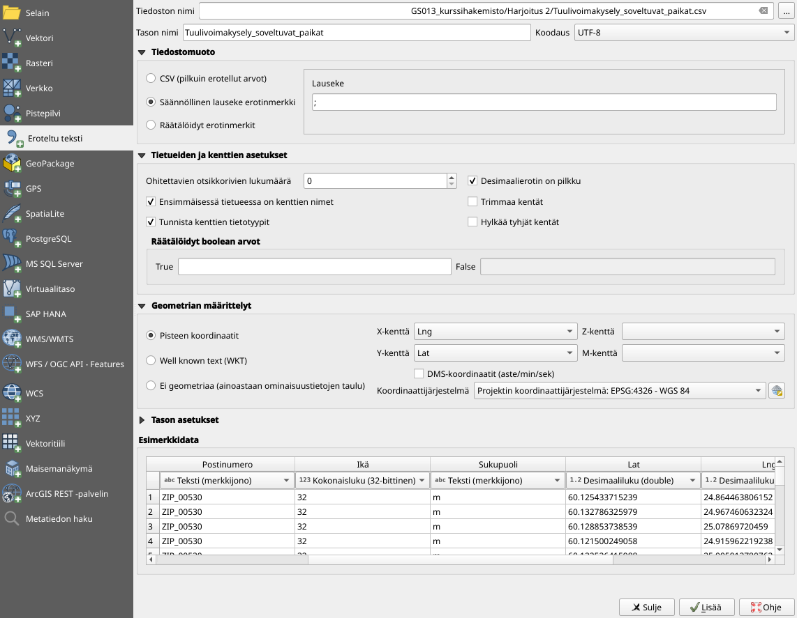
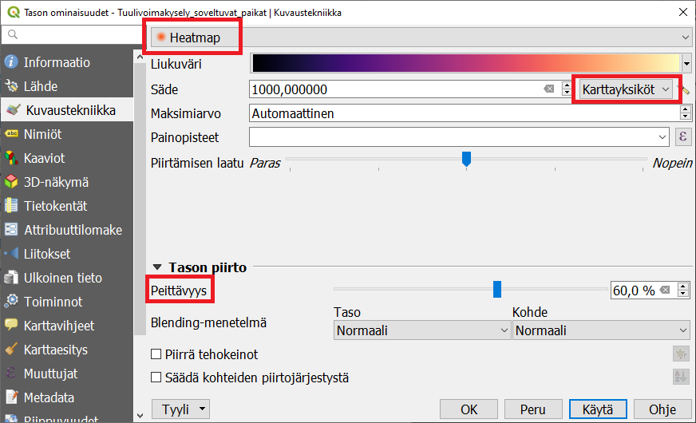
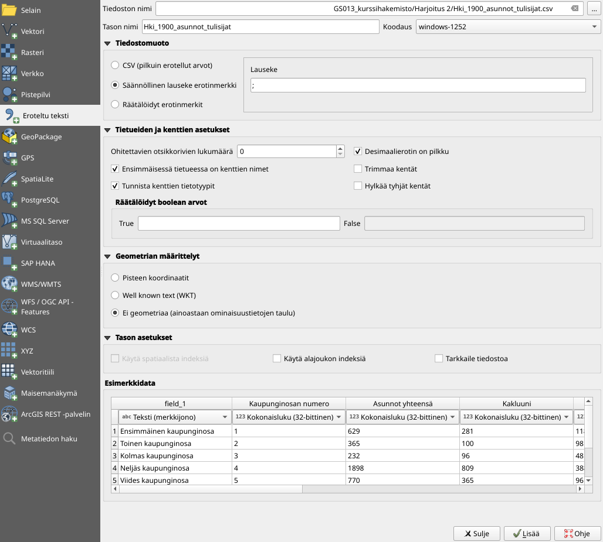
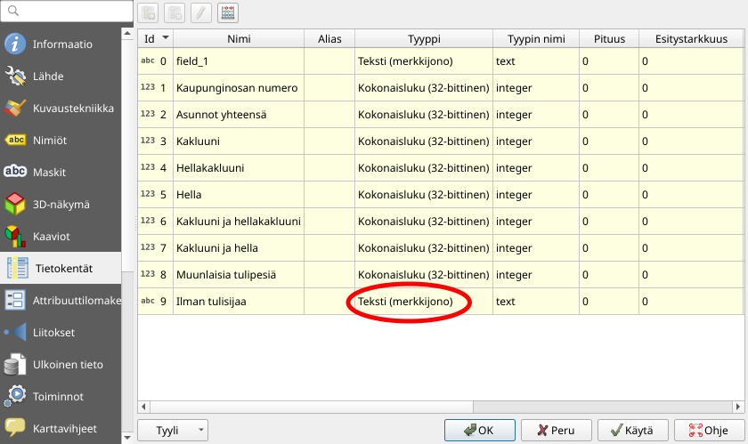
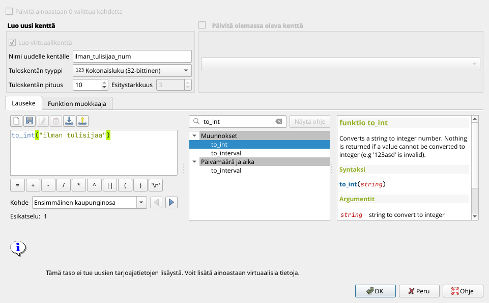
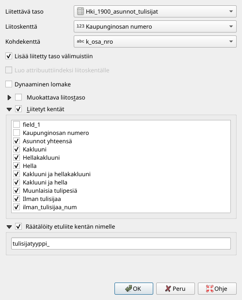

# Harjoitus 2: Taulukosta kartalle

**Harjoituksen sisältö**

Harjoituksessa tuodaan koordinaatteja sisältävä CSV-tekstitiedosto kartalle, muokataan kenttien tyyppiä ja liitetään taulukkomuotoista dataa olemassa olevaan paikkatietoaineistoon.

**Harjoituksen tavoite**

Koulutettava oppii tuomaan sekä geometrian sisältäviä että puhtaita attribuuttitaulukoita QGISiin sekä käsittelemään yleisimpiä ongelmia taulukoiden tuonnissa.

**Arvioitu kesto**

40 minuuttia.

## Valmistautuminen

Avaa uusi QGIS-projekti (**Projekti \> Uusi**) ja tallenna se nimellä "**QGIS-harjoitus 2**". Tässä harjoituksessa avataan tekstimuotoisena tallennettu paikkatietoaineisto ja liitetään taulukkomuotoista tilastotietoa paikkatietoaineistoon. 

## Pisteet tekstitiedostosta kartalle

Lisää projektiisi kurssihakemiston aineisto **Tuulivoima_sopivat_paikat.csv**. Tämä aineisto on Helsingin kaupungin karttapohjaisella kyselyllä keräämä aineisto tuulivoiman hyväksyttävyydestä Helsingissä. Tiedosto sisältää lähes 8000 pistemäistä sijaintia, jotka ovat kyselyyn vastanneiden mielestä sopivia paikkoja tuulivoimalle. Lisää aineisto valitsemalla ylävalikosta **Tasot \>  Lisää taso \> Lisää erotinmerkkejä sisältävä tekstitiedosto**. Ota mallia seuraavan kuvan asetuksista:

Paina sitten **OK**.

Koska aineiston koordinaatit on tallennettu asteina WGS84-koordinaattijärjestelmässä, Helsinki näyttää hieman litistyneeltä. Vaihda projektin koordinaattijärjestelmäksi **ETRS89/TM35FIN (EPSG:3067)**. Nyt kartan muoto on tutumpi, ja karttayksiköt ovat metrejä asteiden sijaan.

Valitse **Ominaisuudet \> Kuvaustekniikka**. Vaihda pudotusvalikosta kuvaustapa "single symbol":sta "heatmap":ksi. Valitse väriliukuma mieleiseksesi. (Muista, että nyt aineiston spatiaaliset tihentymät kuvaavat niitä paikkoja, joihin tuulivoimala parhaiten sopisi!) Voit valita, kuinka suuri on yksittäisen pisteen vaikutussäde. Tämä vaikuttaa siihen, miten pienipiirteinen valmiista heatmapistasi tulee. Jos valitset säteen yksiköiksi "karttayksiköt", kartta pysyy saman näköisenä zoomatessa. Jos valitset yksiköksi millimetrit tai pikselit, kartan yksityiskohtaisuus muuttuu zoomaustason muuttuessa. Paina **Apply** ja tarkastele heatmapia.

Säädä vielä heatmap-taso läpinäkyväksi (n. 50 %) ja lisää taustakartta (esim. OpenStreetMap).

::: hint-box
Missä ovat helsinkiläisten mielestä hyväksyttävimmät alueet tuulivoimalalle?
:::

## Ilman geometriaa olevan taulukon tuominen

Tuo kurssihakemistosta projektiisi aluemainen shapefile-taso Helsingin kaupunginosista vuoden 1899 aluejaon mukaan (**Helsingin kaupunginosat 1899.shp**). Lisää myös erotinmerkkejä sisältävä taulukkotiedosto **Hki_1900_asunnot_tulisijat.csv** . **Tietolähteiden hallinta -ikkunassa** voit määritellä, mikä merkki toimii taulukossasi kenttien erottimena. Alareunan esimerkki-ikkunassa voit esikatsella, millä asetuksilla QGIS lukee taulukkoa oikein. Aseta koodaukseksi **windows-1252** ja erotinmerkiksi **;-merkki**. Tämä tiedosto ei sisällä geometriaa lainkaan, vaan tietää tilastotiedoista vain kaupunginosan nimen ja numeron. Valitse siis **Ei geometriaa (ainoastaan ominaisuustietojen taulu)**. Klikkaa lopuksi **Lisää**.

Koska taulukko ei sisällä geometriaa, sitä ei voida kuvata karttanäkymässä, mutta se tulee Tasot -listaukseen. 

## Taulukon kenttien tyypin muokkaaminen

Kun tuot taulukon QGISiin, et voi vaikuttaa siihen, minkä tyyppisiksi QGIS tunnistaa taulukkosi kentät. Jos vaikkapa numeerisessa kentässä on yksikin tekstiksi tulkittava solu (esim. tyhjää merkitsevä viiva tai  N/A- tai NULL-teksti), koko kenttä tulkitaan tekstiksi. Tällöin et voi käyttää kentän tietoja numeerisiin analyyseihin kuten koropleettikartan laatimiseen.

Avaa tulisijat-tason **ominaisuudet** ja tarkastele **Tietokentät** -välilehteä. Yksi kenttä on sisältänyt muita kuin numeroita, ja siksi siitä on tullut String- eli tekstikenttä.

Kentän tyypin muuttaminen jälkikäteen on työlästä, mutta voit luoda uuden kentän, jolle asetat halutun tyypin ja johon muunnat olemassa olevan kentän arvot.

Avaa **Kentän arvojen laskin** ja luo uusi kenttä, jonka nimi on ilman tulisijaa num ja tyyppi kokonaisluku. Käytä funktiota to_int muuntaaksesi Ilman tulisijaa -kentän tiedot numeerisiksi.

Vastaavasti funktio to_string muuntaa numeerisesta kentästä luetut numerot tekstiksi. Jos aineistossa on rivejä, joille muunnosta ei voi tehdä, muunnosfunktio jättää ne solut tyhjiksi.

Kentän arvojen laskin -työkalun ja lausekkeenmuodostustyökalun funktioissa on ryhmä **Muunnokset**, josta voit tutkia mitkä kaikki muunnokset ovat mahdollisia. Muunnosfunktiota voit käyttää myös osana pidempää lauseketta.

## Taulukkotiedon liittäminen geometriaan

Saat taulukon tiedot käyttöön paikkatietona, kun luot liitoksen shapefile-tiedostosi ja taulukon välille. Klikkaa hiiren oikealla napilla **Helsingin kaupunginosat 1899-tasoa**, valitse **Ominaisuudet** ja vasemman reunan valikosta **Liitokset**. 

Luo uusi liitos . Valitse pudotusvalikosta liitettäväksi tasoksi csv-taulukkosi, liitoskentäksi Kaupunginosan numero ja kohdekentäksi shp-tason kenttä **k_osa_nro**. Paina lopuksi **OK**.

Tarkastele nyt **Helsingin kaupunginosat 1899 -tason** attribuuttitaulua. Csv-taulukko on lisätty shp-tason ominaisuuksien perään uusiksi sarakkeiksi. Jos liitettävä taulukkosi sisältää kohteita, joille ei löydy vastinetta toisessa aineistossa, ne putoavat automaattisesti pois liitosta tehtäessä.

Uusien kenttien nimet muodostuvat automaattisesti liitettävän taulukon nimestä ja alkuperäisestä kentän nimestä. Jos haluat muokata niitä helpommin luettavaksi, voit säätää liitoksen asetuksia joko liitosta tehdessäsi tai myöhemmin. Voit myös valita, liitätkö kaikki taulun kentät vaan vain osan. 

Luotu liitos on olemassa vain nykyisessä QGIS-projektissasi. Jos haluat tallentaa liitetyn tiedon muuta käyttöä varten, tallenna taso uudestaan klikkaamalla hiiren oikealla ja valitsemalla **Vie \> Tallenna kohteet nimellä**.

Liitettyjä kenttiä voi käyttää aineiston visualisointiin ja valintatyökaluihin kuten tason alkuperäisiäkin attribuuttikenttiä. Niitä ei sen sijaan voi käyttää esimerkiksi datan suodattamiseen näkymästä. Suodattamista varten voit luoda väliaikaisen virtuaalitason tai tallentaa tason uutena aineistona.

Kun olet valmis, tallenna projektitiedosto kurssihakemistoon pikanäppäimellä **CTRL + T** tai päävalikosta **Projekti \> Tallenna**.

::: hint-box
Psst! Koulutuksen jälkeen saat henkilökohtaista tukea Gispon tukipalvelusta. Lähetä kysymyksesi tai kommenttisi osoitteeseen tuki\@gispo.fi!
:::
