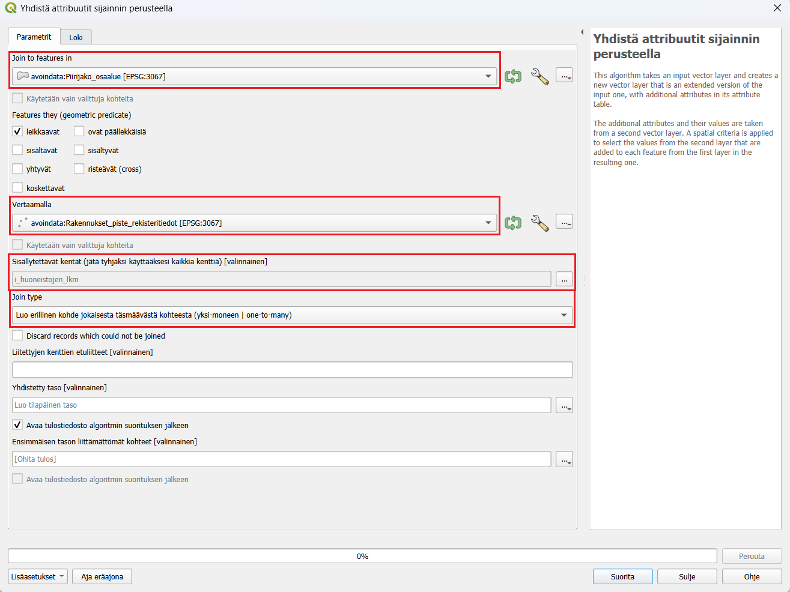

# Harjoitus 3: Vektorianalyysi

**Harjoituksen sisältö**

Harjoituksessa tutustutaan muutamiin hyödyllisiin tilasto- ja vektorianalyysityökaluihin, opitaan yhdistämään aineistoja ja laskemaan uusia ominaisuustietokenttiä.

**Harjoituksen tavoite**

Koulutettava osaa etsiä ja hyödyntää tarkoitukseensa sopivia analyysityökaluja.

**Arvioitu kesto**

30 minuuttia.

## Valmistautuminen

Avaa uusi QGIS-projekti (**Projekti \> Uusi**) ja tallenna se nimellä "**QGIS-harjoitus 3**".

## Vektorianalyysi

Tässä harjoituksessa tehdään joitakin vektorianalyyseja ja perehdytään monipuolisten analyysityökalujen maailmaan. Yleisimmin käytetyt analyysityökalut löytyvät päävalikon kohdasta **Vektori**, mutta kattavimman kokoelman QGISin, GRASSin, SAGAn ja GDALin analyysityökaluja saat näkyviin valitsemalla päävalikosta **Prosessointi \> Työkalut**. Tämä avaa Prosessointityökalut-paneelin QGISiin (yleensä oikealle puolelle käyttöliittymää), jonka kautta voit hakea erilaisia analyysejä.

::: hint-box
Psst! QGIS kehittyy jatkuvasti ja suomennos ei aina pysy kaikkien uusien työkalujen perässä. Työkalun nimi tai sen selitys saattaa joskus löytyä vain englanninkielisenä.
:::

Useimmat QGISin vektori- ja rasterianalyysityökalut toimivat samalla periaatteella: käyttäjä valitsee projektin tasoista haluamansa lähtötiedot ja muokkaa erilaisia parametreja tarvittaessa. Lopulta analyysin tuloksena syntyy uusi tulostaso. Käyttäjä voi valita tallennetaanko tulos **tilapäiseksi tasoksi** vai **pysyväksi tasoksi**. Tilapäiset tulostasot ovat olemassa auki olevassa QGIS-projektissa vain siihen saakka, kun ohjelma suljetaan. Tilapäisen tulostason voi halutessaan tallentaa myöhemminkin pysyväksi tasoksi. Suurilla aineistoilla jotkin analyysiprosessit voivat kestää pitkään. Tällöin on hyvä valita vaihtoehto **Aja eräajona**, jolloin ohjelman käyttöä voi jatkaa, ja analyysin laskentaan käytetään vain osa tietokoneen kapasiteetista.

Joskus käytettävissä aineistot eivät ole laadultaan täydellisiä. Esimerkiksi virheelliset geometriat eivät aina näy aineistosta päällepäin, mutta voivat estää geometriaan perustuvien analyysien suorittamisen. Tätä voi estää valitsemalla **Prosessointityökalut-paneelista** seuraava vaihtoehto: Asetukset  -> Prosessointi -> Yleinen -> Epäkelpo kohteiden suodatus **-> Ohita kohteet joilla on virheellinen geometria**.

## Tilastot

QGISin **Tilastot-paneelilla** voit tarkastella aineistosi arvojen tilastollista jakaumaa. Saat **Tilastot-paneelin** näkyviin QGISin käyttöliittymään klikkaamalla Näytä tilastollinen yhteenveto -painiketta  tai valitsemalla päävalikosta **Näytä \> Paneelit \> Tilastot**. Avautuvassa ikkunassa valitse pudotusvalikosta **HSY_vaestotietoruudukko_2019-taso** ja sen jälkeen yksi tason attribuuttikenttä. Tarkastele esitettäviä tilastollisia tunnuslukuja. Voit myös valita aineistosta vain osan, jonka tilastoja haluat tarkastella. Valitse osa aineiston ruuduista joko kartalta tai attribuuttitaulusta, ja klikkaa **Tilastot-paneelin** ruutu **Käytetään vain valittuja kohteita** aktiiviseksi.

## Alueellisten summien laskeminen ja aggregointi

Erilaisia paikkatietoaineistoja pitää välillä yhdistää ominaisuuksiensa tai sijainnin perusteella. Tässä harjoituksessa tutustuaan, miten ominaisuustietoja voidaan yhdistää eri tavoin. Harjoituksessa käytetään Helsingin kaupungin avointa aineistoa rajapinnalta ja lasketaan, kuinka paljon huoneistoja on eri Helsingin osa-alueilla.

Tee yhteys Helsingin kaupungin WFS-osoitteeseen: 

<https://kartta.hel.fi/ws/geoserver/avoindata/wfs?request=getCapabilities>

Lisää projektiisi rajapinnalta:

-   **Piirijako_osaalue**
-   **Rakennukset_piste_rekisteritiedot**

Pisteaineisto on melko iso, joten sen lataamisessa voi kestää hetki. Aineistossa on jokainen rakennus pisteenä ja ominaisuustiedoissa huoneistojen lukumäärä kussakin rakennuksessa sarakkeessa **i_huoneistojen_lkm**. Liitetään tieto huoneistojen lukumäärästä Helsingin piirijakoon sijainnin perusteella. Avaa **Vektori -> Tiedonhallinta -> Yhdistä attribuutit sijainnin perusteella**. Valitse yhdistettäväksi tasoksi Piirijako_osaalue ja vertailukohteeksi Rakennukset_piste_rekisteritiedot. 
**Sisällytettävät kentät** kohdassa valitse listasta **i_huoneistojen_lkm**. Jos kenttä jää tyhjäksi niin kaikki Rakennus-tason sarakkeet lisätään. Tarkista vielä, että Join type on **Luo  erillinen kohde jokaisesta täsmäävästä kohteesta (yksi-moneen) **, jotta jokainen piste huomiodaan uudessa tasossa.

Paina Suorita, tasoluetteloon pitäisi tulla uusi taso nimeltään “Yhdistetty taso”. Voit tarkistaa onko yhdistys tehty oikein tarkistamalla kohteiden lukumäärän. Klikkaa tasoa hiiren oikealla ja valitse “Näytä kohteiden lukumäärä” täppä aktiiviseksi. Tee sama Rakennukset_piste -tasolle. Jos lukumäärä on sama, yhdistys on onnistunut! Attribuuttitaulukossa on sarake kaikista huoneistojen lukumääristä piirijaon attribuuttien lisäksi.

Seuraavaksi tasot yhdistetään osa-alueittain aggregoimalla taso piirijaon mukaisesti. Aggregoimalla voidaan yhdistää sarakkeita jonkun ominaisuustiedon perusteella ja päättää, miten muut sarakkeet yhdistyvät toisiinsa. Etsi Prosessointityökaluista **Aggregaatti**. Valitse syötetasoksi aiemmin tehty Yhdistetty taso, ryhmittelylauseeksi tunnus. 
Kokoomat lehdellä on kaikki aineiston sarakkeet ja voit valita miten sarakkeet yhdistyvät toisiinsa. Valitse teksti-sarakkeisiin esimerkiksi first_value, jolloin vain ensimmäinen alueen arvo tulee sarakkeeseen. Voit myös poistaa ylimääräisiä sarakkeita vasemmalta puolelta  -napista.
Tarkista, että i_huoneistojen_lkm sarakkeessa aggregaattifunktio on **sum**, jotta saamme huoneistojen yhteismäärän alueittain. 

Paina vielä Suorita, ajossa kestää hetki ja uusi Aggregated-taso ilmestyy projektiisi. Avaa tason attribuuttitaulukko, jokaisella osa-alueella on summattuna alueella olevien huoneistojen määrä. Voit visualisoida aineiston esimerkiksi valitsemalla kuvaustekniikaksi esimerkiksi porrastettu ja etsimällä aineistoon sopivat luokkavälit.

## Vaaralliset tieristeykset

Tässä harjoituksessa tehdään tyypillinen monivaihenen paikkatietoanalyysi, jossa selvitetään Uudenmaan alueella vaaralliset tieristeykset. 

Tieliikenneonnettomuudet vuosittain on saatavilla Tilastokeskuksen WFS-palvelusta. Tee WFS-yhteys osoitteeseen:

<http://geo.stat.fi/geoserver/tieliikenne/wfs>

Lisää projektiisi minkä tahansa vuoden tieliikenneonnettomuudet.
Lisää vielä kurssihakemistosta projektiisi aineistot:

-   **TieViiva.shp**
-   **Uusimaa.gpkg**

 
Leikkaa ensin TieViiva aineisto vastaamaan tutkimusaluetta, eli Uudenmaan aluetta. Avaa leikkaustyökalu **Vektori -> Geoprosessointi -> Leikkaa (clip)** . Syötetasoksi tulee TieViiva ja peitetasoksi Uusimaa. Tarkista, että aineistojen koordinaattijärjestelmät vastaavat toisiaan. Jos koordinaattijärjestelmät eivät ole samat, analyysin tiedot eivät välttämättä ole luotettavia.

Tee vielä sama tieonnettomuus-aineistolle. Voit nimetä leikatut tasot uudelleen tunnistamisen helpottamiseksi painamalla tasoa hiiren oikealla ja painamalla **Nimeä taso**. Voit nimetä leikatun TieViiva-aineiston esimerkiksi **tiet_uusimaa**.

Seuraavaksi lasketaan TieViiva-aineistolle risteysalueet. TieViiva-aineisto koostuu pienistä tiepätkistä, jotka katkeavat jokaisen risteyksen kohdalla, joten saamme risteysalueet laskettua suoraan aineistolle.

Avaa seuraavaksi **Vektori -> Analyysit -> Viivan risteämispisteet**. Valitse syötetasoksi sekä leikkaavaksi tasoksi leikattu tieviiva-aineisto. Muut kohdat voit työkalussa jättää tyhjäksi.

Tulokseksi tästä tulee pistetaso, jossa on jokainen tieristeys omana kohteenaan.

Seuraavaksi voit laskea tienristeyksille vyöhykkeet, joiden avulla voidaan tutkia risteysalueiden lähellä olevia tieliikenneonnettomuuksia. Avaa **Vektori -> Geoprosessointi -> Vyöhyke**. Syötetasoksi määritetään juuri lasketut tienristeykset, eli Leikkaukset-taso. Tässä vaiheessa voit määrittää, kuinka suuren vyöhykkeen ja tarkastelualueen haluat määrittää risteyksien ympärille. Määritä **Etäisyys** kohtaan esimerkiksi 200 metriä, jolloin algoritmi laskee 200m pituisella säteellä ympyrän risteyksen ympärille.

Kun vyöhykkeet risteysalueille on luotu, pitää vielä selvittää, mitkä liikenneonnettomuudet osuvat tähän 200m vyöhykkeen sisään. Valitaan kaikki näihin alueisiin osuvat tieliikenneonnettomuudet. Avaa **Vektori -> Tutkimuksen työkalut -> Valitse sijainnin perusteella**

Ensimmäiseen kohtaan määritä Uudenmaan tieliikenneonnettomuudet. Tältä tasolta valinta tehdään. Vertailutasoksi voit valita luomasi vyöhykkeet **Vyöhyke luotu**. Tarkista, että valitset kohteet, jotka **leikkaavat** vyöhykkeitä ja että teet uuden valinnan tästä joukosta.

Suorittamisen jälkeen onnettomuudet_uusimaa -tasolta on valittuna kaikki kohteet, jotka osuvat määrittämillesi risteysalueille.. Tallenna valinta uutena tasona klikkaamalla tasoa hiiren oikealla -> Vie -> Tallenna valitut kohteet nimellä. Tallenna taso uutena GeoPackagena haluamaasi paikkaan. Tallentamisen jälkeen taso tulee uutena tasona QGISiisi. Tarkastele, missä tienristeyksissä on eniten onnettomuuksia. Voit myös visualisoida onnettomuudet esimerkiksi vakavuuden perusteella valitsemalla kuvaustekniikasta luokittelun.

## Etsi omia analyysityökaluja

Tutustu **Prosessointityökalut-paneelin** toimintoihin. Se mm. muistaa viimeksi käyttämäsi työkalut. Työkalun nimen edessä oleva symboli kertoo, minkä ohjelman valikoimaan työkalu kuuluu. Tee joitakin hakuja etsiäksesi itseäsi kiinnostavia työkaluja. Huomaa, että jotkin analyysiprosessit ovat saatavilla usean eri ohjelman versiona.

Kun olet valmis, tallenna projektitiedosto kurssihakemistoon pikanäppäimellä **CTRL + T** tai päävalikosta **Projekti \> Tallenna**.

::: hint-box
Psst! Koulutuksen jälkeen saat henkilökohtaista tukea Gispon tukipalvelusta. Lähetä kysymyksesi tai kommenttisi osoitteeseen koulutustuki\@gispo.fi!
:::
